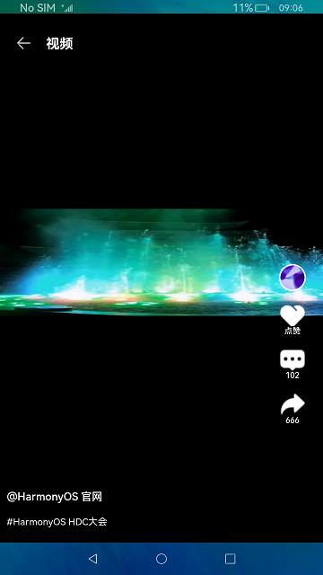

# Swiper的使用（ArkTS）

# 介绍

本篇Codelab主要介绍了滑动容器组件Swiper的几种常见的应用场景，包括顶部导航、轮播图以及视频滑动播放。


## 相关概念

-   [Swiper](https://gitee.com/openharmony/docs/blob/OpenHarmony-3.2-Release/zh-cn/application-dev/reference/arkui-ts/ts-container-swiper.md)：滑动容器，提供子组件切换滑动的能力。
-   [Stack](https://gitee.com/openharmony/docs/blob/OpenHarmony-3.2-Release/zh-cn/application-dev/reference/arkui-ts/ts-container-stack.md)：堆叠容器，子组件按照顺序依次入栈，后入栈组件在先入栈组件上方显示。
-   [Video](https://gitee.com/openharmony/docs/blob/OpenHarmony-3.2-Release/zh-cn/application-dev/reference/arkui-ts/ts-media-components-video.md)：视频播放组件。
-   [Observed和ObjectLink数据管理](https://gitee.com/openharmony/docs/blob/OpenHarmony-3.2-Release/zh-cn/application-dev/quick-start/arkts-observed-and-objectlink.md)：
    -   @Observed应用于类，表示该类中的数据变更被UI页面管理，例如：@Observed class ClassA \{\}。
    -   @ObjectLink应用于被@Observed所装饰类的对象，例如：@ObjectLink a: ClassA。

# 环境搭建

## 软件要求

-   [DevEco Studio](https://gitee.com/openharmony/docs/blob/master/zh-cn/application-dev/quick-start/start-overview.md#%E5%B7%A5%E5%85%B7%E5%87%86%E5%A4%87)版本：DevEco Studio 3.1 Release及以上版本。
-   OpenHarmony SDK版本：API version 9及以上版本。

## 硬件要求

-   开发板类型：[润和RK3568开发板](https://gitee.com/openharmony/docs/blob/master/zh-cn/device-dev/quick-start/quickstart-appendix-rk3568.md)。
-   OpenHarmony系统：3.2 Release及以上版本。

## 环境搭建

完成本篇Codelab我们首先要完成开发环境的搭建，本示例以**RK3568**开发板为例，参照以下步骤进行：

1. [获取OpenHarmony系统版本](https://gitee.com/openharmony/docs/blob/master/zh-cn/device-dev/get-code/sourcecode-acquire.md#%E8%8E%B7%E5%8F%96%E6%96%B9%E5%BC%8F3%E4%BB%8E%E9%95%9C%E5%83%8F%E7%AB%99%E7%82%B9%E8%8E%B7%E5%8F%96)：标准系统解决方案（二进制）。以3.2 Release版本为例：

   

2. 搭建烧录环境。

   1.  [完成DevEco Device Tool的安装](https://gitee.com/openharmony/docs/blob/master/zh-cn/device-dev/quick-start/quickstart-ide-env-win.md)
   2.  [完成RK3568开发板的烧录](https://gitee.com/openharmony/docs/blob/master/zh-cn/device-dev/quick-start/quickstart-ide-3568-burn.md)

3. 搭建开发环境。

   1.  开始前请参考[工具准备](https://gitee.com/openharmony/docs/blob/master/zh-cn/application-dev/quick-start/start-overview.md#%E5%B7%A5%E5%85%B7%E5%87%86%E5%A4%87)，完成DevEco Studio的安装和开发环境配置。
   2.  开发环境配置完成后，请参考[使用工程向导](https://gitee.com/openharmony/docs/blob/master/zh-cn/application-dev/quick-start/start-with-ets-stage.md#创建ets工程)创建工程（模板选择“Empty Ability”）。
   3.  工程创建完成后，选择使用[真机进行调测](https://gitee.com/openharmony/docs/blob/master/zh-cn/application-dev/quick-start/start-with-ets-stage.md#使用真机运行应用)。

# 代码结构解读

本篇Codelab只对核心代码进行讲解，完整代码可以直接从gitee获取。

```
├──entry/src/main/ets                 // 代码区
│  ├──common                          
│  │  ├──bean                          
│  │  │  ├──PictureItem.ets           // 图片bean 
│  │  │  ├──TopBarItem.ets            // 顶部导航bean
│  │  │  └──VideoItem.ets             // 视频bean
│  │  └──constants                    
│  │     ├──CommonConstant.ets        // 公共常量 
│  │     ├──PictureConstants.ets      // 图片所使用的常量
│  │     ├──TopBarConstants.ets       // TopBar使用的常量
│  │     └──VideoConstants.ets        // Video使用的常量                       
│  ├──entryability                      
│  │  └──EntryAbility.ts              // 程序入口类                          
│  ├──pages                            
│  │  ├──PageVideo.ets                // 视频播放页
│  │  └──SwiperIndex.ets              // 应用首页                          
│  ├──view                             
│  │  ├──all                          
│  │  │  └──PictureSort.ets           // “全部”tab页图片类别组件                           
│  │  ├──common                        
│  │  │  ├──Banner.ets                // 轮播图组件
│  │  │  ├──PictureView.ets           // 图片组件
│  │  │  └──TopBar.ets                // 顶部导航组件                           
│  │  ├──movie                         
│  │  │  └──MovieSort.ets             // “电影”tab页图片类别组件                        
│  │  ├──play                         // 视频播放组件目录 
│  │  │  ├──CommentView.ets           // 评论模块组件
│  │  │  ├──DescriptionView.ets       // 视频描述信息组件
│  │  │  ├──NavigationView.ets        // 顶部返回导航组件
│  │  │  └──PlayView.ets              // 视频滑动播放组件                         
│  │  └──tabcontent                   // tab内容组件 
│  │     ├──PageAll.ets               // 全部tab页
│  │     ├──PageEntertainment.ets     // 娱乐tab页
│  │     ├──PageGame.ets              // 游戏tab页
│  │     ├──PageLive.ets              // 直播tab页
│  │     ├──PageMovie.ets             // 电影tab页
│  │     └──PageTV.ets                // 电视tab页                        
│  └──viewmodel                        
│     ├──PictureViewModel.ets         // 图片model 
│     ├──TopBarViewModel.ets          // 顶部导航model     
│     └──VideoViewModel.ets           // 视频model
└──entry/src/main/resources           // 应用资源目录
```

# 顶部导航场景

应用首页首页使用Swiper组件实现了顶部导航的应用场景。用户点击不同的分类标题，会切换展示不同的界面内容。同时也支持用户左右滑动界面，对应导航标题联动变化的效果。


实现这种效果，我们只需将界面划分为两部分：导航栏与内容区。导航栏使用自定义组件TopBar实现，内容区使用Swiper组件实现。

@State和@Link装饰符配合使用，实现TopBar组件标题与Swiper组件索引的双向绑定。内容区内容滑动时，会触发Swiper的onChange事件，并改变索引index的值。前面已经通过特定修饰符实现了索引的双向绑定。因此该索引值的变化会使TopBar的索引值同步变化，实现TopBar和Swiper的联动效果。

```typescript
// SwiperIndex.ets
@Entry
@Component
struct SwiperIndex {
  // 索引值双向绑定 实现联动效果.
  @State index: number = 0;

  build() {
    Flex({ direction: FlexDirection.Column, alignItems: ItemAlign.Start }) {
      TopBar({ index: $index })
      Swiper() {
        PageAll()
        PageMovie()
        PageTV()
        PageEntertainment()
        PageLive()
        PageGame()
      }
      .index(this.index)
      .indicator(false)
      .loop(false)
      .onChange((index: number) => {
        this.index = index;
      })
    }
    .backgroundColor($r('app.color.start_window_background'))
  }
}
```

点击导航栏中的不同标题时，会触发TopBar中的onClick事件，并改变对应的索引值。同理，该索引的变化会使Swiper的索引值同步变化，实现Swiper和TopBar的联动效果。

```typescript
// TopBar.ets
@Component
export struct TopBar {
  // 索引值双向绑定 实现联动效果
  @Link index: number;
  private tabArray: Array<TopBarItem> = initializeOnStartup();

  build() {
    Row({ space: CommonConstants.SPACE_TOP_BAR }) {
      ForEach(this.tabArray,
        (item: TopBarItem) => {
          Text(item.name)
            .fontSize(this.index === item.id ? $r('app.float.font_size_checked') : $r('app.float.font_size_unchecked'))
            .fontColor(Color.Black)
            .textAlign(TextAlign.Center)
            .fontWeight(this.index === item.id ? FontWeight.Bold : FontWeight.Regular)
            .onClick(() => {
              this.index = item.id;
            })
        }, item => JSON.stringify(item))
    }
    .margin({ left: CommonConstants.ADS_LEFT })
    .width(CommonConstants.FULL_WIDTH)
    .height(CommonConstants.TOP_BAR_HEIGHT)
  }
}
```

最终实现导航栏与内容区的双向联动效果。

# 轮播图场景

轮播图常见于各种应用首页，用于各类信息、资讯的轮番展示。本应用使用Swiper组件，同样实现了这一能力。“全部”页签的“电影精选”部分，即为一个电影内容的轮播模块。它可以切换展示不同电影内容。


我们将轮播图模块定义为一个自定义组件Banner。在Banner组件创建新实例时，会初始化轮播内容并开启定时任务。定时任务通过调用swiperController.showNext\(\)方法，控制Swiper组件切换内容展示。

```typescript
// Banner.ets
aboutToAppear() {
  // 内容数据初始化
  this.imageArray = initializePictures(PictureType.BANNER);
  // 开启定时轮播
  startPlay(this.swiperController);
}

// PictureViewModel.ets
export function startPlay(swiperController: SwiperController) {
  let timerId = setInterval(() => {
    swiperController.showNext();
  }, CommonConstants.SWIPER_TIME);
  timerIds.push(timerId);
}
```

在Swiper组件内，将初始化数据进行循环渲染。配合开启的定时任务，循环播放。

```typescript
// Banner.ets
build() {
  Swiper(this.swiperController) {
    ForEach(this.imageArray, item => {
      Stack({ alignContent: Alignment.TopStart }) {
        Image(item.image)
          ...
        Column() {
          Text($r('app.string.movie_classic'))
            .textStyle($r('app.float.font_size_description'), CommonConstants.FONT_WEIGHT_LIGHT)
            ...
          Text(item.name)
            .textStyle($r('app.float.font_size_title'), CommonConstants.FONT_WEIGHT_BOLD)
        }
        ...
      }
      .height(CommonConstants.FULL_HEIGHT)
      .width(CommonConstants.FULL_WIDTH)
    }, item => JSON.stringify(item))
  }
  ...
}
```

# 视频滑动播放场景

视频滑动播放是Swiper组件的另一个常见应用场景。点击应用首页中的视频图片，会跳转至视频播放界面。我们可以通过上下滑动，切换播放的视频内容。



视频播放界面通过函数initializeOnStartup初始化视频内容。在Swiper组件内通过循环渲染的方式，将各个视频内容渲染成自定义组件PlayView。这样每一个视频内容就是一个Swiper的子组件，就可以通过滑动的方式切换播放内容。

```typescript
// PageVideo.ets
build() {
  Column() {
    Swiper() {
      ForEach(this.videoArray, (item: VideoItem, index: number) => {
        PlayView({
          index: $index,
          pageShow: $pageShow,
          item: item,
          barPosition: index
        });
      }, item => JSON.stringify(item))
    }
    .width(CommonConstants.FULL_WIDTH)
    .height(CommonConstants.FULL_HEIGHT)
    .indicator(false)
    .loop(false)
    .vertical(true)
    .onChange((index: number) => {
      this.index = index;
    })
  }
}
```

在自定义组件PlayView中，通过Video来控制视频播放。另外，结合Stack容器组件，在视频内容上叠加点赞、评论、转发等内容。

```typescript
// PlayView.ets
build() {
  Stack({ alignContent: Alignment.End }) {
    Video({
      src: this.item.src,
      controller: this.videoController
    })
      .controls(false)
      .autoPlay(this.playState === PlayState.START ? true : false) // 首次可见状态自动播放
      .objectFit(ImageFit.Fill)
      .loop(true)
      .height(CommonConstants.WIDTH_VIDEO)
      .width(CommonConstants.FULL_WIDTH)
      .onClick(() => {
        if (this.playState === PlayState.START) {
          this.playState = PlayState.PAUSE;
          this.videoController.pause();
        } else if (this.playState === PlayState.PAUSE) {
          this.playState = PlayState.START;
          this.videoController.start();
        }
      })

    NavigationView()
    CommentView({ item: this.item })
    DescriptionView()
  }
  .backgroundColor(Color.Black)
  .width(CommonConstants.FULL_WIDTH)
  .height(CommonConstants.FULL_HEIGHT)
}
```

# 总结

您已经完成了本次Codelab的学习，并了解到以下知识点：

1.  使用Swiper组件实现顶部导航、轮播图、视频滑动播放等场景。
2.  使用Stack组件实现堆叠布局。
3.  使用@Extend快速定义并复用组件的自定义样式。


