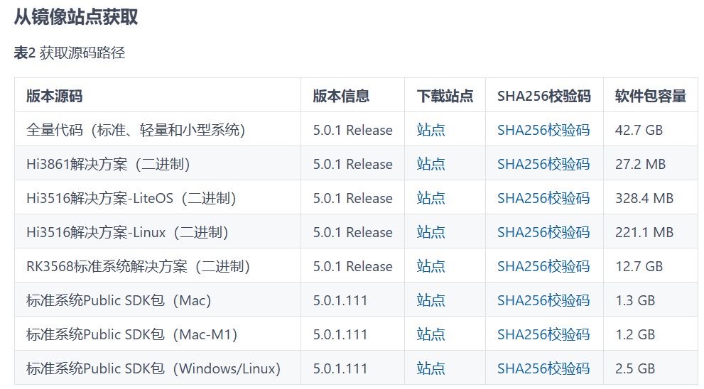

# 联系人管理系统（ArkTS）
## 介绍
本TelManageApp中，我们会构建一个具有增、删、改、查功能的联系人管理系统。应用包含两级页面，分别是主页（联系人添加、查找、删除），以及联系人信息编辑页面。效果如下图所示：
- 图1：添加联系人。
- 图2：修改联系人信息。
- 图3：根据姓名字段查找联系人。
- 图4：删除联系人。
- 图5：字母索引条快速定位联系人。
- 图6：批量删除联系人。
- 图7：密令分享与导入联系人。


# 搭建OpenHarmony环境
## 软件要求
- [DevEco Studio](https://gitcode.com/openharmony/docs/blob/master/zh-cn/application-dev/quick-start/start-overview.md#%E5%B7%A5%E5%85%B7%E5%87%86%E5%A4%87)版本：DevEco Studio 5.0.5。
- OpenHarmony SDK版本：API version 13。

## 硬件要求

- 开发板类型：[润和DAYU200开发板](https://gitcode.com/hihope/DAYU200/blob/main/README.md)。
- OpenHarmony系统：5.0.1 Release。

## 环境搭建
完成本篇Codelab我们首先要完成开发环境的搭建，本示例以**DAYU200**开发板为例，参照以下步骤进行：

1.  [获取OpenHarmony系统版本](https://gitcode.com/openharmony/docs/blob/master/zh-cn/device-dev/get-code/sourcecode-acquire.md#%E8%8E%B7%E5%8F%96%E6%96%B9%E5%BC%8F3%E4%BB%8E%E9%95%9C%E5%83%8F%E7%AB%99%E7%82%B9%E8%8E%B7%E5%8F%96)：标准系统解决方案（二进制）

    以5.0.1版本为例：

    

2.  搭建烧录环境

    1.  [完成DevEco Device Tool的安装](https://gitcode.com/openharmony/docs/blob/master/zh-cn/device-dev/quick-start/quickstart-ide-env-win.md)
    2.  [完成DAYU200开发板的烧录](https://gitcode.com/hihope/DAYU200/blob/main/%E7%83%A7%E5%86%99%E5%B7%A5%E5%85%B7%E5%8F%8A%E6%8C%87%E5%8D%97/windows/%E7%83%A7%E5%BD%95%E6%8C%87%E5%AF%BC%E6%96%87%E6%A1%A3.md)
3.  搭建开发环境

    1.  开始前请参考[工具准备](https://gitcode.com/openharmony/docs/blob/master/zh-cn/application-dev/quick-start/start-overview.md#%E5%B7%A5%E5%85%B7%E5%87%86%E5%A4%87)，完成DevEco Studio的安装和开发环境配置。
    2.  开发环境配置完成后，请参考[使用工程向导](https://gitcode.com/openharmony/docs/blob/master/zh-cn/application-dev/quick-start/start-with-ets-fa.md#%E5%88%9B%E5%BB%BAets%E5%B7%A5%E7%A8%8B)创建工程（模板选择“Empty Ability”），选择JS或者eTS语言开发。
    3.  工程创建完成后，选择使用[真机进行调测](https://gitcode.com/openharmony/docs/blob/master/zh-cn/application-dev/quick-start/start-with-ets-fa.md#%E4%BD%BF%E7%94%A8%E7%9C%9F%E6%9C%BA%E8%BF%90%E8%A1%8C%E5%BA%94%E7%94%A8)。


# 代码结构解读
本篇Codelab只对核心代码进行讲解，对于完整代码，我们会在gitcode中提供。
```typescript
├──entry/src/main/ets                     // 代码区
│  ├──entryability
│  │  └──EntryAbility.ets                // 程序入口类
│  ├──entrybackupability
│  │  └──EntryBackupAbility.ets          // 数据备份与恢复类
│  ├──model
│  │  ├──ContactData.ets                 // 联系人数据管理类
│  │  ├──ContactGroup.ets                // 联系人分组模型与管理器
│  │  ├──DuplicateDetector.ets           // 重复联系人检测器
│  │  ├──DuplicateStrategy.ets           // 重复检测策略
│  │  └──MergeResult.ets                 // 合并结果模型
│  ├──pages
│  │  ├──EditContact.ets                 // 编辑联系人页面
│  │  ├──AddContact.ets                  // 添加联系人
│  │  ├──Index.ets                       // 主页面的UI设计
│  │  ├──GroupManager.ets                // 联系人分组管理页面
│  │  └──DuplicateManager.ets            // 重复联系人管理页面
│  ├──utils
│  │  ├──CommonUtil.ts                   // 通用工具类
│  │  ├──PermissionUtil.ts               // 权限工具类
│  │  └──SimilarityCalculator.ts         // 相似度计算工具
│  └──view    
│     ├──ContactItem.ets                 // 联系人信息类
│     └──SearchBar.ets                   // 搜索栏组件
│——entry/src/main/resource                // 应用静态资源目录
└──entry/src/main/module.json5            //配置文件
│  │  ├──BusinessCardData.ts             // 个人名片管理
│  │  └──FavoriteManager.ts              // 个人收藏管理
│  ├──pages
│  │  ├──EditContact.ets                 // 编辑联系人页面
│  │  ├──AddContact.ets                  // 添加联系人
│  │  ├──FavoriteManagement.ets          // 收藏管理
│  │  ├──FavoritesDisplay.ets            // 收藏展示
│  │  ├──ImportExport.ets                // 导入导出
│  │  ├──MyBusinessCard.ets              // 个人名片
│  │  ├──SecretShare.ets                 // 密令分享页面
│  │  ├──SecretImport.ets                // 密令导入页面
│  │  └──Index.ets                       // 主页面的UI设计
│  ├──utils
│  │  ├──SecretCodeUtil.ts               // 密令编解码工具
│  │  ├──ValidationUtil.ts               // 字段校验工具
│  │  ├──LetterIndexUtil.ts              // 字母索引工具
│  │  └──CommonUtil.ts                   // 通用工具函数
│  ├──view
│  │  └──AlphabetIndexBar.ets            // 字母索引条组件
│  └──viewmodel    
│     ├──ContactItem.ets                 // 联系人信息类
│     └──ContactViewModel.ets            // 联系人页面数据处理类
│——entry/src/main/resource               // 应用静态资源目录
└──entry/src/main/module.json5           // 配置文件
```

## 联系人管理系统主页面
  联系人管理系统的主页面主要由三部分组成：顶栏、搜索框和联系人列表。

1.  顶栏

    以下代码实现了顶栏布局,使用Row容器来水平排列“联系人管理”标题和“添加”按钮,设置容器内边距为20像素。其中，使用Text组件来显示“联系人管理”标题，使用Button组件来实现“添加”按钮。
    ```typescript
    Row() {
      Text('联系人管理')
        .fontSize(24)
        .fontWeight(FontWeight.Bold)
        .textAlign(TextAlign.Center)

      Blank()

      Button('添加')
        .onClick(() => {
          console.log('Index: 点击添加按钮，跳转到添加页面');
          router.pushUrl({
            url: 'pages/AddContact'
          });
        })
    }
    .width('100%')
    .padding(20)
    .backgroundColor('#f0f0f0')
    ```
2.  搜索框

    以下代码使用TextInput组件实现了搜索框布局，支持按姓名或电话号码搜索联系人。设置宽度占90%，高度为40像素，并使用onChange()方法监听用户输入的变化，将输入值实时绑定到状态变量searchText。
    ```typescript
    TextInput({ placeholder: '搜索联系人姓名或电话号码' })
      .width('90%')
      .height(40)
      .margin(10)
      .onChange((value: string) => {
        this.searchText = value;
      })
      .onSubmit(() => {
        this.searchContacts();
      })
    ```
3.  联系人列表
    位于页面中间，使用List容器来实现垂直排列的滚动列表，并动态遍历状态变量this.contacts，为每个联系人生成一个列表项。设置列表项之间的垂直间距为10像素，列表宽度占父容器的100%。
    ```typescript
    List({ space: 10 }) {
      ForEach(this.contacts, (item: contact.Contact, index: number) => {
        ListItem() {
          this.contactItem(item)
        }
      }, (item: contact.Contact) => item.key || item.id?.toString() || '')
    }
    .width('100%')
    .layoutWeight(1)
    ```

  在联系人列表中，每个列表项由头像区、信息区（姓名/电话/邮箱）和操作区（编辑/删除）三部分组成，整体使用水平 Row 布局。

  头像使用Column()作为容器，右侧留出 15 像素外边距，与中间信息区拉开间距。若无头像时，则展示姓名首字母作为默认占位。

  中间信息区使用Column()作为容器，姓名加粗并左对齐，作为主标题。电话号码作为次级信息，以5像素的外边距与姓名分隔。邮箱层次最弱，以2像素的外边距与电话分隔。

  右侧操作区使用Row()作为容器，水平放置“编辑”和“删除”两个按钮。其中删除按钮设为红底白字，强调危险动作。
  ```typescript
    @Builder
    contactItem(contactItem: contact.Contact) {
      Row() {
        Column() {
          // 头像
          if (contactItem.portrait?.uri) {
            Image(contactItem.portrait.uri)
              .width(50)
              .height(50)
              .borderRadius(25)
          } else {
            // 默认头像
            Text(contactItem.name?.fullName?.charAt(0) || '?')
              .fontSize(20)
              .fontColor(Color.White)
              .textAlign(TextAlign.Center)
              .width(50)
              .height(50)
              .borderRadius(25)
              .backgroundColor('#007DFF')
          }
        }
        .margin({ right: 15 })

        Column() {
          // 姓名
          Text(contactItem.name?.fullName || '未知')
            .fontSize(18)
            .fontWeight(FontWeight.Medium)
            .textAlign(TextAlign.Start)
            .width('100%')

          // 电话号码
          if (contactItem.phoneNumbers && contactItem.phoneNumbers.length > 0) {
            Text(contactItem.phoneNumbers[0].phoneNumber)
              .fontSize(14)
              .fontColor('#666')
              .textAlign(TextAlign.Start)
              .width('100%')
              .margin({ top: 5 })
          }

          // 邮箱
          if (contactItem.emails && contactItem.emails.length > 0) {
            Text(contactItem.emails[0].email)
              .fontSize(12)
              .fontColor('#999')
              .textAlign(TextAlign.Start)
              .width('100%')
              .margin({ top: 2 })
          }
        }
        .alignItems(HorizontalAlign.Start)
        .layoutWeight(1)

        // 操作按钮
        Row() {
          Button('编辑')
            .fontSize(12)
            .width(60)
            .height(30)
            .onClick(() => {
              router.pushUrl({
                url: 'pages/EditContact',
                params: {
                  contactKey: contactItem.key || '',
                  parentContext: this.context
                }
              });
            })

          Button('删除')
            .fontSize(12)
            .width(60)
            .height(30)
            .margin({ left: 10 })
            .backgroundColor('#ff3b30')
            .fontColor(Color.White)
            .onClick(() => {
              this.showDeleteConfirmDialog(contactItem);
            })
        }
      }
  ```
## 增加联系人
### 新增联系人界面设计
整体采用可滚动纵向布局来承载整个表单内容，即Scroll + 垂直Column布局。页面被分为三大部分：顶栏、头像区域与基本信息表单卡片。
1.  顶栏

    包括取消按钮、“添加联系人”标题和保存按钮。

    ```typescript
    build() {
        Column() {
          // 标题栏
          Row() {
            Button('取消')
              .fontSize(16)
              .backgroundColor(Color.Transparent)
              .fontColor('#007DFF')
              .onClick(() => {
                router.back();
              })

            Text('添加联系人')
              .fontSize(18)
              .fontWeight(FontWeight.Bold)
              .textAlign(TextAlign.Center)
              .layoutWeight(1)

            Button('保存')
              .fontSize(16)
              .backgroundColor(Color.Transparent)
              .fontColor(this.name && this.phone ? '#007DFF' : '#999')
              .enabled(!!this.name && !!this.phone && !this.isSaving)
              .onClick(() => {
                this.saveContact();
              })
          }
          .width('100%')
          .padding(20)
          .backgroundColor('#f0f0f0')
        }
    }

    ```
2.  头像区域

    使用Column容器，设置内容中向居中，并使用头像占位字符，若已输入姓名，取首字母并转大写当作头像字符；否则显示“+”表示新增。
    ```typescript
    // 表单内容
          Scroll() {
            Column() {
              // 头像区域
              Column() {
                Text(this.name ? this.name.charAt(0).toUpperCase() : '+')
                  .fontSize(40)
                  .fontColor(Color.White)
                  .textAlign(TextAlign.Center)
                  .width(80)
                  .height(80)
                  .borderRadius(40)
                  .backgroundColor('#007DFF')
              }
              .width('100%')
              .padding(30)
              .justifyContent(FlexAlign.Center)
    ```

3.  基本信息

    外层容器为Column，设置外边距为左右各 20，视觉上让白卡片悬浮在灰色背景上，表单标题为“基本信息”，表单项分别为姓名（必填）、电话（必填）、邮箱（选填），TextInput 的 onChange 与状态 this.name/phone/email 绑定，表单项之间以Divider分隔。
    ```typescript
    // 基本信息表单
    Column() {
      Text('基本信息')
        .fontSize(16)
        .fontWeight(FontWeight.Medium)
        .textAlign(TextAlign.Start)
        .width('100%')
        .margin({ bottom: 15 })

      // 姓名输入框
      Column() {
        Text('姓名')
          .fontSize(14)
          .fontColor('#666')
          .textAlign(TextAlign.Start)
          .width('100%')
          .margin({ bottom: 5 })

        TextInput({ placeholder: '请输入姓名（必填）' })
          .width('100%')
          .height(50)
          .fontSize(16)
          .backgroundColor('#f8f8f8')
          .borderRadius(5)
          .padding({ left: 10, right: 10 })
          .onChange((value: string) => {
            this.name = value.trim();
          })
      }
      .width('100%')
      .margin({ bottom: 15 })

      Divider()
        .width('100%')
        .strokeWidth(1)
        .color('#eee')

      // 电话输入框
      Column() {
        Text('电话号码')
          .fontSize(14)
          .fontColor('#666')
          .textAlign(TextAlign.Start)
          .width('100%')
          .margin({ bottom: 5, top: 15 })

        TextInput({ placeholder: '请输入电话号码（必填）' })
          .width('100%')
          .height(50)
          .fontSize(16)
          .backgroundColor('#f8f8f8')
          .borderRadius(5)
          .padding({ left: 10, right: 10 })
          .type(InputType.Number)
          .onChange((value: string) => {
            this.phone = value.trim();
          })
      }
      .width('100%')
      .margin({ bottom: 15 })

      Divider()
        .width('100%')
        .strokeWidth(1)
        .color('#eee')

      // 邮箱输入框
      Column() {
        Text('邮箱地址')
          .fontSize(14)
          .fontColor('#666')
          .textAlign(TextAlign.Start)
          .width('100%')
          .margin({ bottom: 5, top: 15 })

        TextInput({ placeholder: '请输入邮箱地址（可选）' })
          .width('100%')
          .height(50)
          .fontSize(16)
          .backgroundColor('#f8f8f8')
          .borderRadius(5)
          .padding({ left: 10, right: 10 })
          .onChange((value: string) => {
            this.email = value.trim();
          })
      }
      .width('100%')
    }
    ```

### 新增联系人逻辑
点击顶栏的“添加”按钮后，将进入“新增模式”。在新增联系人核心逻辑 saveContact组件中，先校验姓名和电话必填，未填则直接返回。接着将 isSaving 置为 true 显示提交中状态，随后根据表单值构造联系人对象并写入系统通讯录。联系人对象保存成功后返回上一页。
```typescript
async saveContact() {
    if (!this.name || !this.phone) {
      return;
    }

    this.isSaving = true;

    try {
      const newContact = this.contactData.createContact(this.name, this.phone, this.email);
      await this.contactData.addContact(newContact);
      console.error('添加联系人成功');
      router.back();
    } catch (error) {
      console.error('添加联系人失败:', error);
    } finally {
      this.isSaving = false;
    }
  }
```

## 修改联系人信息
### 修改联系人界面设计
整体采用与新增页面一致的纵向结构：顶部标题栏、可滚动内容区（头像占位 + 基本信息表单），并在表单下方提供“删除联系人”入口。
1. 顶栏

    包含“取消”、“编辑联系人”标题与“保存”按钮，保存按钮在姓名与电话非空且非保存中时可点击。

    ```typescript
    // EditContact.ets 标题栏
    Row() {
      Button('取消')
        .fontSize(16)
        .backgroundColor(Color.Transparent)
        .fontColor('#007DFF')
        .onClick(() => {
          router.back();
        })

      Text('编辑联系人')
        .fontSize(18)
        .fontWeight(FontWeight.Bold)
        .textAlign(TextAlign.Center)
        .layoutWeight(1)

      Button('保存')
        .fontSize(16)
        .backgroundColor(Color.Transparent)
        .fontColor(this.name && this.phone && !this.isSaving ? '#007DFF' : '#999')
        .enabled(!!this.name && !!this.phone && !this.isSaving)
        .onClick(() => {
          this.saveContact();
        })
    }
    .width('100%')
    .padding(20)
    .backgroundColor('#f0f0f0')
    ```

2. 头像区域

    显示姓名首字母作为占位头像。

    ```typescript
    // 头像占位
    Column() {
      Text(this.name ? this.name.charAt(0).toUpperCase() : '?')
        .fontSize(40)
        .fontColor(Color.White)
        .textAlign(TextAlign.Center)
        .width(80)
        .height(80)
        .borderRadius(40)
        .backgroundColor('#007DFF')
    }
    .width('100%')
    .padding(30)
    .justifyContent(FlexAlign.Center)
    ```

3. 基本信息

    表单包含姓名、电话号码、邮箱三项；已填值通过 `text` 属性回显。

    ```typescript
    // 基本信息卡片（节选）
    Column() {
      Text('基本信息')
        .fontSize(16)
        .fontWeight(FontWeight.Medium)
        .textAlign(TextAlign.Start)
        .width('100%')
        .margin({ bottom: 15 })

      // 姓名
      Column() {
        Text('姓名')
          .fontSize(14)
          .fontColor('#666')
          .textAlign(TextAlign.Start)
          .width('100%')
          .margin({ bottom: 5 })

        TextInput({ text: this.name, placeholder: '请输入姓名' })
          .width('100%')
          .height(50)
          .fontSize(16)
          .backgroundColor('#f8f8f8')
          .borderRadius(5)
          .onChange((value: string) => {
            this.name = value.trim();
          })
      }
      .width('100%')
      .margin({ bottom: 15 })

      // 电话
      Column() {
        Text('电话号码')
          .fontSize(14)
          .fontColor('#666')
          .textAlign(TextAlign.Start)
          .width('100%')
          .margin({ bottom: 5 })

        TextInput({ text: this.phone, placeholder: '请输入电话号码' })
          .width('100%')
          .height(50)
          .fontSize(16)
          .backgroundColor('#f8f8f8')
          .borderRadius(5)
          .type(InputType.Number)
          .onChange((value: string) => {
            this.phone = value.trim();
          })
      }
      .width('100%')
      .margin({ bottom: 15 })

      // 邮箱
      Column() {
        Text('邮箱地址')
          .fontSize(14)
          .fontColor('#666')
          .textAlign(TextAlign.Start)
          .width('100%')
          .margin({ bottom: 5 })

        TextInput({ text: this.email, placeholder: '请输入邮箱地址（可选）' })
          .width('100%')
          .height(50)
          .fontSize(16)
          .backgroundColor('#f8f8f8')
          .borderRadius(5)
          .onChange((value: string) => {
            this.email = value.trim();
          })
      }
      .width('100%')
    }
    .width('100%')
    .padding(20)
    .backgroundColor(Color.White)
    .borderRadius(10)
    .shadow({ radius: 2, color: '#10000000', offsetX: 0, offsetY: 1 })
    .margin({ bottom: 20 })
    ```

4. 删除入口

    编辑页底部提供“删除联系人”按钮，点击后显示二次确认遮罩弹层（删除逻辑详见“删除联系人”章节）。

    ```typescript
    Button('删除联系人')
      .width('100%')
      .height(50)
      .backgroundColor('#ff3b30')
      .fontColor(Color.White)
      .fontSize(16)
      .borderRadius(10)
      .onClick(() => {
        this.showDeleteConfirm = true;
      })
    ```

### 修改联系人逻辑
编辑页在生命周期中获取参数并加载详情，保存时构造更新对象并提交。

```typescript
// 1) 获取参数并加载联系人
aboutToAppear() {
  this.contactData.setContext(getContext(this));
  const params = router.getParams() as Record<string, string>;
  this.contactKey = params?.contactKey || '';
  if (this.contactKey) {
    this.loadContact();
  } else {
    this.isLoading = false;
  }
}

async loadContact() {
  this.isLoading = true;
  this.contactInfo = await this.contactData.queryContactById(this.contactKey);
  if (this.contactInfo) {
    this.name = this.contactInfo.name?.fullName || '';
    this.phone = this.contactInfo.phoneNumbers?.[0]?.phoneNumber || '';
    this.email = this.contactInfo.emails?.[0]?.email || '';
  }
  this.isLoading = false;
}

// 2) 保存更新
async saveContact() {
  if (!this.name || !this.phone || !this.contactInfo) {
    return;
  }

  this.isSaving = true;
  try {
    const updatedContact: contact.Contact = {
      id: this.contactInfo.id,
      key: this.contactInfo.key,
      name: { fullName: this.name },
      phoneNumbers: [{ phoneNumber: this.phone, labelId: contact.PhoneNumber.NUM_MOBILE }],
      emails: this.email ? [{ email: this.email, labelId: contact.Email.EMAIL_HOME }] : []
    };

    // 保留未在本页编辑但已存在的字段
    if (this.contactInfo.portrait) updatedContact.portrait = this.contactInfo.portrait;
    if (this.contactInfo.organization) updatedContact.organization = this.contactInfo.organization;
    if (this.contactInfo.note) updatedContact.note = this.contactInfo.note;
    if (this.contactInfo.relations) updatedContact.relations = this.contactInfo.relations;
    if (this.contactInfo.imAddresses) updatedContact.imAddresses = this.contactInfo.imAddresses;
    if (this.contactInfo.websites) updatedContact.websites = this.contactInfo.websites;
    if (this.contactInfo.events) updatedContact.events = this.contactInfo.events;
    if (this.contactInfo.postalAddresses) updatedContact.postalAddresses = this.contactInfo.postalAddresses;

    await this.contactData.updateContact(updatedContact);
    router.back();
  } catch (error) {
    console.error('更新联系人失败:');
  } finally {
    this.isSaving = false;
  }
}
```

## 查找联系人
### 查找联系人界面设计
搜索输入框位于主页顶栏下方，输入关键字（姓名）后提交触发搜索；列表区域根据状态显示加载指示、空态或联系人列表。

```typescript
// 搜索框（Index.ets）
TextInput({ placeholder: '搜索联系人姓名' })
  .width('90%')
  .height(40)
  .margin(10)
  .onChange((value: string) => {
    this.searchText = value;
  })
  .onSubmit(() => {
    this.searchContacts();
  })

// 列表/空态/加载态（节选）
if (this.isLoading) {
  LoadingProgress()
    .width(50)
    .height(50)
    .margin({ top: 100 })
} else if (this.contacts.length === 0) {
  Column() {
    Text(this.searchText ? '未找到匹配的联系人' : '暂无联系人')
      .fontSize(18)
      .fontColor('#666')
  }
  .width('100%')
  .height('70%')
  .justifyContent(FlexAlign.Center)
} else {
  List({ space: 10 }) {
    ForEach(this.contacts, (item: contact.Contact, index: number) => {
      ListItem() {
        this.contactItem(item)
      }
    }, (item: contact.Contact) => item.key || item.id?.toString() || '')
  }
  .width('100%')
  .layoutWeight(1)
}
```

### 查找联系人逻辑
搜索逻辑位于 `searchContacts()`：空关键字回退到全量列表；申请权限后全量拉取并按姓名包含过滤；最终更新列表数据。

```typescript
async searchContacts() {
  console.log('Index: 开始搜索联系人，关键词:', this.searchText);
  if (this.searchText.trim() === '') {
    console.log('Index: 搜索关键词为空，加载所有联系人');
    this.loadContacts();
    return;
  }

  this.isLoading = true;
  try {
    let permissionRequestResult = await abilityAccessCtrl.createAtManager().requestPermissionsFromUser(this.context,
      [
        'ohos.permission.READ_CONTACTS',
        'ohos.permission.WRITE_CONTACTS'
      ]);
    if (permissionRequestResult.authResults[0] === 0) {
      let results = await this.contactData.queryContactsByPhone(this.searchText);
      console.log('Index: 按电话号码搜索到结果数量:', results.length);

      if (results.length === 0) {
        console.log('Index: 开始按姓名过滤');
        const allContacts = await this.contactData.queryAllContacts();
        results = allContacts.filter(contact =>
          contact.name?.fullName?.toLowerCase().includes(this.searchText.toLowerCase())
        );
        console.log('Index: 按姓名过滤后结果数量:', results.length);
      }

      this.contacts = results;
    }
  } catch (error) {
    console.error('Index: 搜索联系人失败:', error);
  } finally {
    this.isLoading = false;
  }
}
```

## 删除联系人
### 删除联系人界面设计
删除入口在主页列表项与编辑页均可触达，并均提供二次确认。

1. 主页删除入口与确认对话框

    ```typescript
    // 列表项中的删除按钮（Index.ets 节选）
    Button('删除')
      .fontSize(12)
      .width(60)
      .height(30)
      .margin({ left: 10 })
      .backgroundColor('#ff3b30')
      .fontColor(Color.White)
      .onClick(() => {
        this.showDeleteConfirmDialog(contactItem);
      })
    ```

    ```typescript
    // 主页的 AlertDialog 确认（Index.ets）
    showDeleteConfirmDialog(contactItem: contact.Contact) {
      if (!contactItem.key) return;

      const contactName = contactItem.name?.fullName || '未知联系人';

      AlertDialog.show(
        {
          title: '删除联系人',
          message: `确定要删除联系人"${contactName}"吗？此操作不可撤销。`,
          autoCancel: true,
          alignment: DialogAlignment.Center,
          primaryButton: { value: '取消', action: () => {} },
          secondaryButton: {
            value: '删除',
            fontColor: '#ff3b30',
            action: () => {
              this.deleteContact(contactItem.key!);
            }
          }
        }
      );
    }
    ```

2. 编辑页删除入口与确认遮罩

    ```typescript
    // 删除入口按钮（EditContact.ets）
    Button('删除联系人')
      .width('100%')
      .height(50)
      .backgroundColor('#ff3b30')
      .fontColor(Color.White)
      .fontSize(16)
      .borderRadius(10)
      .onClick(() => {
        this.showDeleteConfirm = true;
      })
    ```

    ```typescript
    // 遮罩确认对话框（EditContact.ets 节选）
    if (this.showDeleteConfirm) {
      Column() {
        Blank()
          .width('100%')
          .height('100%')
          .backgroundColor('#000000')
          .opacity(0.5)
          .onClick(() => {
            this.showDeleteConfirm = false;
          })

        Column() {
          Text('删除联系人')
            .fontSize(18)
            .fontWeight(FontWeight.Bold)
            .margin({ bottom: 10 })

          Text('确定要删除这个联系人吗？此操作不可撤销。')
            .fontSize(14)
            .textAlign(TextAlign.Center)
            .margin({ bottom: 20 })

          Row() {
            Button('取消')
              .layoutWeight(1)
              .height(40)
              .backgroundColor('#f0f0f0')
              .fontColor('#333')
              .onClick(() => {
                this.showDeleteConfirm = false;
              })

            Button('删除')
              .layoutWeight(1)
              .height(40)
              .margin({ left: 10 })
              .backgroundColor('#ff3b30')
              .fontColor(Color.White)
              .onClick(() => {
                this.showDeleteConfirm = false;
                this.deleteContact();
              })
          }
          .width('100%')
          .justifyContent(FlexAlign.SpaceBetween)
        }
        .width('80%')
        .padding(20)
        .backgroundColor(Color.White)
        .borderRadius(10)
        .shadow({ radius: 10, color: '#40000000', offsetX: 0, offsetY: 5 })
      }
      .width('100%')
      .height('100%')
      .justifyContent(FlexAlign.Center)
      .alignItems(HorizontalAlign.Center)
      .position({ x: 0, y: 0 })
    }
    ```

### 删除联系人逻辑
- 主页路径：确认后调用 `deleteContact(key)` 删除并刷新列表。

  ```typescript
  // Index.ets
  async deleteContact(key: string) {
    console.log('Index: 开始删除联系人，key:', key);
    try {
      await this.contactData.deleteContact(key);
      console.log('Index: 删除联系人成功，重新加载列表');
      this.loadContacts();
    } catch (error) {
      console.error('Index: 删除联系人失败:', error);
    }
  }
  ```

- 编辑页路径：确认后调用 `deleteContact()` 删除并返回上一页。

  ```typescript
  // EditContact.ets
  async deleteContact() {
    try {
      await this.contactData.deleteContact(this.contactKey);
      router.back();
    } catch (error) {
      console.error('删除联系人失败:');
    }
  }
  ```

- 底层实现：`ContactData.deleteContact(key)` 调用系统通讯录接口删除指定联系人。

## 联系人分组管理

联系人分组功能允许用户对联系人进行分类管理，支持创建自定义分组、智能分组等功能，并使用 preferences 持久化存储分组数据。

### 分组管理界面设计

分组管理页面（GroupManager.ets）包含多个视图模式：

1. **分组列表视图**：显示所有分组及其成员数量
2. **分组详情视图**：查看分组内的联系人列表
3. **创建/编辑分组视图**：设置分组名称、颜色、图标等
4. **联系人选择视图**：为分组添加或移除联系人
5. **智能分组视图**：自动按规则生成分组

### 分组数据模型

分组功能使用 `ContactGroup.ets` 中定义的数据模型：

```typescript
// 分组类型枚举
export enum GroupType {
  CUSTOM = 'CUSTOM',           // 用户自定义分组
  SYSTEM = 'SYSTEM',           // 系统预设分组
  SMART = 'SMART',             // 智能分组（自动分类）
  FAVORITE = 'FAVORITE',       // 收藏分组
  RECENT = 'RECENT',           // 最近联系
  FREQUENT = 'FREQUENT'        // 常用联系人
}

// 联系人分组接口
export interface ContactGroup {
  groupId: string;              // 分组唯一标识
  name: string;                 // 分组名称
  description: string;          // 分组描述
  type: GroupType;              // 分组类型
  color: string;                // 分组颜色
  icon: string;                 // 分组图标
  contactKeys: string[];        // 分组内联系人key列表
  createdAt: number;            // 创建时间
  updatedAt: number;            // 更新时间
  sortOrder: number;            // 排序顺序
  isDefault: boolean;           // 是否为默认分组
  isVisible: boolean;           // 是否可见
}
```

### 分组数据持久化

分组数据使用 OpenHarmony 的 `@kit.ArkData` 中的 `preferences` API 进行持久化存储：

```typescript
import { preferences } from '@kit.ArkData';
import { Context } from '@kit.AbilityKit';

export class GroupManager {
  private groups: Map<string, ContactGroupModel> = new Map();
  private storageKey: string = 'contact_groups';
  private context: Context | null = null;
  private dataStore: preferences.Preferences | null = null;
  private isInitialized: boolean = false;

  /**
   * 初始化分组管理器
   * 必须在使用前调用此方法
   */
  async initialize(context: Context): Promise<void> {
    if (this.isInitialized) {
      return;
    }

    this.context = context;
    try {
      this.dataStore = await preferences.getPreferences(context, 'contact_groups_store');
      await this.loadFromStorage();
      this.isInitialized = true;
    } catch (error) {
      console.error('GroupManager: 初始化失败', error);
      this.initializeDefaultGroups();
      this.isInitialized = true;
    }
  }

  /**
   * 从存储加载分组数据
   */
  private async loadFromStorage(): Promise<void> {
    if (!this.dataStore) {
      this.initializeDefaultGroups();
      return;
    }

    try {
      const dataStr = await this.dataStore.get(this.storageKey, '') as string;
      if (dataStr && dataStr.length > 0) {
        const groupsArray: ContactGroup[] = JSON.parse(dataStr) as ContactGroup[];
        this.groups.clear();
        groupsArray.forEach(data => {
          const group = ContactGroupModel.fromJSON(data);
          this.groups.set(group.groupId, group);
        });
      } else {
        this.initializeDefaultGroups();
        await this.saveToStorage();
      }
    } catch (error) {
      console.error('GroupManager: 加载数据失败', error);
      this.initializeDefaultGroups();
    }
  }

  /**
   * 保存分组数据到存储
   */
  async saveToStorage(): Promise<void> {
    if (!this.dataStore) return;

    try {
      const groupsArray = this.exportGroups();
      const dataStr = JSON.stringify(groupsArray);
      await this.dataStore.put(this.storageKey, dataStr);
      await this.dataStore.flush();
    } catch (error) {
      console.error('GroupManager: 保存数据失败', error);
    }
  }
}
```

### 分组管理页面集成

在 `GroupManagerPage` 组件中，需要在页面加载时初始化分组管理器，并在数据变更时保存：

```typescript
@Entry
@Component
struct GroupManagerPage {
  private groupManager: GroupManager = new GroupManager();
  @State isGroupManagerInitialized: boolean = false;

  aboutToAppear() {
    this.checkPermissionsAndLoad();
  }

  async checkPermissionsAndLoad() {
    // ... 权限检查 ...
    await this.loadContacts();
    await this.initializeGroupManager();
    this.loadGroups();
  }

  /**
   * 初始化分组管理器（从存储加载数据）
   */
  async initializeGroupManager() {
    if (!this.isGroupManagerInitialized) {
      await this.groupManager.initialize(this.context);
      this.isGroupManagerInitialized = true;
    }
  }

  /**
   * 保存分组数据到存储
   */
  async saveGroupData() {
    await this.groupManager.saveToStorage();
  }

  /**
   * 创建新分组（示例）
   */
  async createGroup() {
    const result = this.groupManager.createGroup(this.editingGroupName.trim());
    if (result.success) {
      await this.saveGroupData();  // 保存到持久化存储
      this.loadGroups();
    }
  }
}
```

### 智能分组功能

智能分组功能使用 `SmartGroupGenerator` 类根据不同规则自动生成分组：

- **按姓氏分组**：将相同姓氏的联系人分为一组
- **按首字母分组**：按联系人姓名首字母分组
- **按邮箱域名分组**：相同邮箱域名的联系人分为一组
- **按电话区号分组**：按电话号码归属地分组
- **按公司/组织分组**：相同公司的联系人分为一组

## 重复联系人检测与合并

重复联系人检测功能帮助用户识别和合并通讯录中的重复项。

### 重复检测策略

`DuplicateStrategy.ets` 定义了多种检测策略：

```typescript
// 检测策略类型
export enum DetectionStrategyType {
  EXACT_NAME = 'EXACT_NAME',           // 姓名完全匹配
  EXACT_PHONE = 'EXACT_PHONE',         // 电话完全匹配
  EXACT_EMAIL = 'EXACT_EMAIL',         // 邮箱完全匹配
  FUZZY_NAME = 'FUZZY_NAME',           // 姓名模糊匹配
  SIMILAR_PHONE = 'SIMILAR_PHONE',     // 电话相似匹配
  COMBINED = 'COMBINED'                // 组合策略
}
```

### 重复检测器

`DuplicateDetector.ets` 实现了重复联系人的检测逻辑：

```typescript
export class DuplicateDetector {
  /**
   * 检测重复联系人
   */
  detectDuplicates(
    contacts: contact.Contact[],
    strategy: DetectionStrategy
  ): DuplicateGroup[] {
    // 根据策略类型进行检测
    // 返回重复联系人分组
  }
}
```

### 合并结果模型

`MergeResult.ets` 定义了合并操作的结果：

```typescript
export interface MergeResult {
  success: boolean;
  mergedContact: contact.Contact | null;
  deletedKeys: string[];
  message: string;
}
```

### 重复管理界面

重复联系人管理页面（DuplicateManager.ets）提供：

1. **重复组列表**：显示检测到的所有重复联系人组
2. **重复详情**：查看每组重复联系人的详细信息
3. **合并操作**：选择保留的信息并合并联系人
4. **忽略功能**：标记某组为非重复，不再显示
5. **批量合并**：一键合并所有检测到的重复项
## 字母索引条

### 字母索引条界面设计

字母索引条位于主页联系人列表右侧，支持点击或滑动选择字母快速定位联系人。组件采用垂直布局，展示 A-Z 及 # 符号。

```typescript
// AlphabetIndexBar.ets 主体结构
@Component
export struct AlphabetIndexBar {
  @Prop letters: string[] = [];
  @Link selectedLetter: string;

  @State barHeight: number = 0;
  @State isTouching: boolean = false;
  @State currentLetter: string = '';

  build(): void {
    Stack() {
      this.buildLetterBar();
      this.buildFloatingTip();
    }
    .width(70)
    .height('100%')
  }
}
```

1. 字母列表

    字母按垂直排列展示，选中字母高亮显示。

    ```typescript
    @Builder
    private buildLetterColumn(): void {
      Column() {
        ForEach(this.letters, (letter: string) => {
          Text(letter)
            .width(24)
            .height(18)
            .fontSize(this.isLetterSelected(letter) ? 12 : 10)
            .fontWeight(this.isLetterSelected(letter) ? FontWeight.Bold : FontWeight.Normal)
            .textAlign(TextAlign.Center)
            .fontColor(this.isLetterSelected(letter) ? '#ffffff' : '#666')
            .backgroundColor(this.isLetterSelected(letter) ? '#007DFF' : 'transparent')
            .borderRadius(9)
            .onClick(() => {
              this.selectLetter(letter);
            })
        }, (letter: string) => letter)
      }
    }
    ```

2. 悬浮提示

    触摸滑动时显示当前选中字母的大号悬浮提示。

    ```typescript
    @Builder
    private buildFloatingTip(): void {
      if (this.isTouching && this.currentLetter) {
        Text(this.currentLetter)
          .width(64)
          .height(64)
          .fontSize(30)
          .fontWeight(FontWeight.Bold)
          .textAlign(TextAlign.Center)
          .backgroundColor('#00000099')
          .fontColor(Color.White)
          .borderRadius(12)
      }
    }
    ```

### 字母索引条逻辑

通过触摸事件监听实现滑动选择，根据触摸位置计算对应字母并触发列表滚动。

```typescript
// 处理触摸事件
private handleTouchEvent(event: TouchEvent): void {
  if (this.letters.length === 0) {
    return;
  }

  const typeValue = this.normalizeTouchType(event.type);
  if (typeValue === TouchKind.Down || typeValue === TouchKind.Move) {
    this.isTouching = true;
    this.updateLetterByPosition(event.touches[0].y);
    return;
  }

  if (typeValue === TouchKind.Up || typeValue === TouchKind.Cancel) {
    this.isTouching = false;
  }
}

// 根据触摸位置计算选中字母
private updateLetterByPosition(offsetY: number): void {
  if (this.barHeight <= 0) {
    return;
  }

  const itemHeight = this.barHeight / this.letters.length;
  const rawIndex = Math.floor(offsetY / itemHeight);
  const index = Math.min(Math.max(rawIndex, 0), this.letters.length - 1);
  const letter = this.letters[index];

  if (letter !== this.currentLetter) {
    this.selectLetter(letter);
  }
}
```

主页通过 `@Watch` 监听选中字母变化，调用 `Scroller.scrollToIndex()` 实现列表滚动定位：

```typescript
// Index.ets 中监听字母变化
@State @Watch('onSelectedLetterChanged') selectedLetter: string = '';

onSelectedLetterChanged(): void {
  if (!this.selectedLetter) {
    return;
  }
  const index = this.indexMap.get(this.selectedLetter);
  if (index === undefined) {
    return;
  }
  this.listScroller.scrollToIndex(index);
}
```

## 批量删除

### 批量删除界面设计

批量删除模式通过顶栏按钮进入，进入后联系人列表项左侧显示复选框，底部显示批量操作工具条。

1. 顶栏入口

    ```typescript
    Button(this.isBatchMode ? '退出批量' : '批量删除')
      .fontSize(14)
      .margin({ right: 8 })
      .onClick(() => {
        this.toggleBatchMode();
      })
    ```

2. 列表项复选框

    批量模式下，列表项左侧显示复选框指示选中状态。

    ```typescript
    if (this.isBatchMode) {
      Toggle({ type: ToggleType.Checkbox, isOn: this.isSelected(this.getContactKey(contactItem)) })
        .enabled(false)
        .margin({ right: 8 })
    }
    ```

3. 底部工具条

    显示已选数量、全选/清空按钮、删除按钮和取消按钮。

    ```typescript
    @Builder
    private buildBatchBar(): void {
      Row() {
        Text(`已选 ${this.selectedKeys.length}`)
          .fontSize(12)
          .fontColor('#666')

        Button(this.isAllSelected() ? '清空' : '全选')
          .height(32)
          .backgroundColor('#eaeaea')
          .fontColor('#333')
          .onClick(() => {
            this.toggleSelectAll();
          })

        Button(this.isBatchDeleting ? '删除中...' : `删除(${this.selectedKeys.length})`)
          .layoutWeight(1)
          .height(44)
          .backgroundColor(this.selectedKeys.length > 0 ? '#ff3b30' : '#ccc')
          .fontColor(Color.White)
          .enabled(this.selectedKeys.length > 0 && !this.isBatchDeleting)
          .onClick(() => {
            this.showBatchDeleteConfirm();
          })

        Button('取消')
          .layoutWeight(1)
          .height(44)
          .backgroundColor('#e0e0e0')
          .fontColor('#333')
          .onClick(() => {
            this.exitBatchMode();
          })
      }
      .width('100%')
      .padding(12)
      .backgroundColor(Color.White)
      .position({ x: 0, y: '86%' })
    }
    ```

### 批量删除逻辑

批量删除采用二次确认机制，确保用户不会误操作删除大量联系人。

```typescript
// 第一次确认
showBatchDeleteConfirm(): void {
  if (this.selectedKeys.length === 0) {
    return;
  }

  AlertDialog.show({
    title: '批量删除',
    message: `即将删除 ${this.selectedKeys.length} 个联系人，是否继续？`,
    autoCancel: true,
    alignment: DialogAlignment.Center,
    primaryButton: { value: '取消', action: () => {} },
    secondaryButton: {
      value: '继续',
      fontColor: '#ff3b30',
      action: () => {
        this.showBatchDeleteFinalConfirm();
      }
    }
  });
}

// 二次确认
private showBatchDeleteFinalConfirm(): void {
  AlertDialog.show({
    title: '再次确认',
    message: '删除后无法恢复，请确认是否执行删除。',
    autoCancel: true,
    alignment: DialogAlignment.Center,
    primaryButton: { value: '取消', action: () => {} },
    secondaryButton: {
      value: '删除',
      fontColor: '#ff3b30',
      action: () => {
        this.performBatchDelete();
      }
    }
  });
}

// 执行批量删除
async performBatchDelete(): Promise<void> {
  if (this.selectedKeys.length === 0) {
    return;
  }

  this.isBatchDeleting = true;
  try {
    const result = await this.contactData.deleteContacts(this.selectedKeys);
    this.handleBatchDeleteResult(result);
    await this.loadContacts();
  } catch (error) {
    console.error('Index: 批量删除失败:', error);
  } finally {
    this.isBatchDeleting = false;
    this.exitBatchMode();
  }
}
```

## 密令分享与导入

密令功能支持将联系人信息编码为短密令字符串，便于线下分享。接收方通过密令导入页面解析并添加联系人。

### 密令分享界面设计

密令分享页面展示联系人摘要信息和生成的密令，支持一键复制。

```typescript
// SecretShare.ets 页面结构
build(): void {
  Column() {
    this.buildHeader();
    this.buildContent();
  }
  .width('100%')
  .height('100%')
  .backgroundColor('#f5f5f5')
}

@Builder
private buildContent(): void {
  Column() {
    this.buildContactCard();   // 联系人信息卡片
    this.buildSecretCard();    // 密令展示卡片
    this.buildHintText();      // 使用说明
  }
}
```

1. 联系人信息卡片

    ```typescript
    @Builder
    private buildContactCard(): void {
      Column() {
        Text(this.contactName)
          .fontSize(18)
          .fontWeight(FontWeight.Medium)

        if (this.contactPhone) {
          Text(this.contactPhone)
            .fontSize(14)
            .fontColor('#666')
        }

        if (this.contactEmail) {
          Text(this.contactEmail)
            .fontSize(12)
            .fontColor('#999')
        }
      }
      .width('90%')
      .padding(16)
      .backgroundColor(Color.White)
      .borderRadius(12)
    }
    ```

2. 密令展示与复制

    ```typescript
    @Builder
    private buildSecretCard(): void {
      Column() {
        Text('密令')
          .fontSize(14)
          .fontColor('#666')

        Text(this.formattedCode || '生成中...')
          .fontSize(13)
          .fontColor('#333')
          .textAlign(TextAlign.Center)
          .width('100%')
          .padding(10)
          .backgroundColor('#f4f4f4')
          .borderRadius(8)

        Button('复制密令')
          .width('100%')
          .height(40)
          .backgroundColor('#007DFF')
          .fontColor(Color.White)
          .onClick(() => {
            this.onCopyClick();
          })
      }
      .width('90%')
      .padding(16)
      .backgroundColor(Color.White)
      .borderRadius(12)
    }
    ```

### 密令分享逻辑

页面加载时从路由参数获取联系人 key，查询联系人信息后调用 `SecretCodeUtil.encode()` 生成密令并自动复制到剪贴板。

```typescript
private async fetchAndBuildCode(key: string): Promise<void> {
  try {
    const contactItem = await this.contactData.queryContactById(key);
    if (!contactItem) {
      this.statusText = '联系人不存在';
      return;
    }
    this.applyContactSummary(contactItem);
    const code = this.buildSecretCode(contactItem);
    this.secretCode = code;
    this.formattedCode = SecretCodeUtil.formatForDisplay(code);
    this.statusText = '密令已生成';
    await this.copyCodeToClipboard(this.secretCode);
  } catch (error) {
    this.statusText = '生成密令失败';
  }
}

private buildSecretCode(contactItem: contact.Contact): string {
  return SecretCodeUtil.encode({
    name: contactItem.name?.fullName ?? '',
    phone: contactItem.phoneNumbers?.[0]?.phoneNumber ?? '',
    email: contactItem.emails?.[0]?.email ?? ''
  });
}
```

### 密令导入界面设计

密令导入页面提供输入区域和预览区域，支持解析密令后编辑字段再导入。

```typescript
// SecretImport.ets 页面结构
build(): void {
  Column() {
    this.buildHeader();
    this.buildInputCard();    // 密令输入区
    this.buildPreviewCard();  // 解析预览区
  }
  .width('100%')
  .height('100%')
  .backgroundColor('#f5f5f5')
}
```

1. 密令输入区

    ```typescript
    @Builder
    private buildInputCard(): void {
      Column() {
        Text('密令输入')
          .fontSize(14)
          .fontColor('#666')

        TextArea({ placeholder: '粘贴或输入密令' })
          .height(120)
          .width('100%')
          .backgroundColor('#f4f4f4')
          .borderRadius(8)
          .onChange((value: string) => {
            this.inputCode = value.trim();
          })

        Row() {
          Button('粘贴提示')
            .layoutWeight(1)
            .backgroundColor('#e0e0e0')
            .fontColor('#333')
            .onClick(() => {
              this.showPasteHint();
            })

          Button('解析密令')
            .layoutWeight(1)
            .backgroundColor('#007DFF')
            .fontColor(Color.White)
            .onClick(() => {
              this.parseCode();
            })
        }
      }
      .width('90%')
      .padding(16)
      .backgroundColor(Color.White)
      .borderRadius(12)
    }
    ```

2. 解析预览区

    解析成功后展示联系人字段，支持切换编辑模式修改字段后再导入。

    ```typescript
    @Builder
    private buildPreviewCard(): void {
      Column() {
        Text('预览信息')
          .fontSize(14)
          .fontColor('#666')

        if (this.parsedFields) {
          this.buildEditableFields();
        } else {
          Text('暂无解析结果')
            .fontSize(14)
            .fontColor('#999')
        }

        if (this.parsedFields) {
          Button(this.isEditingFields ? '完成编辑' : '修改字段')
            .width('100%')
            .height(40)
            .backgroundColor('#e0e0e0')
            .fontColor('#333')
            .onClick(() => {
              this.toggleEditMode();
            })
        }

        Button(this.isSaving ? '导入中...' : '确认导入')
          .width('100%')
          .height(44)
          .backgroundColor('#34C759')
          .fontColor(Color.White)
          .enabled(!!this.parsedFields && !this.isSaving)
          .onClick(() => {
            this.confirmImport();
          })
      }
      .width('90%')
      .padding(16)
      .backgroundColor(Color.White)
      .borderRadius(12)
    }
    ```

### 密令导入逻辑

解析密令后校验字段有效性，确认导入时调用 `ContactData.addContact()` 添加联系人。

```typescript
// 解析密令
parseCode(): void {
  if (!this.inputCode.trim()) {
    this.statusText = '密令不能为空';
    this.parsedFields = null;
    return;
  }
  try {
    const normalized = SecretCodeUtil.normalizeCode(this.inputCode.trim());
    this.parsedFields = SecretCodeUtil.decode(normalized);
    this.applyEditableFields(this.parsedFields);
    this.statusText = '解析成功，请确认导入';
    this.fieldValidationText = this.buildValidationText();
  } catch (error) {
    this.parsedFields = null;
    this.statusText = '密令解析失败';
  }
}

// 确认导入
async confirmImport(): Promise<void> {
  if (!this.parsedFields || this.isSaving) {
    return;
  }
  if (!this.isFieldsValid()) {
    this.statusText = '请修正字段后再导入';
    return;
  }
  this.isSaving = true;
  try {
    const contactItem = this.contactData.createContact(
      this.getFinalFields().name,
      this.getFinalFields().phone,
      this.getFinalFields().email
    );
    await this.contactData.addContact(contactItem);
    this.statusText = '联系人已添加';
    this.goBack();
  } catch (error) {
    this.statusText = '联系人导入失败';
  } finally {
    this.isSaving = false;
  }
}
