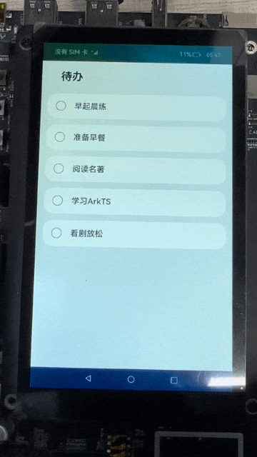

# 待办列表（ArkTS）
## 介绍

本篇Codelab将介绍如何使用ArkTS声明式语法和基础组件，实现简易待办列表。效果为点击某一事项，替换标签图片、虚化文字。效果如图所示：


### 相关概念

-   [ArkTS语法](https://gitee.com/openharmony/docs/blob/master/zh-cn/application-dev/quick-start/arkts-get-started.md)：ArkTS是HarmonyOS的主要应用开发语言。ArkTS基于TypeScript（简称TS）语言扩展而来，是TS的超集。
-   [Text组件](https://gitee.com/openharmony/docs/blob/master/zh-cn/application-dev/reference/arkui-ts/ts-basic-components-text.md)：显示一段文本的组件。
-   [Column组件](https://gitee.com/openharmony/docs/blob/master/zh-cn/application-dev/reference/arkui-ts/ts-container-column.md)：沿垂直方向布局的容器。
-   [Row组件](https://gitee.com/openharmony/docs/blob/master/zh-cn/application-dev/reference/arkui-ts/ts-container-row.md)：沿水平方向布局的容器。

## 环境搭建

### 软件要求

-   [DevEco Studio](https://gitee.com/openharmony/docs/blob/master/zh-cn/application-dev/quick-start/start-overview.md#%E5%B7%A5%E5%85%B7%E5%87%86%E5%A4%87)版本：DevEco Studio 3.1 Release及以上版本。
-   OpenHarmony SDK版本：API version 9及以上版本。

### 硬件要求

-   开发板类型：[润和RK3568开发板](https://gitee.com/openharmony/docs/blob/master/zh-cn/device-dev/quick-start/quickstart-appendix-rk3568.md)。
-   OpenHarmony系统：3.2 Release及以上版本。

### 环境搭建

完成本篇Codelab我们首先要完成开发环境的搭建，本示例以**RK3568**开发板为例，参照以下步骤进行：

1.  [获取OpenHarmony系统版本](https://gitee.com/openharmony/docs/blob/master/zh-cn/device-dev/get-code/sourcecode-acquire.md#%E8%8E%B7%E5%8F%96%E6%96%B9%E5%BC%8F3%E4%BB%8E%E9%95%9C%E5%83%8F%E7%AB%99%E7%82%B9%E8%8E%B7%E5%8F%96)：标准系统解决方案（二进制）。以3.2 Release版本为例：

    

2.  搭建烧录环境。
    1. [完成DevEco Device Tool的安装](https://gitee.com/openharmony/docs/blob/master/zh-cn/device-dev/quick-start/quickstart-ide-env-win.md)
    2.  [完成RK3568开发板的烧录](https://gitee.com/openharmony/docs/blob/master/zh-cn/device-dev/quick-start/quickstart-ide-3568-burn.md)

3.  搭建开发环境。
    1.  开始前请参考[工具准备](https://gitee.com/openharmony/docs/blob/master/zh-cn/application-dev/quick-start/start-overview.md#%E5%B7%A5%E5%85%B7%E5%87%86%E5%A4%87)，完成DevEco Studio的安装和开发环境配置。
    2.  开发环境配置完成后，请参考[使用工程向导](https://gitee.com/openharmony/docs/blob/master/zh-cn/application-dev/quick-start/start-with-ets-stage.md#创建ets工程)创建工程（模板选择“Empty Ability”）。
    3.  工程创建完成后，选择使用[真机进行调测](https://gitee.com/openharmony/docs/blob/master/zh-cn/application-dev/quick-start/start-with-ets-stage.md#使用真机运行应用)。

## 代码结构解读

本篇Codelab只对核心代码进行讲解，对于完整代码，我们会在gitee中提供。

```
├──entry/src/main/ets                   // ArkTS代码区
│  ├──common
│  │  └──constants
│  │     └──CommonConstants.ets         // 公共常量类
│  ├──entryability
│  │  └──EntryAbility.ts                // 程序入口类
│  ├──pages
│  │  └──ToDoListPage.ets               // 主页面
│  ├──view
│  │  └──ToDoItem.ets                   // 自定义单项待办组件
│  └──viewmodel
│     └──DataModel.ets                  // 列表数据获取文件
└──entry/src/main/resources	            // 资源文件目录
```
## 构建主界面

本章节将介绍应用主页面的实现，采用Column容器嵌套ForEach完成页面整体布局，页面分为两个部分：

-   标题区：使用Text组件显示“待办”标题。
-   数据列表：使用ForEach循环渲染自定义组件ToDoItem。

效果如图所示：



在工程pages目录中，选中Index.ets，点击鼠标右键 \> Refactor \> Rename，改名为ToDoListPage.ets。改名后，在工程entryability目录下，把EntryAbility.ts文件中windowStage.loadContent方法的第一个参数修改为pages/ToDoListPage。

```typescript
// EntryAbility.ts
onWindowStageCreate(windowStage: Window.WindowStage) {
  ...
  windowStage.loadContent('pages/ToDoListPage', (err, data) => {
    ...
  });
}
```

选中工程的ets目录，点击鼠标右键 \> new \> Directory，新建view文件夹。选中新建的view文件夹，点击鼠标右键 \> new \> ArkTS File，新建ToDoItem.ets文件。后续在此文件中封装自定义组件。在ToDoListPage.ets中导入封装的自定义组件ToDoItem，在aboutToAppear生命周期中初始化待办数据totalTasks，在build方法中编写主页面布局，使用Text文本组件显示标题，使用ForEach循环渲染自定义组件ToDoItem。

```typescript
// ToDoListPage.ets
import ToDoItem'../view/ToDoItem';
...
@Entry
@Component
struct ToDoListPage {
  private totalTasks: Array<string> = [];

  aboutToAppear() {
    this.totalTasks = DataModel.getData();
  }

  build() {
    Column({ space: CommonConstants.COLUMN_SPACE }) {
      Text($r('app.string.page_title'))
        ...
      ForEach(this.totalTasks, (item) => {
        ToDoItem({ content: item })
      }, item => JSON.stringify(item))
    }
    ...
  }
}
```
## 自定义子组件

在ToDoItem.ets文件中，显示的文本内容为入参content，使用@State修饰参数isComplete来管理当前事项的完成状态。当点击当前ToDoItem时，触发Row组件的onClick事件，更新isComplete的值，isComplete的改变将会刷新使用该状态变量的UI组件。具体表现为：当前点击的ToDoItem中，labelIcon图片的替换、文本透明度opacity属性的变化、文本装饰线decoration的显隐。

```typescript
// ToDoItem.ets
...
@Component
export default struct ToDoItem {
  private content: string;
  @State isComplete: boolean = false;
  
 @Builder labelIcon(icon) {
    Image(icon)
      ...
  }

  build() {
    Row() {
      if (this.isComplete) {
        this.labelIcon($r('app.media.ic_ok'));
      } else {
        this.labelIcon($r('app.media.ic_default'));
      }
      Text(this.content)
        ...
        .opacity(this.isComplete ? CommonConstants.OPACITY_COMPLETED : CommonConstants.OPACITY_DEFAULT)
        .decoration({ type: this.isComplete ? TextDecorationType.LineThrough : TextDecorationType.None })
    }
    ...
    .onClick(() => {
      this.isComplete = !this.isComplete;
    })
  }
}
```
## 总结

您已经完成了本次Codelab的学习，并了解到以下知识点：

1.  ArkTS声明式语法。
2.  Image、Text、Column、Row等基础组件的使用。

    


