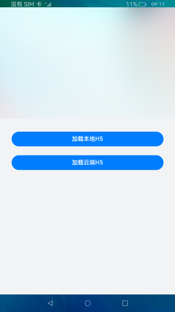

# Web组件抽奖案例（ArkTS）

## 介绍

本篇Codelab是基于ArkTS的声明式开发范式的样例，主要介绍了Web组件如何加载本地和云端H5小程序。所加载的页面是一个由HTML+CSS+JavaScript实现的完整小应用。样例主要包含以下功能：

1.  web组件加载H5页面。
2.  eTS和H5页面交互。

效果如下图所示：


### 相关概念

-   [Web](https://gitee.com/openharmony/docs/blob/master/zh-cn/application-dev/reference/arkui-ts/ts-basic-components-web.md)：提供具有网页显示能力的Web组件。

-   [runJavaScript](https://gitee.com/openharmony/docs/blob/master/zh-cn/application-dev/reference/arkui-ts/ts-basic-components-web.md#runjavascript)：异步执行JavaScript脚本，并通过回调方式返回脚本执行的结果。

### 相关权限

本Codelab使用了在线网页，需要在配置文件module.json5文件里添加网络权限：ohos.permission.INTERNET。

```typescript
{
  "module": {
    "name": "entry",
    ...
    "requestPermissions": [
      {
        "name": "ohos.permission.INTERNET"
      }
    ]
  }
}
```
## 环境搭建

### 软件要求

-   [DevEco Studio](https://gitee.com/openharmony/docs/blob/master/zh-cn/application-dev/quick-start/start-overview.md#%E5%B7%A5%E5%85%B7%E5%87%86%E5%A4%87)版本：DevEco Studio 3.1 Canary1及以上版本。
-   OpenHarmony SDK版本：API version 9及以上版本。

### 硬件要求

-   开发板类型：[润和RK3568开发板](https://gitee.com/openharmony/docs/blob/master/zh-cn/device-dev/quick-start/quickstart-appendix-rk3568.md)。
-   OpenHarmony系统：3.2 Beta3及以上版本。

### 环境搭建

完成本篇Codelab我们首先要完成开发环境的搭建，本示例以**RK3568**开发板为例，参照以下步骤进行：

1.  [获取OpenHarmony系统版本](https://gitee.com/openharmony/docs/blob/master/zh-cn/device-dev/get-code/sourcecode-acquire.md#%E8%8E%B7%E5%8F%96%E6%96%B9%E5%BC%8F3%E4%BB%8E%E9%95%9C%E5%83%8F%E7%AB%99%E7%82%B9%E8%8E%B7%E5%8F%96)：标准系统解决方案（二进制）。以3.2 Beta3版本为例：

    

2.  搭建烧录环境。
    1.  [完成DevEco Device Tool的安装](https://gitee.com/openharmony/docs/blob/master/zh-cn/device-dev/quick-start/quickstart-ide-env-win.md)
    2.  [完成RK3568开发板的烧录](https://gitee.com/openharmony/docs/blob/master/zh-cn/device-dev/quick-start/quickstart-ide-3568-burn.md)

3.  搭建开发环境。
    1.  开始前请参考[工具准备](https://gitee.com/openharmony/docs/blob/master/zh-cn/application-dev/quick-start/start-overview.md#%E5%B7%A5%E5%85%B7%E5%87%86%E5%A4%87)，完成DevEco Studio的安装和开发环境配置。
    2.  开发环境配置完成后，请参考[使用工程向导](https://gitee.com/openharmony/docs/blob/master/zh-cn/application-dev/quick-start/start-with-ets-stage.md#创建ets工程)创建工程（模板选择“Empty Ability”），选择JS或者eTS语言开发。
    3.  工程创建完成后，选择使用[真机进行调测](https://gitee.com/openharmony/docs/blob/master/zh-cn/application-dev/quick-start/start-with-ets-stage.md#使用真机运行应用)。

## 代码结构解读

```
├──entry/src/main/ets        // 代码区
│  ├──common
│  │  └──Constant.ets        // 常量类
│  ├──entryability            
│  │  └──EntryAbility.ets    // 程序入口类
│  └──pages
│     ├──MainPage.ets        // 主页入口文件
│     └──WebPage.ets         // 抽奖页入口文件
└──entry/src/main/resources  
   ├──base
   │  ├──element             // 尺寸、颜色、文字等资源文件存放位置
   │  ├──media               // 媒体资源存放位置
   │  └──profile             // 页面配置文件存放位置
   ├──en_US                  // 国际化英文
   ├──rawfile                // 本地html代码存放位置 
   └──zh_CN                  // 国际化中文
```
## H5小程序

抽奖小程序由HTML+CSS+JS实现，主要的代码展示：

```javascript
<!-- index.html -->
<div class="luckyDraw">
    <!-- 使用无序列表实现抽奖盘 -->
    <ul class="prizes">
        ...
        <li class="prizes-li"><span class="trigger" onclick="start()">点击抽奖</span></li>
    </ul>
</div>

<!-- css/index.css -->
/* 抽奖div */
.luckyDraw {
    width: 93.3%;
    margin: 0 auto;
}
...
/* 点击抽奖 */
.prizes li:nth-of-type(9) {
    width: 25.8%;
    height: 25.8%;
    ...
}
...

<!-- js/index.js -->
function roll() {
    ...
    // 满足转圈数和指定位置就停止
    if (count >= totalCount && (prizesPosition + 1) === index) {
        clearTimeout(timer);
        isClick = true;
        speed = initSpeed;
        timer = setTimeout(openDialog, 1000); // 等待1s打开弹窗
    }
    ...
}

function startDraw() {
    ...
    if (isClick) {
        ...
        roll();
        isClick = false;
    }
}

function openDialog() {
  // confirm返回抽奖结果
  confirm(prizesArr[prizesPosition]);
}
```
## Web组件

应用首页：



启动应用进入首页，页面提供两个按钮，分别对应加载本地H5和加载云端H5，点击按钮跳转到抽奖页面。

代码如下：

```typescript
Column() {
  Navigator({ target: WEB_PAGE_URI, type: NavigationType.Push }) {
    Button($r('app.string.loadLocalH5'))
      ...
  }
  .params({ path: LOCAL_PATH, tips: $r('app.string.local') })

  Navigator({ target: WEB_PAGE_URI, type: NavigationType.Push }) {
    Button($r('app.string.loadCloudH5'))
      ...
  }
  .params({ path: CLOUD_PATH, tips: $r('app.string.online') })
}
```

> **说明：**
>H5页面本地存放在resources\\rawfile目录下，通过$rawfile\(\)访问；云端则存放在服务器上面，开发者可以自己搭建服务端。

抽奖页面：


页面主要是由“点击抽奖”按钮和Web组件构成。给“点击抽奖”按钮绑定点击事件，实现点击按钮调用H5页面的JavaScript函数，并且通过onConfirm回调返回抽奖结果，在原生页面弹窗显示，完成eTS和H5的双向交互。

代码如下：

```typescript
Column() {
  ...
  Web({ src: this.params['path'], controller: this.webController })
    ...
    // 网页调用confirm()告警时触发此回调
    .onConfirm((event) => {
      // 弹窗显示抽奖结果
      AlertDialog.show({
        message: WebConstant.WEB_ALERT_DIALOG_TEXT_VALUE + event.message,
        ...
      })
      return true;
    })
  Button($r('app.string.btnValue'))
    ...
    .onClick(() => {
      // 异步执行JavaScript脚本
      this.webController.runJavaScript({ script: 'startDraw()' });
    })
}
```

## 总结

目前你已经成功完成了Codelab并且学到了：

1. 使用Web组件加载H5页面。
2. 使用ArkTS与H5页面进行交互。


