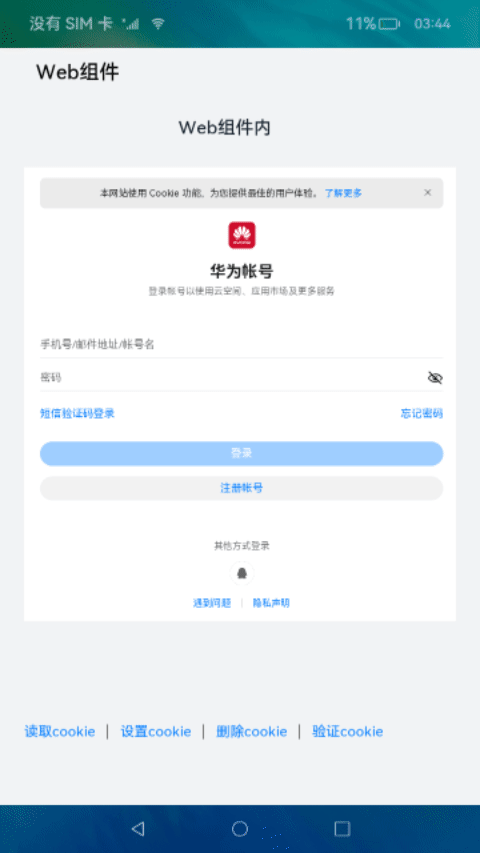
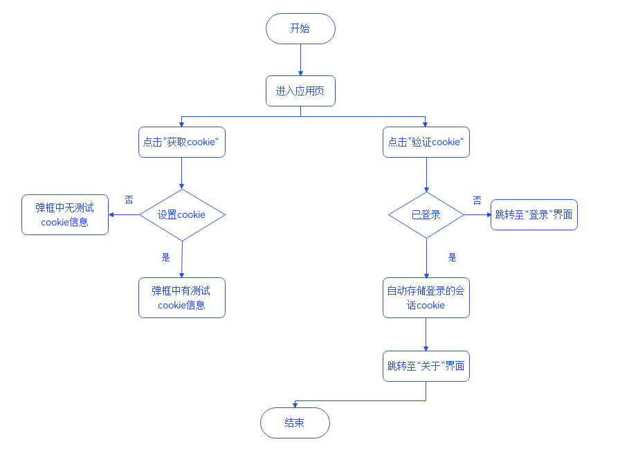
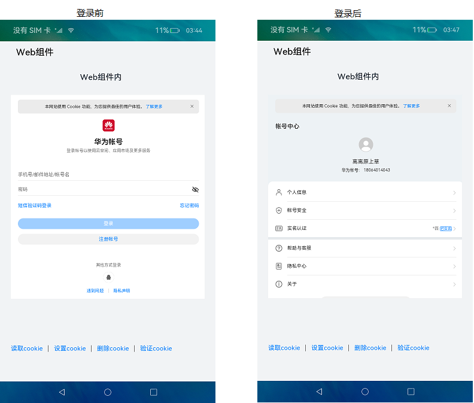
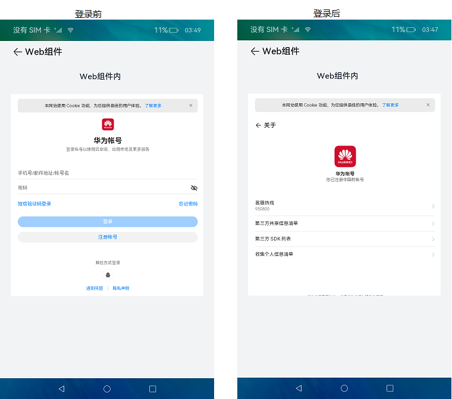

# Web组件的使用（ArkTS）

## 介绍

本篇Codelab使用ArkTS语言实现一个简单的免登录过程，向大家介绍基本的cookie管理操作。主要包含以下功能：

1.  获取指定url对应的cookie的值。
2.  设置cookie。
3.  清除所有cookie。
4.  免登录访问账户中心。



### 原理说明

本应用旨在说明Web组件中cookie的管理操作。结合应用弹框和免登录两种方式进行讲解。

- 应用弹框

  若用户已通过“设置cookie”完成cookie写操作，点击应用首页的“获取cookie”按钮，则应用弹窗中会带有“info=测试cookie写入”的信息。若用户未进行写操作，则弹窗信中无对应信息。

- 免登录

  若用户在应用首页完成登录操作，则点击“验证cookies”按钮，界面会跳转至“关于”界面；若用户此前未完成登录操作，则会跳转至登录界面。这里借助真实的登录过程，体现了Web组件自动存储登录后的会话cookie，并在整个应用中生效的能力。


流程如图所示：



### 相关概念

-   [Web](https://gitee.com/openharmony/docs/blob/master/zh-cn/application-dev/reference/arkui-ts/ts-basic-components-web.md)：提供网页显示能力的组件。
-   [WebCookie](https://gitee.com/openharmony/docs/blob/master/zh-cn/application-dev/reference/arkui-ts/ts-basic-components-web.md#webcookie)：WebCookie可以控制Web组件中的cookie的各种行为，其中每个应用中的所有Web组件共享一个WebCookie。通过controller方法中的getCookieManager方法可以获取WebCookie对象，进行后续的cookie管理操作。

### 相关权限

本篇Codelab使用的是在线网页，需添加网络权限：ohos.permission.INTERNET。在配置文件module.json5中添加对应信息：

```
{
  "module": {
    "name": "entry",
    ...
    "requestPermissions": [
      {
        "name": "ohos.permission.INTERNET"
      }
    ]
  }
}
```

## 环境搭建

### 软件要求

-   [DevEco Studio](https://gitee.com/openharmony/docs/blob/master/zh-cn/application-dev/quick-start/start-overview.md#%E5%B7%A5%E5%85%B7%E5%87%86%E5%A4%87)版本：DevEco Studio  3.1 Release。
-   OpenHarmony SDK版本：API version 9。

### 硬件要求

-   开发板类型：[润和RK3568开发板](https://gitee.com/openharmony/docs/blob/master/zh-cn/device-dev/quick-start/quickstart-appendix-rk3568.md)。
-   OpenHarmony系统：3.2 Release。

### 环境搭建

完成本篇Codelab我们首先要完成开发环境的搭建，本示例以**RK3568**开发板为例，参照以下步骤进行：

1. [获取OpenHarmony系统版本](https://gitee.com/openharmony/docs/blob/master/zh-cn/device-dev/get-code/sourcecode-acquire.md#%E8%8E%B7%E5%8F%96%E6%96%B9%E5%BC%8F3%E4%BB%8E%E9%95%9C%E5%83%8F%E7%AB%99%E7%82%B9%E8%8E%B7%E5%8F%96)：标准系统解决方案（二进制）。以3.2 Release版本为例：

   

2. 搭建烧录环境。

   1.  [完成DevEco Device Tool的安装](https://gitee.com/openharmony/docs/blob/master/zh-cn/device-dev/quick-start/quickstart-ide-env-win.md)
   2.  [完成RK3568开发板的烧录](https://gitee.com/openharmony/docs/blob/master/zh-cn/device-dev/quick-start/quickstart-ide-3568-burn.md)

3. 搭建开发环境。

   1.  开始前请参考[工具准备](https://gitee.com/openharmony/docs/blob/master/zh-cn/application-dev/quick-start/start-overview.md#%E5%B7%A5%E5%85%B7%E5%87%86%E5%A4%87)，完成DevEco Studio的安装和开发环境配置。
   2.  开发环境配置完成后，请参考[使用工程向导](https://gitee.com/openharmony/docs/blob/master/zh-cn/application-dev/quick-start/start-with-ets-stage.md#创建ets工程)创建工程（模板选择“Empty Ability”）。
   3.  工程创建完成后，选择使用[真机进行调测](https://gitee.com/openharmony/docs/blob/master/zh-cn/application-dev/quick-start/start-with-ets-stage.md#使用真机运行应用)。

## 代码结构解读

本篇Codelab只对核心代码进行讲解，完整代码可以直接从gitee获取。

```
├──entry/src/main/ets               // 代码区
│  ├──common                         
│  │  ├──constants                   
│  │  │  └──CommonConstant.ets      // 常量类
│  │  └──utils                       
│  │     ├──DialogUtil.ets          // 弹框工具类 
│  │     └──Logger.ets              // 日志工具类
│  ├──entryability                    
│  │  └──EntryAbility.ts            // 程序入口类
│  ├──pages                          
│  │  ├──Verify.ets                 // 免登录验证界面
│  │  └──WebIndex.ets               // 应用首页
│  └──view                                
│     └──LinkButton.ets             // 链接按钮组件
└──entry/src/main/resources         // 应用资源目录
```

## 实现步骤

### 应用首页

首次打开应用时，应用首页的Web组件内呈现的是登录界面。用户完成登录操作后，会跳转至账号中心界面。在用户不点击“删除cookies”按钮的情况下，用户关闭并再次打开应用，首页仍会跳转至账号中心界面。Web组件会自动存储所加载界面的cookie信息，包括登录的cookie信息。用户可以通过点击“删除cookies”按钮，清除所有cookie信息。首页呈现效果如图：



首页布局简单，由应用标题“Web组件”、内部标题“Web组件内”、中间加载的网页和底部一排按钮组成。分别对应两个Text组件、一个Web组件以及一个Row容器组件。Row容器组件内包含四个链接按钮，为LinkButton自定义组件。

```typescript
// WebIndex.ets
Column() {
  Text($r('app.string.navigator_name'))
    ...

  Text($r('app.string.title_name'))
    ...

  Web({
    src: CommonConstants.USER_CENTER_URL,
    controller: this.controller
  })
    ...

  Row() {
    LinkButton({ buttonType: CookieOperation.GET_COOKIE, isNeedDivider: true })
    LinkButton({ buttonType: CookieOperation.SET_COOKIE, isNeedDivider: true })
    LinkButton({ buttonType: CookieOperation.DELETE_COOKIE, isNeedDivider: true })
    LinkButton({ buttonType: CookieOperation.VERIFY_COOKIE, isNeedDivider: false })
  }
  ...
}
...
```

自定义组件LinkButton由Text组件和Divider分隔器组件组成。最后一个按钮没有分隔器，通过isNeedDivider标识符判断是否需要添加Divider分隔器组件。

```typescript
// LinkButton.ets
Row() {
  Text(this.buttonType)
    ...

  if (this.isNeedDivider) {
    Divider()
      ...
  }
}
```

每个按钮被点击时，都是调用operationMethod函数。函数根据不同操作，执行不同的代码内容。包括cookie的读、写和删除操作，以及页面跳转操作。

```typescript
// LinkButton.ets
operationMethod() {
  switch (this.buttonType) {
    case CookieOperation.GET_COOKIE:
      try {
        let originCookie = web_webview.WebCookieManager.getCookie(CommonConstants.USER_CENTER_URL);
        showDialog(originCookie);
      } catch (error) {
        showDialog(`ErrorCode: ${error.code},  Message: ${error.message}`);
      }
      break;
    case CookieOperation.SET_COOKIE:
      try {
        web_webview.WebCookieManager.setCookie(CommonConstants.USER_ABOUT_URL, 'info=测试cookie写入');
        showDialog($r('app.string.write_success'));
      } catch (error) {
        showDialog(`ErrorCode: ${error.code},  Message: ${error.message}`);
      }
      break;
    case CookieOperation.DELETE_COOKIE:
      web_webview.WebCookieManager.deleteEntireCookie();
      let deleteMessage = $r('app.string.delete_success');
      showDialog(deleteMessage);
      break;
    case CookieOperation.VERIFY_COOKIE:
      router.pushUrl({
        url: CommonConstants.PAGE_VERIFY
      }).catch((err: Error) => {
        Logger.error('[LinkButton] push url fail: ' + JSON.stringify(err));
      });
      break;
    default:
      break;
  }
}
```

### 免登录验证页

当用户在应用内已完成登录操作，在应用的其他位置使用Web组件访问需要相同授权的页面时，可免去多余的登录操作。一个应用中的所有Web组件共享一个WebCookie，因此一个应用中Web组件存储的cookie信息，也是可以共享的。界面呈现效果如图：



该页面布局同样简单，由应用导航标题“Web组件”、内部标题“Web组件内”、加载的网页组成。分别对应一个Navigator导航组件、一个Text组件和一个Web组件。Navigator导航组件类型设置为返回（NavigationType.Back），内容由返回图标和应用标题组成，呈水平排列展示。

```typescript
// Verify.ets
Column() {
  Navigator({ target: CommonConstants.PAGE_INDEX, type: NavigationType.Back }) {
    Row() {
      Image($r('app.media.ic_back'))
        ...

      Text($r('app.string.navigator_name'))
        ...
    }
    ...
  }
  ...

  Text($r('app.string.title_name'))
    ...

  Web({
    src: CommonConstants.USER_ABOUT_URL,
    controller: this.controller
  })
    ...
}
...
```

## 总结

您已经完成了本次Codelab的学习，并了解到以下知识点：

1.  Web组件的基本用法。
2.  使用WebCookie进行cookie管理操作。


