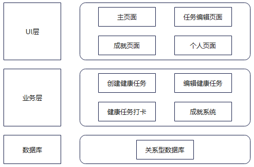
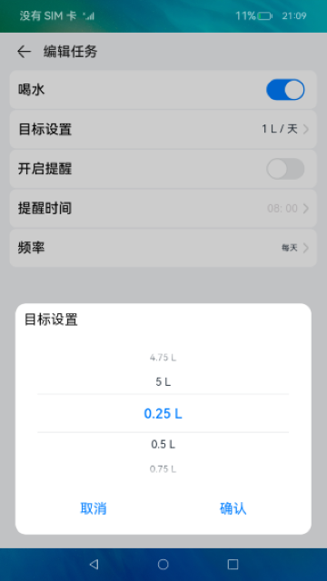
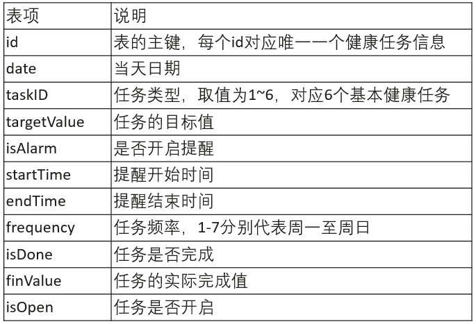

# 健康生活应用（ArkTS）

## 介绍

本篇Codelab介绍了如何实现一个简单的健康生活应用，主要功能包括：

1. 用户可以创建最多6个健康生活任务（早起，喝水，吃苹果，每日微笑，刷牙，早睡），并设置任务目标、是否开启提醒、提醒时间、每周任务频率。
2. 用户可以在主页面对设置的健康生活任务进行打卡，其中早起、每日微笑、刷牙和早睡只需打卡一次即可完成任务，喝水、吃苹果需要根据任务目标量多次打卡完成。

3. 主页可显示当天的健康生活任务完成进度，当天所有任务都打卡完成后，进度为100%，并且用户的连续打卡天数加一。

4. 当用户连续打卡天数达到3、7、30、50、73、99天时，可以获得相应的成就。成就在获得时会以动画形式弹出，并可以在“成就”页面查看。

5. 用户可以查看以前的健康生活任务完成情况。

本应用的运行效果如下图所示：


### 相关概念

- [@Observed 和 @ObjectLink](https://gitee.com/openharmony/docs/blob/master/zh-cn/application-dev/quick-start/arkts-state-mgmt-page-level.md#observed%E5%92%8Cobjectlink%E6%95%B0%E6%8D%AE%E7%AE%A1%E7%90%86)：@Observed适用于类，表示类中的数据变化由UI页面管理；@ObjectLink应用于被@Observed装饰类的对象。

- [@Consume 和 @Provide](https://gitee.com/openharmony/docs/blob/master/zh-cn/application-dev/quick-start/arkts-state-mgmt-page-level.md#consume%E5%92%8Cprovide)：@Provide作为数据提供者，可以更新子节点的数据，触发页面渲染。@Consume检测到@Provide数据更新后，会发起当前视图的重新渲染。

- [Flex](https://gitee.com/openharmony/docs/blob/master/zh-cn/application-dev/reference/arkui-ts/ts-container-flex.md)：一个功能强大的容器组件，支持横向布局，竖向布局，子组件均分和流式换行布局。

- [List](https://gitee.com/openharmony/docs/blob/master/zh-cn/application-dev/reference/arkui-ts/ts-container-list.md)：List是很常用的滚动类容器组件之一，它按照水平或者竖直方向线性排列子组件， List的子组件必须是ListItem，它的宽度默认充满List的宽度。

- [TimePicker](https://gitee.com/openharmony/docs/blob/master/zh-cn/application-dev/reference/arkui-ts/ts-basic-components-timepicker.md)：TimePicker是选择时间的滑动选择器组件，默认以00:00至23:59的时间区创建滑动选择器。

- [Toggle](https://gitee.com/openharmony/docs/blob/master/zh-cn/application-dev/reference/arkui-ts/ts-basic-components-toggle.md)：组件提供勾选框样式、状态按钮样式及开关样式。

- [后台代理提醒](https://gitee.com/openharmony/docs/blob/master/zh-cn/application-dev/reference/apis/js-apis-reminderAgentManager.md)：使用后台代理提醒能力后，应用可以被冻结或退出，计时和弹出提醒的功能将被后台系统服务代理。

- [关系型数据库（Relational Database，RDB）](https://gitee.com/openharmony/docs/blob/master/zh-cn/application-dev/reference/apis/js-apis-data-rdb.md)：一种基于关系模型来管理数据的数据库。

## 环境搭建

### 软件要求

-   [DevEco Studio](https://gitee.com/openharmony/docs/blob/master/zh-cn/application-dev/quick-start/start-overview.md#%E5%B7%A5%E5%85%B7%E5%87%86%E5%A4%87)版本：DevEco Studio 3.1 Release。
-   OpenHarmony SDK版本：API version 9。

### 硬件要求

-   开发板类型：[润和RK3568开发板](https://gitee.com/openharmony/docs/blob/master/zh-cn/device-dev/quick-start/quickstart-appendix-rk3568.md)。
-   OpenHarmony系统：3.2 Release。

### 环境搭建

完成本篇Codelab我们首先要完成开发环境的搭建，本示例以**RK3568**开发板为例，参照以下步骤进行：

1.  [获取OpenHarmony系统版本](https://gitee.com/openharmony/docs/blob/master/zh-cn/device-dev/get-code/sourcecode-acquire.md#%E8%8E%B7%E5%8F%96%E6%96%B9%E5%BC%8F3%E4%BB%8E%E9%95%9C%E5%83%8F%E7%AB%99%E7%82%B9%E8%8E%B7%E5%8F%96)：标准系统解决方案（二进制）。以3.2 Release版本为例：

    

2.  搭建烧录环境。
    1.  [完成DevEco Device Tool的安装](https://gitee.com/openharmony/docs/blob/master/zh-cn/device-dev/quick-start/quickstart-ide-env-win.md)
    2.  [完成RK3568开发板的烧录](https://gitee.com/openharmony/docs/blob/master/zh-cn/device-dev/quick-start/quickstart-ide-3568-burn.md)

3.  搭建开发环境。
    1.  开始前请参考[工具准备](https://gitee.com/openharmony/docs/blob/master/zh-cn/application-dev/quick-start/start-overview.md#%E5%B7%A5%E5%85%B7%E5%87%86%E5%A4%87)，完成DevEco Studio的安装和开发环境配置。
    2.  开发环境配置完成后，请参考[使用工程向导](https://gitee.com/openharmony/docs/blob/master/zh-cn/application-dev/quick-start/start-with-ets-stage.md#创建ets工程)创建工程（模板选择“Empty Ability”），选择JS或者eTS语言开发。
    3.  工程创建完成后，选择使用[真机进行调测](https://gitee.com/openharmony/docs/blob/master/zh-cn/application-dev/quick-start/start-with-ets-stage.md#使用真机运行应用)。

## 代码结构解读

本篇Codelab只对核心代码进行讲解，完整代码可以直接从gitee获取。

```
├─entry/src/main/ets                 // 代码区
│  ├─common
│  │  ├─constants
│  │  │  └─CommonConstants.ets       // 公共常量
│  │  ├─database
│  │  │  ├─rdb                       // 数据库
│  │  │  │  ├─RdbHelper.ets
│  │  │  │  ├─RdbHelperImp.ets
│  │  │  │  ├─RdbUtil.ets
│  │  │  │  └─TableHelper.ets
│  │  │  └─tables                    // 数据库接口
│  │  │     ├─DayInfoApi.ets
│  │  │     ├─GlobalInfoApi.ets
│  │  │     └─TaskInfoApi.ets
│  │  └─utils
│  │     ├─BroadCast.ets             // 通知
│  │     ├─GlobalContext.ets         // 全局上下文
│  │     ├─HealthDataSrcMgr.ets      // 数据管理单例
│  │     ├─Logger.ets                // 日志类
│  │     └─Utils.ets                 // 工具类
│  ├─entryability
│  │  └─EntryAbility.ets             // 程序入口类
│  ├─model                           // model
│  │  ├─AchieveModel.ets
│  │  ├─DatabaseModel.ets            // 数据库model
│  │  ├─Mine.ets
│  │  ├─NavItemModel.ets             // 菜单栏model
│  │  ├─RdbColumnModel.ets           // 数据库表数据
│  │  ├─TaskInitList.ets
│  │  └─WeekCalendarModel.ets        // 日历model
│  ├─pages
│  │  ├─AdvertisingPage.ets          // 广告页
│  │  ├─MainPage.ets                 // 应用主页面
│  │  ├─MinePage.ets                 // 我的页面
│  │  ├─SplashPage.ets               // 启动页
│  │  ├─TaskEditPage.ets             // 任务编辑页面
│  │  └─TaskListPage.ets             // 任务列表页面
│  ├─service
│  │  └─ReminderAgent.ets            // 后台提醒
│  ├─view
│  │  ├─dialog                       // 弹窗组件
│  │  │  ├─AchievementDialog.ets     // 成就弹窗
│  │  │  ├─CustomDialogView.ets      // 自定义弹窗
│  │  │  ├─TaskDetailDialog.ets      // 打卡弹窗
│  │  │  ├─TaskDialogView.ets        // 任务对话框
│  │  │  ├─TaskSettingDialog.ets     // 任务编辑相关弹窗
│  │  │  └─UserPrivacyDialog.ets
│  │  ├─home                         // 主页面相关组件
│  │  │  ├─AddBtnComponent.ets       // 添加任务按钮组件
│  │  │  ├─HomeTopComponent.ets      // 首页顶部组件
│  │  │  ├─TaskCardComponent.ets     // 任务item组件件
│  │  │  └─WeekCalendarComponent.ets // 日历组件
│  │  ├─task                         // 任务相关组件
│  │  │  ├─TaskDetailComponent.ets   // 任务编辑详情组件
│  │  │  ├─TaskEditListItem.ets      // 任务编辑行内容
│  │  │  └─TaskListComponent.ets     // 任务列表组件
│  │  ├─AchievementComponent.ets     // 成就页面
│  │  ├─BadgeCardComponent.ets       // 勋章卡片组件
│  │  ├─BadgePanelComponent.ets      // 勋章面板组件
│  │  ├─HealthTextComponent.ets      // 自定义text组件
│  │  ├─HomeComponent.ets            // 首页页面
│  │  ├─ListInfo.ets                 // 用户信息列表
│  │  ├─TitleBarComponent.ets        // 成就标题组件
│  │  └─UserBaseInfo.ets             // 用户基本信息
│  └─viewmodel                       // viewmodel
│     ├─AchievementInfo.ets          // 成就信息
│     ├─AchievementMapInfo.ets       // 成就map信息
│     ├─AchievementViewModel.ets     // 成就相关模块
│     ├─BroadCastCallBackInfo.ets    // 通知回调信息
│     ├─CalendarViewModel.ets        // 日历相关模块
│     ├─CardInfo.ets                 // 成就卡片信息
│     ├─ColumnInfo.ets               // 数据库表结构
│     ├─CommonConstantsInfo.ets      // 公共常量信息
│     ├─DayInfo.ets                  // 每日信息
│     ├─GlobalInfo.ets               // 全局信息
│     ├─HomeViewModel.ets            // 首页相关模块
│     ├─PublishReminderInfo.ets      // 发布提醒信息
│     ├─ReminderInfo.ets             // 提醒信息
│     ├─TaskInfo.ets                 // 任务信息
│     ├─TaskViewModel.ets            // 任务设置相关模块
│     ├─WeekCalendarInfo.ets         // 日历信息
│     └─WeekCalendarMethodInfo.ets   // 日历方法信息
└─entry/src/main/resources           // 资源文件夹
```

## 应用架构分析

本应用的基本架构如下图所示，数据库为其他服务提供基础的用户数据，主要业务包括：用户可以查看和编辑自己的健康任务并进行打卡、查看成就。UI层提供了承载上述业务的UI界面。



## 应用主页面

本节将介绍如何给应用添加一个启动页，设计应用的主界面，以及首页的界面开发和数据展示。

### 启动页

首先我们需要给应用添加一个启动页，启动页里我们需要用到一个定时器来实现启动页展示固定时间后跳转应用主页的功能，效果图如下：


打开应用时会进入此页面，具体实现逻辑是：

通过修改/entry/src/main/ets/entryability里的loadContent路径可以改变应用的入口文件，我们需要把入口文件改为我们写的SplashPage启动页面。

```typescript
// EntryAbility.ets
windowStage.loadContent('pages/SplashPage', (err, data) => {    
  if (err.code) {...}    
  Logger.info('windowStage','Succeeded in loading the content. Data: ' + JSON.stringify(data));
});
```

在SplashPage启动页的文件里通过首选项来实现是否需要弹“权限管理”的弹窗，如果需要弹窗的情况下，用户点击同意权限后通过首选项对用户的操作做持久化保存。相关代码如下：

```typescript
// SplashPage.ets
import data_preferences from '@ohos.data.preferences';
onConfirm() {
  let preferences = data_preferences.getPreferences(this.context, H_STORE);
  preferences.then((res) => {
    res.put(IS_PRIVACY, true).then(() => {
      res.flush();
      Logger.info('SplashPage','isPrivacy is put success');
    }).catch((err: Error) => {
      Logger.info('SplashPage','isPrivacy put failed. Cause:' + err);
    });
  })
  this.jumpAdPage();
}
exitApp() {
  this.context.terminateSelf();
}
jumpAdPage() {
  setTimeout(() => {
    router.replaceUrl({ url: 'pages/AdvertisingPage' });
  }, Const.LAUNCHER_DELAY_TIME);
}
aboutToAppear() {
  let preferences = data_preferences.getPreferences(this.context, H_STORE);
  preferences.then((res) => {
    res.get(IS_PRIVACY, false).then((isPrivate) => {
      if (isPrivate === true) {
        this.jumpAdPage();
      } else {
        this.dialogController.open();
      }
    });
  });
}
```

### APP功能入口

我们需要给APP添加底部菜单栏，用于切换不同的应用模块，由于各个模块之间属于完全独立的情况，并且不需要每次切换都进行界面的刷新，所以我们用到了Tabs，TabContent组件。


本应用一共有首页（HomeIndex），成就（AchievementIndex）和我的（MineIndex）三个模块，分别对应Tabs组件的三个子组件TabContent。

```typescript
// MainPage.ets
TabContent() {
  HomeIndex({ homeStore: $homeStore, editedTaskInfo: $editedTaskInfo, editedTaskID: $editedTaskID })
    .borderWidth({ bottom: 1 })
    .borderColor($r('app.color.primaryBgColor'))
}
.tabBar(this.TabBuilder(TabId.HOME))
.align(Alignment.Start)
TabContent() {
  AchievementIndex()
}
.tabBar(this.TabBuilder(TabId.ACHIEVEMENT))
TabContent() {
  MineIndex()
    .borderWidth({ bottom: 1 })
    .borderColor($r('app.color.primaryBgColor'))
}
.tabBar(this.TabBuilder(TabId.MINE))
```

### 首页

首页包含了任务信息的所有入口，包含任务列表的展示，任务的编辑和新增，上下滚动的过程中顶部导航栏的渐变，日期的切换以及随着日期切换界面任务列表跟着同步的功能，效果图如下：


具体代码实现我们将在下边分模块进行说明：

1. 导航栏背景渐变

   Scroll滚动的过程中，在它的onScroll方法里我们通过计算它Y轴的偏移量来改变当前界面的@State修饰的naviAlpha变量值，进而改变顶部标题的背景色，代码实现如下：

   ```typescript
   // HomeComponent.ets
   // 视图滚动的过程中处理导航栏的透明度
   onScrollAction() {  
     this.yOffset = this.scroller.currentOffset().yOffset;  
     if (this.yOffset > Const.DEFAULT_56) {    
       this.naviAlpha = 1; 
     } else {    
       this.naviAlpha = this.yOffset / Const.DEFAULT_56;
     }
   }
   ```


2. 日历组件

   日历组件主要用到的是一个横向滑动的Scroll组件。

```typescript
// WeekCalendarComponent.ets
   build() {    
     Row() {      
       Column() {        
         Row() {...}             
         Scroll(this.scroller) {          
           Row() {            
             ForEach(this.homeStore.dateArr, (item: WeekDateModel, index?: number) => {              
               Column() {                
                 Text(item.weekTitle)                  
                   .fontColor(sameDate(item.date, this.homeStore.showDate) ? $r('app.color.blueColor') : $r('app.color.titleColor'))                                 
                 Divider()
                   .color(sameDate(item.date, this.homeStore.showDate) ? $r('app.color.blueColor') : $r('app.color.white'))                
                 Image(this.getProgressImg(item))                               
               } 
               .onClick(() => WeekCalendarMethods.calenderItemClickAction(item, index, this.homeStore))            
             })          
           }       
         }
         ...               
         .onScrollEdge((event) => this.onScrollEdgeAction(event))      
       }
       ...       
     }
     ...    
   }
```

   手动滑动页面时，我们通过在onScrollEnd方法里计算Scroll的偏移量来实现分页的效果，同时Scroll有提供scrollPage\(\)方法可供我们点击左右按钮的时候来进行页面切换。

   ```typescript
   // WeekCalendarComponent.ets
   import display from '@ohos.display';
   ...
   // scroll滚动停止时通过判断偏移量进行分页处理
   onScrollEndAction() {
     if (this.isPageScroll === false) {
       let page = Math.round(this.scroller.currentOffset().xOffset / this.scrollWidth);
       page = (this.isLoadMore === true) ? page + 1 : page;
       if (this.scroller.currentOffset().xOffset % this.scrollWidth != 0 || this.isLoadMore === true) {
         let xOffset = page * this.scrollWidth;
         this.scroller.scrollTo({ xOffset, yOffset: 0 } as ScrollTo);
         this.isLoadMore = false;
       }
       this.currentPage = this.homeStore.dateArr.length / Const.WEEK_DAY_NUM - page - 1;
       Logger.info('HomeIndex', 'onScrollEnd: page ' + page + ', listLength ' + this.homeStore.dateArr.length);
       let dayModel: WeekDateModel = this.homeStore.dateArr[Const.WEEK_DAY_NUM * page+this.homeStore.selectedDay];
       Logger.info('HomeIndex', 'currentItem: ' + JSON.stringify(dayModel) + ', selectedDay  ' + this.homeStore.selectedDay);
       this.homeStore!.setSelectedShowDate(dayModel!.date!.getTime());
     }
     this.isPageScroll = false;
   }
   ```

   我们在需要在Scroll滑动到左边边缘的时候去请求更多的历史数据以便Scroll能一直滑动，通过Scroll的onScrollEdge方法我们可以判断它是否已滑到边缘位置。

   ```typescript
   // WeekCalendarComponent.ets
   onScrollEdgeAction(side: Edge) {
     if (side === Edge.Top && this.isPageScroll === false) {
       Logger.info('HomeIndex', 'onScrollEdge: currentPage ' + this.currentPage);
       if ((this.currentPage + 2) * Const.WEEK_DAY_NUM >= this.homeStore.dateArr.length) {
         Logger.info('HomeIndex', 'onScrollEdge: load more data');
         let date: Date = new Date(this.homeStore.showDate);
         date.setDate(date.getDate() - Const.WEEK_DAY_NUM);
         this.homeStore.getPreWeekData(date, () => {});
         this.isLoadMore = true;
       }
     }
   }
   ```

   homeStore主要是请求数据库的数据并对数据进行处理进而渲染到界面上。

   ```typescript
   // HomeViewModel.ets
   public getPreWeekData(date: Date, callback: Function) {
     let weekCalendarInfo: WeekCalendarInfo = getPreviousWeek(date);
       
     // 请求数据库数据
     DayInfoApi.queryList(weekCalendarInfo.strArr, (res: DayInfo[]) => {
   
       // 数据处理
       ...  
       this.dateArr = weekCalendarInfo.arr.concat(...this.dateArr);
     })
   }
   ```

   同时我们还需要知道怎么根据当天的日期计算出本周内的所有日期数据。

   ```typescript
   // WeekCalendarModel.ets
   export function getPreviousWeek(showDate: Date): WeekCalendarInfo {
     Logger.debug('WeekCalendarModel', 'get week date by date: ' + showDate.toDateString());
     let weekCalendarInfo: WeekCalendarInfo = new WeekCalendarInfo();
     let arr: Array<WeekDateModel> = [];
     let strArr: Array<string> = [];
     let currentDay = showDate.getDay() - 1;
     // 由于date的getDay()方法返回的是0-6代表周日到周六，我们界面上展示的周一-周日为一周，所以这里要将getDay()数据偏移一天
     let currentDay = showDate.getDay() - 1;
     if (showDate.getDay() === 0) {
       currentDay = 6;
     }
     // 将日期设置为当前周第一天的数据（周一）
     showDate.setDate(showDate.getDate() - currentDay);
     for (let index = WEEK_DAY_NUM; index > 0; index--) {
       let tempDate = new Date(showDate);
       tempDate.setDate(showDate.getDate() - index);
       let dateStr = dateToStr(tempDate);
       strArr.push(dateStr);
       arr.push(new WeekDateModel(WEEK_TITLES[tempDate.getDay()], dateStr, tempDate));
     }
     Logger.debug('WeekCalendarModel', JSON.stringify(arr));
     weekCalendarInfo.arr = arr;
     weekCalendarInfo.strArr = strArr;
     return weekCalendarInfo;
   }
   ```


3. 悬浮按钮

   由于首页右下角有一个悬浮按钮，所以首页整体我们用了一个Stack组件，将右下角的悬浮按钮和顶部的title放在滚动组件层的上边。

   ```typescript
   // HomeComponent.ets
   build() {  
     Stack() {    
       Scroll(this.scroller) {      
         Column() {     
           ...   // 上部界面组件
           Column() {          
             ForEach(this.homeStore.getTaskListOfDay(), (item: TaskInfo) => {            
               TaskCard({
                 taskInfoStr: JSON.stringify(item),
                 clickAction: (isClick: boolean) => this.taskItemAction(item, isClick)
               })
               ...
             }, (item: TaskInfo) => JSON.stringify(item))} 
         }   
       }
     }
     .onScroll(() => {
       this.onScrollAction()
     })
     // 悬浮按钮
     AddBtn({ clickAction: () => {
       this.editTaskAction()
     } }) 
     // 顶部title 
     Row() {
       Text($r('app.string.EntryAbility_label'))
         .titleTextStyle()
         .fontSize($r('app.float.default_24'))
         .padding({ left: Const.THOUSANDTH_66 })
     }
     .width(Const.THOUSANDTH_1000)
     .height(Const.DEFAULT_56)
     .position({ x: 0, y: 0 })
     .backgroundColor(`rgba(${WHITE_COLOR_0X},${WHITE_COLOR_0X},${WHITE_COLOR_0X},${this.naviAlpha})`)
     CustomDialogView()
   } 
   .allSize() 
   .backgroundColor($r('app.color.primaryBgColor'))
   ```


4. 界面跳转及传参
 
   首页任务列表长按时需要跳转到对应的任务编辑界面，同时点击悬浮按钮时需要跳转到任务列表页面。

   页面跳转需要在头部引入router。

   ```typescript
   // HomeComponent.ets
   import router from '@ohos.router';
   ```
 
   任务item的点击事件代码如下

   ```typescript
   // HomeComponent.ets
   taskItemAction(item: TaskInfo, isClick: boolean): void {
     if (!this.homeStore.checkCurrentDay()) {
       return;
     }
     if (isClick) {  
       // 点击任务打卡    
       let callback: CustomDialogCallback = { confirmCallback: (taskTemp: TaskInfo) => {
         this.onConfirm(taskTemp)
       }, cancelCallback: () => {
       } };
       this.broadCast.emit(BroadCastType.SHOW_TASK_DETAIL_DIALOG, [item, callback]); 
     } else {   
       // 长按编辑任务    
       let editTaskStr: string = JSON.stringify(TaskMapById[item.taskID - 1]);
       let editTask: ITaskItem = JSON.parse(editTaskStr);
       ...
       router.pushUrl({ url: 'pages/TaskEditPage', params: { params: JSON.stringify(editTask) } });
     }
   }
   ```


## 任务创建与编辑

本节将介绍如何创建和编辑健康生活任务。

### 功能概述

用户点击悬浮按钮进入任务列表页，点击任务列表可进入对应任务编辑的页面中，对任务进行详细的设置，之后点击完成按钮编辑任务后将返回首页。实现效果如下图：


### 任务列表与编辑任务

这里主要为大家介绍添加任务列表页的实现、任务编辑的实现、以及具体弹窗设置和编辑完成功能的逻辑实现。

#### 任务列表页

任务列表页由包括上部分的标题、返回按钮以及正中间的任务列表组成。实现效果如图：


使用Navigation以及List组件构成元素，ForEach遍历生成具体列表。这里是Navigation构成页面导航：

```typescript
// TaskListPage.ets
Navigation() {
  Column() {
    // 页面中间的列表
    TaskList() 
  }
  .width(Const.THOUSANDTH_1000)
  .justifyContent(FlexAlign.Center)
}
.size({ width: Const.THOUSANDTH_1000, height: Const.THOUSANDTH_1000 })
.title(Const.ADD_TASK_TITLE)
.titleMode(NavigationTitleMode.Mini)
```

列表右侧有一个判断是否开启的文字标识，点击某个列表需要跳转到对应的任务编辑页里。具体的列表实现如下：

```typescript
// TaskListComponent.ets

@Component
export default struct TaskList {
  ...
  build() {
    List({ space: Const.LIST_ITEM_SPACE }) {
      ForEach(this.taskList, (item: ITaskItem) => {
        ListItem() {
          Row() {
            Row() {
              Image(item?.icon)
                ...
              Text(item?.taskName).fontSize(Const.DEFAULT_20).fontColor($r('app.color.titleColor'))
            }.width(Const.THOUSANDTH_500)

            Blank()
              ...
			// 状态改变
            if (item?.isOpen) {
              Text($r('app.string.already_open'))
                ...
            }
            Image($r('app.media.ic_right_grey'))
              ...
          }
          ...
        }
        ...
        .onClick(() => {
          router.pushUrl({
            url: 'pages/TaskEditPage',
            params: {
              params: formatParams(item),
            }
          })
        })
        ...
      }, (item: ITaskItem) => JSON.stringify(item))
    }
  ...
  }
}
```

#### 任务编辑页

任务编辑页由上方的“编辑任务”标题以及返回按钮，主体内容的List配置项和下方的完成按钮组成，实现效果如图：


由于每一个配置项功能不相同，且逻辑复杂，故将其拆分为五个独立的组件。

这是任务编辑页面，由Navigation和一个自定义组件TaskDetail构成：

```typescript
// TaskEditPage.ets
Navigation() {
  Column() {
    TaskDetail()
  }
  .width(Const.THOUSANDTH_1000)
  .height(Const.THOUSANDTH_1000)
}
.size({ width: Const.THOUSANDTH_1000, height: Const.THOUSANDTH_1000 })
.title(Const.EDIT_TASK_TITLE)
.titleMode(NavigationTitleMode.Mini)
```

自定义组件由List以及其子组件ListItem构成：

```typescript
// TaskDetailComponent.ets
List({ space: Const.LIST_ITEM_SPACE }) {
  ListItem() {
    TaskChooseItem()
  }
  ...
  ListItem() {
    TargetSetItem()
  }
  ...
  ListItem() {
    OpenRemindItem()
  }
  ...
  ListItem() {
    RemindTimeItem()
  }
  ...
  ListItem() {
    FrequencyItem()
  }
  ...
}
.width(Const.THOUSANDTH_940)
```

其中做了禁用判断，需要任务打开才可以点击编辑：

```typescript
// TaskDetailComponent.ets
.enabled(
  this.settingParams?.isOpen
)
```

一些特殊情况的禁用，如每日微笑、每日刷牙的目标设置不可编辑：

```typescript
// TaskDetailComponent.ets
.enabled(
  this.settingParams?.isOpen
    && this.settingParams?.taskID !== taskType.smile
    && this.settingParams?.taskID !== taskType.brushTeeth
)
```

提醒时间在开启提醒打开之后才可以编辑：

```typescript
// TaskDetailComponent.ets
.enabled(this.settingParams?.isOpen && this.settingParams?.isAlarm)
```

设置完成之后，点击完成按钮，会向数据库更新现在进行改变的状态信息，并执行之后的逻辑判断：

```typescript
// TaskDetailComponent.ets
addTask(taskInfo, context).then((res: number) => {
  GlobalContext.getContext().setObject('taskListChange', true);
  // 成功的状态，成功后跳转首页
  router.back({
    url: 'pages/MainPage', 
    params: {
      editTask: this.backIndexParams(),
    }
  })
  Logger.info('addTaskFinished', JSON.stringify(res));
}).catch((error: Error) => {
  // 失败的状态，失败后弹出提示，并打印错误日志
  prompt.showToast({
    message: Const.SETTING_FINISH_FAILED_MESSAGE
  })
  Logger.error('addTaskFailed', JSON.stringify(error));
})
```

#### 任务编辑弹窗

弹窗由封装的自定义组件CustomDialogView注册事件，并在点击对应的编辑项时进行触发，从而打开弹窗。

CustomDialogView引入实例并注册事件：

```typescript
// TaskDialogView.ets
targetSettingDialog: CustomDialogController = new CustomDialogController({ 
  builder: TargetSettingDialog(),
  autoCancel: true,
  alignment: DialogAlignment.Bottom,
  offset: { dx: Const.ZERO, dy: Const.MINUS_20 }
});
...

// 注册事件
this.broadCast.on(BroadCastType.SHOW_TARGET_SETTING_DIALOG, () => {
  this.targetSettingDialog.open();
})
```

点击对应的编辑项进行触发：

```typescript
// TaskDetailComponent.ets
.onClick(() => {
  this.broadCast.emit(
    BroadCastType.SHOW_TARGET_SETTING_DIALOG);
})
```

自定义弹窗的实现：

任务目标设置的弹窗较为特殊，故单独拿出来说明。

因为任务目标设置有三种类型：

-   早睡早起的时间
-   喝水的量度
-   吃苹果的个数

如下图所示：



故根据任务的ID进行区分，将同一弹窗复用：

```typescript
// TaskSettingDialog.ets
if ([taskType.getup, taskType.sleepEarly].indexOf(this.settingParams?.taskID) > Const.HAS_NO_INDEX) {
  TimePicker({
    selected: new Date(`${new Date().toDateString()} 8:00:00`),
  })
    .height(Const.THOUSANDTH_800)
    .useMilitaryTime(true)
    .onChange((value: TimePickerResult) => {
      this.currentTime = formatTime(value);
    })
} else {
  TextPicker({ range: this.settingParams?.taskID === taskType.drinkWater ? this.drinkRange : this.appleRange })
    .width(Const.THOUSANDTH_900,)
    .height(Const.THOUSANDTH_800,)
    .onChange((value) => {
      this.currentValue = value?.split(' ')[0];
    })
}
```

弹窗确认的时候将修改好的值赋予该项设置，如不符合规则，将弹出提示：

```typescript
// TaskSettingDialog.ets
// 校验规则
compareTime(startTime: string, endTime: string) {
  if (returnTimeStamp(this.currentTime) < returnTimeStamp(startTime) ||
    returnTimeStamp(this.currentTime) > returnTimeStamp(endTime)) {
    prompt.showToast({
      message: Const.CHOOSE_TIME_OUT_RANGE
    })
    return false;
  }
  return true;
}
// 设置修改项
setTargetValue() {
  if (this.settingParams?.taskID === taskType.getup) {
    if (!this.compareTime(Const.GET_UP_EARLY_TIME, Const.GET_UP_LATE_TIME)) {
      return;
    }
    this.settingParams.targetValue = this.currentTime;
    return;
  }
  if (this.settingParams?.taskID === taskType.sleepEarly) {
    if (!this.compareTime(Const.SLEEP_EARLY_TIME, Const.SLEEP_LATE_TIME)) {
      return;
    }
    this.settingParams.targetValue = this.currentTime;
    return;
  }
  this.settingParams.targetValue = this.currentValue;
}
```

其余弹窗实现基本类似，这里不再赘述。

## 后台代理提醒

健康生活App中提供了任务提醒功能，我们用系统提供的后台代理提醒reminderAgent接口完成相关的开发。

> **说明：** 
>后台代理提醒接口需要在module.json5中申请ohos.permission.PUBLISH\_AGENT\_REMINDER权限，代码如下：

```typescript
// module.json5
"requestPermissions": [
  {
    "name": "ohos.permission.PUBLISH_AGENT_REMINDER"
  }
]
```

后台代理提醒entry\\src\\main\\ets\\service\\ReminderAgent.ts文件中提供了发布提醒任务、查询提醒任务、删除提醒任务三个接口供任务编辑页面调用，跟随任务提醒的开关增加、更改、删除相关后台代理提醒，代码如下：

```typescript
// ReminderAgent.ets
import reminderAgent from '@ohos.reminderAgentManager';
import notification from '@ohos.notificationManager';
import preferences from '@ohos.data.preferences';
import Logger from '../common/utils/Logger';
import { CommonConstants as Const } from '../common/constants/CommonConstants';
import ReminderInfo from '../viewmodel/ReminderInfo';
import PublishReminderInfo from '../viewmodel/PublishReminderInfo';

// 发布提醒
function publishReminder(params: PublishReminderInfo, context: Context) {
  if (!params) {
    Logger.error(Const.REMINDER_AGENT_TAG, 'publishReminder params is empty');
    return;
  }
  let notifyId: string = params.notificationId.toString();
  hasPreferencesValue(context, notifyId, (preferences: preferences.Preferences, hasValue: boolean) => {
    if (hasValue) {
      preferences.get(notifyId, -1, (error: Error, value: preferences.ValueType) => {
        if (typeof value !== 'number') {
          return;
        }
        if (value >= 0) {
          reminderAgent.cancelReminder(value).then(() => {
            processReminderData(params, preferences, notifyId);
          }).catch((err: Error) => {
            Logger.error(Const.REMINDER_AGENT_TAG, `cancelReminder err: ${err}`);
          });
        } else {
          Logger.error(Const.REMINDER_AGENT_TAG, 'preferences get value error ' + JSON.stringify(error));
        }
      });
    } else {
      processReminderData(params, preferences, notifyId);
    }
  });
}

// 取消提醒
function cancelReminder(reminderId: number, context: Context) {
  if (!reminderId) {
    Logger.error(Const.REMINDER_AGENT_TAG, 'cancelReminder reminderId is empty');
    return;
  }
  let reminder: string = reminderId.toString();
  hasPreferencesValue(context, reminder, (preferences: preferences.Preferences, hasValue: boolean) => {
    if (!hasValue) {
      Logger.error(Const.REMINDER_AGENT_TAG, 'cancelReminder preferences value is empty');
      return;
    }
    getPreferencesValue(preferences, reminder);
  });
}

// 可通知ID
function hasNotificationId(params: number) {
  if (!params) {
    Logger.error(Const.REMINDER_AGENT_TAG, 'hasNotificationId params is undefined');
    return;
  }
  return reminderAgent.getValidReminders().then((reminders) => {
    if (!reminders.length) {
      return false;
    }
    let notificationIdList: Array<number> = [];
    for (let i = 0; i < reminders.length; i++) {
      let notificationId = reminders[i].notificationId;
      if (notificationId) {
        notificationIdList.push(notificationId);
      }
    }
    const flag = notificationIdList.indexOf(params);
    return flag === -1 ? false : true;
  });
}

function hasPreferencesValue(context: Context, hasKey: string, callback: Function) {
  let preferencesPromise = preferences.getPreferences(context, Const.H_STORE);
  preferencesPromise.then((preferences: preferences.Preferences) => {
    preferences.has(hasKey).then((hasValue: boolean) => {
      callback(preferences, hasValue);
    });
  });
}

// 进程提醒数据
function processReminderData(params: PublishReminderInfo, preferences: preferences.Preferences, notifyId: string) {
  let timer = fetchData(params);
  reminderAgent.publishReminder(timer).then((reminderId: number) => {
    putPreferencesValue(preferences, notifyId, reminderId);
  }).catch((err: Error) => {
    Logger.error(Const.REMINDER_AGENT_TAG, `publishReminder err: ${err}`);
  });
}

// 获取数据
function fetchData(params: PublishReminderInfo): reminderAgent.ReminderRequestAlarm {
  return {
    reminderType: reminderAgent.ReminderType.REMINDER_TYPE_ALARM,
    hour: params.hour || 0,
    minute: params.minute || 0,
    daysOfWeek: params.daysOfWeek || [],
    wantAgent: {
      pkgName: Const.PACKAGE_NAME,
      abilityName: Const.ENTRY_ABILITY
    },
    title: params.title || '',
    content: params.content || '',
    notificationId: params.notificationId || -1,
    slotType: notification.SlotType.SOCIAL_COMMUNICATION
  }
}

function putPreferencesValue(preferences: preferences.Preferences, putKey: string, putValue: number) {
  preferences.put(putKey, putValue).then(() => {
    preferences.flush();
  }).catch((error: Error) => {
    Logger.error(Const.REMINDER_AGENT_TAG, 'preferences put value error ' + JSON.stringify(error));
  });
}

function getPreferencesValue(preferences: preferences.Preferences, getKey: string) {
  preferences.get(getKey, -1).then((value: preferences.ValueType) => {
    if (typeof value !== 'number') {
      return;
    }
    if (value >= 0) {
      reminderAgent.cancelReminder(value).then(() => {
        Logger.info(Const.REMINDER_AGENT_TAG, 'cancelReminder promise success');
      }).catch((err: Error) => {
        Logger.error(Const.REMINDER_AGENT_TAG, `cancelReminder err: ${err}`);
      });
    }
  }).catch((error: Error) => {
    Logger.error(Const.REMINDER_AGENT_TAG, 'preferences get value error ' + JSON.stringify(error));
  });
}

const reminder = {
  publishReminder: publishReminder,
  cancelReminder: cancelReminder,
  hasNotificationId: hasNotificationId
} as ReminderInfo

export default reminder;
```

## 实现打卡功能

首页会展示当前用户已经开启的任务列表，每条任务会显示对应的任务名称以及任务目标、当前任务完成情况。用户只可对当天任务进行打卡操作，用户可以根据需要对任务列表中相应的任务进行点击打卡。如果任务列表中的每个任务都在当天完成则为连续打卡一天，连续打卡多天会获得成就徽章。打卡效果如下图所示：


### 任务列表

使用List组件展示用户当前已经开启的任务，每条任务对应一个TaskCard组件，clickAction包装了点击和长按事件，用户点击任务卡时会触发弹起打卡弹窗，从而进行打卡操作；长按任务卡时会跳转至任务编辑界面，对相应的任务进行编辑处理。代码如下：

```typescript
// HomeComponent.ets
// 任务列表
ForEach(this.homeStore.getTaskListOfDay(), (item: TaskInfo) => {
  TaskCard({
    taskInfoStr: JSON.stringify(item),
    clickAction: (isClick: boolean) => this.taskItemAction(item, isClick)
  })
  .margin({ bottom: Const.DEFAULT_12 })
  .height($r('app.float.default_64'))
}, (item: TaskInfo) => JSON.stringify(item))
...
CustomDialogView() // 自定义弹窗中间件
```

#### 自定义弹窗中间件CustomDialogView

在组件CustomDialogView的aboutToAppear生命周期中注册SHOW\_TASK\_DETAIL\_DIALOG的事件回调方法 ，当通过emit触发此事件时即触发回调方法执行。代码如下：

```typescript
// CustomDialogView.ets
export class CustomDialogCallback {
  confirmCallback: Function = () => {};
  cancelCallback: Function = () => {};
}

@Component
export struct CustomDialogView {
  @State isShow: boolean = false;
  @Provide achievementLevel: number = 0;
  @Consume broadCast: BroadCast;
  @Provide currentTask: TaskInfo = TaskItem;
  @Provide dialogCallBack: CustomDialogCallback = new CustomDialogCallback();

  // 成就对话框
  achievementDialog: CustomDialogController = new CustomDialogController({
    builder: AchievementDialog(),
    autoCancel: true,
    customStyle: true
  });

  // 任务时钟对话框
  taskDialog: CustomDialogController = new CustomDialogController({
    builder: TaskDetailDialog(),
    autoCancel: true,
    customStyle: true
  });

  aboutToAppear() {
    Logger.debug('CustomDialogView', 'aboutToAppear');
    // 成就对话框
    this.broadCast.on(BroadCastType.SHOW_ACHIEVEMENT_DIALOG, (achievementLevel: number) => {
      Logger.debug('CustomDialogView', 'SHOW_ACHIEVEMENT_DIALOG');
      this.achievementLevel = achievementLevel;
      this.achievementDialog.open();
    });

    // 任务时钟对话框
    this.broadCast.on(BroadCastType.SHOW_TASK_DETAIL_DIALOG,
      (currentTask: TaskInfo, dialogCallBack: CustomDialogCallback) => {
        Logger.debug('CustomDialogView', 'SHOW_TASK_DETAIL_DIALOG');
        this.currentTask = currentTask || TaskItem;
        this.dialogCallBack = dialogCallBack;
        this.taskDialog.open();
    });
  }

  aboutToDisappear() {
    Logger.debug('CustomDialogView', 'aboutToDisappear');
  }

  build() {
  }
}
```

#### 点击任务卡片

点击任务卡片会emit触发 “SHOW\_TASK\_DETAIL\_DIALOG” 事件，同时把当前任务，以及确认打卡回调方法传递下去。代码如下：

```typescript
// HomeComponent.ets
// 任务卡片事件
taskItemAction(item: TaskInfo, isClick: boolean): void {
  ...
  if (isClick) {
    // 点击任务打卡
     let callback: CustomDialogCallback = { confirmCallback: (taskTemp: TaskInfo) => {
        this.onConfirm(taskTemp)
     }, cancelCallback: () => {
     } };
    // 触发弹出打卡弹窗事件  并透传当前任务参数（item） 以及确认打卡回调
     this.broadCast.emit(BroadCastType.SHOW_TASK_DETAIL_DIALOG, [item, callback]);
  } else {
    // 长按编辑任务
    ...
  }
}
// 确认打卡
onConfirm(task) {
  this.homeStore.taskClock(task).then((res: AchievementInfo) => {
    // 打卡成功后 根据连续打卡情况判断是否 弹出成就勋章  以及成就勋章级别
    if (res.showAchievement) {
      // 触发弹出成就勋章SHOW_ACHIEVEMENT_DIALOG 事件， 并透传勋章类型级别
      let achievementLevel = res.achievementLevel;
      if (achievementLevel) {
        this.broadCast.emit(BroadCastType.SHOW_ACHIEVEMENT_DIALOG, achievementLevel);
      } else {
        this.broadCast.emit(BroadCastType.SHOW_ACHIEVEMENT_DIALOG);
      }
    }
  })
}
```

### 打卡弹窗组件TaskDetailDialog

打卡弹窗组件根据当前任务的ID获取任务名称以及弹窗背景图片资源。

打卡弹窗组件由两个小组件构成，代码如下：

```typescript
// TaskDetailDialog.ets
Column() {
  // 展示任务的基本信息
  TaskBaseInfo({
    taskName: TaskMapById[this.currentTask?.taskID - 1].taskName  // 根据当前任务ID获取任务名称
  });
  // 打卡功能组件 （任务打卡、关闭弹窗）
  TaskClock({
    confirm: () => {
      this.dialogCallBack.confirmCallback(this.currentTask);
      this.controller.close();
    },
    cancel: () => {
      this.controller.close();
    },
    showButton: this.showButton
  })
}
...
```

TaskBaseInfo组件代码如下：

```typescript
// TaskDetailDialog.ets
@Component
struct TaskBaseInfo {
  taskName: string | Resource = '';

  build() {
    Column({ space: Const.DEFAULT_8 }) {
      Text(this.taskName)
        .fontSize($r('app.float.default_22'))
        .fontWeight(FontWeight.Bold)
        .fontFamily($r('app.string.HarmonyHeiTi_Bold'))
        .taskTextStyle()
        .margin({left: $r('app.float.default_12')})
    }
    .position({ y: $r('app.float.default_267') })
  }
}
```

TaskClock组件代码如下：

```typescript
// TaskDetailDialog.ets
@Component
struct TaskClock {
  confirm: Function = () => {};
  cancel: Function = () => {};
  showButton: boolean = false;

  build() {
    Column({ space: Const.DEFAULT_12 }) {
      Button() {
        Text($r('app.string.clock_in'))
          .height($r('app.float.default_42'))
          .fontSize($r('app.float.default_20'))
          .fontWeight(FontWeight.Normal)
          .textStyle()
      }
      .width($r('app.float.default_220'))
      .borderRadius($r('app.float.default_24'))
      .backgroundColor('rgba(255,255,255,0.40)')
      .onClick(() => {
        GlobalContext.getContext().setObject('taskListChange', true);
        this.confirm();
      })
      .visibility(!this.showButton ? Visibility.None : Visibility.Visible)
      Text($r('app.string.got_it'))
        .fontSize($r('app.float.default_14'))
        .fontWeight(FontWeight.Regular)
        .textStyle()
        .onClick(() => {
          this.cancel();
        })
    }
  }
}
```

### 打卡接口调用

```typescript
// HomeViewModel.ets
public async taskClock(taskInfo: TaskInfo) {
  let taskItem = await this.updateTask(taskInfo);
  let dateStr = this.selectedDayInfo?.dateStr;
  // 更新任务失败
  if (!taskItem) {
    return {
      achievementLevel: 0,
      showAchievement: false
    } as AchievementInfo;
  }
  // 更新当前时间的任务列表
  this.selectedDayInfo.taskList = this.selectedDayInfo.taskList.map((item) => {
    return item.taskID === taskItem?.taskID ? taskItem : item;
  });
  let achievementLevel: number = 0;
  if(taskItem.isDone) {
    // 更新每日任务完成情况数据
    let dayInfo = await this.updateDayInfo();
    ... 
    // 当日任务完成数量等于总任务数量时 累计连续打卡一天
    // 更新成就勋章数据 判断是否弹出获得勋章弹出及勋章类型
    if (dayInfo && dayInfo?.finTaskNum === dayInfo?.targetTaskNum) {
      achievementLevel = await this.updateAchievement(this.selectedDayInfo.dayInfo);
    }
  }
  ...
  return {
    achievementLevel: achievementLevel,
    showAchievement: ACHIEVEMENT_LEVEL_LIST.includes(achievementLevel)
  } as AchievementInfo;
}
```

```typescript
// HomeViewModel.ets
// 更新当天任务列表
updateTask(task: TaskInfo): Promise<TaskInfo> {
  return new Promise((resolve, reject) => {
    let taskID = task.taskID;
    let targetValue = task.targetValue;
    let finValue = task.finValue;
    let updateTask = new TaskInfo(task.id, task.date, taskID, targetValue, task.isAlarm, task.startTime,
      task.endTime, task.frequency, task.isDone, finValue, task.isOpen);
    let step = TaskMapById[taskID - 1].step; // 任务步长
    let hasExceed = updateTask.isDone;
    if (step === 0) { // 任务步长为0 打卡一次即完成该任务
      updateTask.isDone = true; // 打卡一次即完成该任务
      updateTask.finValue = targetValue;
    } else {
      let value = Number(finValue) + step; // 任务步长非0 打卡一次 步长与上次打卡进度累加
      updateTask.isDone = updateTask.isDone || value >= Number(targetValue); // 判断任务是否完成
      updateTask.finValue = updateTask.isDone ? targetValue : `${value}`;
    }
    TaskInfoTableApi.updateDataByDate(updateTask, (res: number) => { // 更新数据库
      if (!res || hasExceed) {
        Logger.error('taskClock-updateTask', JSON.stringify(res));
        reject(res);
      }
      resolve(updateTask);
    })
  })
}
```

## 获取成就

本节将介绍成就页面。

### 功能概述

成就页面展示用户可以获取的所有勋章，当用户满足一定的条件时，将点亮本页面对应的勋章，没有得到的成就勋章处于熄灭状态。共有六种勋章，当用户连续完成任务打卡3天、7天、30天、50天、73天、99天时，可以获得对应的“连续xx天达成”勋章。

### 页面布局与 ArkTS 代码对应关系

效果如图所示：


标题部分TitleBar是一个横向容器Row里包含一个子组件Text。

```typescript
// TitleBarComponent.ets
@Component
export struct TitleBar {
  build() {
    Row() {
      Text($r('app.string.achievement'))
        .fontSize($r('app.float.default_24'))
        .fontColor($r('app.color.white'))
        .align(Alignment.Start)
        .padding({left: Const.ACHIEVE_TITLE_BAR_LEFT,top: Const.ACHIEVE_TITLE_BAR_TOP})
    }
    .width(Const.FULL_WIDTH)
  }
}
```

每个勋章卡片BadgeCard是由一个竖向容器Column、一个图片子组件Image和一个文字子组件Text组成。

```typescript
// BadgeCardComponent.ets
@Component
export struct BadgeCard {
  @Prop content: string = '';
  imgSrc: Resource = $r('app.string.empty');

  build() {
    Column({space: Const.DEFAULT_18}) {
      Image(this.imgSrc)
        .width(Const.FULL_WIDTH)
        .height(Const.ACHIEVE_CARD_IMG_HEIGHT)
        .objectFit(ImageFit.Contain)
      Text($r('app.string.task_achievement_level', Number(this.content)))
        .lineHeight($r('app.float.default_16'))
        .fontSize($r('app.float.default_12'))
        .fontColor($r('app.color.white'))
    }
    .width(ratio2percent(Const.ACHIEVE_SPLIT_RATIO))
    .padding({top: Const.ACHIEVE_CARD_TOP, bottom: Const.ACHIEVE_CARD_BOTTOM})
  }
}
```

整体的勋章面板使用Flex一个组件即可以实现均分和换行的功能。

```typescript
// BadgePanelComponent.ets
@Component
export struct BadgePanel {
  @StorageProp(ACHIEVEMENT_LEVEL_KEY) successiveDays: number = 0;

  aboutToAppear() {
    Logger.debug('BadgePanel','aboutToAppear');
    getAchievementLevel();
  }

build() {
  Flex({ direction: FlexDirection.Row, wrap: FlexWrap.Wrap }) {
    ForEach(getBadgeCardItems(this.successiveDays), (item: CardInfo) => {
      BadgeCard({ content: item.titleContent, imgSrc: item.achievement})
    })
  }
  .width(Const.FULL_WIDTH)
  }
}
```

### 获取数据

进入界面第一次获取数据在aboutToAppear\(\)声明周期中从数据库GlobalInfo表中获取存储的勋章数据,  通过@StorageProp装饰器刷新界面，其他的地方只要通过AppStorage更新勋章数据即可。

```typescript
// BadgePanelComponent.ets
aboutToAppear() {
  Logger.debug('BadgePanel','aboutToAppear');
  getAchievementLevel();
}

// AchieveModel.ets
export function getAchievementLevel() {
  GlobalInfoApi.query((res: GlobalInfo) => {
    let globalInfo: GlobalInfo = res;
    let achievementStr = globalInfo.achievements??'';
    let achievements = achievementStr.split(',');
    if (achievements.length > 0) {
      AppStorage.Set<Number>(ACHIEVEMENT_LEVEL_KEY, Number(achievements[achievements.length - 1]));
    }
  })
}

// BadgePanelComponent.ets
@StorageProp(ACHIEVEMENT_LEVEL_KEY) successiveDays: number = 0;

ForEach(getBadgeCardItems(this.successiveDays), (item: CardInfo) => {
  BadgeCard({ content: item.titleContent, imgSrc: item.achievement})
})

// AchievementViewModel.ets
export function getBadgeCardItems(successiveDays: number): Array<CardInfo> {
  let badgeMileStones = ACHIEVEMENT_LEVEL_LIST;
  let cardItems: Array<CardInfo> = [];
  for (let i = 0; i < badgeMileStones.length; i++) {
    let onOrOff = successiveDays >= badgeMileStones[i] ? 'on' : 'off';
    let titleContent = String(badgeMileStones[i]);
    let cardInfo: CardInfo = new CardInfo();
    cardInfo.titleContent = titleContent;
    cardInfo.achievement = getAchievement(`${ onOrOff }_${ badgeMileStones[i] }`);
    cardItems.push(cardInfo);
  }
  return cardItems;
}
```

## 搭建关系型数据库

本节将介绍如何调用关系型数据库接口在本地搭建数据库，并读写相应的用户数据。

### 创建数据库

要使用关系型数据库存储用户数据，首先要进行数据库的创建，并提供基本的增、删、查、改接口。

导入关系型数据库模块：

```typescript
import data_rdb from '@ohos.data.rdb';
```

关系型数据库提供以下两个基本功能：


#### 获取RdbStore

首先要获取一个RdbStore来操作关系型数据库，代码如下：

```typescript
// RdbHelperImp.ets
getRdb(context: Context): Promise<RdbHelper> {
  this.storeConfig = {
    name: this.mDatabaseName, securityLevel: dataRdb.SecurityLevel.S1
  };
  return new Promise<RdbHelper>((success, error) => {
    dataRdb.getRdbStore(context, this.storeConfig).then(dbStore => {
      this.rdbStore = dbStore;
      success(this);
    }).catch((err: Error) => {
      Logger.error(`initRdb err : ${JSON.stringify(err)}`);
      error(err);
    })
  })
}
```

#### 封装增、删、改、查接口

关系型数据库接口提供的增、删、改、查操作均有callback和Promise两种异步回调方式，本Codelab使用了callback异步回调，其中插入数据使用了insert\(\)接口，实现代码如下：

```typescript
// RdbHelperImp.ets
insert(tableName: string, values: dataRdb.ValuesBucket | Array<dataRdb.ValuesBucket>): Promise<number> {
  return new Promise<number>((success, error) => {
    Logger.info(`insert tableName : ${tableName}, values : ${JSON.stringify(values)}`);
    if (!values) {
      Logger.info(`insert failed, values is undefined`);
      error(0);
      return;
    }
    if (values instanceof Array) {
      Logger.info(`insert values isArray = ${values.length}`);
      this.rdbStore.beginTransaction();
      this.saveArray(tableName, values).then(data => {
        Logger.info(`insert success, data : ${JSON.stringify(data)}`);
        success(data);
        this.rdbStore.commit();
      }).catch((err: Error) => {
        Logger.error(`insert failed, err : ${err}`);
        error(err);
        this.rdbStore.commit();
      })
    } else {
      this.rdbStore.insert(tableName, values).then(data => {
        Logger.info(`insert success id : ${data}`);
        success(data);
        his.rdbStore.commit();
      }).catch((err: Error) => {
        Logger.error(`insert failed, err : ${JSON.stringify(err)}`);
        error(err);
        this.rdbStore.commit();
      })
    }
  })
}
```

删除数据使用了delete\(\)接口，实现代码如下：

```typescript
// RdbHelperImp.ets
delete(rdbPredicates: dataRdb.RdbPredicates): Promise<number> {
  Logger.info(`delete rdbPredicates : ${JSON.stringify(rdbPredicates)}`);
  return this.rdbStore.delete(rdbPredicates);
}
```

更新数据使用了update\(\)接口，实现代码如下：

```typescript
// RdbHelperImp.ets
update(values: dataRdb.ValuesBucket, rdbPredicates: dataRdb.RdbPredicates): Promise<number> {
  return this.rdbStore.update(values, rdbPredicates);
}
```

查找数据使用了query\(\)接口，实现代码如下：

```typescript
// RdbHelperImp.ets
query(rdbPredicates: dataRdb.RdbPredicates, columns?: Array<string>): Promise<dataRdb.ResultSet> {
  Logger.info(`query rdbPredicates : ${JSON.stringify(rdbPredicates)}`);
  return this.rdbStore.query(rdbPredicates, columns);
}
```


### 数据库表结构

根据健康生活APP的使用场景和业务逻辑，定义了三个数据对象，并使用三张数据表来存储，分别是健康任务信息表、每日信息表和全局信息表。

#### 健康任务信息表

目前健康生活应用提供了6个基本的健康任务，分别是早起、喝水、吃苹果、每日微笑、睡前刷牙和早睡。用户可以选择开启或关闭某个任务，开启的任务可以选择是否开启提醒，在指定的时间段内提醒用户进行打卡。任务也可以选择开启的频率，如只在周一到周五开启等。需要记录每项任务的目标值和实际完成值，在用户打卡后判断任务是否已经完成，并记录在数据库中。因此，需要创建一张存储每天的健康任务信息的表，表头如下：



#### 每日信息表

在主页面，用户可以查看当天健康任务的完成进度，需要创建一张表记录当天开启的任务个数和已经完成的任务个数，表头如下：


#### 全局信息表

用户连续多日打卡完成所有创建的任务可以获得相应的成就，因此，需要有一张表记录连续打卡天数和已达成的成就项。另外，考虑应用多日未打开的情况，需要记录应用第一次打开的日期和最后一次打开的日期以向数据库回填数据，表头如下：


### 创建数据表

根据6.2中设计的表结构，创建对应的数据表，实现对相应数据的读写操作。

#### 健康任务信息数据表

在获取RdbStore后，需要使用executeSql接口执行SQL语句来创建相应的表结构和初始化数据，SQL语句如下：

```sql
CREATE TABLE IF NOT EXISTS taskInfo(
  id INTEGER PRIMARY KEY AUTOINCREMENT, 
  date TEXT NOT NULL, 
  taskID INTEGER, 
  targetValue TEXT NOT NULL, 
  isAlarm BOOLEAN, 
  startTime TEXT NOT NULL, 
  endTime TEXT NOT NULL, 
  frequency TEXT NOT NULL, 
  isDone BOOLEAN, 
  finValue TEXT NOT NULL, 
  isOpen BOOLEAN
)
```

健康任务信息数据表需要提供插入数据的接口，以在用户当天第一次打开应用时创建当天的健康任务信息，实现代码如下：

```typescript
// TaskInfoApi.ets
insertData(taskInfo: TaskInfo, callback: Function): void {
  // 根据输入数据创建待插入的数据行
  const valueBucket = generateBucket(taskInfo);
  RdbUtils.insert('taskInfo', valueBucket).then(result => {
    callback(result);
  });
  Logger.info('TaskInfoTable', `Insert taskInfo {${taskInfo.date}:${taskInfo.taskID}} finished.`);
}
```

其中generateBucket\(\)代码如下：

```typescript
// TaskInfoApi.ets
function generateBucket(taskInfo: TaskInfo): dataRdb.ValuesBucket {
  let valueBucket = {} as dataRdb.ValuesBucket;
  Const.TASK_INFO.columns?.forEach((item: string) => {
    if (item !== 'id') {
      switch (item) {
        case 'date':
          valueBucket[item] = taskInfo.date;
          break;
        case 'taskID':
          valueBucket[item] = taskInfo.taskID;
          break;
        case 'targetValue':
          valueBucket[item] = taskInfo.targetValue;
          break;
        case 'isAlarm':
          valueBucket[item] = taskInfo.isAlarm;
          break;
        case 'startTime':
          valueBucket[item] = taskInfo.startTime;
          break;
        case 'endTime':
          valueBucket[item] = taskInfo.endTime;
          break;
        case 'frequency':
          valueBucket[item] = taskInfo.frequency;
          break;
        case 'isDone':
          valueBucket[item] = taskInfo.isDone;
          break;
        case 'finValue':
          valueBucket[item] = taskInfo.finValue;
          break;
        case 'isOpen':
          valueBucket[item] = taskInfo.isOpen;
          break;
        default:
          break;
      }
    }
  });
  return valueBucket;
}
```

用户开启和关闭任务，改变任务的目标值、提醒时间、频率等，用户打卡后修改任务的实际完成值都是通过更新数据接口来实现的，代码如下：

```typescript
// TaskInfoApi.ets
updateDataByDate(taskInfo: TaskInfo, callback: Function): void {
  const valueBucket = generateBucket(taskInfo);
  let tableName = Const.TASK_INFO.tableName;
  if (!tableName) {
    return;
  }
  let predicates = new dataRdb.RdbPredicates(tableName);
  // 根据date和taskID匹配要更新的数据行
  predicates.equalTo('date', taskInfo.date).and().equalTo('taskID', taskInfo.taskID);
  RdbUtils.update(valueBucket, predicates).then((result: number) => {
    callback(result);
  });
  Logger.info('TaskInfoTable', `Update data {${taskInfo.date}:${taskInfo.taskID}} finished.`);
}
```

用户可以查看当天和以前某日的健康任务信息，需要提供查找数据接口，实现代码如下：

```typescript
// TaskInfoApi.ets
query(date: string, isOpen: boolean = true, callback: Function): void {
  let tableName = Const.TASK_INFO.tableName;
  if (!tableName) {
    return;
  }
  let predicates = new dataRdb.RdbPredicates(tableName);
  predicates.equalTo('date', date);
  // 如果isOpen为true，则只查找开启的任务 
  if (isOpen) {
    predicates.equalTo('isOpen', true);
  }
  predicates.orderByAsc('taskID');  // 查找结果按taskID排序
  RdbUtils.query(predicates).then(resultSet => {
    let count = resultSet.rowCount;
    // 查找结果为空则返回空数组，否则返回查找结果数组
    if (count === 0 || typeof count === 'string') {
      Logger.error('TaskInfoTable', `${date} query no results!`);
      const result: TaskInfo[] = [];
      callback(result);
    } else {
      resultSet.goToFirstRow();
      const result: TaskInfo[] = [];
      for (let i = 0; i < count; i++) {
        let tmp = new TaskInfo(0, '', 0, '', false, '', '', '', false, '');
        tmp.isOpen = resultSet.getDouble(resultSet.getColumnIndex('isOpen')) ? true : false;
        tmp.id = resultSet.getDouble(resultSet.getColumnIndex('id'));
        tmp.date = resultSet.getString(resultSet.getColumnIndex('date'));
        tmp.taskID = resultSet.getDouble(resultSet.getColumnIndex('taskID'));
        tmp.targetValue = resultSet.getString(resultSet.getColumnIndex('targetValue'));
        tmp.isAlarm = resultSet.getDouble(resultSet.getColumnIndex('isAlarm')) ? true : false;
        tmp.startTime = resultSet.getString(resultSet.getColumnIndex('startTime'));
        tmp.endTime = resultSet.getString(resultSet.getColumnIndex('endTime'));
        tmp.frequency = resultSet.getString(resultSet.getColumnIndex('frequency'));
        tmp.isDone = resultSet.getDouble(resultSet.getColumnIndex('isDone')) ? true : false;
        tmp.finValue = resultSet.getString(resultSet.getColumnIndex('finValue'));
        result[i] = tmp;
        resultSet.goToNextRow();
      }
      callback(result);
    }
  });
}
```

#### 每日信息数据表

创建每日信息数据表的SQL语句如下：

```sql
CREATE TABLE IF NOT EXISTS dayInfo(
  date TEXT NOT NULL PRIMARY KEY, 
  targetTaskNum INTEGER, 
  finTaskNum INTEGER
)
```

在当天第一次打开应用时需要初始化每日信息数据，页面需要根据用户编辑任务和打卡的情况来更新当天目标任务个数和完成任务个数，所以需要提供插入数据和更新数据的接口，写法与上一条中相应接口类似，不再赘述。

页面需要查找对应日期的目标任务个数和完成任务个数用以在页面显示任务进度，因此需要查找数据的接口。且页面在打开时需要显示当周每天任务的完成情况，因此需要允许一次调用查找一周的每日任务信息。实现代码如下：

```typescript
// DayInfoApi.ets
queryList(dates: string[], callback: Function): void {
  let predicates: dataRdb.RdbPredicates = new dataRdb.RdbPredicates(Const.DAY_INFO.tableName ? Const.DAY_INFO.tableName : '');
  predicates.in('date', dates);  // 匹配日期数组内的所有日期
  RdbUtils.query(predicates).then(resultSet => {
    let count = resultSet.rowCount;
    if (count === 0) {
      Logger.info('DayInfoTable', 'query no results.');
      let result: DayInfo[] = [];
      callback(result);
    } else {
      resultSet.goToFirstRow();
      let result: DayInfo[] = [];
      for (let i = 0; i < count; i++) {
        let tmp = new DayInfo('', 0, 0);
        tmp.date = resultSet.getString(resultSet.getColumnIndex('date'));
        tmp.targetTaskNum = resultSet.getDouble(resultSet.getColumnIndex('targetTaskNum'));
        tmp.finTaskNum = resultSet.getDouble(resultSet.getColumnIndex('finTaskNum'));
        result[i] = tmp;
        resultSet.goToNextRow();
      }
      callback(result);
    }
  });
}
```

#### 全局信息数据表

创建全局信息数据表的SQL语句如下：

```sql
CREATE TABLE IF NOT EXISTS globalInfo(
  id INTEGER PRIMARY KEY, 
  firstDate TEXT NOT NULL, 
  lastDate TEXT NOT NULL, 
  checkInDays INTEGER, achievements TEXT NOT NULL
)
```

全局信息数据表同样需要提供插入数据、更新数据和查找数据的接口，写法与本节前两条中相应接口类似，不再赘述。

### 数据库初始化

应用首次打开时，数据库中没有数据，要做数据库的初始化，写入一组空数据。另外，如果用户连续几天没有打开APP，再次打开时需要将数据回写至数据库。因此需要实现一个数据库接口，在应用打开时调用，进行上述操作。代码如下：

```typescript
// DatabaseModel.ets
query(date: string, callback: Function) {
  let result: TaskInfo[] = [];
  let self = this;
  GlobalInfoApi.query((globalResult: GlobalInfo) => {
    if (!globalResult.firstDate) { // 如果找不到全局信息，则写入
      let globalInfo: GlobalInfo = new GlobalInfo(date, date, 0, '');
      GlobalInfoApi.insertData(globalInfo, (isDone: number) => {
        if (isDone) {
          Logger.info('AppStart', 'Insert globalInfo success: ' + JSON.stringify(globalInfo));
        }
      });
      self.insertGlobalTask();
      let dayInfo: DayInfo = new DayInfo(date, 0, 0);
      DayInfoApi.insertData(dayInfo, (isDone: number) => {
        if (isDone) {
          Logger.info('AppStart', 'Insert dayInfo success: ' + JSON.stringify(dayInfo));
        }
      })
      self.insertTask(date);
      callback(result, dayInfo);
    } else { // 如果找到全局信息，则查询当天的任务信息
      let newGlobalInfo = globalResult;
      let preDate = globalResult.lastDate;
      newGlobalInfo.lastDate = date;
      GlobalInfoApi.updateData(newGlobalInfo, (isDone: number) => {
        if (isDone) {
          Logger.info('AppStart', 'update globalInfo success: ' + JSON.stringify(newGlobalInfo));
        }
      });
      self.queryPreInfo(date, preDate, result, callback);
    }
  });
}
```

## 编写通用工具类

本节将介绍日志打印、时间换算等通用工具类的编写和使用，工具类可以简化应用代码编写和业务流程处理。

### 日志类

日志类Logger旨在提供一个全局的日志打印、日志管理的地方，既可以规范整个应用的日志打印，也方便日后对日志工具类进行修改，而不需要去改动代码中每一个调用日志的地方，如切换具体的日志实现类（比如不使用Console而是HiLog），将日志记录到本地文件等。

Logger对外的日志API全部使用静态方法，方便调用者使用，目前分verbose，debug，info，warn，error五个级别。

使用方法如下：

1. import Logger日志类：

   ```typescript
   import { Logger } from '../utils/log/Logger';
   ```

2. 调用对应级别的静态方法:

   ```typescript
   Logger.debug('MyAbilityStage', 'onCreate');
   ```

3、Logger类中包括debug、info、warn、error，具体内容如下：

```typescript
// Logger.ets  
import hilog from '@ohos.hilog';

const LOGGER_PREFIX: string = 'Healthy_life';

class Logger {
  private domain: number;
  private prefix: string;

  ...
  constructor(prefix: string = '', domain: number = 0xFF00) {
    this.prefix = prefix;
    this.domain = domain;
  }

  debug(...args: string[]): void {
    hilog.debug(this.domain, this.prefix, this.format, args);
  }

  info(...args: string[]): void {
    hilog.info(this.domain, this.prefix, this.format, args);
  }

  warn(...args: string[]): void {
    hilog.warn(this.domain, this.prefix, this.format, args);
  }

  error(...args: string[]): void {
    hilog.error(this.domain, this.prefix, this.format, args);
  }
}

export default new Logger(LOGGER_PREFIX, 0xFF02);
```

### 时间工具

为全局提供时间工具，避免重复定义。

1. 常用时间相关常量：

```typescript
  // Utils.ets
  const CHINESE_OF_WEEK: string[] = ['一', '二', '三', '四', '五', '六', '日'];
  const YEAR: string = '年';
  const MONTH: string = '月';
  const DAY: string = '日';
  const WEEK: string = '星期';
  DAYS_OF_WEEK: number = 7;
  const SUNDAY_FIRST_SHIFT: number = 6;
```

2. 时间函数示例（由时间常量衍生出星期一到星期日和数字 1-7 的字典映射）：

```typescript
// Utils.ets
export const oneWeekDictFunc = () => {
  const oneWeekDict: Array<string> = [];
  for (let index = 0;index < CHINESE_OF_WEEK.length; index++) {
    oneWeekDict[index] = `${WEEK}${CHINESE_OF_WEEK[index]}`;
  }
  return oneWeekDict;
}
```

### 单位转换工具

把比例等分浮点数转换为百分比字符串。

例如成就页面，每一行平均分布三个徽章，可以先定义一个浮点数代表等分比例，再转换为百分比字符串。

```typescript
// Utils.ets
export function ratio2percent(ratio: number): string {
  return `${ratio * 100}%`;
}
```

使用方法如下：

1. import 工具方法：

   ```typescript
   import { ratio2percent } from '../common/utils/Utils'
   ```

2. 引用工具方法 \( 例如成就页面，每个徽章占据屏幕宽度的三分之一 \) ：

   ```typescript
   // BadgeCardComponent.ets
   Column({space: commonConst.DEFAULT_18}) { 
     ...  // 省略徽章卡片的 UI 布局细节
   }
   .width(ratio2percent(Const.ACHIEVE_SPLIT_RATIO)) // achieveConst.ACHIEVE_SPLIT_RATIO = 1 / 3
   ```

### 事件分发类

事件分发类提供应用全局的事件注册，分发，接受，可以实现组件之间的解耦。

事件分发类全局共享一个实例， 将事件处理统一管理（HealthDataSrcMgr是单例）:

获取事件分发实例：

```typescript
// HomeComponent.ets
@Provide broadCast: BroadCast = HealthDataSrcMgr.getInstance().getBroadCast();

// HealthDataSrcMgr.ets
public getBroadCast(): BroadCast {
  return this.broadCast;
}
```

事件注册：

```typescript
// CustomDialogView.ets
aboutToAppear() {
  Logger.debug('CustomDialogView', 'aboutToAppear'); 
  // 成就对话
  this.broadCast.on(BroadCastType.SHOW_ACHIEVEMENT_DIALOG, (achievementLevel: number) => {
    Logger.debug('CustomDialogView', 'SHOW_ACHIEVEMENT_DIALOG');
    this.achievementLevel = achievementLevel;
    this.achievementDialog.open();
  });

  // 任务时钟对话框
  this.broadCast.on(BroadCastType.SHOW_TASK_DETAIL_DIALOG,
    (currentTask: TaskInfo, dialogCallBack: CustomDialogCallback) => {
      Logger.debug('CustomDialogView', 'SHOW_TASK_DETAIL_DIALOG');
      this.currentTask = currentTask || TaskItem;
      this.dialogCallBack = dialogCallBack;
      this.taskDialog.open();
    });
}
  
// BroadCast.ets
public on(event: string, callback: Function) {
  Logger.info(FILE_TAG, 'register broadcast with type '+ event);
  switch (event) {
    case BroadCastType.SHOW_ACHIEVEMENT_DIALOG:
      this.callBackArray.showAchievementDialog = callback;
      break;
    case BroadCastType.SHOW_TASK_DETAIL_DIALOG:
      this.callBackArray.showTaskDetailDialog = callback;
      break;
    case BroadCastType.SHOW_TARGET_SETTING_DIALOG:
      this.callBackArray.showTargetSettingDialog = callback;
      break;
    case BroadCastType.SHOW_REMIND_TIME_DIALOG:
      this.callBackArray.showRemindTimeDialog = callback;
      break;
    case BroadCastType.SHOW_FREQUENCY_DIALOG:
      this.callBackArray.showFrequencyDialog = callback;
      break;
    default:
      break;
  }
}
```

取消事件注册：

```typescript
// TaskDetailComponent.ets
aboutToAppear() {
  this.broadCast.off(BroadCastType.SHOW_TARGET_SETTING_DIALOG, () => {});
  this.broadCast.off(BroadCastType.SHOW_REMIND_TIME_DIALOG, () => {});
  this.broadCast.off(BroadCastType.SHOW_FREQUENCY_DIALOG, () => {});
}

// BroadCast.ets
public off(event: string, callback: Function) {
  if (event === null) {
    Logger.info(FILE_TAG, 'cancel all broadcast');
    this.callBackArray = callBackArrayTemp;
  }
  Logger.info(FILE_TAG, 'cancel broadcast with type '+ event);
  const cbs = this.callBackArray;
  if (!cbs) {
    return;
  }
  if (callback === null) {
    switch (event) {
      case BroadCastType.SHOW_ACHIEVEMENT_DIALOG:
        this.callBackArray.showAchievementDialog = () => {};
        break;
      case BroadCastType.SHOW_TASK_DETAIL_DIALOG:
        this.callBackArray.showTaskDetailDialog = () => {}; 
        break;
      case BroadCastType.SHOW_TARGET_SETTING_DIALOG:
        this.callBackArray.showTargetSettingDialog = () => {};
        break;
      case BroadCastType.SHOW_REMIND_TIME_DIALOG: 
        this.callBackArray.showRemindTimeDialog = () => {};
        break;
      case BroadCastType.SHOW_FREQUENCY_DIALOG:
        this.callBackArray.showFrequencyDialog = () => {};
        break;
      default:
        break;
    }
  }
}
```

发送事件：

```typescript
// HomeComponent.ets
taskItemAction(item: TaskInfo, isClick: boolean): void {
  if (!this.homeStore.checkCurrentDay()) {
    return;
  }
  if (isClick) {
    // 点击时钟
    let callback: CustomDialogCallback = { confirmCallback: (taskTemp: TaskInfo) => {
      this.onConfirm(taskTemp)
      }, cancelCallback: () => {
      } };
    this.broadCast.emit(BroadCastType.SHOW_TASK_DETAIL_DIALOG, [item, callback]);
  } else {
    // 编辑任务
    let editTaskStr: string = JSON.stringify(TaskMapById[item.taskID - 1]);
    let editTask: ITaskItem = JSON.parse(editTaskStr);
    editTask.targetValue = item?.targetValue;
    editTask.isAlarm = item.isAlarm;
    editTask.startTime = item.startTime;
    editTask.frequency = item.frequency;
    editTask.isOpen = item.isOpen;
    router.pushUrl({ url: 'pages/TaskEditPage', params: { params: JSON.stringify(editTask) } });
  }
}
```

## 总结

通过本次Codelab的学习，您应该已经掌握了页面跳转、自定义弹窗等UI方法，并学会了操作关系型数据库读写数据。


