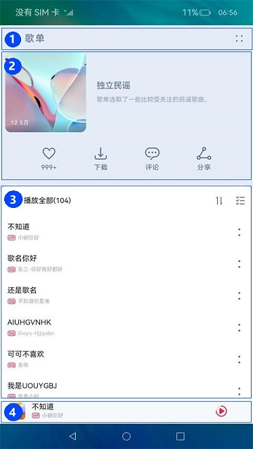

# 一次开发，多端部署-音乐专辑（ArkTS）

## 简介
基于自适应和响应式布局，实现一次开发、多端部署音乐专辑页面。


### 相关概念
-   [一次开发，多端部署](https://gitcode.com/openharmony/docs/blob/master/zh-cn/application-dev/key-features/multi-device-app-dev/introduction.md)：一套代码工程，一次开发上架，多端按需部署。支撑开发者快速高效的开发支持多种终端设备形态的应用，实现对不同设备兼容的同时，提供跨设备的流转、迁移和协同的分布式体验。
-   [自适应布局](https://gitcode.com/openharmony/docs/blob/master/zh-cn/application-dev/key-features/multi-device-app-dev/adaptive-layout.md)：当外部容器大小发生变化时，元素可以根据相对关系自动变化以适应外部容器变化的布局能力。相对关系如占比、固定宽高比、显示优先级等。当前自适应布局能力有7种：拉伸能力、均分能力、占比能力、缩放能力、延伸能力、隐藏能力、折行能力。自适应布局能力可以实现界面显示随外部容器大小连续变化。
-   [响应式布局](https://gitcode.com/openharmony/docs/blob/master/zh-cn/application-dev/key-features/multi-device-app-dev/responsive-layout.md)：当外部容器大小发生变化时，元素可以根据断点、栅格或特定的特征（如屏幕方向、窗口宽高等）自动变化以适应外部容器变化的布局能力。当前响应式布局能力有3种：断点、媒体查询、栅格布局。
-   [GridRow](https://gitcode.com/openharmony/docs/blob/master/zh-cn/application-dev/reference/arkui-ts/ts-container-gridrow.md)：栅格容器组件，仅可以和栅格子组件（GridCol）在栅格布局场景中使用。
-   [GridCol](https://gitcode.com/openharmony/docs/blob/master/zh-cn/application-dev/reference/arkui-ts/ts-container-gridcol.md)：栅格子组件，必须作为栅格容器组件（GridRow）的子组件使用。

## 环境搭建

### 软件要求

-   [DevEco Studio](https://gitcode.com/openharmony/docs/blob/master/zh-cn/application-dev/quick-start/start-overview.md#%E5%B7%A5%E5%85%B7%E5%87%86%E5%A4%87)版本：DevEco Studio 3.1 Release及以上版本。
-   OpenHarmony SDK版本：API version 9及以上版本。

### 硬件要求

-   开发板类型：[润和RK3568开发板](https://gitcode.com/openharmony/docs/blob/master/zh-cn/device-dev/quick-start/quickstart-appendix-rk3568.md)。
-   OpenHarmony系统：3.2 Release及以上版本。

### 环境搭建

完成本篇Codelab我们首先要完成开发环境的搭建，本示例以**RK3568**开发板为例，参照以下步骤进行：

1. [获取OpenHarmony系统版本](https://gitcode.com/openharmony/docs/blob/master/zh-cn/device-dev/get-code/sourcecode-acquire.md#%E8%8E%B7%E5%8F%96%E6%96%B9%E5%BC%8F3%E4%BB%8E%E9%95%9C%E5%83%8F%E7%AB%99%E7%82%B9%E8%8E%B7%E5%8F%96)：标准系统解决方案（二进制）。以3.2 Release版本为例：

   

2. 搭建烧录环境。

   1.  [完成DevEco Device Tool的安装](https://gitcode.com/openharmony/docs/blob/master/zh-cn/device-dev/quick-start/quickstart-ide-env-win.md)
   2.  [完成RK3568开发板的烧录](https://gitcode.com/openharmony/docs/blob/master/zh-cn/device-dev/quick-start/quickstart-ide-3568-burn.md)

3. 搭建开发环境。

   1.  开始前请参考[工具准备](https://gitcode.com/openharmony/docs/blob/master/zh-cn/application-dev/quick-start/start-overview.md#%E5%B7%A5%E5%85%B7%E5%87%86%E5%A4%87)，完成DevEco Studio的安装和开发环境配置。
   2.  开发环境配置完成后，请参考[使用工程向导](https://gitcode.com/openharmony/docs/blob/master/zh-cn/application-dev/quick-start/start-with-ets-stage.md#创建ets工程)创建工程（模板选择“Empty Ability”）。
   3.  工程创建完成后，选择使用[真机进行调测](https://gitcode.com/openharmony/docs/blob/master/zh-cn/application-dev/quick-start/start-with-ets-stage.md#使用真机运行应用)。


## 代码结构解读

本篇Codelab只对核心代码进行讲解，对于完整代码，我们会在gitee中提供。

```
├──common/src/main/ets               // 公共能力层
│  ├──bean
│  │  └──MenuData.ets                // 菜单数据实体类
│  ├──constants
│  │  ├──BreakpointConstants.ets     // 断点常量类
│  │  ├──GridConstants.ets           // 栅格常量类
│  │  └──StyleConstants.ets          // 样式常量类
│  └──utils
│     └──BreakpointSystem.ets        // 断点工具类
├──features                          // 基础特性层
│  ├──content/src/main/ets           // 专辑封面和歌曲列表内容区
│  │  ├──components
│  │  │  ├──AlbumComponent.ets       // 自定义专辑封面组件
│  │  │  ├──AlbumCover.ets           // 支持多设备的自定义专辑封面组件
│  │  │  ├──Content.ets              // 自定义专辑封面和歌曲列表组件
│  │  │  └──PlayList.ets             // 自定义歌曲列表组件
│  │  ├──constants
│  │  │  └──ContentConstants.ets     // 内容区常量类
│  │  └──viewmodel
│  │     ├──SongDataSource.ets       // 懒加载数据源
│  │     └──SongListData.ets         // 歌曲列表数据类
│  ├──content/src/main/resources     // 资源文件目录
│  ├──header/src/main/ets            // 顶部标题栏
│  │  ├──components
│  │  │  └──Header.ets               // 自定义标题栏组件
│  │  └──constants
│  │     └──HeaderConstants.ets      // 标题栏常量类
│  ├──header/src/main/resources      // 资源文件目录
│  └──player/src/main/ets            // 底部播放控制区
│  │  ├──components
│  │  │  └──Player.ets               // 自定义底部播放控制区组件
│  │  └──constants
│  │     └──PlayerConstants.ets      // 播放控制区常量类
│  └──player/src/main/resources      // 资源文件目录
└──products                          // 产品定制层
   ├──phone/src/main/ets             // 支持手机、平板
   │  ├──entryability
   │  │  └──EntryAbility.ts          // 程序入口类
   │  └──pages
   │     └──MainPage.ets             // 主界面
   └──phone/src/main/resources       // 资源文件目录
```

## 工程结构管理

在这个章节中，我们需要完成模块划分、梳理模块间依赖关系并设计代码结构，从而便于后续复杂项目的维护。参考上一章节页面设计，我们可以将页面分拆为多个组成部分：

1.  标题栏
2.  专辑封面
3.  歌曲列表
4.  播放控制区



工程结构建议如下：

- 定义common层（公共能力层）：
  用于存放项目的工具类、公共常量等。需编译成一个HAR包，只可以被products和features依赖，不可以反向依赖。

- 定义features层（基础特性层）：
  用于存放相对独立的各个功能单元、自定义UI组件或业务实现逻辑，供产品灵活部署。不需要单独部署的feature通常编译为HAR包，供products或其它features使用。需要单独部署的feature通常编译为Feature类型的HAP包，和products下Entry类型的HAP包进行组合部署。features层可以横向调用及依赖common层，同时可以被products层不同设备形态的HAP所依赖，但是不能反向依赖products层。

- 定义products层（产品定制层）：
  用于针对不同设备形态进行功能和特性集成。products层各个子目录分别编译为一个Entry类型的HAP包，作为应用的主入口，products层不可以横向调用。

本篇Codelab通过common层管理媒体查询工具类、栅格常量、公共常量等；按照页面分组，将标题栏定义为header基础特性，将专辑封面和歌曲列表定义为content基础特性，将播放控制区定义为player基础特性；定义phone产品目录支持手机、平板等设备，集成基础特性层的能力。products依赖features和common，features依赖common但不互相依赖，工程结构清晰且便于维护。

```
├──common               // 公共能力层
├──features             // 基础特性层
│  ├──content           // 专辑封面和歌曲列表内容区
│  ├──header            // 顶部标题栏
│  └──player            // 底部播放控制区
└──products             // 产品定制层
   └──phone             // 支持手机、平板
```


## 一次开发，多端部署实现方案

### 多标题栏

在这个章节中，我们需完成顶部标题栏的实现方案。不同设备的标题栏始终只显示“返回按钮”、“歌单”以及“更多按钮”，中间空白区域通过Blank组件填充，可实现自适应拉伸能力。效果如图所示：


```typescript
// Header.ets
@Component
export struct Header {
  @StorageProp('fontSize') fontSize: number = 0;

  build() {
    Row() {
      Image($r('app.media.ic_back'))
        .width($r('app.float.icon_width'))
        .height($r('app.float.icon_height'))
        .margin({ left: $r('app.float.icon_margin') })
      Text($r('app.string.play_list'))
        .fontSize(this.fontSize + HeaderConstants.TITLE_FONT_SIZE_PLUS)
        .fontWeight(HeaderConstants.TITLE_FONT_WEIGHT)
        .fontColor($r('app.color.title_color'))
        .opacity($r('app.float.title_opacity'))
        .letterSpacing(HeaderConstants.LETTER_SPACING)
        .padding({ left: $r('app.float.title_padding_left') })

      Blank()

      Image($r('app.media.ic_more'))
        .width($r('app.float.icon_width'))
        .height($r('app.float.icon_height'))
        .margin({ right: $r('app.float.icon_margin') })
        .bindMenu(this.getMenu())
    }
    .width(StyleConstants.FULL_WIDTH)
    .height($r('app.float.title_bar_height'))
    .zIndex(HeaderConstants.Z_INDEX)
  }
}
```

### 专辑封面

在这个章节中，我们需完成专辑封面的实现方案。专辑封面由图片、歌单介绍及常用操作（“收藏”“下载”“评论”“分享”）三部分组成，这三部分的布局可以用栅格实现。

-   在sm断点下，图片占4个栅格，歌单介绍占8个栅格，常用操作占12个栅格。
-   在md断点下，图片、歌单介绍和常用操作分别占12个栅格。
-   在lg断点下，图片、歌单介绍和常用操作分别占12个栅格。


```typescript
// AlbumComponent.ets
@Component
export struct AlbumComponent {
  @StorageProp('coverMargin') coverMargin: number = 0;
  @StorageProp('currentBreakpoint') currentBreakpoint: string = 'sm';

  ...
  build() {
    Column() {
      GridRow() {
        GridCol({
          span: { sm: GridConstants.SPAN_FOUR, md: GridConstants.SPAN_TWELVE, lg: GridConstants.SPAN_TWELVE }
        }) {
          this.CoverImage()
        }

        GridCol({
          span: { sm: GridConstants.SPAN_EIGHT, md: GridConstants.SPAN_TWELVE, lg: GridConstants.SPAN_TWELVE }
        }) {
          this.CoverIntroduction()
        }

        GridCol({
          span: { sm: GridConstants.SPAN_TWELVE, md: GridConstants.SPAN_TWELVE, lg: GridConstants.SPAN_TWELVE }
        }) {
          this.CoverOptions()
        }
        .padding({
          top: this.currentBreakpoint === BreakpointConstants.BREAKPOINT_SM ? $r('app.float.option_margin') : 0,
          bottom: this.currentBreakpoint === BreakpointConstants.BREAKPOINT_SM ? $r('app.float.option_margin') : 0
        })
      }
      .padding({
        top: this.currentBreakpoint === BreakpointConstants.BREAKPOINT_SM ?
        $r('app.float.cover_padding_top_sm') : $r('app.float.cover_padding_top_other')
      })
    }
    .margin({
      left: this.coverMargin,
      right: this.coverMargin
    })
  }
}
```

对于“收藏”、“下载”、“评论”、“分享”常用操作，通过设置容器组件的justifyContent属性为FlexAlign.SpaceEvenly，实现自适应均分能力。对于专辑图片，设置aspectRatio属性为1，Image组件宽高比固定为1:1，实现自适应缩放能力。

```typescript
// AlbumComponent.ets
@Component
export struct AlbumComponent {
  ...

  @Builder
  CoverImage() {
    Stack({ alignContent: Alignment.BottomStart }) {
      ...
    }
    .width(StyleConstants.FULL_WIDTH)
    .height(StyleConstants.FULL_HEIGHT)
    .aspectRatio(ContentConstants.ASPECT_RATIO_ALBUM_COVER)
  }

  ...
  @Builder
  CoverOptions() {
    Row() {
      ForEach(optionList, item => {
        Column({ space: ContentConstants.COVER_OPTION_SPACE }) {
          Image(item.image)
            .height($r('app.float.option_image_size'))
            .width($r('app.float.option_image_size'))
          Text(item.text)
            .fontColor($r('app.color.album_name_introduction'))
            .fontSize(this.fontSize - 1)
        }
      })
    }
    .height($r('app.float.option_area_height'))
    .width(StyleConstants.FULL_WIDTH)
    .justifyContent(FlexAlign.SpaceEvenly)
  }
}
```

### 歌曲列表

在这个章节中，我们需完成歌曲列表的实现方案。对于不同屏幕尺寸的设备，歌单列表的样式基本一致，但sm和md断点下的歌曲列表是单列显示，lg断点下的歌曲列表是双列显示。可以通过List组件的lanes属性实现这一效果。效果如图所示：


```typescript
// PlayList.ets
@Component
export struct PlayList {
  @Consume coverHeight: number;
  @StorageProp('currentBreakpoint') currentBreakpoint: string = 'sm';
  @StorageProp('fontSize') fontSize: number = 0;

  ...
  build() {
    Column() {
      this.PlayAll()
      List() {
        LazyForEach(new SongDataSource(songList), (item: SongItem) => {
          ListItem() {
            Column() {
              this.SongItem(item.title, item.label, item.singer)
              Divider()
                .strokeWidth(ContentConstants.DIVIDER_STROKE_WIDTH)
                .color($r('app.color.black'))
                .opacity($r('app.float.divider_opacity'))
            }
            .padding({
              left: $r('app.float.list_item_padding'),
              right: $r('app.float.list_item_padding')
            })
          }
        }, (item, index) => JSON.stringify(item) + index)
      }
      .width(StyleConstants.FULL_WIDTH)
      .height(StyleConstants.FULL_HEIGHT)
      .backgroundColor($r('app.color.white'))
      .margin({ top: $r('app.float.list_area_margin_top') })
      .lanes(this.currentBreakpoint === BreakpointConstants.BREAKPOINT_LG ?
        ContentConstants.COL_TWO : ContentConstants.COL_ONE)
    }
    .padding({
      top: this.currentBreakpoint === BreakpointConstants.BREAKPOINT_SM ? 0 : $r('app.float.list_area_padding_top'),
      bottom: $r('app.float.list_area_padding_bottom')
    })
  }
  ...
  }
}
```

### 播放控制区

在这个章节中，我们需完成底部播放控制区的实现方案。对于不同屏幕尺寸的设备，播放控制区显示的内容有差异，sm断点仅显示播放按钮，md断点显示上一首、播放和下一首按钮，lg断点显示收藏、上一首、播放、下一首、列表按钮，可以分别设置按钮的displayPriority属性，通过自适应隐藏能力实现。同时，歌曲信息与播放控制按钮之间通过Blank组件自动填充，实现自适应拉伸能力。效果如图所示：


```typescript
// Player.ets
@Component
export struct Player {
  ...

  build() {
    Row() {
      ...
    
      Blank()

      Row() {
        Image($r('app.media.ic_favorite'))
          ...
          .displayPriority(PlayerConstants.DISPLAY_PRIORITY_ONE)
        Image($r('app.media.ic_previous'))
          ...
          .displayPriority(PlayerConstants.DISPLAY_PRIORITY_TWO)
        Image($r('app.media.ic_pause'))
          ...
          .displayPriority(PlayerConstants.DISPLAY_PRIORITY_THREE)
        Image($r('app.media.ic_next'))
          ...
          .displayPriority(PlayerConstants.DISPLAY_PRIORITY_TWO)
        Image($r('app.media.ic_music_list'))
          ...
          .displayPriority(PlayerConstants.DISPLAY_PRIORITY_ONE)
      }
      .layoutWeight(PlayerConstants.LAYOUT_WEIGHT_PLAYER_CONTROL)
      .justifyContent(FlexAlign.End)
    }
    ...
  }
}
```

### 特性集成

在这个章节中，我们将标题栏（header基础特性）、专辑内容（content基础特性）、播放控制区（player基础特性）集成到一起，作为应用的主入口。同时，后续项目如果新增更多的产品例如穿戴设备、智慧屏等，可定义新的products产品、自由集成不同的features基础特性，从而达成代码尽量复用、产品自由定制的目标。

```typescript
// MainPage.ets
@Component
struct MainPage {
  ...

  build() {
    Stack({ alignContent: Alignment.Top }) {
      Header()
      Content()
      Player()
    }
    ...
}
```

## 解决系统能力差异的兼容性问题

前面章节主要介绍了如何解决页面适配、工程管理的问题，本章节主要介绍应用如何解决设备系统能力差异的兼容问题。

我们以一个简单例子说明：一个具有音频设备管理功能的应用，如何兼容地运行在有音频设备管理和无音频设备管理系统能力的设备上。

从开发到用户安装、运行，一般要经历几个阶段：应用分发和下载->应用安装->应用运行，要解决上面提到的兼容问题，一般有如下几种解决思路：

1. 分发和下载：有音频设备管理设备的用户才能在应用市场可见该应用，供用户下载。
2. 安装：有音频设备管理能力的设备才允许安装该应用。
3. 运行：在运行阶段通过动态判断方式，在有音频设备管理设备上功能运行正常，在无音频设备管理设备上运行不发生Crash。

所以，对应的解决方案就有：

1. 在分发阶段，上架的应用使用的系统能力是设备系统能力的子集。满足这个条件，用户才能在应用市场看到该应用。
2. 在安装阶段，安装的应用调用的系统能力是设备系统能力的子集。满足这个条件，用户才能安装该应用。
3. 通过canIUse接口判断是否支持某个系统能力。

本篇Codelab以音频设备管理为例，仅介绍canIUse接口判断的方式。点击右上角更多，如果当前系统支持音频设备管理能力，则显示“音频设备管理”菜单选项，否则不显示。

```typescript
// Header.ets
@Component
export struct Header {
  ...

  getMenu(): MenuData[] {
    let menuItem: MenuData = new MenuData();
    let menuDatas: MenuData[] = [];
    if (canIUse(HeaderConstants.SYSCAP_ETHERNET)) {
      menuItem.value = HeaderConstants.AUDIO_DEVICE_SERVICE;
      menuItem.action = () => {
        promptAction.showToast({
          message: HeaderConstants.AUDIO_DEVICE_SERVICE,
          duration: HeaderConstants.TOAST_DURATION
        });
      };
      menuDatas.push(menuItem);
    }
    return menuDatas;
  }
}
```

## 总结

您已经完成了本次Codelab的学习，并了解到以下知识点：

1.  如何针对不同屏幕尺寸的设备完成一次开发，多端部署的方案设计。
2.  如何按照合理的工程结构划分模块、组织代码。
3.  通过自适应布局和响应式布局方案实现一次开发，多端部署。
4.  通过运行时判断解决系统能力差异的兼容性问题。

