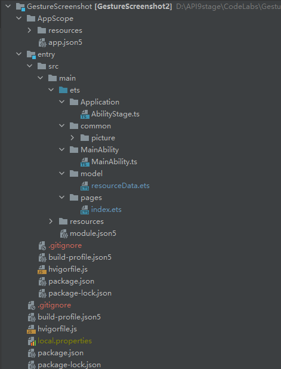

# 介绍<a name="ZH-CN_TOPIC_0000001273217726"></a>

本篇Codelab是基于TS扩展的声明式开发范式及OpenHarmony的手势处理和截屏能力结合实现的一个手势截屏的示例。

本篇Codelab实现如下功能：

-   展示商品详情页信息。
-   手指双击屏幕进行区域截屏，截屏区域可手动改变。
-   手指下滑屏幕进行全屏截屏。

相关效果图如下：

**图 1**  ：全屏截屏：<a name="fig76881047172419"></a>


**图 2**  ：区域截屏<a name="fig17354293108"></a>  


# 相关概念<a name="ZH-CN_TOPIC_0000001323899805"></a>

-   [Canvas](https://gitee.com/openharmony/docs/blob/master/zh-cn/application-dev/reference/arkui-ts/ts-canvasrenderingcontext2d.md)：提供画布组件，用于自定义绘制图形。
-   [双击手势](https://gitee.com/openharmony/docs/blob/master/zh-cn/application-dev/reference/arkui-ts/ts-basic-gestures-tapgesture.md)：手指双击屏幕回调事件。
-   [手指下滑手势](https://gitee.com/openharmony/docs/blob/master/zh-cn/application-dev/reference/arkui-ts/ts-basic-gestures-pangesture.md)：手指从屏幕由上向下滑回调事件。
-   [截屏功能](https://gitee.com/openharmony/docs/blob/master/zh-cn/application-dev/reference/apis/js-apis-screenshot.md)：截屏功能API。

# 搭建OpenHarmony环境<a name="ZH-CN_TOPIC_0000001324019673"></a>

完成本篇Codelab我们首先要完成开发环境的搭建，本示例以**RK3568**开发板为例，参照以下步骤进行：

1.  [获取OpenHarmony系统版本](https://gitee.com/openharmony/docs/blob/master/zh-cn/device-dev/get-code/sourcecode-acquire.md#%E8%8E%B7%E5%8F%96%E6%96%B9%E5%BC%8F3%E4%BB%8E%E9%95%9C%E5%83%8F%E7%AB%99%E7%82%B9%E8%8E%B7%E5%8F%96)：标准系统解决方案（二进制）。

    以3.1版本为例：

    

2.  搭建烧录环境。
    1.  [完成DevEco Device Tool的安装](https://gitee.com/openharmony/docs/blob/master/zh-cn/device-dev/quick-start/quickstart-standard-env-setup.md)
    2.  [完成RK3568开发板的烧录](https://gitee.com/openharmony/docs/blob/master/zh-cn/device-dev/quick-start/quickstart-ide-standard-running-rk3568-burning.md)

3.  搭建开发环境。
    1.  开始前请参考[工具准备](https://gitee.com/openharmony/docs/blob/master/zh-cn/application-dev/quick-start/start-overview.md#%E5%B7%A5%E5%85%B7%E5%87%86%E5%A4%87)，完成DevEco Studio的安装和开发环境配置。
    2.  开发环境配置完成后，请参考[使用工程向导](https://gitee.com/openharmony/docs/blob/master/zh-cn/application-dev/quick-start/start-with-ets-stage.md#%E5%88%9B%E5%BB%BAets%E5%B7%A5%E7%A8%8B)创建工程（模板选择“Empty Ability”），选择JS或者eTS语言开发。
    3.  工程创建完成后，选择使用[真机进行调测](https://gitee.com/openharmony/docs/blob/master/zh-cn/application-dev/quick-start/start-with-ets-stage.md#%E4%BD%BF%E7%94%A8%E7%9C%9F%E6%9C%BA%E8%BF%90%E8%A1%8C%E5%BA%94%E7%94%A8)。


# 代码结构导读<a name="ZH-CN_TOPIC_0000001323700621"></a>



-   AppScope：App作用域目录。
-   entry/src/main/ets：程序目录。
    -   Application：stage模型目录。
        -   AbilityStage.ts：stage模型文件。

    -   common/picture：资源图片及图标。
    -   MainAbility：程序入口目录。
        -   pages/Index.ets：程序入口类。
        -   app.ets：程序入口。

    -   model/resourceData：数据模型。
    -   pages：界面目录。
        -   index.ets：主界面。


-   entry/src/main/resources：资源文件目录。
-   entry/src/main/module.json5：应用配置文件。
-   entry/src/build-profile.json5：应用构建配置文件。

# 相关权限设置<a name="ZH-CN_TOPIC_0000001273380814"></a>

本篇Codelab需要在module.json5中配置如下权限：

```
"requestPermissions" :[
  {
    // 截屏权限
    "name": "ohos.permission.CAPTURE_SCREEN"
  }
]
```

> **说明：**
>本篇codelab所涉及的截屏权限属于高级权限，高级权限需要增加一些配置，请参考：[权限申请说明](https://gitee.com/openharmony/docs/blob/master/zh-cn/application-dev/security/accesstoken-guidelines.md#acl%E6%96%B9%E5%BC%8F%E5%A3%B0%E6%98%8E)

# 截屏主界面<a name="ZH-CN_TOPIC_0000001324138221"></a>

主界面包括图片文字两部分，整体效果图如下：


示例代码如下：

```
Column() {
  // 图片轮播图
  Column() {
    Swiper(this.swiperController) {
      ForEach(this.swiperArray.map((item, index) => {
        return { i: index, data: item };
      }), (item) => {
        Column() {
          Image(item.data.resourceSrc)
            .objectFit(ImageFit.Cover)
            .width('100%')
            .height('100%')
        }
        .width('100%')
        .height('100%')
        .alignItems(HorizontalAlign.Center)
      })
    }
    .index(0)
    .autoPlay(true)
    .interval(3000)
    .indicator(false)
    .loop(true)
    .indicatorStyle({ color: '#cccccc', selectedColor: '#ffffff' })
    .height('100%')
  }
  .width('100%')
  .height('50%')

  // 文字信息
  Column() {
    Column({ space: 20 }) {
      Text('微澜止水    ')
        .fontSize(20)
        .padding({ bottom: 10 })
      Text('平地微澜终吹皱，')
        .fontSize(20)
      Text('顾盼逡巡为哪般？')
        .fontSize(20)
      Text('杨柳青烟红暮里，')
        .fontSize(20)
      Text('斌驳墙下故人还。')
        .fontSize(20)
    }
    .border({ width: 2, radius: 10, style: BorderStyle.Solid, color: Color.White })
    .align(Alignment.Top)
    .padding({ top: 28, bottom: 8 })
    .margin({ left: 8, right: 8, top: 50 })
    .width('100%')
  }
  .padding({ left: 8, right: 8 })
  .height('50%')
}
.width('100%')
.height('100%')
.backgroundColor('#ffd6d6d6')
```

# 截屏操作界面<a name="ZH-CN_TOPIC_0000001323900813"></a>

截屏操作分为全屏截屏和区域截屏，具体操作步骤代码介绍如下：

1.  全屏截屏，手指从屏幕任何地方向下滑动一小段距离即可触发全屏截屏，示例代码如下：

    ```
    Column() {
    	// 图片轮播图
    	Column() {
    	    ...
    	}
    	.width('100%')
    	.height('50%')
    
    	// 文字信息
    	Column() {
                ...
    	}
    	.padding({ left: 8, right: 8 })
    	.height('50%')
    }
    .width('100%')
    .height('100%')
    .backgroundColor('#ffd6d6d6')
    .gesture(
    // 触发手指数：fingers  触发方向：direction  触发滑动距离：distance
    	PanGesture({ fingers: 3, direction: PanDirection.Down, distance: 50 })
    	// 手势触发开始回调
    	.onActionStart((event: GestureEvent) => {
    	  // 截屏参数
    	  var ScreenshotOptions = {
    	    rotation: 0
    	  };
              // 截屏API
    	  let promise = screenshot.save(ScreenshotOptions);
    	  promise.then(() => {
    	    console.log('screenshot save success');
    	  }).catch((err) => {
    	    console.log('screenshot save fail: ' + JSON.stringify(err));
    	  });
    	})
    	  // 手势触发更新回调
    	.onActionUpdate((event: GestureEvent) => {
    	  console.info('Pan update' + JSON.stringify(event))
    	})
    	  // 手势触发结束回调
    	.onActionEnd(() => {
    	  console.info('Pan end')
    	})
    )
    ```

2.  区域截屏，分为三个操作步骤，具体操作如下：

（1）手指双击屏幕触发区域截屏选取框，示例代码如下：

```
Column() {
	// 图片轮播图
	Column() {
	    ...
	}
	.width('100%')
	.height('50%')

	// 文字信息
	Column() {
            ...
	}
	.padding({ left: 8, right: 8 })
	.height('50%')
}
.width('100%')
.height('100%')
.backgroundColor('#ffd6d6d6')
// 手势双击操作
.gesture(
  // 触发连击次数：count
  TapGesture({ count: 2 })
    .onAction(() => {
      // 显示区域截屏选取界面
      this.showScreen = true
    })
)

if (this.showScreen) {
  Stack() {
    Flex({ justifyContent: FlexAlign.SpaceBetween, alignItems: ItemAlign.Center }) {
      Button({ type: ButtonType.Capsule, stateEffect: true }) {
        Text('取消')
          .fontSize(18)
          .fontWeight(FontWeight.Bolder)
          .fontColor('#FFFFFF')
      }
      .onClick(() => {
        // 区域截屏初始化
        this.showScreen = false
        this.offsetX1 = 50
        this.offsetX2 = 300
        this.offsetY1 = 200
        this.offsetY2 = 450
      })
      .backgroundColor('#00ffffff')
      .width('25%')

      Button({ type: ButtonType.Capsule, stateEffect: true }) {
        Text('确定')
          .fontSize(18)
          .fontWeight(FontWeight.Bolder)
          .fontColor('#FFFFFF')
      }
      .onClick(() => {
        // 截屏参数
        var ScreenshotOptions = {
          rotation: 0,
          "screenRect": {
            "left": this.offsetX1,
            "top": this.offsetY1,
            "width": this.offsetX2 - this.offsetX1,
            "height": this.offsetY2 - this.offsetY1 }
        };
        // 截屏API
        let promise = screenshot.save(ScreenshotOptions);
        promise.then(() => {
          console.log('screenshot save success');
        }).catch((err) => {
          console.log('screenshot save fail: ' + JSON.stringify(err));
        });

        // 区域截屏初始化
        this.showScreen = false
        this.offsetX1 = 50
        this.offsetX2 = 300
        this.offsetY1 = 200
        this.offsetY2 = 450
      })
      .backgroundColor('#00ffffff')
      .width('25%')
    }
    .zIndex(1)
    .position({ x: 0, y: 0 })

    // Canvas绘制选取框
    Canvas(this.context)
      .height('100%')
      .onReady(() => {
        this.draw(this.offsetX1, this.offsetX2, this.offsetY1, this.offsetY2)
      })

  }
  .width('100%')
  .height('100%')
  .onTouch((event: TouchEvent) => {
    ...
  })
}
```

Canvas绘制选取框方法，示例代码如下：

```
// 传入左上及右下两个点横纵坐标
private draw(x1, x2, y1, y2) {
  // 每次画之前先清除之前的画布
  this.context.clearRect(0, 0, this.screenWidth, this.screenHeight)
  this.context.beginPath()

  // 先画一个最外层的与屏幕大小一样的透明矩形
  this.context.moveTo(0, 0)
  this.context.lineTo(this.screenWidth, 0)
  this.context.lineTo(this.screenWidth, this.screenHeight)
  this.context.lineTo(0, this.screenHeight)
  this.context.globalAlpha = 0
  this.context.closePath()
  this.context.fill()

  // 画选取框大小
  this.context.moveTo(x2, y1)
  this.context.lineTo(x1, y1)
  this.context.lineTo(x1, y2)
  this.context.lineTo(x2, y2)

  this.context.globalAlpha = 0.9
  this.context.fillStyle = '#000'
  this.context.closePath()
  this.context.fill()
}
```

（2）拖拽选取框的边缘可以改变选取框的大小，包括八个方向，示例代码如下：

```
if (this.showScreen) {
  Stack() {
	...
  }
  .width('100%')
  .height('100%')
  .onTouch((event: TouchEvent) => {
	// 触摸手指按下事件回调
    if (event.type === TouchType.Down) {
	// 确定用户是向哪个方向拖动
      this.clippingType = this.fetchType(event.touches[0].screenX, event.touches[0].screenY)
    }
    // 触摸手指移动事件回调
    if (event.type === TouchType.Move) {
      if (this.clippingType !== -1) {
	// 不同方向传入不同参数来用Canvas重绘选取框
        if (this.clippingType == CLIPPINGENUM.LEFT) {
          this.draw(event.touches[0].screenX, this.offsetX2, this.offsetY1, this.offsetY2)
          this.offsetX1 = event.touches[0].screenX
        }
        if (this.clippingType === CLIPPINGENUM.RIGHT) {
          this.draw(this.offsetX1, event.touches[0].screenX, this.offsetY1, this.offsetY2)
          this.offsetX2 = event.touches[0].screenX
        }
        if (this.clippingType === CLIPPINGENUM.UP) {
          this.draw(this.offsetX1, this.offsetX2, event.touches[0].screenY, this.offsetY2)
          this.offsetY1 = event.touches[0].screenY
        }
        if (this.clippingType === CLIPPINGENUM.DOWN) {
          this.draw(this.offsetX1, this.offsetX2, this.offsetY1, event.touches[0].screenY)
          this.offsetY2 = event.touches[0].screenY
        }
        if (this.clippingType === CLIPPINGENUM.LEFTUP) {
          this.draw(event.touches[0].screenX, this.offsetX2, event.touches[0].screenY, this.offsetY2)
          this.offsetX1 = event.touches[0].screenX
          this.offsetY1 = event.touches[0].screenY
        }
        if (this.clippingType === CLIPPINGENUM.LEFTDOWN) {
          this.draw(event.touches[0].screenX, this.offsetX2, this.offsetY1, event.touches[0].screenY)
          this.offsetX1 = event.touches[0].screenX
          this.offsetY2 = event.touches[0].screenY
        }
        if (this.clippingType === CLIPPINGENUM.RIGHTUP) {
          this.draw(this.offsetX1, event.touches[0].screenX, event.touches[0].screenY, this.offsetY2)
          this.offsetX2 = event.touches[0].screenX
          this.offsetY1 = event.touches[0].screenY
        }
        if (this.clippingType === CLIPPINGENUM.RIGHTDOWN) {
          this.draw(this.offsetX1, event.touches[0].screenX, this.offsetY1, event.touches[0].screenY)
          this.offsetX2 = event.touches[0].screenX
          this.offsetY2 = event.touches[0].screenY
        }
      }
    }
    // 触摸手指抬起事件回调
    if (event.type === TouchType.Up) {
    }
  })
}	
```

确定用户拖动方向函数，示例代码如下：

```
// 八方向枚举类
const CLIPPINGENUM = {
  LEFT: 0,
  RIGHT: 1,
  UP: 2,
  DOWN: 3,
  LEFTUP: 4,
  RIGHTUP: 5,
  LEFTDOWN: 6,
  RIGHTDOWN: 7,
}

// 通过手指触发屏幕的x,y坐标确定手指在哪个方向的选取框上
private fetchType(x, y) {
  let left, right, up, down
  if (y > this.offsetY1 - 5 && y < this.offsetY2 + 5 && x > this.offsetX1 - 5 && x < this.offsetX1 + 5) {
    left = true
  }
  if (y > this.offsetY1 - 5 && y < this.offsetY2 + 5 && x > this.offsetX2 - 5 && x < this.offsetX2 + 5) {
    right = true
  }
  if (x > this.offsetX1 - 5 && x < this.offsetX2 + 5 && y > this.offsetY1 - 5 && y < this.offsetY1 + 5) {
    up = true
  }
  if (x > this.offsetX1 - 5 && x < this.offsetX2 + 5 && y > this.offsetY2 - 5 && y < this.offsetY2 + 5) {
    down = true
  }

  if (left && up) return CLIPPINGENUM.LEFTUP
  if (left && down) return CLIPPINGENUM.LEFTDOWN
  if (right && up) return CLIPPINGENUM.RIGHTUP
  if (right && down) return CLIPPINGENUM.RIGHTDOWN
  if (left) return CLIPPINGENUM.LEFT
  if (right) return CLIPPINGENUM.RIGHT
  if (up) return CLIPPINGENUM.UP
  if (down) return CLIPPINGENUM.DOWN

  return -1
}
```

（3）确定选取及取消事件，示例代码在步骤（1）的示例代码可查看。

# 恭喜您<a name="ZH-CN_TOPIC_0000001323780681"></a>

目前你已经成功完成了本Codelab并且学到了：

-   如何使用双击手势。
-   如何使用手指下滑手势。
-   如何使用截屏API。
-   如何使用Canvas动态绘制图形。


