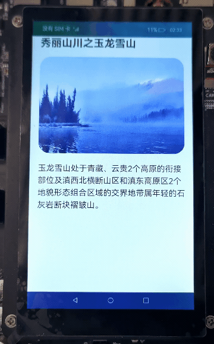

# 手势截屏（ArkTS）

## 介绍

本篇Codelab基于手势处理和截屏能力，介绍了手势截屏的实现过程。样例主要包括以下功能：

1. 根据下滑手势调用全屏截图功能。
2. 全屏截图，同时右下角有弹窗提示截图成功。
3. 根据双击手势调用区域截图功能。
4. 区域截图，通过调整选择框大小完成。


### 相关概念

- [Canvas](https://gitcode.com/openharmony/docs/blob/master/zh-cn/application-dev/reference/arkui-ts/ts-components-canvas-canvas.md)：画布组件，用于自定义绘制图形。
- [CanvasRenderingContext2D对象](https://gitcode.com/openharmony/docs/blob/master/zh-cn/application-dev/reference/arkui-ts/ts-canvasrenderingcontext2d.md)：使用RenderingContext在Canvas组件上进行绘制，绘制对象可以是矩形、文本、图片等。
- [双击手势](https://gitcode.com/openharmony/docs/blob/master/zh-cn/application-dev/reference/arkui-ts/ts-basic-gestures-tapgesture.md)：手指双击屏幕回调事件。
- [手指滑动手势](https://gitcode.com/openharmony/docs/blob/master/zh-cn/application-dev/reference/arkui-ts/ts-basic-gestures-pangesture.md)：手指在屏幕滑动回调事件。

### 相关权限

- 本篇Codelab用到屏幕截图的能力，需要在配置文件module.json5里添加屏幕截图的权限：ohos.permission.CAPTURE\_SCREEN。
- 本篇Codelab需要使用的screenshot为系统接口。需要使用Full SDK手动从镜像站点获取，并在DevEco Studio中替换，具体操作可参考[替换指南](https://gitcode.com/openharmony/docs/blob/master/zh-cn/application-dev/faqs/full-sdk-switch-guide.md)。
- 本篇Codelab使用的部分API仅系统应用可用，需要提升应用等级为system_core。具体可参考指南[《访问控制授权申请指导》](https://gitcode.com/openharmony/docs/blob/master/zh-cn/application-dev/security/accesstoken-overview.md#%E5%BA%94%E7%94%A8apl%E7%AD%89%E7%BA%A7%E8%AF%B4%E6%98%8E)。

## 环境搭建

### 软件要求

- [DevEco Studio](https://gitcode.com/openharmony/docs/blob/master/zh-cn/application-dev/quick-start/start-overview.md#%E5%B7%A5%E5%85%B7%E5%87%86%E5%A4%87)版本：DevEco Studio 3.1 Release。
- OpenHarmony SDK版本：API version 9。

### 硬件要求

- 开发板类型：[润和RK3568开发板](https://gitcode.com/openharmony/docs/blob/master/zh-cn/device-dev/quick-start/quickstart-appendix-rk3568.md)。
- OpenHarmony系统：3.2 Release。

### 环境搭建

完成本篇Codelab我们首先要完成开发环境的搭建，本示例以**RK3568**开发板为例，参照以下步骤进行：

1. [获取OpenHarmony系统版本](https://gitcode.com/openharmony/docs/blob/master/zh-cn/device-dev/get-code/sourcecode-acquire.md#%E8%8E%B7%E5%8F%96%E6%96%B9%E5%BC%8F3%E4%BB%8E%E9%95%9C%E5%83%8F%E7%AB%99%E7%82%B9%E8%8E%B7%E5%8F%96)：标准系统解决方案（二进制）。以3.2 Release版本为例：

    

2. 搭建烧录环境。
    1. [完成DevEco Device Tool的安装](https://gitcode.com/openharmony/docs/blob/master/zh-cn/device-dev/quick-start/quickstart-ide-env-win.md)
    2. [完成RK3568开发板的烧录](https://gitcode.com/openharmony/docs/blob/master/zh-cn/device-dev/quick-start/quickstart-ide-3568-burn.md)

3. 搭建开发环境。
    1. 开始前请参考[工具准备](https://gitcode.com/openharmony/docs/blob/master/zh-cn/application-dev/quick-start/start-overview.md#%E5%B7%A5%E5%85%B7%E5%87%86%E5%A4%87)，完成DevEco Studio的安装和开发环境配置。
    2. 开发环境配置完成后，请参考[使用工程向导](https://gitcode.com/openharmony/docs/blob/master/zh-cn/application-dev/quick-start/start-with-ets-stage.md#创建ets工程)创建工程（模板选择“Empty Ability”）。
    3. 工程创建完成后，选择使用[真机进行调测](https://gitcode.com/openharmony/docs/blob/master/zh-cn/application-dev/quick-start/start-with-ets-stage.md#使用真机运行应用)。

## 代码结构解读

本篇Codelab只对核心代码进行讲解，对于完整代码，我们会在gitee中提供。

```
├──entry/src/main/ets           // 代码区
│  ├──common
│  │  └──utils
│  │     ├──CommonConstants.ets	// 公共常量类
│  │     ├──DrawUtil.ets        // 画布相关工具类
│  │     └──Logger.ets          // 日志打印类
│  ├──entryability
│  │  └──EntryAbility.ets       // 程序入口类
│  ├──model
│  │  └──OffsetModel.ets        // 区域截图坐标相关工具类
│  ├──pages
│  │  └──GestureScreenshot.ets  // 主界面	
│  └──view
│     ├──AreaScreenshot.ets     // 自定义区域截屏组件类
│     └──ScreenshotDialog.ets   // 自定义截屏显示弹窗组件类
└──entry/src/main/resources     // 资源文件目录
```

## 构建截屏主页面

使用下滑手势，进行全屏截图并展示图片。效果如图所示：



主界面主要实现以下功能：

1. 下滑手势绑定在主界面上，双击手势绑定在区域手势的最底层Stack组件上。
2. 如果使用下滑手势，就进行全屏截图并展示图片。
3. 如果使用双击手势，就唤起区域截图相关组件。

```typescript
// GestureScreenshot.ets
// 区域截图最底层，当主页面缩放后会露出，设置为黑色
Stack() {
  // 主页面布局
  Column() {
    ...
  })
  // 添加滑动手势事件
  .gesture(
    // fingers：触发手指数 direction：触发方向 distance：触发滑动距离
    PanGesture({
      fingers: 1,
      direction: PanDirection.Down,
      distance: CommonConstants.MINIMUM_FINGER_DISTANCE
    })// 触发开始回调
      .onActionStart(() => {
        let screenshotOptions: screenshot.ScreenshotOptions = {
          rotation: 0
        };
        screenshot.save(screenshotOptions, (err: Error, data: image.PixelMap) => {
          if (err) {
            Logger.error(`Failed to save the screenshot. Error:${ JSON.stringify(err) }`);
          }
          if (this.pixelMap !== undefined) {
            this.pixelMap.release();
          }
          this.pixelMap = data;
          this.dialogController.open();
        });
      })
  )
  .scale(this.scaleNum)

  // 区域截图相关组件
  AreaScreenshot({ showScreen: this.showScreen, pixelMap: this.pixelMap, scaleNum: this.scaleNum })
}
.backgroundColor($r('app.color.black_area'))
// 添加双击手势事件
.gesture(
  TapGesture({ count: 2 })
    .onAction(() => {
      this.showScreen = true;
      this.scaleNum = {
        x: CommonConstants.X_SCALE_DOWN,
        y: CommonConstants.Y_SCALE_DOWN
      }
    })
)
```

## 构建区域截图组件

本章节将完成区域选择框的绘制并完成区域截图，效果如图所示：


在绘制区域选择框之前，首先需要在AreaScreenshot.ets的aboutToAppear方法中获取屏幕的宽和高，并初始化offsetModel和drawUtil对象（初始化参数为屏幕的宽高）。offsetModel对输入的坐标进行计算和更改，drawUtil使用offsetModel的坐标在屏幕上绘制区域选择框。

```typescript
// AreaScreenshot.ets
aboutToAppear() {
  window.getLastWindow(getContext(this))
    .then((window) => {
      let property = window.getWindowProperties();
      this.systemBarHeight = property.windowRect.top;

      drawUtil.initDrawUtil(
        this.canvasRenderingContext,
        px2vp(property.windowRect.width),
        px2vp(property.windowRect.height)
      );

      offsetModel.initOffsetModel(
        px2vp(property.windowRect.width),
        px2vp(property.windowRect.height)
      );

      // 在展示截图的时候，用于计算图片大小
      this.screenAspectRatio = px2vp(property.windowRect.height) / px2vp(property.windowRect.width);
    })
    .catch((err: Error) => {
      Logger.error(`window loading has error: ${ JSON.stringify(err) }`);
    })
}
```

在AreaScreenshot.ets布局页面中添加Canvas组件，通过showScreen变量控制局部截屏页面的显示，并控制主页面的缩放。步骤如下：

1. 根据手指按下的位置确定需要移动的边框。
2. 手指移动后，更新offsetModel记录的坐标信息。
3. 根据offsetModel提供的坐标，使用drawUtil绘制区域选择框。
4. 点击保存按钮后，设置截屏区域坐标。
5. 根据截屏区域坐标进行区域截屏。

```typescript
// AreaScreenshot.ets
// 关闭区域截屏相关组件，并还原主页面
private resetParameter() {
  this.showScreen = false;
  this.scaleNum = {
    x: CommonConstants.NO_SCALE_DOWN,
    y: CommonConstants.NO_SCALE_DOWN
  };
  offsetModel.resetDefaultOffSet();
}

// 使用if渲染，控制区域截图相关组件的显隐
if (this.showScreen) {
  Stack() {
    Canvas(this.canvasRenderingContext)
      ...
      .onReady(() => {
        // 通过draw方法绘制选择框和非高亮区域
        drawUtil.draw();
      })
    // 截图的工具栏
    Row() {
      ...
      // 区域截图并展示图像
      Image($r('app.media.ic_save'))
        .onClick(() => {
          let screenshotOptions: screenshot.ScreenshotOptions = {
            // 截屏区域Rect参数
            screenRect: {
              left: vp2px(offsetModel.getXLeft()),
              top: vp2px(offsetModel.getYTop()) + this.systemBarHeight,
              width: vp2px(offsetModel.getWidth()),
              height: vp2px(offsetModel.getHeight())
            } as screenshot.Rect,
            // 截图的大小
            imageSize: {
              width: vp2px(offsetModel.getWidth()),
              height: vp2px(offsetModel.getHeight())
            } as screenshot.Size,
            rotation: 0,
            displayId: 0
          };
          screenshot.save(screenshotOptions, (err: Error, data: image.PixelMap) => {
            if (err) {
              Logger.error(`Failed to save the screenshot. Error:${JSON.stringify(err)}`);
            }
            if (this.pixelMap !== undefined) {
              this.pixelMap.release();
            }
            this.pixelMap = data;
            // 使用弹窗组件展示截完的图片
            this.dialogController.open();
          });
          this.resetParameter();
        })
    }
    ...
    // 根据手指位置调整选择框大小和位置
    .onTouch((event: TouchEvent) => {
      switch(event.type) {
        case TouchType.Down:
          // 根据手指位置，判断移动哪个坐标
          offsetModel.setXLocationType(event.touches[0].screenX);
          offsetModel.setYLocationType(event.touches[0].screenY);
          break;
        case TouchType.Move:
          // 更新坐标信息，并保证坐标值合法
          offsetModel.resetOffsetXY(event.touches[0].screenX, event.touches[0].screenY);
          drawUtil.draw();
          break;
        default:
          break;
      }
    })
}
```

## 区域选择框工具类的实现

在构建区域截图组件中介绍了OffsetModel和DrawUtil两个工具类，本章节介绍一下具体的实现步骤。

使用OffsetModel校验坐标的范围，并保存坐标相关信息。

1. 在初始化对象的时候，根据屏幕的缩放比例计算出黑色区域的宽高。
2. 使用setXLocationType方法和setYLocationType方法，判断需要移动的x、y坐标位置。
3. 根据传入的x、y坐标值，更改offset对应的坐标值，并保证选择框的宽高大于等于预设的选择框的最小值。
4. 再次校验offset坐标值，是否超出可截屏区域。

```typescript
// OffsetModel.ets
public initOffsetModel(width: number, height: number) {
  ...
  this.blackAreaWidth = this.screenWidth * (1 - CommonConstant.X_SCALE_DOWN);
  this.blackAreaWidth = this.blackAreaWidth / CommonConstant.BLACK_AREA_NUM;
  this.blackAreaHeight = this.screenHeight * (1 - CommonConstant.Y_SCALE_DOWN);
  this.blackAreaHeight = this.blackAreaHeight / CommonConstant.BLACK_AREA_NUM;
}

// 判断x坐标位置
public setXLocationType(offsetX: number) {
  if (offsetX > this.offsetXRight - CommonConstant.OFFSET_RANGE &&
    offsetX < this.offsetXRight + CommonConstant.OFFSET_RANGE) {
    this.xLocationType = XLocationEnum.XRight;
  } else if (offsetX > this.offsetXLeft - CommonConstant.OFFSET_RANGE &&
    offsetX < this.offsetXLeft + CommonConstant.OFFSET_RANGE) {
    this.xLocationType = XLocationEnum.XLeft;
  } else {
    this.xLocationType = XLocationEnum.noChange;
  }
}

// 判断y坐标位置
public setYLocationType(offsetY: number) {
  ...
}

// 根据参数改变坐标值
public resetOffsetXY(offsetX: number, offsetY: number) {
  if (this.xLocationType === XLocationEnum.XLeft) {
    this.offsetXLeft = this.offsetXRight - offsetX < CommonConstant.OFFSET_RANGE * 2 ?
      this.offsetXLeft : offsetX;
  }
  ...

  this.checkOffsetXY();
}

// 再次校验坐标值,是否超出可截屏区域
private checkOffsetXY() {
  this.offsetXLeft = this.offsetXLeft < this.blackAreaWidth ? this.blackAreaWidth : this.offsetXLeft;
  this.offsetXRight = this.offsetXRight > this.screenWidth - this.blackAreaWidth ?
    this.screenWidth - this.blackAreaWidth : this.offsetXRight;
  this.offsetYTop = this.offsetYTop < this.blackAreaHeight ? this.blackAreaHeight : this.offsetYTop;
  this.offsetYBottom = this.offsetYBottom > this.screenHeight - this.blackAreaHeight ?
    this.screenHeight - this.blackAreaHeight : this.offsetYBottom;
}
```

DrawUtil主要提供绘制方法，用于绘制区域选择框。

```typescript
// DrawUtil.ets
// 绘制整个区域选择框
public draw() {
  this.offsetXLeft = offsetModel.getXLeft();
  this.offsetXRight = offsetModel.getXRight();
  this.offsetYTop = offsetModel.getYTop();
  this.offsetYBottom = offsetModel.getYBottom();
  
  // 填充非高亮区域
  this.drawScreenSelection();
  // 绘制框选线
  this.drawLines();
}

// 填充非高亮区域，设置回形区域并填充颜色
private drawScreenSelection() {
  this.canvasContext.clearRect(0, 0, this.screenWidth, this.screenHeight)
  this.canvasContext.beginPath();

  this.canvasContext.moveTo(0, 0);
  this.canvasContext.lineTo(this.screenWidth, 0);
  this.canvasContext.lineTo(this.screenWidth, this.screenHeight);
  this.canvasContext.lineTo(0, this.screenHeight);
  this.canvasContext.closePath();

  this.canvasContext.moveTo(this.offsetXRight, this.offsetYTop);
  this.canvasContext.lineTo(this.offsetXLeft, this.offsetYTop);
  this.canvasContext.lineTo(this.offsetXLeft, this.offsetYBottom);
  this.canvasContext.lineTo(this.offsetXRight, this.offsetYBottom);

  this.canvasContext.globalAlpha = Constants.UNSELECT_AREA_ALPHA;
  this.canvasContext.fillStyle = Constants.UNSELECT_AREA_COLOR;
  this.canvasContext.closePath();
  this.canvasContext.fill();
}

// 绘制框选线
private drawLines() {
  this.canvasContext.beginPath();
  ...
  this.canvasContext.moveTo(
    (this.offsetXLeft + Constants.LINES_MAX_LENGTH),
    (this.offsetYTop - Constants.GAP_WIDTH)
  );
  this.canvasContext.lineTo(
    (this.offsetXLeft - Constants.GAP_WIDTH),
    (this.offsetYTop - Constants.GAP_WIDTH)
  );
  this.canvasContext.lineTo(
    (this.offsetXLeft - Constants.GAP_WIDTH),
    (this.offsetYTop + Constants.LINES_MAX_LENGTH)
  );
  ...
  this.canvasContext.stroke();
}
```

## 展示截图

本篇Codelab采用弹窗组件展示截屏，需要在aboutToAppear方法中计算对应的宽度：

1. 截图长宽比小于或者等于屏幕长宽比：此截图展示时和全屏截图展示时等宽。
2. 截图长宽比大于屏幕长宽比：此截图展示时和全屏截图展示时等长，通过计算对应的宽来实现。

```typescript
// ScreenshotDialog.ets
aboutToAppear() {
  this.getDialogWidth();
}
...
private async getDialogWidth() {
  if (this.pixelMap !== undefined) {
    let info = await this.pixelMap.getImageInfo();
    let pixelMapAspectRatio = info.size.height / info.size.width;

    if ((this.screenAspectRatio !== -1) && (pixelMapAspectRatio > this.screenAspectRatio)) {
      let width = CommonConstants.HEIGHT_FIRST / pixelMapAspectRatio * this.screenAspectRatio;
      this.dialogWidth = width + '%';
    } else {
      this.dialogWidth = CommonConstants.WIDTH_FIRST;
    }
  }
}
```

## 总结

您已经完成了本次Codelab的学习，并了解到以下知识点：

1. 使用Canvas绘制区域选择框。
2. 使用手势事件。
3. 进行全屏截图和区域截图。


