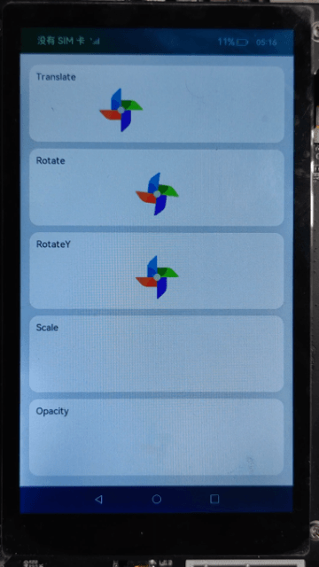

# 动画样式（JS）

## 介绍

本篇Codelab使用动画样式，实现几种常见动画效果：平移、旋转、缩放以及透明度变化。



### 相关概念

-   [自定义组件](https://gitee.com/openharmony/docs/blob/master/zh-cn/application-dev/reference/arkui-js/js-components-custom-basic-usage.md)：自定义组件是用户根据业务需求，将已有的组件组合，封装成的新组件，可以在工程中多次调用，从而提高代码的可读性。
-   [动画样式](https://gitee.com/openharmony/docs/blob/master/zh-cn/application-dev/reference/arkui-js/js-components-common-animation.md)：组件支持动态的旋转、平移、缩放效果，可在style或css中设置。

## 环境搭建

### 软件要求

-   [DevEco Studio](https://gitee.com/openharmony/docs/blob/master/zh-cn/application-dev/quick-start/start-overview.md#%E5%B7%A5%E5%85%B7%E5%87%86%E5%A4%87)版本：DevEco Studio 3.1 Release及以上版本。
-   OpenHarmony SDK版本：API version 9及以上版本。

### 硬件要求

-   开发板类型：[润和RK3568开发板](https://gitee.com/openharmony/docs/blob/master/zh-cn/device-dev/quick-start/quickstart-appendix-rk3568.md)。
-   OpenHarmony系统：3.2 Release及以上版本。

### 环境搭建

完成本篇Codelab我们首先要完成开发环境的搭建，本示例以**RK3568**开发板为例，参照以下步骤进行：

1. [获取OpenHarmony系统版本](https://gitee.com/openharmony/docs/blob/master/zh-cn/device-dev/get-code/sourcecode-acquire.md#%E8%8E%B7%E5%8F%96%E6%96%B9%E5%BC%8F3%E4%BB%8E%E9%95%9C%E5%83%8F%E7%AB%99%E7%82%B9%E8%8E%B7%E5%8F%96)：标准系统解决方案（二进制）。以3.2 Release版本为例：

   

2. 搭建烧录环境。

   1.  [完成DevEco Device Tool的安装](https://gitee.com/openharmony/docs/blob/master/zh-cn/device-dev/quick-start/quickstart-ide-env-win.md)
   2.  [完成RK3568开发板的烧录](https://gitee.com/openharmony/docs/blob/master/zh-cn/device-dev/quick-start/quickstart-ide-3568-burn.md)

3. 搭建开发环境。

   1.  开始前请参考[工具准备](https://gitee.com/openharmony/docs/blob/master/zh-cn/application-dev/quick-start/start-overview.md#%E5%B7%A5%E5%85%B7%E5%87%86%E5%A4%87)，完成DevEco Studio的安装和开发环境配置。
   2.  开发环境配置完成后，请参考[使用工程向导](https://gitee.com/openharmony/docs/blob/master/zh-cn/application-dev/quick-start/start-with-ets-stage.md#创建ets工程)创建工程（模板选择“Empty Ability”）。
   3.  工程创建完成后，选择使用[真机进行调测](https://gitee.com/openharmony/docs/blob/master/zh-cn/application-dev/quick-start/start-with-ets-stage.md#使用真机运行应用)。

## 代码结构解读

本篇Codelab只对核心代码进行讲解，对于完整代码，我们会在gitee中提供。

```
├──entry/src/main/js	             // 代码区
│  └──MainAbility
│     ├──common
│     │  └──images
│     │     └──ic_windmill.png       // 风车图标
│     ├──component
│     │  └──animatedCards
│     │     ├──animatedCards.css     // 自定义动画组件样式
│     │     ├──animatedCards.hml     // 自定义动画组件页面
│     │     └──animatedCards.js      // 自定义动画组件逻辑
│     ├──i18n
│     │  ├──en-US.json               // 英文国际化
│     │  └──zh-CN.json               // 中文国际化
│     ├──pages
│     │  └──animation
│     │     ├──animation.css   	     // 动画页面样式
│     │     ├──animation.hml         // 动画页面
│     │     └──animation.js          // 动画页面逻辑
│     └──app.js                      // 程序入口
└──entry/src/main/resources          // 应用资源目录
```

## 页面构建

页面展示几种常见动画效果：平移、旋转、缩放以及透明度变化，界面主要由image组件和text组件组成，效果如图所示：


```html
<!-- animation.hml -->
<element name='animated-cards' src="../../component/animatedCards/animatedCards.hml"></element>
<div class="container">
    <div class="animation-box" for="{{ value in animationList }}">
        <animated-cards icon="{{ windmillIcon }}" animation-list="{{ value }}"></animated-cards>
    </div>
</div>
```

animation.js文件中，animationList是展示动画效果的列表数据，windmillIcon是页面动画的图片。

```javascript
// animation.js
export default {
  data: {
    // 动画列表
    animationList: [
      {
        animationName: 'Translate',
        animationStyle: 'img-translate'
      },
      {
        animationName: 'Rotate',
        animationStyle: 'img-rotate'
      },
      {
        animationName: 'RotateY',
        animationStyle: 'img-rotateY'
      },
      {
        animationName: 'Scale',
        animationStyle: 'img-scale'
      },
      {
        animationName: 'Opacity',
        animationStyle: 'img-opacity'
      }
    ],
    // 动画图片
    windmillIcon: '/common/images/ic_windmill.png'
  }
}
```

## 动画实现

图片的平移、旋转、缩放以及透明度变化都是在animatedCards自定义组件中进行实现，界面主要由image组件和text组件组成。

```html
<!--animatedCards.hml-->
<div class="container">
    <div class="box">
        <text class="text">{{ animationList.animationName }}</text>
        <div class="windmill-box">
            <image class="img {{ animationList.animationStyle }}" src="{{ icon }}"></image>
        </div>
    </div>
</div>
```

声明类型为Array的props，父组件可以通过设置props属性向子组件传递参数。

```javascript
// animatedCards.js
export default {
  props: ['icon', 'animationList']
}
```

通过css样式，实现风车的平移、旋转、缩放以及透明度的变化。

```css
/* animatedCards.css */
/* 平移动画 */
.img-translate {
    animation-name: translateAnim;
}

/* 顺时针旋转 */
.img-rotate {
    animation-name: rotateAnim;
}

/* Y轴方向旋转 */
.img-rotateY {
    animation-name: rotateYAnim;
}

/* 缩放动画 */
.img-scale {
    animation-name: scaleAnim;
}
/* 透明度变化 */
.img-opacity {
    animation-name: opacityAnim;
}

/* 从-100vp平移到100vp */
@keyframes translateAnim {
    from {
        transform: translate(-100vp);
    }
    to {
        transform: translate(100vp);
    }
}
/* 从0°旋转到360° */
@keyframes rotateAnim {
    from {
        transform: rotate(0deg);
    }
    to {
        transform: rotate(360deg);
    }
}

/* 沿Y轴旋转，从0°旋转到360° */
@keyframes rotateYAnim {
    from {
        transform: rotateY(0deg);
    }
    to {
        transform: rotateY(360deg);
    }
}

/* 从0倍缩放到1.2倍大小 */
@keyframes scaleAnim {
    from {
        transform: scale(0);
    }
    to {
        transform: scale(1.2);
    }
}

/* 不透明度值从0变化到1 */
@keyframes opacityAnim {
    from {
        opacity: 0;
    }
    to {
        opacity: 1;
    }
}
```

## 总结

您已经完成了本次Codelab的学习，并了解到以下知识点：

1. 自定义组件的使用。
2. 动画样式的使用。

