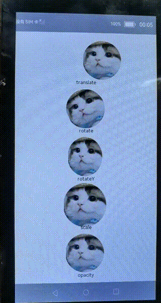

# 1.介绍

本篇Codelab，我们将一起学习ArkUI（基于JS扩展的类Web开发范式）通用动画样式的使用。

在本教程中，我们通过一个简单的样例，实现了平移、旋转、缩放以及透明度变化的效果，效果图如下：



# 2.相关概念

[image组件](https://gitee.com/openharmony/docs/blob/master/zh-cn/application-dev/reference/arkui-js/js-components-basic-image.md)：图片组件，用于图片资源的展示。

# 3.搭建OpenHarmony环境

完成本篇Codelab我们首先要完成开发环境的搭建，本示例以**Hi3516DV300**开发板为例，参照以下步骤进行：

1. [获取OpenHarmony系统版本](https://gitee.com/openharmony/docs/blob/master/zh-cn/device-dev/get-code/sourcecode-acquire.md#%E8%8E%B7%E5%8F%96%E6%96%B9%E5%BC%8F3%E4%BB%8E%E9%95%9C%E5%83%8F%E7%AB%99%E7%82%B9%E8%8E%B7%E5%8F%96)：标准系统解决方案（二进制）

   以3.0版本为例：

   

2. 搭建烧录环境

   1.  [完成DevEco Device Tool的安装](https://gitee.com/openharmony/docs/blob/master/zh-cn/device-dev/quick-start/quickstart-ide-env--win.md)
   2.  [完成Hi3516开发板的烧录](https://gitee.com/openharmony/docs/blob/master/zh-cn/device-dev/quick-start/quickstart-ide-3516-burn.md)

3. 搭建开发环境

   1.  开始前请参考[工具准备](https://gitee.com/openharmony/docs/blob/master/zh-cn/application-dev/quick-start/start-overview.md#%E5%B7%A5%E5%85%B7%E5%87%86%E5%A4%87) ，完成DevEco Studio的安装和开发环境配置。
   2.  开发环境配置完成后，请参考[使用工程向导](https://gitee.com/openharmony/docs/blob/master/zh-cn/application-dev/quick-start/start-with-js-fa.md#%E5%88%9B%E5%BB%BAjs%E5%B7%A5%E7%A8%8B) 创建工程（模板选择“Empty Ability”），选择JS或者eTS语言开发。
   3.  工程创建完成后，选择使用[真机进行调测](https://gitee.com/openharmony/docs/blob/master/zh-cn/application-dev/quick-start/start-with-js-fa.md#%E4%BD%BF%E7%94%A8%E7%9C%9F%E6%9C%BA%E8%BF%90%E8%A1%8C%E5%BA%94%E7%94%A8) 。
   
# 4.将组件添加到布局文件中

在这个任务中，我们需要完成程序页面的新建和设计，并将程序使用到的input组件添加到布局文件index.hml中。在完成新建项目后，我们看到系统自动创建了pages.index目录，在这个目录下，我们找到index.hml文件，开始进行页面设计。

打开index.hml文件，默认代码使用div组件和text组件来共同呈现文本显示的效果，具体代码如下：

```
<div class="container">
    <text class="title">
        {{ $t('strings.hello') }} {{ title }}
    </text>
</div>
```

开发者可以删除默认代码，并跟着接下来的步骤一起开发，实现如下界面效果。

从上面布局效果图可以看到，界面主要由image组件和text组件组成，我们现在index.html中添加image组件和text组件，并添加对应的class，用于设置组件的显示效果，代码如下：

```
<div class="container">
    <image class="img img-translate" src="/common/images/cat.png"></image>
    <text class="text">translate</text>
    <image class="img img-rotate" src="/common/images/cat.png"></image>
    <text class="text">rotate</text>
    <image class="img img-rotateY" src="/common/images/cat.png"></image>
    <text class="text">rotateY</text>
    <image class="img img-scale" src="/common/images/cat.png"></image>
    <text class="text">scale</text>
    <image class="img img-opacity" src="/common/images/cat.png"></image>
    <text class="text">opacity</text>
</div>
```

# 5.为页面设计样式

在这个任务中，我们将一起为任务二中写好的页面添加样式，上面所有的组件都定义了class属性，它对应的样式都定义在index.css中，有关css更多的知识可以参考[CSS语法参考](https://gitee.com/openharmony/docs/blob/OpenHarmony-3.0-LTS/zh-cn/application-dev/js-reference/js-framework-syntax-css.md)。

这部分定义了整个页面中各个组件的样式。在index.css中先添加如下代码：

```
.container {
    background-color: #F8FCF5;
    flex-direction: column;
    justify-content: center;
    align-items: center;
}

.img {
    margin-top: 10px;
    height: 100px;
    width: 100px;
    animation-timing-function: ease;
    animation-duration: 2s;
    animation-delay: 0s;
    animation-fill-mode: forwards;
    animation-iteration-count: infinite;
}

.text {
    font-size: 20px;
}

.img-translate {
    animation-name: translateAnim;
}

.img-rotate {
    animation-name: rotateAnim;
}

.img-rotateY {
    animation-name: rotateYAnim;
}

.img-scale {
    animation-name: scaleAnim;
}

.img-mixes {
    animation-name: mixesAnim;
}

.img-opacity {
    animation-name: opacityAnim;
}

/*从-100px平移到100px*/
@keyframes translateAnim {
    from {
        transform: translate(-100px);
    }

    to {
        transform: translate(100px);
    }
}

/*从0°旋转到360°*/
@keyframes rotateAnim {
    from {
        transform: rotate(0deg);
    }

    to {
        transform: rotate(360deg);
    }
}

/*沿Y轴旋转，从0°旋转到360°*/
@keyframes rotateYAnim {
    from {
        transform: rotateY(0deg);
    }

    to {
        transform: rotateY(360deg);
    }
}

/*从0倍缩放到1.2倍大小*/
@keyframes scaleAnim {
    from {
        transform: scale(0);
    }

    to {
        transform: scale(1.2);
    }
}

/*透明度从0变化到1*/
@keyframes opacityAnim {
    from {
        opacity: 0;
    }

    to {
        opacity: 1;
    }
}
```

更多动画样式可以参考[动画样式](https://gitee.com/openharmony/docs/blob/master/zh-cn/application-dev/reference/arkui-js/js-components-common-animation.md)章节。

# 6.恭喜您

在本篇Codelab中，我们主要为大家讲解了ArkUI（基于JS扩展的类Web开发范式）通用动画样式的使用。

通过一个代码示例，实现image组件的平移、缩放、旋转和透明度变化动效。希望通过本教程，各位开发者可以对JS通用动画样式具有更深刻的认识。