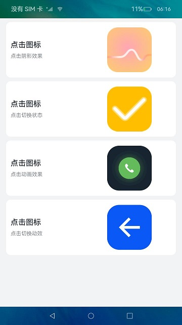

# image、image-animator组件的使用（JS）

## 介绍

OpenHarmony提供了常用的图片、图片帧动画播放器组件，开发者可以根据实际场景和开发需求，实现不同的界面交互效果，包括：点击阴影效果、点击切换状态、点击动画效果、点击切换动效。


### 相关概念

-   [image组件](https://gitcode.com/openharmony/docs/blob/OpenHarmony-3.2-Release/zh-cn/application-dev/reference/arkui-js/js-components-basic-image.md)：图片组件，用于图片资源的展示。
-   [image-animator组件](https://gitcode.com/openharmony/docs/blob/OpenHarmony-3.2-Release/zh-cn/application-dev/reference/arkui-js/js-components-basic-image-animator.md)：帧动画播放器，用以播放一组图片，可以设置播放时间、次数等参数。
-   [通用事件](https://gitcode.com/openharmony/docs/blob/OpenHarmony-3.2-Release/zh-cn/application-dev/reference/arkui-js/js-components-common-events.md)：事件绑定在组件上，当组件达到事件触发条件时，会执行JS中对应的事件回调函数，实现页面UI视图和页面JS逻辑层的交互。

## 环境搭建

### 软件要求

-   [DevEco Studio](https://gitcode.com/openharmony/docs/blob/master/zh-cn/application-dev/quick-start/start-overview.md#%E5%B7%A5%E5%85%B7%E5%87%86%E5%A4%87)版本：DevEco Studio 3.1 Release及以上版本。
-   OpenHarmony SDK版本：API version 9及以上版本。

### 硬件要求

-   开发板类型：[润和RK3568开发板](https://gitcode.com/openharmony/docs/blob/master/zh-cn/device-dev/quick-start/quickstart-appendix-rk3568.md)。
-   OpenHarmony系统：3.2 Release及以上版本。

### 环境搭建

完成本篇Codelab我们首先要完成开发环境的搭建，本示例以**RK3568**开发板为例，参照以下步骤进行：

1.  [获取OpenHarmony系统版本](https://gitcode.com/openharmony/docs/blob/master/zh-cn/device-dev/get-code/sourcecode-acquire.md#%E8%8E%B7%E5%8F%96%E6%96%B9%E5%BC%8F3%E4%BB%8E%E9%95%9C%E5%83%8F%E7%AB%99%E7%82%B9%E8%8E%B7%E5%8F%96)：标准系统解决方案（二进制）。以3.2 Release版本为例：

    

2.  搭建烧录环境。
    1.  [完成DevEco Device Tool的安装](https://gitcode.com/openharmony/docs/blob/master/zh-cn/device-dev/quick-start/quickstart-ide-env-win.md)
    2.  [完成RK3568开发板的烧录](https://gitcode.com/openharmony/docs/blob/master/zh-cn/device-dev/quick-start/quickstart-ide-3568-burn.md)

3.  搭建开发环境。
    1.  开始前请参考[工具准备](https://gitcode.com/openharmony/docs/blob/master/zh-cn/application-dev/quick-start/start-overview.md#%E5%B7%A5%E5%85%B7%E5%87%86%E5%A4%87)，完成DevEco Studio的安装和开发环境配置。
    2.  开发环境配置完成后，请参考[使用工程向导](https://gitcode.com/openharmony/docs/blob/master/zh-cn/application-dev/quick-start/start-with-ets-stage.md#创建ets工程)创建工程（模板选择“Empty Ability”）。
    3.  工程创建完成后，选择使用[真机进行调测](https://gitcode.com/openharmony/docs/blob/master/zh-cn/application-dev/quick-start/start-with-ets-stage.md#使用真机运行应用)。

## 代码结构解读

本篇Codelab只对核心代码进行讲解，对于完整代码，我们会在gitcode中提供。

```
├──entry/src/main/js	              // 代码区
│  └──MainAbility
│     ├──common
│     │  ├──constants
│     │  │  └──commonConstants.js     // 帧动画数据常量
│     │  └──images
│     ├──i18n		                  // 中英文	
│     │  ├──en-US.json			
│     │  └──zh-CN.json			
│     └──pages
│        └──index
│           ├──index.css              // 首页样式文件	
│           ├──index.hml              // 首页布局文件
│           └──index.js               // 首页脚本文件
└──entry/src/main/resources           // 应用资源目录
```

## 界面布局

本示例使用卡片布局，将四种实现以四张卡片的形式呈现在主界面。每张卡片都使用图文结合的方式直观地向开发者展示所实现效果。



每张卡片对应一个div容器组件，以水平形式分为左侧文本和右侧图片两部分。左侧文本同样是一个div容器组件，以垂直形式分为操作文本与效果描述文本。右侧图片则根据需要使用image组件或image-animator组件。当前示例中，前两张卡片右侧使用的是image组件，剩余两张卡片使用的是image-animator组件。

```html
<!-- index.hml -->
<div class="container">
    <!-- image组件的点击效果 -->
    <div class="card-container" for="item in imageCards">
        <div class="text-container">
            <text class="text-operation">{{ contentTitle }}</text>
            <text class="text-description">{{ item.description }}</text>
        </div>
        <image class="{{ item.classType }}" src="{{ item.src }}" onclick="changeHookState({{ item.eventType }})"
               ontouchstart="changeShadow({{ item.eventType }},true)"
               ontouchend="changeShadow({{ item.eventType }},false)"/>
    </div>
	
    <!-- image-animator组件的点击效果 -->
    <div class="card-container" for="item in animationCards">
        <div class="text-container">
            <text class="text-operation">{{ contentTitle }}</text>
            <text class="text-description">{{ item.description }}</text>
        </div>
        <image-animator id="{{ item.id }}" class="animator" images="{{ item.frames }}" iteration="1"
                        duration="{{ item.durationTime }}" onclick="handleStartFrame({{ item.type }})"/>
    </div>
</div>
```

## 事件交互 

为image组件添加touchstart和touchend事件，实现点击图片改变边框阴影的效果，点击触碰结束时，恢复初始效果。

```javascript
// index.js
// 点击阴影效果
changeShadow(eventType, shadowFlag) {
  if (eventType === 'click') {
    return;
  }
  if (shadowFlag) {
    this.imageCards[0].classType = 'main-img-touch';
  } else {
    this.imageCards[0].classType = 'img-normal';
  }
}
```

为image组件添加click事件，实现点击切换状态并变换显示图片的效果。

```javascript
// index.js
// 点击切换状态
changeHookState(eventType) {
  if (eventType === 'touch') {
    return;
  }
  if (this.hook) {
    this.imageCards[1].src = '/common/images/ic_fork.png';
    this.hook = false;
  } else {
    this.imageCards[1].src = '/common/images/ic_hook.png';
    this.hook = true;
  }
}
```

为image-animator组件添加click事件，实现点击播放帧动画效果。

```javascript
// index.js
// 点击动画效果方法
handleStartFrame(type) {
  if (type === 'dial') {
    this.animationCards[0].durationTime = CommonConstants.DURATION_TIME;
    this.$element('dialAnimation').start();
  } else {
    if (this.animationCards[1].flag) {
      this.animationCards[1].frames = this.collapse;
      this.animationCards[1].durationTime = this.durationTimeArray[0];
      this.$element('toggleAnimation').start();
      this.animationCards[1].flag = false;
      this.$element('toggleAnimation').stop();
    } else {
      this.animationCards[1].frames = this.arrow;
      this.animationCards[1].durationTime = this.durationTimeArray[1];
      this.$element('toggleAnimation').start();
      this.animationCards[1].flag = true;
      this.$element('toggleAnimation').stop();
    }
  }
}
```

## 总结

您已经完成了本次Codelab的学习，并了解到以下知识点：

1.  image、image-animator组件的使用。


