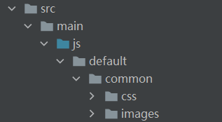
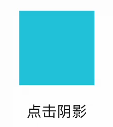
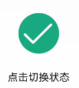
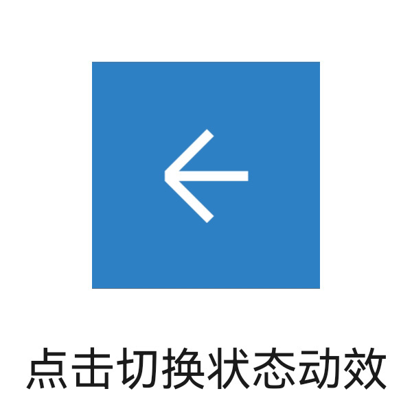

#ClickableJsDemo

# 介绍<a name="ZH-CN_TOPIC_0000001185839250"></a>
OpenHarmony ArkUI（基于JS扩展的类Web开发范式）提供了常用的图片、图片帧动画播放器组件，并且为这些组件提供了很多属性与可监听到的事件（例如动画属性与点击、触碰事件）。开发者可以根据实际场景和开发需求，选用不同的组件、事件、属性来实现界面交互效果的设计，本篇CodeLab，我们将一起开启ArkUI（基于JS扩展的类Web开发范式）基础组件与动画的学习之路。本教程主要涉及到的页面元素有image，image-animator。


## 应用场景<a name="section225718574575"></a>

-   社交、办公类等应用中涉及到交互、导航、拨打电话或者语音的场景。

# 相关概念<a name="ZH-CN_TOPIC_0000001185679748"></a>

**[image组件](https://gitee.com/openharmony/docs/blob/master/zh-cn/application-dev/reference/arkui-js/js-components-basic-image.md)**：图片组件，用于图片资源的展示。

**[image-animitor组件](https://gitee.com/openharmony/docs/blob/master/zh-cn/application-dev/reference/arkui-js/js-components-basic-image-animator.md)**：帧动画播放器，用以播放一组图片，可以设置播放时间、次数等参数。

**[通用事件](https://gitee.com/openharmony/docs/blob/master/zh-cn/application-dev/reference/arkui-js/js-components-common-events.md)**：事件绑定在组件上，当组件达到事件触发条件时，会执行JS中对应的事件回调函数，实现页面UI视图和页面JS逻辑层的交互。

# 搭建OpenHarmony环境<a name="ZH-CN_TOPIC_0000001188224804"></a>

完成本篇Codelab我们首先要完成开发环境的搭建，本示例以**Hi3516DV300**开发板为例，参照以下步骤进行：

1. [获取OpenHarmony系统版本](https://gitee.com/openharmony/docs/blob/master/zh-cn/device-dev/get-code/sourcecode-acquire.md#%E8%8E%B7%E5%8F%96%E6%96%B9%E5%BC%8F3%E4%BB%8E%E9%95%9C%E5%83%8F%E7%AB%99%E7%82%B9%E8%8E%B7%E5%8F%96)：标准系统解决方案（二进制）

   以3.0版本为例：

   

2. 搭建烧录环境

   1.  [完成DevEco Device Tool的安装](https://gitee.com/openharmony/docs/blob/master/zh-cn/device-dev/quick-start/quickstart-standard-env-setup.md)

   2.  [完成Hi3516开发板的烧录](https://gitee.com/openharmony/docs/blob/master/zh-cn/device-dev/quick-start/quickstart-lite-steps-hi3516-burn.md)

3. 搭建开发环境

   1.  开始前请参考[工具准备](https://gitee.com/openharmony/docs/blob/master/zh-cn/application-dev/quick-start/start-overview.md#%E5%B7%A5%E5%85%B7%E5%87%86%E5%A4%87) ，完成DevEco Studio的安装和开发环境配置。
   2.  开发环境配置完成后，请参考[使用工程向导](https://gitee.com/openharmony/docs/blob/master/zh-cn/application-dev/quick-start/start-with-js.md#%E5%88%9B%E5%BB%BAjs%E5%B7%A5%E7%A8%8B) 创建工程（模板选择“Empty Ability”），选择JS或者eTS语言开发。
   3.  工程创建完成后，选择使用[真机进行调测](https://gitee.com/openharmony/docs/blob/master/zh-cn/application-dev/quick-start/start-with-ets.md#%E4%BD%BF%E7%94%A8%E7%9C%9F%E6%9C%BA%E8%BF%90%E8%A1%8C%E5%BA%94%E7%94%A8) 。

# 任务一：完成页面布局<a name="ZH-CN_TOPIC_0000001185998280"></a>

在这个任务中，我们需要完成UI界面的设置。具体步骤：

-   准备好所使用的图片等相关资源。
-   准备好样式文件index.css。
-   编写好图形背景数据。
-   编写主页面。

1. 在default/common/images目录下放入案例要用到的图片，在default/common/下创建css文件夹并放入公共样式文件style.css。

   图片与样式文件放置位置

   

2. 在default/pages/index/index.css中引入公共样式style.css并编写需要用到的样式，样式代码如下：

   ```
   @import '../../common/css/style.css';
   .container {
       flex-direction: column;
       align-items: center;
   }
   .container-son-div{
       width: 100%;
       height: 200px;
   }
   .line-div{
       flex-direction: column;
       width: 50%;
       height: 180px;
   }
   .line-div-son{
       flex-direction: column;
       width: 100%;
       align-items: center;
       justify-content: center;
   }
   .text-div{
       position: absolute;
       bottom: 0;
       left: 50%;
       transform: translate(-50%, -50%);
   }
   
   .img-normal{
       width:80px;
       height:80px
   }
   .main-img-unTouch{
       width: 100px;
       height: 100px;
       border:0px solid #777676;
   }
   .main-img-touch{
       width: 110px;
       height: 110px;
       border:4px solid #777676;
   }
   .animator {
       width: 100px;
       height: 100px;
   }
   ```

3. 在src/main/js/default/pages/index/index.js中准备好所需要用到的数据。

   imageNormal

   ```
   imageNormal: {
       classType: "main-img-unTouch",
       src: "/common/images/sky_blue.png",
       title: "点击阴影"
   }
   ```

   imageNormal为image（第一张图）所需要的数据，参数说明如下：

   -   classType：css样式
   -   src：图片路径
   -   title：辅助说明的文字内容

   imageSelect

   imageSelect为image（第二张图）所需要的数据，参数说明如下：

   -   src：图片路径
   -   title：辅助说明的文字内容
   -   hook：当前是否为打钩状态

   ```
   imageSelect: {
       src: "/common/images/hook.png",
       title: "点击切换状态",
       hook: true
   }
   ```

   frameContainerPhone

   frameContainerPhone为image-animator（帧动画电话来电效果）所需要的数据，参数说明如下：

   -   frames：帧动画所使用的的图片路径数组
   -   title：辅助说明的文字内容

   ```
   frameContainerPhone: {
       frames: [
           {src: "/common/images/frames/phone/phone_0.png"},
           {src: "/common/images/frames/phone/phone_1.png"},
           {src: "/common/images/frames/phone/phone_2.png"},
           ...
           {src: "/common/images/frames/phone/phone_57.png"}
       ],
       title: "点击动画效果"
   }
   ```

   frameContainerState

   frameContainerState为image-animator（帧动画状态切换效果）所需要的数据，参数说明如下：

   -   frames：帧动画所使用的的图片路径数组
   -   src：默认背景图片路径
   -   title：辅助说明的文字内容
   -   flag：记录点击状态，每点击一次，改变一次值

   ```
   frameContainerState: {
       frames:[],
       src: "/common/images/frames/arrowheadCollapse/arrowhead_collapse_0.png",
       title: "点击切换状态动效",
       durationTime: 0,
       flag: true
   }
   ```

   其他数据

   -   durationTimeArray：帧动画播放时间数组
   -   back：“后退”图标效果帧动画所需图片路径数组
   -   collapse：“收起”图标效果帧动画所需图片路径数组

   ```
   durationTimeArray:[1400,1400],
   back:[
       {src: "/common/images/frames/arrowheadBack/arrowhead_back_0.png"},
       {src: "/common/images/frames/arrowheadBack/arrowhead_back_1.png"},
       {src: "/common/images/frames/arrowheadBack/arrowhead_back_2.png"},
       ...
       {src: "/common/images/frames/arrowheadBack/arrowhead_back_13.png"}
   ],
   collapse:[
       {src: "/common/images/frames/arrowheadCollapse/arrowhead_collapse_0.png"},
       {src: "/common/images/frames/arrowheadCollapse/arrowhead_collapse_1.png"},
       {src: "/common/images/frames/arrowheadCollapse/arrowhead_collapse_2.png"},
       ...
       {src: "/common/images/frames/arrowheadCollapse/arrowhead_collapse_13.png"}
   ]
   ```

4. 我们需要完成程序页面的新建和设计，并将程序使用到的image、image-animator组件添加到布局文件index.hml中。

   代码使用div组件和text组件来共同呈现文本显示的效果，其中div属于[基础容器](https://developer.harmonyos.com/cn/docs/documentation/doc-references/js-components-container-div-0000000000611484)，用作页面结构的根节点或将内容进行分组；text是[文本组件](https://developer.harmonyos.com/cn/docs/documentation/doc-references/js-components-basic-text-0000000000611633)，用于呈现一段信息。有关这个两个组件更多的知识，可以参考本系列教程的其他Codelab。

   image组件

   

   ```
   <div class="line-div">
       <div class="line-div-son margin-top-20" >
           <image ref="imageNormal" class="{{imageNormal.classType}}"  src="{{imageNormal.src}}" ontouchstart="changeShadow(true)"  ontouchend="changeShadow(false)"/>
       </div>
       <div class="line-div-son text-div">
           <text class="font-size-20" >{{imageNormal.title}}</text>
       </div>
   </div>
   ```

   

   ```
   <div class="line-div">
       <div class="line-div-son margin-top-30">
           <image ref="imageSelect" class="img-normal" src="{{imageSelect.src}}" onclick="changeHookState"/>
       </div>
       <div class="line-div-son text-div">
           <text class="font-size-20" >{{imageSelect.title}}</text>
       </div>
   </div>
   ```

   image-animator组件

   

   ```
   <div class="line-div">
       <div class="line-div-son margin-top-20">
           <image-animator class="animator" ref="frameContainerPhone" images="{{frameContainerPhone.frames}}" iteration="1"
               duration="{{frameContainerPhone.durationTime}}" onclick="handleStartFrameContainerPhone" />
       </div>
    	<div class="line-div-son text-div"> <text class="font-size-20">{{frameContainerPhone.title}}</text> </div>
   </div>
   ```

   

   ```
   <div class="line-div">
       <div class="line-div-son margin-top-20">
           <image-animator ref="frameContainerState" class="animator" images="{{frameContainerState.frames}}" iteration="1"
               duration="{{frameContainerState.durationTime}}" onclick="handleStartFrameContainerState" />
       </div>
       <div class="line-div-son text-div"> <text class="font-size-20">{{frameContainerState.title}}</text> </div>
    </div>
   ```

   index.hml全文如下：

   ```
   <div class="container">
       <div class="first-div">
           <div class="line-div">
               <div class="line-div-son margin-top-20">
                   <image ref="imageNormal" class="{{imageNormal.classType}}" src="{{imageNormal.src}}"
                       ontouchstart="changeShadow(true)" ontouchend="changeShadow(false)" />
               </div>
               <div class="line-div-son text-div"> <text class="font-size-20">{{imageNormal.title}}</text> </div>
           </div>
           <div class="line-div">
               <div class="line-div-son margin-top-30">
                   <image ref="imageSelect" class="img-normal" src="{{imageSelect.src}}" onclick="changeHookState" />
               </div>
               <div class="line-div-son text-div"> <text class="font-size-20">{{imageSelect.title}}</text> </div>
           </div>
       </div>
       <div class="first-div">
           <div class="line-div">
               <div class="line-div-son margin-top-20">
                   <image-animator class="animator" ref="frameContainerPhone" images="{{frameContainerPhone.frames}}"
                       iteration="1" duration="5800ms" onclick="handleStartFrameContainerPhone" />
               </div>
               <div class="line-div-son text-div"> <text class="font-size-20">{{frameContainerPhone.title}}</text> </div>
           </div>
           <div class="line-div">
               <div class="line-div-son margin-top-20">
                   <image-animator class="animator" ref="frameContainerState" images="{{frameContainerState.frames}}"
                       iteration="1" duration="{{frameContainerState.durationTime}}"
                       onclick="handleStartFrameContainerState" />
               </div>
               <div class="line-div-son text-div"> <text class="font-size-20">{{frameContainerState.title}}</text> </div>
           </div>
       </div>
   </div>
   ```

# 任务二：添加交互事件<a name="ZH-CN_TOPIC_0000001231637897"></a>

1. 为图片组件\(ref=“imageNormal”\)添加ontouchstart\(\)、ontouchend\(\)事件，实现触碰时，图片大小、边框、透明度改变；触碰结束恢复初始效果。

   -   ontouchstart：手指刚触摸屏幕时触发该事件。
   -   ontouchend：手指触摸结束离开屏幕时触发该事件。

   ```
   <image ref="imageNormal" class="{{imageNormal.classType}}"  src="{{imageNormal.src}}"  ontouchstart="changeShadow(true)"  ontouchend="changeShadow(false)"  />
   ```

   ```
   changeShadow(flag) {
       if (flag) {
           this.imageNormal.classType = "main-img-touch"
       } else {
           this.imageNormal.classType = "main-img-unTouch"
       }
   }
   ```

2. 为图片组件\(ref="imageSelect"\)添加onclick事件，实现点击切换图片效果。

   -   onclick：点击动作触发该事件。

   ```
   <image ref="imageSelect"  class="img-normal" src="{{imageSelect.src}}"  onclick="changeHookState" />
   ```

   ```
   changeHookState() {
       if (this.imageSelect.hook) {
           this.imageSelect.src = "/common/images/fork.png"
           this.imageSelect.hook = false
       } else {
           this.imageSelect.src = "/common/images/hook.png"
           this.imageSelect.hook = true
       }
   }
   ```

3. 为图片帧动画播放器（ref="frameContainerPhone"）添加onclick事件，实现点击播放帧动画效果。

   ```
    <image-animator ref="frameContainerPhone" class="animator" images="{{frameContainerPhone.frames}}" iteration="1" duration="5800ms" onclick="handleStartFrameContainerPhone" />
   ```

   ```
   handleStartFrameContainerPhone(){
       this.frameContainerPhone.durationTime = 5800
       this.$refs.frameContainerPhone.start();
   }
   ```

4. 为图片帧动画播放器\(ref="frameContainerState"\)添加onclick事件，实现点击播放帧动画效果并切换状态、记录状态效果。

   ```
   <image-animator class="animator" ref="frameContainerState" images="{{frameContainerState.frames}}" iteration="1" duration="{{frameContainerState.durationTime}}" onclick="handleStartFrameContainerState" />
   ```

   ```
   handleStartFrameContainerState(){
       if (this.frameContainerState.flag) {
           this.frameContainerState.frames = this.collapse
           this.frameContainerState.durationTime = this.durationTimeArray[0]
           this.$refs.frameContainerState.start()
           this.frameContainerState.flag = false
           this.$refs.frameContainerState.stop()
       } else {
           this.frameContainerState.frames = this.back
           this.frameContainerState.durationTime = this.durationTimeArray[1]
           this.$refs.frameContainerState.start()
           this.frameContainerState.flag = true
           this.$refs.frameContainerState.stop()
       }
   }
   ```

5. index.js全文如下：

   ```
   export default {
       data: {
           imageNormal: {
               classType: 'main-img-unTouch',
               src: '/common/images/sky_blue.png',
               title: '点击阴影'
           },
           imageSelect: {
               src: '/common/images/hook.png',
               title: '点击切换状态',
               hook: true
           },
           frameContainerPhone: {
               frames: [{
                   src: '/common/images/frames/phone/phone_0.png'
               }, {
                   src: '/common/images/frames/phone/phone_1.png'
               }, {
                   src: '/common/images/frames/phone/phone_2.png'
               }, ...{
                   src: '/common/images/frames/phone/phone_35.png'
               }],
               title: '点击动画效果',
               durationTime: 3600
           },
           frameContainerState: {
               frames: [],
               title: '点击切换状态动效',
               durationTime: 0,
               flag: true
           },
           durationTimeArray: [1400, 1400],
           back: [{
               src: '/common/images/frames/arrowheadBack/arrowhead_back_0.png'
           }, {
               src: '/common/images/frames/arrowheadBack/arrowhead_back_1.png'
           }, ...{
               src: '/common/images/frames/arrowheadBack/arrowhead_back_13.png'
           }],
           collapse: [{
               src: '/common/images/frames/arrowheadCollapse/arrowhead_collapse_0.png'
           }, {
               src: '/common/images/frames/arrowheadCollapse/arrowhead_collapse_1.png'
           }, ...{
               src: '/common/images/frames/arrowheadCollapse/arrowhead_collapse_13.png'
           }]
       },
       // 初始化 
       onInit() {
           this.frameContainerState.frames = this.back;
           this.frameContainerState.durationTime = 0;
           this.frameContainerPhone.durationTime = 0;
       },
       // 触碰阴影方法 
       changeHookState() {
           if (this.imageSelect.hook) {
               this.imageSelect.src = '/common/images/fork.png';
               this.imageSelect.hook = false;
           } else {
               this.imageSelect.src = '/common/images/hook.png';
               this.imageSelect.hook = true;
           }
       },
       // 点击切换状态 
       changeShadow(flag) {
           if (flag) {
               this.imageNormal.classType = 'main-img-touch';
           } else {
               this.imageNormal.classType = 'main-img-unTouch';
           }
       },
       // 点击动画效果方法 
       handleStartFrameContainerPhone() {
           this.frameContainerPhone.durationTime = 3600;
           this.$refs.frameContainerPhone.start();
       },
       // 点击切换状态动效方法 
       handleStartFrameContainerState() {
           if (this.frameContainerState.flag) {
               this.frameContainerState.frames = this.collapse;
               this.frameContainerState.durationTime = this.durationTimeArray[0];
               this.$refs.frameContainerState.start();
               this.frameContainerState.flag = false;
               this.$refs.frameContainerState.stop();
           } else {
               this.frameContainerState.frames = this.back;
               this.frameContainerState.durationTime = this.durationTimeArray[1];
               this.$refs.frameContainerState.start();
               this.frameContainerState.flag = true;
               this.$refs.frameContainerState.stop();
           }
       }
   };
   ```

# 恭喜您<a name="ZH-CN_TOPIC_0000001231397833"></a>

1.  image
    -   image的src属性可以指定图片资源位置。
    -   image的class属性可以设置图片样式，包括大小、边框、透明度等。

2.  image-animator
    -   image-animator的images属性用来指定图片路径数组。
    -   image-animator的duration属性用来设置播放时间。


通过本代码示，实现了触碰 image改变图片的大小、边框、透明度，点击切换图片；点击image-animator切换帧动画图片资源以及播放帧动画。