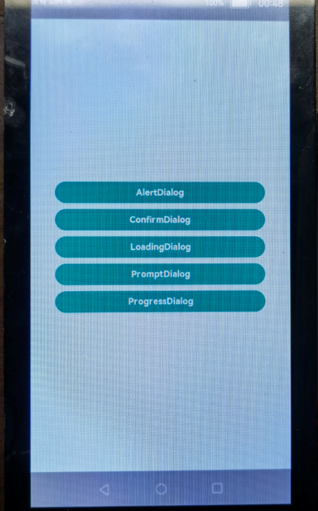

# DialogDemo
# 介绍<a name="ZH-CN_TOPIC_0000001186523840"></a>

OpenHarmony的ArkUI（基于JS扩展的类Web开发范式）提供了常用的接口和组件，开发者可以根据实际场景和开发需求，选用不同的组件和接口。本篇Codelab，我们将一起开启ArkUI（基于JS扩展的类Web开发范式）容器组件的学习之路。本教程给大家分享的内容是容器组件dialog的使用。

本篇Codelab通过一个简单的样例，实现了dialog的几种常用的效果，点击不同的button呈现不同的样式的dialog。效果如下图所示，开发者还可以根据自己的需求添加不同的效果。


# 相关概念<a name="ZH-CN_TOPIC_0000001186365952"></a>

**[dialog组件](https://gitee.com/openharmony/docs/blob/master/zh-cn/application-dev/reference/arkui-js/js-components-container-dialog.md)**：自定义弹窗容器组件。

**[button组件](https://gitee.com/openharmony/docs/blob/master/zh-cn/application-dev/reference/arkui-js/js-components-basic-button.md)**：按钮组件。

**[div组件](https://gitee.com/openharmony/docs/blob/master/zh-cn/application-dev/reference/arkui-js/js-components-container-div.md)**：基础容器组件，用作页面结构的根节点或将内容进行分组。

**[text组件](https://gitee.com/openharmony/docs/blob/master/zh-cn/application-dev/reference/arkui-js/js-components-basic-text.md)**：文本组件，用于呈现一段信息。

# 搭建OpenHarmony环境<a name="ZH-CN_TOPIC_0000001238655161"></a>

完成本篇Codelab我们首先要完成开发环境的搭建，本示例以**Hi3516DV300**开发板为例，参照以下步骤进行：

1. [获取OpenHarmony系统版本](https://gitee.com/openharmony/docs/blob/master/zh-cn/device-dev/get-code/sourcecode-acquire.md#%E8%8E%B7%E5%8F%96%E6%96%B9%E5%BC%8F3%E4%BB%8E%E9%95%9C%E5%83%8F%E7%AB%99%E7%82%B9%E8%8E%B7%E5%8F%96)：标准系统解决方案（二进制）

   以3.0版本为例：

   

2. 搭建烧录环境

   1.  [完成DevEco Device Tool的安装](https://gitee.com/openharmony/docs/blob/master/zh-cn/device-dev/quick-start/quickstart-standard-env-setup.md)

   2.  [完成Hi3516开发板的烧录](https://gitee.com/openharmony/docs/blob/master/zh-cn/device-dev/quick-start/quickstart-lite-steps-hi3516-burn.md)

3. 搭建开发环境

   1.  开始前请参考[工具准备](https://gitee.com/openharmony/docs/blob/master/zh-cn/application-dev/quick-start/start-overview.md#%E5%B7%A5%E5%85%B7%E5%87%86%E5%A4%87) ，完成DevEco Studio的安装和开发环境配置。
   2.  开发环境配置完成后，请参考[使用工程向导](https://gitee.com/openharmony/docs/blob/master/zh-cn/application-dev/quick-start/start-with-js.md#%E5%88%9B%E5%BB%BAjs%E5%B7%A5%E7%A8%8B) 创建工程（模板选择“Empty Ability”），选择JS或者eTS语言开发。
   3.  工程创建完成后，选择使用[真机进行调测](https://gitee.com/openharmony/docs/blob/master/zh-cn/application-dev/quick-start/start-with-ets.md#%E4%BD%BF%E7%94%A8%E7%9C%9F%E6%9C%BA%E8%BF%90%E8%A1%8C%E5%BA%94%E7%94%A8) 。

# 将组件添加到布局中<a name="ZH-CN_TOPIC_0000001186524512"></a>

-   [button组件]
-   [dialog组件]

我们需要完成程序页面的新建和设计，并将程序使用到的input组件添加到布局文件index.hml中。在完成新建项目后，我们看到系统自动创建了pages.index目录，打开index.hml文件，开始进行页面设计。

打开index.hml文件，里面有默认代码如下：

```
<div class="container">
    <text class="title">
        {{ $t('strings.hello') }} {{ title }}
    </text>
</div>
```

## button组件<a name="section1648574312326"></a>

开发者可以删除默认代码跟着接下来的步骤一起开发，实现如下界面效果。



从上面布局效果图可以看到，界面主要由button组成，我们先在index.hml中添加button组件，并添加onclick事件，代码如下：

```
<div class="doc-page">
    <div class="btn-div">
        <button type="capsule" value="AlertDialog" class="btn" onclick="showAlert"></button>
        <button type="capsule" value="ConfirmDialog" class="btn" onclick="showConfirm"></button>
        <button type="capsule" value="LoadingDialog" class="btn" onclick="showLoading"></button>
        <button type="capsule" value="PromptDialog" class="btn" onclick="showPrompt"></button>
        <button type="capsule" value="ProgressDialog" class="btn" onclick="showProgress"></button>
    </div>
</div>
```

## dialog组件<a name="section1393961711172"></a>

因为上面添加了5个button，根据效果图点击不同的button会呈现不同的dialog，所以我们接下来将在index.hml中添加5个dialog，代码如下所示：

```
<div class="doc-page">
    <div class="btn-div">
        <button type="capsule" value="AlertDialog" class="btn" onclick="showAlert"></button>
        <button type="capsule" value="ConfirmDialog" class="btn" onclick="showConfirm"></button>
        <button type="capsule" value="LoadingDialog" class="btn" onclick="showLoading"></button>
        <button type="capsule" value="PromptDialog" class="btn" onclick="showPrompt"></button>
        <button type="capsule" value="ProgressDialog" class="btn" onclick="showProgress"></button>
    </div>

    <dialog id="alertDialog" class="alert-dialog">
        <div class="dialog-div">
            <div class="alert-inner-txt">
                <text class="txt">AlertDialog</text>
            </div>
            <div class="alert-inner-btn">
                <button type="capsule" value="Confirm" onclick="confirmClick('alertDialog')" style="width : 80%;">
                </button>
            </div>
        </div>
    </dialog>

    <dialog id="confirmDialog" class="dialog-main">
        <div class="dialog-div">
            <div class="inner-txt">
                <text class="txt">ConfirmDialog</text>
            </div>
            <div class="inner-btn">
                <button type="capsule" value="Cancel" style="width : 40%; margin-right : 10px;"
                        class="btn-txt" onclick="cancelClick('confirmDialog')">
                </button>
                <button type="capsule" value="Confirm" style="width : 40%;" class="btn-txt"
                        onclick="confirmClick('confirmDialog')">
                </button>
            </div>
        </div>
    </dialog>

    <dialog id="loadingDialog" style="width : 120px; height : 120px; margin-bottom : 40%;">
        <div class="dialog-div">
            <image class="loading-img img-rotate" id="loading-img" src="/common/images/loading.svg"
                   style="height : 60px; width : 60px;"></image>
            <text style="font-size : 16px; color : #999999;">loading...</text>
        </div>
    </dialog>

    <dialog id="promptDialog" class="dialog-main">
        <div class="dialog-div">
            <div class="inner-txt">
                <text class="txt">PromptDialog</text>
            </div>
            <input type="password" placeholder="please enter password" style="margin-left : 20px; margin-right : 20px;">
            </input>
            <div class="inner-btn">
                <button type="capsule" value="Cancel" style="width : 40%; margin-right : 10px;"
                        class="btn-txt" onclick="cancelClick('promptDialog')">
                </button>
                <button type="capsule" value="Confirm" style="width : 40%;" class="btn-txt"
                        onclick="confirmClick('promptDialog')">
                </button>
            </div>
        </div>
    </dialog>

    <dialog id="progressDialog" style="width : 80%; height : 200px; margin-bottom : 40%;" oncancel="onCancel">
        <div style="flex-direction : column; align-items : center;">
            <text style="font-size : 25px; color : black; font-weight : bold;">Downloading...</text>
            <div style="width : 80%; margin-top : 40px; margin-bottom : 10px;">
                <progress class="min-progress" style="height : 10px;" type="horizontal" percent="{{ percent }}"
                          secondarypercent="50"></progress>
            </div>
            <text style="font-size : 18px; color : #666666;">Image {{ percent / 10 }} of 10</text>
        </div>
    </dialog>

</div>
```

# 为页面设计样式<a name="ZH-CN_TOPIC_0000001186684428"></a>

在这此步骤中，我们将一起为写好的页面添加样式，上面所有的组件都定义了class属性，它对应的样式都定义在index.css中，有关css更多的知识可以参考[CSS语法参考](https://gitee.com/openharmony/docs/blob/OpenHarmony-3.0-LTS/zh-cn/application-dev/js-reference/js-framework-syntax-css.md)。

这部分定义了整个页面中各个组件的样式，在index.css中先添加如下代码：

```
.doc-page {
    height: 100%;
    flex-direction: column;
    background-color: #E3f8F9;
    justify-content: center;
    align-items: center;
}

.btn-div {
    width: 100%;
    flex-direction: column;
    align-items: center;
    justify-content: center;
}

.btn {
    background-color: #17A98E;
    margin-top: 15px;
    width: 80%;
    font-weight: bold;
}

.btn-text {
    color: #000000;
    font-weight: bold;
    font-size: 39px;
}

.dialog-main {
    width: 80%;
    margin-bottom: 40%;
}

.dialog-div {
    flex-direction: column;
    align-items: center;
}

.inner-txt {
    height: 120px;
    flex-direction: column;
    align-items: center;
    justify-content: space-around;
}

.inner-btn {
    height: 80px;
    justify-content: center;
    align-items: center;
}

.alert-inner-txt {
    height: 120px;
    flex-direction: column;
    align-items: center;
    justify-content: space-around;
}

.alert-inner-btn {
    height: 80px;
    justify-content: space-around;
    align-items: center;
}

.alert-dialog {
    width: 80%;
    margin-bottom: 40%;
}
```

# 为组件添加相应事件<a name="ZH-CN_TOPIC_0000001231844063"></a>

我们已经为样例定义好了布局和样式，接下来，我们一起来完成整个样例的最后一步：实现点击不同的button呈现不同dialog效果的功能。

首先我们了解一下dialog主要有哪些API，如下所示：

dialog支持如下事件：

<a name="table2177181910559"></a>

<table><thead align="left"><tr id="row817771918558"><th class="cellrowborder" valign="top" width="11.581158115811581%" id="mcps1.1.4.1.1"><p id="p81771119155518"><a name="p81771119155518"></a><a name="p81771119155518"></a>名称</p>
</th>
<th class="cellrowborder" valign="top" width="10.321032103210321%" id="mcps1.1.4.1.2"><p id="p14177719125516"><a name="p14177719125516"></a><a name="p14177719125516"></a>参数</p>
</th>
<th class="cellrowborder" valign="top" width="78.0978097809781%" id="mcps1.1.4.1.3"><p id="p0177151920551"><a name="p0177151920551"></a><a name="p0177151920551"></a>描述</p>
</th>
</tr>
</thead>
<tbody><tr id="row317881905516"><td class="cellrowborder" valign="top" width="11.581158115811581%" headers="mcps1.1.4.1.1 "><p id="p1317815191554"><a name="p1317815191554"></a><a name="p1317815191554"></a>cancel</p>
</td>
<td class="cellrowborder" valign="top" width="10.321032103210321%" headers="mcps1.1.4.1.2 "><p id="p1517816197558"><a name="p1517816197558"></a><a name="p1517816197558"></a>-</p>
</td>
<td class="cellrowborder" valign="top" width="78.0978097809781%" headers="mcps1.1.4.1.3 "><p id="p1775318015564"><a name="p1775318015564"></a><a name="p1775318015564"></a>用户点击非dialog区域触发取消弹窗时触发的事件。</p>
</td>
</tr>
</tbody>
</table>


dialog支持如下方法：

<a name="table2034519228154"></a>

<table><thead align="left"><tr id="row6345202231515"><th class="cellrowborder" valign="top" width="11.271127112711271%" id="mcps1.1.4.1.1"><p id="p1345622131510"><a name="p1345622131510"></a><a name="p1345622131510"></a>名称</p>
</th>
<th class="cellrowborder" valign="top" width="10.63106310631063%" id="mcps1.1.4.1.2"><p id="p10345322141519"><a name="p10345322141519"></a><a name="p10345322141519"></a>参数</p>
</th>
<th class="cellrowborder" valign="top" width="78.0978097809781%" id="mcps1.1.4.1.3"><p id="p163451222201517"><a name="p163451222201517"></a><a name="p163451222201517"></a>描述</p>
</th>
</tr>
</thead>
<tbody><tr id="row17345722191511"><td class="cellrowborder" valign="top" width="11.271127112711271%" headers="mcps1.1.4.1.1 "><p id="p123451022191519"><a name="p123451022191519"></a><a name="p123451022191519"></a>show</p>
</td>
<td class="cellrowborder" valign="top" width="10.63106310631063%" headers="mcps1.1.4.1.2 "><p id="p934572213156"><a name="p934572213156"></a><a name="p934572213156"></a>-</p>
</td>
<td class="cellrowborder" valign="top" width="78.0978097809781%" headers="mcps1.1.4.1.3 "><p id="p19345622121510"><a name="p19345622121510"></a><a name="p19345622121510"></a>弹出对话框</p>
</td>
</tr>
<tr id="row1756810445505"><td class="cellrowborder" valign="top" width="11.271127112711271%" headers="mcps1.1.4.1.1 "><p id="p73530552504"><a name="p73530552504"></a><a name="p73530552504"></a>close</p>
</td>
<td class="cellrowborder" valign="top" width="10.63106310631063%" headers="mcps1.1.4.1.2 "><p id="p5569164415011"><a name="p5569164415011"></a><a name="p5569164415011"></a>-</p>
</td>
<td class="cellrowborder" valign="top" width="78.0978097809781%" headers="mcps1.1.4.1.3 "><p id="p55691544105012"><a name="p55691544105012"></a><a name="p55691544105012"></a>关闭对话框</p>
</td>
</tr>
</tbody>
</table>


我们已经在之前的步骤中给button分别绑定了click事件，下面我们将实现这些事件调用的方法，在index.js中添加如下代码：

```
import prompt from '@system.prompt';

export default {
  data: {
    percent: 0,
    interval: ''
  },
  showAlert() {
    this.$element('alertDialog').show();
  },
  showConfirm() {
    this.$element('confirmDialog').show();
  },
  showLoading() {
    const options = {
      duration: 800,
      easing: 'linear',
      iterations: 'Infinity'
    };
    const frames = [
      {
        transform: {
          rotate: '0deg'
        }
      },
      {
        transform: {
          rotate: '360deg'
        }
      }
    ];
    this.animation = this.$element('loading-img').animate(frames, options);
    this.$element('loadingDialog').show();
    this.animation.play();
  },
  showPrompt() {
    this.$element('promptDialog').show();
  },
  showProgress() {
    const that = this;
    that.percent = 0;
    this.$element('progressDialog').show();
    this.interval = setInterval(function() {
      that.percent += 10;
      if (that.percent >= 100) {
        clearInterval(that.interval);
      }
    }, 500);
  },
  confirmClick(id) {
    this.$element(id).close();
    prompt.showToast({
      message: 'confirm clicked'
    });
  },
  cancelClick(id) {
    this.$element(id).close();
    prompt.showToast({
      message: 'cancel clicked'
    });
  },
  onCancel(){
    clearInterval(this.interval);
  }
};
```

# 恭喜您<a name="ZH-CN_TOPIC_0000001231725625"></a>

在本篇Codelab中，我们主要为大家讲解了如下JS组件

-   dialog

通过一个代码示例，实现dialog的不同呈现效果，从布局、样式、响应事件三个层面，逐步为大家进行代码讲解。希望通过本教程，各位开发者可以对以上组件具有更深刻的认识。