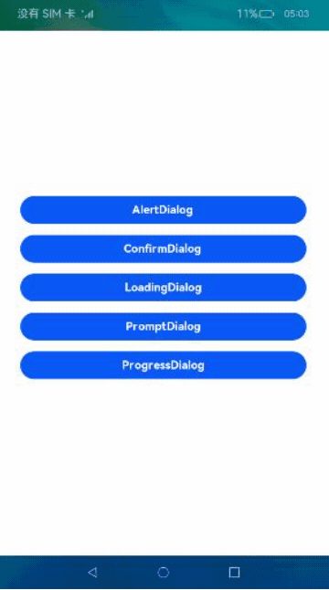
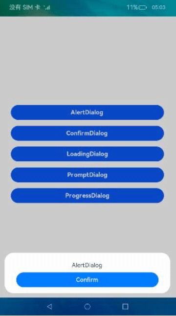
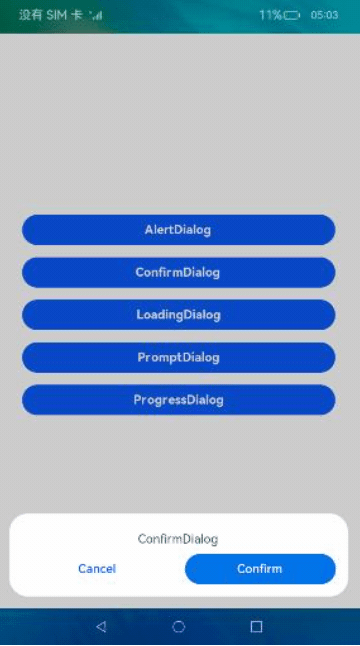
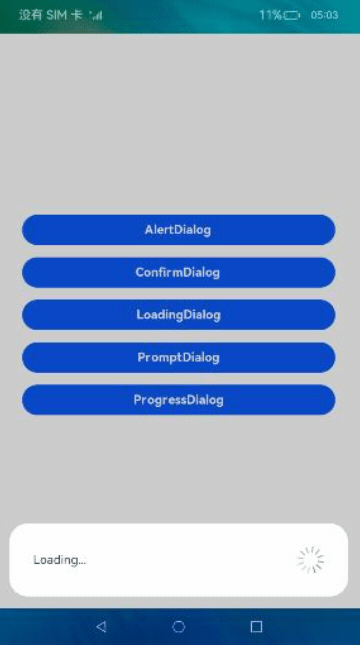
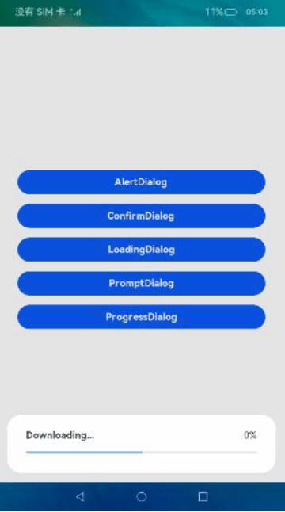

# 弹窗基本使用（JS）

## 介绍

本篇Codelab主要基于dialog和button组件，实现弹窗的几种自定义效果，具体效果有：

1.  警告弹窗，点击确认按钮弹窗关闭。
2.  确认弹窗，点击取消按钮或确认按钮，触发对应操作。
3.  加载弹窗，展示加载中效果。
4.  提示弹窗，支持用户输入内容，点击取消和确认按钮，触发对应操作。
5.  进度条弹窗，展示进度条以及百分比。



### 相关概念

-   [dialog组件](https://gitcode.com/openharmony/docs/blob/master/zh-cn/application-dev/reference/apis-arkui/arkui-js/js-components-container-dialog.md)：自定义弹窗容器组件。
-   [button组件](https://gitcode.com/openharmony/docs/blob/master/zh-cn/application-dev/reference/apis-arkui/arkui-js/js-components-basic-button.md)：按钮组件。

## 环境搭建

### 软件要求

-   [DevEco Studio](https://gitcode.com/openharmony/docs/blob/master/zh-cn/application-dev/quick-start/start-overview.md#%E5%B7%A5%E5%85%B7%E5%87%86%E5%A4%87)版本：DevEco Studio 3.1 Release及以上版本。
-   OpenHarmony SDK版本：API version 9及以上版本。

### 硬件要求

-   开发板类型：[润和RK3568开发板](https://gitcode.com/openharmony/docs/blob/master/zh-cn/device-dev/quick-start/quickstart-appendix-rk3568.md)。
-   OpenHarmony系统：3.2 Release及以上版本。

### 环境搭建

完成本篇Codelab我们首先要完成开发环境的搭建，本示例以**RK3568**开发板为例，参照以下步骤进行：

1. [获取OpenHarmony系统版本](https://gitcode.com/openharmony/docs/blob/master/zh-cn/device-dev/get-code/sourcecode-acquire.md#%E8%8E%B7%E5%8F%96%E6%96%B9%E5%BC%8F3%E4%BB%8E%E9%95%9C%E5%83%8F%E7%AB%99%E7%82%B9%E8%8E%B7%E5%8F%96)：标准系统解决方案（二进制）。以3.2 Release版本为例：

   

2. 搭建烧录环境。

   1.  [完成DevEco Device Tool的安装](https://gitcode.com/openharmony/docs/blob/master/zh-cn/device-dev/quick-start/quickstart-ide-env-win.md)
   2.  [完成RK3568开发板的烧录](https://gitcode.com/openharmony/docs/blob/master/zh-cn/device-dev/quick-start/quickstart-ide-3568-burn.md)

3. 搭建开发环境。

   1.  开始前请参考[工具准备](https://gitcode.com/openharmony/docs/blob/master/zh-cn/application-dev/quick-start/start-overview.md#%E5%B7%A5%E5%85%B7%E5%87%86%E5%A4%87)，完成DevEco Studio的安装和开发环境配置。
   2.  开发环境配置完成后，请参考[使用工程向导](https://gitcode.com/openharmony/docs/blob/master/zh-cn/application-dev/quick-start/start-with-ets-stage.md#创建ets工程)创建工程（模板选择“Empty Ability”）。
   3.  工程创建完成后，选择使用[真机进行调测](https://gitcode.com/openharmony/docs/blob/master/zh-cn/application-dev/quick-start/start-with-ets-stage.md#使用真机运行应用)。

## 代码结构解读

本篇Codelab只对核心代码进行讲解，对于完整代码，我们会在gitee中提供。

```
├──entry/src/main/js         // 代码区
│  └──MainAbility
│     ├──common
│     │  └──images           // 图片资源
│     ├──i18n                // 国际化中英文
│     │  ├──en-US.json			
│     │  └──zh-CN.json			
│     ├──pages
│     │  └──index
│     │     ├──index.css     // 页面整体布局以及弹窗样式
│     │     ├──index.hml     // 自定义弹窗展示页面
│     │     └──index.js      // 弹窗显示关闭逻辑以及动画逻辑
│     └──app.js              // 程序入口
└──entry/src/main/resources  // 应用资源目录
```

## 构建界面

界面主要包括按钮列表页和自定义弹窗两部分，我们可以通过在dialog标签中添加自定义组件设置弹窗，具体效果如图所示：


首先搭建index.hml中的按钮页，主要包括5种常见的弹窗，分别为AlertDialog、ConfirmDialog、LoadingDialog、PromptDialog以及ProgressDialog。

```html
<!--index.hml-->
<div class="btn-div">
    <button type="capsule" value="AlertDialog" class="btn" onclick="showAlert"></button>
    <button type="capsule" value="ConfirmDialog" class="btn" onclick="showConfirm"></button>
    <button type="capsule" value="LoadingDialog" class="btn" onclick="showLoading"></button>
    <button type="capsule" value="PromptDialog" class="btn" onclick="showPrompt"></button>
    <button type="capsule" value="ProgressDialog" class="btn" onclick="showProgress"></button>
</div>
```

### 警告弹窗（AlertDialog）

然后在index.hml中创建AlertDialog自定义弹窗，效果如图所示：



```html
<!-- index.hml -->
<!-- AlertDialog自定义弹窗 -->
<dialog id="alertDialog" class="alert-dialog">
    <div class="dialog-div">
        <div class="alert-inner-txt">
            <text class="txt">AlertDialog</text>
        </div>
        <div class="alert-inner-btn">
            <button class="btn-single" type="capsule" value="Confirm" onclick="confirmClick('alertDialog')">
            </button>
        </div>
    </div>
</dialog>
```

### 确认弹窗（ConfirmDialog）

创建ConfirmDialog自定义弹窗，效果如图所示：



```html
<!-- index.hml -->
<!-- ConfirmDialog自定义弹窗 -->
<dialog id="confirmDialog" class="dialog-main">
    <div class="dialog-div">
        <div class="inner-txt">
            <text class="txt">ConfirmDialog</text>
        </div>
        <div class="inner-btn">
            <button type="capsule" value="Cancel" class="btn-txt-left" onclick="cancelClick('confirmDialog')">
            </button>
            <button type="capsule" value="Confirm" class="btn-txt-right" onclick="confirmClick('confirmDialog')">
            </button>
        </div>
    </div>
</dialog>
```

### 加载弹窗（LoadingDialog）

创建LoadingDialog自定义弹窗，效果如图所示：



```html
<!-- index.hml -->
<!-- LoadingDialog自定义弹窗 -->
<dialog id="loadingDialog" class="low-height-dialog">
    <div class="dialog-loading">
        <text>Loading...</text>
        <image class="loading-img img-rotate" id="loading-img" src="/common/images/ic_loading.svg"></image>
    </div>
</dialog>
```

### 提示弹窗（PromptDialog）

创建PromptDialog自定义弹窗，效果如图所示：


```html
<!-- index.hml -->
<!-- PromptDialog自定义弹窗 -->
<dialog id="promptDialog" class="dialog-prompt">
    <div class="dialog-div-prompt">
        <div class="inner-txt-prompt">
            <text class="txt">PromptDialog</text>
        </div>
        <input class="prompt-input" type="password" placeholder="please enter password">
        </input>
        <div class="inner-btn">
            <button type="capsule" value="Cancel" class="btn-txt-left" onclick="cancelClick('promptDialog')">
            </button>
            <button type="capsule" value="Confirm" class="btn-txt-right" onclick="confirmClick('promptDialog')">
            </button>
        </div>
    </div>
</dialog>
```

### 进度条弹窗（ProgressDialog）

创建ProgressDialog自定义弹窗，效果如图所示：



```html
<!-- index.hml -->
<!-- ProgressDialog自定义弹窗 -->
<dialog id="progressDialog" class="low-height-dialog" oncancel="onCancel">
    <div class="dialog-progress-div">
        <div class="inner-txt-progress">
            <text class="download-txt">Downloading...</text>
            <text>{{ percent + '%' }}</text>
        </div>
        <div class="progress-div">
            <progress class="min-progress" type="horizontal" percent="{{ percent }}" secondarypercent="50">
            </progress>
        </div>
    </div>
</dialog>
```

然后在index.js中文件实现不同button的点击事件，展示对应弹窗：

```js
// index.js
export default {
  data: {...},

  // 展示AlertDialog
  showAlert() {
    this.$element('alertDialog').show();
  },

  // 展示ConfirmDialog
  showConfirm() {
    this.$element('confirmDialog').show();
  },

  // 展示LoadingDialog
  showLoading() {
    ...
    this.animation = this.$element('loading-img').animate(frames, options);
    this.animation.play();
    this.$element('loadingDialog').show();
  },

  // 展示PromptDialog
  showPrompt() {
    this.$element('promptDialog').show();
  },

  // 展示ProgressDialog
  showProgress() {
    ...
  }
}
```

## 总结

您已经完成了本次Codelab的学习，并了解到以下知识点：

1.  dialog自定义弹窗容器组件的使用。
2.  button按钮组件的使用。


