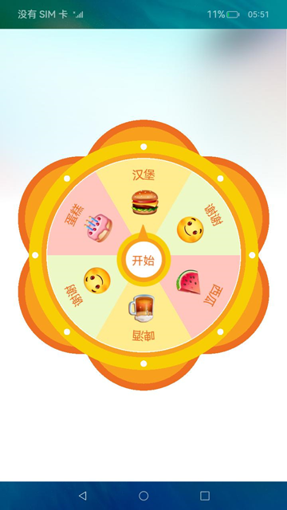

# 自定义抽奖转盘（JS）

## 介绍

本篇Codelab是基于画布组件、动画样式，实现的一个自定义抽奖圆形转盘。包含如下功能：

1.  通过画布组件canvas，画出抽奖圆形转盘。
2.  通过动画样式设置动画，实现抽奖功能。
3.  通过自定义弹窗dialog弹出抽中的奖品。


### 相关概念

-   [stack组件](https://gitcode.com/openharmony/docs/blob/master/zh-cn/application-dev/reference/apis-arkui/arkui-js/js-components-container-stack.md)：堆叠容器，子组件按照顺序依次入栈，后一个子组件覆盖前一个子组件。
-   [canvas组件](https://gitcode.com/openharmony/docs/blob/master/zh-cn/application-dev/reference/apis-arkui/arkui-js/js-components-canvas-canvas.md)：画布组件，用于自定义绘制图形。
-   [CanvasRenderingContext2D对象](https://gitcode.com/openharmony/docs/blob/master/zh-cn/application-dev/reference/apis-arkui/arkui-js/js-components-canvas-canvasrenderingcontext2d.md)：使用CanvasRenderingContext2D在canvas画布组件上进行绘制，绘制对象可以是矩形、文本、图片等。
-   [动画样式](https://gitcode.com/openharmony/docs/blob/master/zh-cn/application-dev/reference/apis-arkui/arkui-js/js-components-common-animation.md)：组件支持动态的旋转、平移、缩放效果，可在style或css中设置。
-   [自定义弹窗dialog](https://gitcode.com/openharmony/docs/blob/master/zh-cn/application-dev/reference/apis-arkui/arkui-js/js-components-container-dialog.md)：自定义弹窗。

## 环境搭建

### 软件要求

-   [DevEco Studio](https://gitcode.com/openharmony/docs/blob/master/zh-cn/application-dev/quick-start/start-overview.md#%E5%B7%A5%E5%85%B7%E5%87%86%E5%A4%87)版本：DevEco Studio 3.1 Release及以上版本。
-   OpenHarmony SDK版本：API version 9及以上版本。

### 硬件要求

-   开发板类型：[润和RK3568开发板](https://gitcode.com/openharmony/docs/blob/master/zh-cn/device-dev/quick-start/quickstart-appendix-rk3568.md)。
-   OpenHarmony系统：3.2 Release及以上版本。

### 环境搭建

完成本篇Codelab我们首先要完成开发环境的搭建，本示例以**RK3568**开发板为例，参照以下步骤进行：

1. [获取OpenHarmony系统版本](https://gitcode.com/openharmony/docs/blob/master/zh-cn/device-dev/get-code/sourcecode-acquire.md#%E8%8E%B7%E5%8F%96%E6%96%B9%E5%BC%8F3%E4%BB%8E%E9%95%9C%E5%83%8F%E7%AB%99%E7%82%B9%E8%8E%B7%E5%8F%96)：标准系统解决方案（二进制）。以3.2 Release版本为例：

   

2. 搭建烧录环境。

   1.  [完成DevEco Device Tool的安装](https://gitcode.com/openharmony/docs/blob/master/zh-cn/device-dev/quick-start/quickstart-ide-env-win.md)
   2.  [完成RK3568开发板的烧录](https://gitcode.com/openharmony/docs/blob/master/zh-cn/device-dev/quick-start/quickstart-ide-3568-burn.md)

3. 搭建开发环境。

   1.  开始前请参考[工具准备](https://gitcode.com/openharmony/docs/blob/master/zh-cn/application-dev/quick-start/start-overview.md#%E5%B7%A5%E5%85%B7%E5%87%86%E5%A4%87)，完成DevEco Studio的安装和开发环境配置。
   2.  开发环境配置完成后，请参考[使用工程向导](https://gitcode.com/openharmony/docs/blob/master/zh-cn/application-dev/quick-start/start-with-ets-stage.md#创建ets工程)创建工程（模板选择“Empty Ability”）。
   3.  工程创建完成后，选择使用[真机进行调测](https://gitcode.com/openharmony/docs/blob/master/zh-cn/application-dev/quick-start/start-with-ets-stage.md#使用真机运行应用)。

## 代码结构解读

本篇Codelab只对核心代码进行讲解，对于完整代码，我们会在gitcode中提供。

```
├──entry/src/main/js                // 代码区
│  └──MainAbility
│     ├──common
│     │  ├──constants
│     │  │  ├──colorConstants.js    // 颜色常量类
│     │  │  └──commonConstants.js   // 公共常量类
│     │  ├──images                  // 图片资源目录
│     │  └──utils
│     │     └──logger.js            // 日志工具类
│     ├──i18n
│     │  ├──en-US.json              // 英文国际化
│     │  └──zh-CN.json	            // 中文国际化	
│     ├──pages
│     │  └──index
│     │     ├──index.css            // index页面样式
│     │     ├──index.hml            // index页面
│     │     └──index.js             // index页面逻辑
│     └──app.js                     // 程序入口
└──entry/src/main/resources         // 应用资源目录
```

## 构建主界面

在这个章节中，我们将完成示例主界面的开发，效果如图所示：



在index.hml布局界面中添加画布组件canvas，画出抽奖圆形转盘，然后添加image组件，实现“开始抽奖”的布局。

```html
<!-- index.hml -->
<stack class="container">
    <canvas ref="canvas" class="canvas-box simple-animation" ...></canvas>
    <image id="center" src="/common/images/ic_center.png" ...></image>
    ...
</stack>
```

在绘制抽奖圆形转盘前，首先需要在index.js的onInit\(\)方法中获取当前设备的屏幕密度和屏幕的宽高。

```javascript
// index.js
import resourceManager from '@ohos.resourceManager';
import featureAbility from '@ohos.ability.featureAbility';

// 页面初始化时触发
onInit() {
  // 获取当前设备的屏幕密度
  resourceManager.getResourceManager((error, mgr) => {
    if(error) {
      Logger.error(`[index][onInit]getResourceManager error is ${JSON.stringify(error)}`);
      return;
    }
    mgr.getDeviceCapability().then(value => {
      let screenDensity = value.screenDensity;
      // 获取屏幕的大小，不包含状态栏大小
      featureAbility.getWindow().then((data) => {
        let windowProperties = data.getWindowProperties();
        this.screenWidth = windowProperties.windowRect.width / screenDensity;
        this.screenHeight = windowProperties.windowRect.height / screenDensity;
      });
    }).catch(err => {
      Logger.error(`[index][onInit]getDeviceCapability error is ${JSON.stringify(err)}`);
    });
  });
}
```

在index.js的onShow\(\)方法中，获取CanvasRenderingContext2D对象，用于在画布组件上绘制矩形、文本、图片等。然后通过draw\(\)方法逐步绘制自定义抽奖圆形转盘。

```javascript
// index.js
// 页面显示时触发
onShow() {
  if (this.ctx !== null) {
    return;
  }
  // 获取CanvasRenderingContext2D对象
  this.ctx = this.$refs.canvas.getContext('2d');
  this.avgAngle = CommonConstants.CIRCLE / CommonConstants.COUNT;
  this.draw();
}

// 画抽奖圆形转盘
draw() {
  // 将画布沿X、Y轴平移指定距离
  this.ctx.translate(this.screenWidth / CommonConstants.HALF, 
    this.screenHeight / CommonConstants.HALF);
  // 画外部圆盘的花瓣
  this.drawFlower();
  // 画外部圆盘、小圈圈
  this.drawOutCircle();
  // 画内部圆盘
  this.drawInnerCircle();
  // 画内部扇形抽奖区域
  this.drawInnerArc();
  // 画内部扇形区域文字
  this.drawArcText();
  // 画内部扇形区域奖品对应的图片
  this.drawImage();
}
```

## 画外部圆盘

画外部圆盘的花瓣：通过调用rotate\(\)方法，将画布旋转指定角度。再通过调用save\(\)和restore\(\)方法，使画布保存最新的绘制状态。根据想要绘制的花瓣个数，改变旋转角度，循环画出花瓣效果。

```javascript
// index.js
// 画外部圆盘的花瓣
drawFlower() {
  let beginAngle = this.startAngle + this.avgAngle;
  const pointY = this.screenWidth * CommonConstants.FLOWER_POINT_Y_RATIOS;
  const radius = this.screenWidth * CommonConstants.FLOWER_RADIUS_RATIOS;
  const innerRadius = this.screenWidth * CommonConstants.FLOWER_INNER_RATIOS;
  for (let i = 0; i < CommonConstants.COUNT; i++) {
    this.ctx.save();
    this.ctx.rotate(beginAngle * Math.PI / CommonConstants.HALF_CIRCLE);
    this.ctx.beginPath();
    this.ctx.fillStyle = ColorConstants.FLOWER_OUT_COLOR;
    this.ctx.arc(0, -pointY, radius, 0, Math.PI * CommonConstants.HALF);
    this.ctx.fill();

    this.ctx.beginPath();
    this.ctx.fillStyle = ColorConstants.FLOWER_INNER_COLOR;
    this.ctx.arc(0, -pointY, innerRadius, 0, Math.PI * CommonConstants.HALF);
    this.ctx.fill();
    beginAngle += this.avgAngle;
    this.ctx.restore();
  }
}
```

画外部圆盘、圆盘边上的小圈圈：在指定的X、Y（0, 0）坐标处，画一个半径为this.screenWidth \* CommonConstants.OUT\_CIRCLE\_RATIOS的圆形。接下来通过一个for循环，且角度每次递增CommonConstants.CIRCLE / CommonConstants.SMALL\_CIRCLE\_COUNT，来绘制圆环上的小圈圈。

```javascript
// index.js
// 画外部圆盘、小圈圈
drawOutCircle() {
  // 画外部圆盘
  this.ctx.beginPath();
  this.ctx.fillStyle = ColorConstants.OUT_CIRCLE_COLOR;
  this.ctx.arc(0, 0, this.screenWidth * CommonConstants.OUT_CIRCLE_RATIOS, 0, Math.PI * CommonConstants.HALF);
  this.ctx.fill();

  // 画小圆圈
  let beginAngle = this.startAngle;
  for (let i = 0; i < CommonConstants.SMALL_CIRCLE_COUNT; i++) {
    this.ctx.save();
    this.ctx.rotate(beginAngle * Math.PI / CommonConstants.HALF_CIRCLE);

    this.ctx.beginPath();
    this.ctx.fillStyle = ColorConstants.WHITE_COLOR;
    this.ctx.arc(this.screenWidth * CommonConstants.SMALL_CIRCLE_RATIOS, 0,
      CommonConstants.SMALL_CIRCLE_RADIUS, 0, Math.PI * CommonConstants.HALF);
    this.ctx.fill();
    beginAngle = beginAngle + CommonConstants.CIRCLE / CommonConstants.SMALL_CIRCLE_COUNT;
    this.ctx.restore();
  }
}
```

## 画内部扇形抽奖区域

画内部圆盘、内部扇形抽奖区域：使用canvas的arc\(\)方法绘制内部圆盘。通过一个for循环，角度每次递增this.avgAngle。然后不断更改弧线的起始弧度this.startAngle \* Math.PI / CommonConstants.HALF\_CIRCLE和弧线的终止弧度\(this.startAngle + this.avgAngle\) \* Math.PI / CommonConstants.HALF\_CIRCLE。最后用fill\(\)方法对路径进行填充。

```javascript
// index.js
// 画内部圆盘
drawInnerCircle() {
  this.ctx.beginPath();
  this.ctx.fillStyle = ColorConstants.INNER_CIRCLE_COLOR;
  this.ctx.arc(0, 0, this.screenWidth * CommonConstants.INNER_CIRCLE_RATIOS, 0, Math.PI * CommonConstants.HALF);
  this.ctx.fill();

  this.ctx.beginPath();
  this.ctx.fillStyle = ColorConstants.WHITE_COLOR;
  this.ctx.arc(0, 0, this.screenWidth * CommonConstants.INNER_WHITE_CIRCLE_RATIOS, 0, Math.PI * CommonConstants.HALF);
  this.ctx.fill();
},

// 画内部扇形抽奖区域
drawInnerArc() {
  let colors = [
    ColorConstants.ARC_PINK_COLOR, ColorConstants.ARC_YELLOW_COLOR,
    ColorConstants.ARC_GREEN_COLOR, ColorConstants.ARC_PINK_COLOR,
    ColorConstants.ARC_YELLOW_COLOR, ColorConstants.ARC_GREEN_COLOR
  ];
  let radius = this.screenWidth * CommonConstants.INNER_ARC_RATIOS;
  for (let i = 0; i < CommonConstants.COUNT; i++) {
    this.ctx.beginPath();
    this.ctx.fillStyle = colors[i];
    this.ctx.arc(0, 0, radius, this.startAngle * Math.PI / CommonConstants.HALF_CIRCLE,
      (this.startAngle + this.avgAngle) * Math.PI / CommonConstants.HALF_CIRCLE);
    this.ctx.fill();
    this.ctx.lineTo(0, 0);
    this.ctx.fill();
    this.startAngle += this.avgAngle;
  }
}
```

画内部抽奖区域文字：用for循环，通过drawCircularText\(\)方法绘制每组文字。drawCircularText\(\)方法接收三个参数，分别是字符串、起始弧度和终止弧度。绘制文本前需要设置每个字母占的弧度angleDecrement，然后设置水平和垂直的偏移量。垂直偏移量circleText.y - Math.sin\(angle\) \* radius就是朝着圆心移动的距离；水平偏移circleText.x + Math.cos\(angle\) \* radius，是为了让文字在当前弧范围文字居中。最后使用fillText\(\)方法绘制文本。

```javascript
// index.js
// 画内部扇形区域文字
drawArcText() {
  this.ctx.textAlign = CommonConstants.TEXT_ALIGN;
  this.ctx.textBaseline = CommonConstants.TEXT_BASE_LINE;
  this.ctx.fillStyle = ColorConstants.TEXT_COLOR;
  this.ctx.font = CommonConstants.CANVAS_FONT;
  let textArrays = [
    this.$t('strings.text_smile'),
    this.$t('strings.text_hamburger'),
    this.$t('strings.text_cake'),
    this.$t('strings.text_smile'),
    this.$t('strings.text_beer'),
    this.$t('strings.text_watermelon')
  ];
  let arcTextStartAngle = CommonConstants.ARC_START_ANGLE;
  let arcTextEndAngle = CommonConstants.ARC_END_ANGLE;
  for (let i = 0; i < CommonConstants.COUNT; i++) {
    this.drawCircularText(textArrays[i],
      (this.startAngle + arcTextStartAngle) * Math.PI / CommonConstants.HALF_CIRCLE,
      (this.startAngle + arcTextEndAngle) * Math.PI / CommonConstants.HALF_CIRCLE);
    this.startAngle += this.avgAngle;
  }
},

// 绘制圆弧文本
drawCircularText(textString, startAngle, endAngle) {
  let circleText = {
    x: 0,
    y: 0,
    radius: this.screenWidth * CommonConstants.INNER_ARC_RATIOS
  };
  // 圆的半径
  let radius = circleText.radius - circleText.radius / CommonConstants.COUNT;
  // 每个字母占的弧度
  let angleDecrement = (startAngle - endAngle) / (textString.length - 1);
  let angle = startAngle;
  let index = 0;
  let character;

  while (index < textString.length) {
    character = textString.charAt(index);
    this.ctx.save();
    this.ctx.beginPath();
    this.ctx.translate(circleText.x + Math.cos(angle) * radius,
      circleText.y - Math.sin(angle) * radius);
    this.ctx.rotate(Math.PI / CommonConstants.HALF - angle);
    this.ctx.fillText(character, 0, 0);
    angle -= angleDecrement;
    index++;
    this.ctx.restore();
  }
}
```

画内部抽奖区域文字对应图片：使用canvas的drawImage\(\)方法绘制抽奖区域文字对应图片，该方法接收五个参数，分别是图片资源、绘制区域左上角的X和Y轴坐标、绘制区域的宽度和高度。

```javascript
// index.js
// 画内部扇形区域奖品对应的图片
drawImage() {
  let beginAngle = this.startAngle;
  let imageSrc = [
    CommonConstants.WATERMELON_IMAGE_URL, CommonConstants.BEER_IMAGE_URL,
    CommonConstants.SMILE_IMAGE_URL, CommonConstants.CAKE_IMAGE_URL,
    CommonConstants.HAMBURG_IMAGE_URL, CommonConstants.SMILE_IMAGE_URL
  ];
  let image = new Image();
  for (let i = 0; i < CommonConstants.COUNT; i++) {
    image.src = imageSrc[i];
    this.ctx.save();
    this.ctx.beginPath();
    this.ctx.rotate(beginAngle * Math.PI / CommonConstants.HALF_CIRCLE);
    this.ctx.drawImage(image, this.screenWidth * CommonConstants.IMAGE_DX_RATIOS,
      this.screenWidth * CommonConstants.IMAGE_DY_RATIOS, CommonConstants.IMAGE_SIZE,
      CommonConstants.IMAGE_SIZE);
    beginAngle += this.avgAngle;
    this.ctx.restore();
  }
}
```

## 实现抽奖功能

在index.hml的canvas组件中添加动画样式的属性，在image组件中添加点击事件onclick。点击“开始抽奖”图片，圆形转盘开始转动抽奖。

```html
<!-- index.hml -->
<stack class="container">
    <canvas ref="canvas" class="canvas-box simple-animation"
            style="transform: rotate({{ rotateDegree }}); animation-iteration-count: {{ infinite }};
                    animation-play-state: {{ playState }};">
    </canvas>
    <image id="center" src="/common/images/ic_center.png"
           onclick="startAnimator" disabled="{{ disabledFlag }}">
    </image>
    ...
</stack>
```

在index.css中设置相应的动画样式，使圆形转盘可以通过动画转动抽奖。

```css
/* index.css */
.simple-animation {
    animation-name: luckyCircle;
    animation-duration: 4s;
    animation-delay: 0s;
    animation-timing-function: ease;
}

@keyframes luckyCircle {
    from {
        transform: rotate(0deg);
    }

    to {
        transform: rotate(1800deg);
    }
}
```

圆形转盘开始转动抽奖：给转盘指定一个随机的转动角度randomAngle，保证每次转动的角度是随机的，即每次抽到的奖品也是随机的。动画结束后，转盘停止转动，抽奖结束，弹出抽中的奖品信息。

```javascript
// index.js
// 开始抽奖
startAnimator() {
  this.disabledFlag = !this.disabledFlag;
  let randomAngle = Math.round(Math.random() * CommonConstants.CIRCLE);
  // 获取中奖信息
  this.showPrizeData(randomAngle);
  if (this.infinite === 0) {
    // 永久旋转
    this.infinite = -1;
  }
  setTimeout(() => {
    this.infinite = 0;
    this.playState = CommonConstants.PLAY_STATE.pause;
    // 打开自定义弹窗，弹出奖品信息
    this.$element('prize-dialog').show();
  }, CommonConstants.DURATION);
  this.rotateDegree = CommonConstants.CIRCLE * CommonConstants.FIVE_CIRCLE +
    CommonConstants.ANGLE - randomAngle;
  this.playState = CommonConstants.PLAY_STATE.running;
}
```

弹出抽中的奖品信息：抽奖结束后，弹出抽中的图片和文本信息，通过自定义弹窗dialog实现。

```html
<!-- index.hml -->
<stack class="container">
    ...
    <dialog id="prize-dialog" oncancel="closeDialog">
        <div class="dialog-div">
            <image id="prize-image" src="{{ prizeData.imageSrc }}"></image>
            <text class="txt message">{{ prizeData.message }}</text>
            <text class="txt confirm" onclick="closeDialog">{{ $t('strings.confirm_text') }}</text>
        </div>
    </dialog>
</stack>
```

点击自定义弹窗的确定按钮，关闭弹窗。

```javascript
// index.js
// 关闭自定义弹窗
closeDialog() {
  this.$element('prize-dialog').close();
  this.disabledFlag = !this.disabledFlag;
}
```

## 总结

您已经完成了本次Codelab的学习，并了解到以下知识点：

1.  使用画布组件canvas，画出抽奖圆形转盘。
2.  使用动画样式设置动画，实现抽奖功能。
3.  使用自定义弹窗dialog弹出抽中的奖品。


