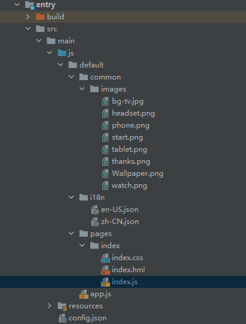

# 介绍

本教程为您展示如何使用自定义组件实现圆形抽奖转盘功能。当系统提供的组件无法满足设计需求时，您可以创建自定义组件，根据设计需求自定义组件的属性及响应事件，并绘制组件。圆形抽奖转盘是两个自定义图层中实现绘制，通过canvas完成绘制任务，最终与组件的其它图层合成在一起呈现在界面中。效果图如下：

**图 1** <a name="fig191111352175713"></a>  


# 搭建OpenHarmony环境

完成本篇Codelab我们首先要完成开发环境的搭建，本示例以**Hi3516DV300**开发板为例，参照以下步骤进行：

1. [获取OpenHarmony系统版本](https://gitee.com/openharmony/docs/blob/master/zh-cn/device-dev/get-code/sourcecode-acquire.md#%E8%8E%B7%E5%8F%96%E6%96%B9%E5%BC%8F3%E4%BB%8E%E9%95%9C%E5%83%8F%E7%AB%99%E7%82%B9%E8%8E%B7%E5%8F%96) ：标准系统解决方案（二进制）

   以3.0版本为例：

   

2. 搭建烧录环境

   1.  [完成DevEco Device Tool的安装](https://gitee.com/openharmony/docs/blob/master/zh-cn/device-dev/quick-start/quickstart-ide-env--win.md)
2.  [完成Hi3516开发板的烧录](https://gitee.com/openharmony/docs/blob/master/zh-cn/device-dev/quick-start/quickstart-ide-3516-burn.md)
   
3. 搭建开发环境

    1.  开始前请参考[工具准备](https://gitee.com/openharmony/docs/blob/master/zh-cn/application-dev/quick-start/start-overview.md#%E5%B7%A5%E5%85%B7%E5%87%86%E5%A4%87) ，完成DevEco Studio的安装和开发环境配置。
    2.  开发环境配置完成后，请参考[使用工程向导](https://gitee.com/openharmony/docs/blob/master/zh-cn/application-dev/quick-start/start-with-js-fa.md#%E5%88%9B%E5%BB%BAjs%E5%B7%A5%E7%A8%8B) 创建工程（模板选择“Empty Ability”），选择JS或者eTS语言开发。
    3.  工程创建完成后，选择使用[真机进行调测](https://gitee.com/openharmony/docs/blob/master/zh-cn/application-dev/quick-start/start-with-js-fa.md#%E4%BD%BF%E7%94%A8%E7%9C%9F%E6%9C%BA%E8%BF%90%E8%A1%8C%E5%BA%94%E7%94%A8) 。
    
# 代码结构解读

代码结构解读

本篇Codelab只对核心代码进行讲解，对于完整代码，我们会在最后的参考中提供下载方式，接下来我们会用一小节来讲解整个工程的代码结构：



-   pages：用于存放所有页面的目录。
    -   common:文件夹存放一些公共的资源，比如图片。
    -   index：构成自定义组件界面，包括index.hml布局文件，index.css样式文件，index.js逻辑处理文件。


-   config.json：配置文件。

# 基本步骤

在index.hml布局界面中添加canvas组件，根据需求绘制需要的图形。

```
<stack class="container">
    <canvas id="{{id}}" class="canvasBox simpleAnimation"
            style="transform: rotate({{rotateDegree}});animation-iteration-count: {{infinite}};animation-play-state: {{playState}}; ">
    </canvas>
    <canvas id="center" class="canvasBox1" ontouchstart="touchStart" focusable="true">
    </canvas>
</stack>
```

在index.js文件通过onDraw方法中进行绘制。

```
draw() {
  // 将画布沿X、Y轴平移指定距离
  this.ctx.translate(this.centerX + 10, this.centerY);
  // 画外部圆盘的花瓣
  this.drawFlower();
  // 画外部圆盘、小圈圈、五角星
  this.drawOutCircleAndFive();
  // 画内部扇形抽奖区域
  this.drawInnerArc();
  // 画内部扇形区域文字
  this.drawArcText();
  // 画内部扇形区域奖品对应的图片
  this.drawImage();
  // 画中心圆盘和指针
  this.drawCenter();
},
```
# 画外部圆盘
1. 画外部圆盘的花瓣：通过调用canvas的rotate\(\)方法，将画布旋转指定角度。通过调用canvas的save\(\)和restore\(\)方法，使画布保存最新的绘制状态。根据想要绘制的花瓣个数，改变旋转角度，循环画出花瓣效果。

   ```
   drawFlower() {
     let beginAngle = this.startAngle + this.avgAngle;
     const radius = this.centerX - this.padding;
     for (let i = 0; i < this.count; i++) {
       this.ctx.save();
       this.ctx.beginPath();
       this.ctx.fillStyle = '#F3B468';
       this.ctx.rotate(beginAngle * Math.PI / 180);
       this.ctx.arc(-radius / 2, radius / 2, radius / 2, 0, Math.PI * 2);
       this.ctx.fill();
   
       this.ctx.beginPath();
       this.ctx.fillStyle = '#E588B9';
       this.ctx.arc(-radius / 2, radius / 2, (radius - this.padding) / 2, 0, Math.PI * 2);
       beginAngle += this.avgAngle;
       this.ctx.fill();
       this.ctx.restore();
    }
   }
   ```

2. 画外部圆盘边上的小圈圈和五角星：接下来一个for循环，且角度每次递增\(this.avgAngle / 3\)，就是绘制圆环上的小圈圈和五角星了。因为是交替绘制五角星和小圈圈，所以用一个条件判断语句去绘制。

   ```
   drawOutCircleAndFive() {
     this.ctx.beginPath();
     this.ctx.fillStyle = '#ED6D56';
     this.ctx.arc(0, 0, this.centerX - this.padding, 0, Math.PI * 2);
     this.ctx.fill();
     let beginAngle = this.startAngle + this.avgAngle;
     for (let i = 0; i < this.count * 3; i++) {
       this.ctx.save();
       if (0 === i % 2) {
   	  // 画小圆圈
   	  this.ctx.beginPath();
   	  this.ctx.rotate(beginAngle * Math.PI / 180);
   	  this.ctx.fillStyle = '#FFFFFF';
   	  this.ctx.arc(this.centerX - this.padding - this.padding / 2, 0, 5, 0, Math.PI * 2);
   	  this.ctx.fill();
       } else {
   	  // 画五角星
   	  this.paintFiveStart(beginAngle);
       }
     beginAngle = beginAngle + this.avgAngle / 3;
     this.ctx.restore();
    }
   },
   ```

3. 画五角星：通过计算获取到五角星的5个顶点位置（计算依据：五角星每个角的角度为36°，然后根据三角函数即可算出各个点的坐标），再使用canvas的fill方法将5个顶点通过画线连接在一起，就完成了五角星的绘制。

   ```
   // 画五角星
   paintFiveStart(beginAngle) {
     // 画五角星的path
     this.ctx.beginPath();
     this.ctx.rotate(beginAngle * Math.PI / 180);
     this.ctx.fillStyle = '#FFFF00';
     const points = this.fivePoints(this.centerX - this.padding - this.padding / 2, 0, this.padding / 2);
     for (let i = 0; i < points.length - 1; i = i + 2) {
       this.ctx.lineTo(points[i], points[i + 1]);
     }
     this.ctx.closePath();
     this.ctx.fill();
   },
   
   // 获取五角星的五个顶点
   fivePoints(pointXa, pointYa, sideLength) {
     const radian = 18 * Math.PI / 180;
     const pointXb = pointXa + sideLength / 2;
     const num = sideLength * Math.sin(radian);
     const pointXc = pointXa + num;
     const pointXd = pointXa - num;
     const pointXe = pointXa - sideLength / 2;
     const pointYb = pointYa + Math.sqrt(Math.pow(pointXc - pointXd, 2) - Math.pow(sideLength / 2, 2));
     const pointYc = pointYa + Math.cos(radian) * sideLength;
     const pointYd = pointYc;
     const pointYe = pointYb;
     const points = [pointXa, pointYa, pointXd, pointYd, pointXb, pointYb,
     pointXe, pointYe, pointXc, pointYc, pointXa, pointYa];
     return points;
   },
   ```
# 画内部扇形抽奖区域
1. 画抽奖区域扇形：使用canvas的arc方法绘制弧，接下来一个for循环，且角度每次递增this.startAngle，然后不断更改弧线的起始弧度\(this.startAngle \* Math.PI / 180\)和弧线的终止弧度\(this.startAngle + this.avgAngle\) \* Math.PI / 180。最后fill\(\)方法对路径进行填充。

   ```
   drawInnerArc() {
     const radius = this.centerX - this.padding * 2;
     for (let i = 0; i < this.count; i++) {
       this.ctx.beginPath();
       this.ctx.fillStyle = this.colors[i];
       this.ctx.arc(0, 0, radius, this.startAngle * Math.PI / 180, (this.startAngle + this.avgAngle) * Math.PI / 180);
       this.ctx.lineTo(0, 0);
       this.ctx.fill();
       this.startAngle += this.avgAngle;
     }
   },
   ```

2. 画抽奖区域文字：textArrays 表示需要绘制文本数组集合，接下来一个for循环，通过drawCircularText\(\)方法绘制每组文字。drawCircularText\(\)方法接收三个参数，分别是字符串，起始弧度和终止弧度。绘制文本前需要设置每个字母占的弧度angleDecrement，然后设置水平和垂直的偏移量。垂直偏移量\( circleText.y - Math.sin\(angle\) \* radius\)就是朝着圆心移动的距离；水平偏移量，就是顺时针去旋转，水平偏移\(circleText.x + Math.cos\(angle\) \* radius\),是为了让文字在当前弧范围文字居中。最后使用canvas的fillText方法绘制文本。

   ```
   drawArcText() {
     this.ctx.textAlign = 'center';
     this.ctx.textBaseLine = 'middle';
     this.ctx.fillStyle = '#EA86A4';
     this.ctx.font = this.padding + 'px sans-serif';
     const textArrays = ['恭喜发财', '华为耳机', '华为手机', '恭喜发财', '华为平板', '华为手表'];
     for (let i = 0; i < this.count; i++) {
       this.drawCircularText(textArrays[i], (this.startAngle + this.avgAngle * 3 / 4) * Math.PI / 180,
   	  (this.startAngle + this.avgAngle / 4) * Math.PI / 180);
       this.startAngle += this.avgAngle;
     }
   },
   drawCircularText(textString, startAngle, endAngle) {
     const circleText = {
       x: 0,
       y: 0,
       radius: this.centerX - this.padding * 2
     };
     // 圆的半径
     const radius = circleText.radius - circleText.radius / 5;
     // 每个字母占的弧度
     const angleDecrement = (startAngle - endAngle) / (textString.length - 1);
     let angle = parseFloat(startAngle);
     let index = 0;
     let character;
   
     while (index < textString.length) {
       character = textString.charAt(index);
       this.ctx.save();
       this.ctx.beginPath();
       //circleText.x 文本 Math.cos(angle) * radius
       this.ctx.translate(circleText.x + Math.cos(angle) * radius, circleText.y - Math.sin(angle) * radius);
       this.ctx.rotate(Math.PI / 2 - angle);
       this.ctx.fillText(character, 0, 0);
       angle -= angleDecrement;
       index++;
      this.ctx.restore();
     }
   },
   ```

3. 画抽奖区域文字对应图片：使用canvas的drawImage方法绘制抽奖区域文字对应图片，该方法接收三个参数，分别是图片资源,对象的左上角和右上角。

   ```
   drawImage() {
     let beginAngle = this.startAngle + this.avgAngle / 2;
     const imageSrc = ['common/images/watch.png', 'common/images/tablet.png', 'common/images/thanks.png',
       'common/images/phone.png', 'common/images/headset.png', 'common/images/thanks.png'];
     const img = new Image();
     for (let i = 0; i < this.count; i++) {
       img.src = imageSrc[i];
       this.ctx.save();
       this.ctx.beginPath();
       this.ctx.rotate(beginAngle * Math.PI / 180);
       this.ctx.drawImage(img, this.centerX / 3, -48 / 2);
       beginAngle += this.avgAngle;
       this.ctx.restore();
     }
   },
   ```
# 画中心圆盘和指针

1.  画中心圆盘大指针：首先确定要移动的三个点的坐标\(-centerX / nine, 0\)、\(centerX / nine, 0\)、\(0F, -centerX / 3\)，通过canvas的fill方法去绘制指针。

    ```
    centerCtx.beginPath();
    centerCtx.fillStyle = '#F6C8D8';
    centerCtx.moveTo(-this.centerX / nine, 0);
    centerCtx.lineTo(this.centerX / nine, 0);
    centerCtx.lineTo(0, -this.centerX / 3);
    centerCtx.closePath();
    centerCtx.fill();
    ```

2.  画内部大圆和小圆：在圆盘圆心处，绘制两个半径分别为centerX / 7 + padding / 2、centerX / 7的中心圆盘。

    ```
    // 画内部大圆
    centerCtx.beginPath();
    centerCtx.fillStyle = '#F6C8D8';
    centerCtx.arc(0, 0, this.centerX / 7 + this.padding / 2, 0, Math.PI * 2);
    centerCtx.fill();
    // 画内部小圆
    centerCtx.beginPath();
    centerCtx.fillStyle = '#FFFFFF';
    centerCtx.arc(0, 0, this.centerX / 7, 0, Math.PI * 2);
    centerCtx.fill();
    ```

3.  画中心圆盘小指针：与步骤1中画中心圆盘大指针类似，通过canvas的fill方法去绘制中心圆盘小指针。

    ```
    centerCtx.beginPath();
    centerCtx.fillStyle = '#FFFFFF';
    centerCtx.moveTo(-this.centerX / 18, 0);
    centerCtx.lineTo(this.centerX / 18, 0);
    centerCtx.lineTo(0, -this.centerX / 3 + this.padding / 2);
    centerCtx.closePath();
    centerCtx.fill();
    ```

4.  画中心圆弧文字：首先设置需要绘制文本的样式，再通过canvas的fillText方法绘制中心文本。

    ```
    const text = '开始';
    centerCtx.textAlign = 'center';
    centerCtx.fillStyle = '#EA86A4';
    centerCtx.font = this.padding - 10 + 'px sans-serif';
    centerCtx.beginPath();
    centerCtx.fillText(text, 0, this.ctx.measureText(text).width / 5);
    ```
# 实现抽奖功能

1. 获取屏幕上点击的坐标，当点击的范围在中心圆盘区域时，圆形转盘开始转动抽奖。

   ```
   touchStart(event) {
     // 获取屏幕上点击的坐标
     const floatX = event.touches[0].globalX;
     const floatY = event.touches[0].globalY;
     const radius = this.centerX / 7 + this.padding / 2;
     const isScopeX = this.centerX - radius < floatX && this.centerX + radius > floatX;
     const isScopeY = this.centerY - radius < floatY && this.centerY + radius > floatY;
     if (isScopeX && isScopeY && this.playState !== 'running') {
       this.startAnimator();
     }
   },
   ```

2. 圆形转盘开始转动抽奖：给转盘指定一个随机的转动角度randomAngle，保证每次转动的角度是随机的\(即每次抽到的奖品也是随机的\)。动画结束后，转盘停止转动（即抽奖结束），会弹出抽中的奖品提示信息。

   ```
   startAnimator() {
     const angle = 270;
     const randomAngle = Math.random() * this.circle;
     this.startAngle = this.circle * 5 - randomAngle + angle;
     if (this.infinite === 0) {
       this.infinite = -1; // 永久旋转
     }
     setTimeout(() => {
       this.infinite = 0;
       this.playState = 'pause';
       this.showPrizeMessage(randomAngle);
     }, 4000);
   
     this.rotateDegree = this.startAngle;
     this.playState = 'running';
   },
   ```
   
# 恭喜您

通过本教程的学习，您已学会了如何使用自定义组件实现圆形抽奖转盘。


