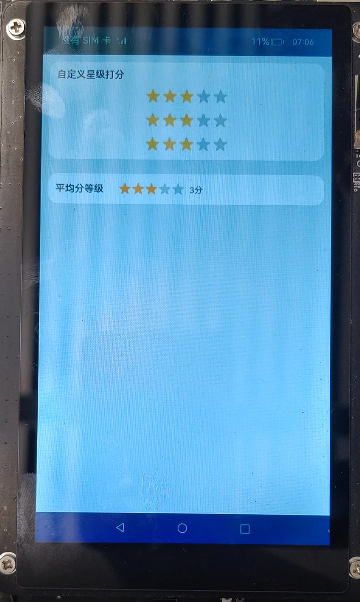

# rating组件的使用（JS）

## 介绍

本篇Codelab将引导开发者使用rating组件实现星级打分功能。


### 相关概念

- [rating组件](https://gitcode.com/openharmony/docs/blob/master/zh-cn/application-dev/reference/apis-arkui/arkui-js/js-components-basic-rating.md/)：评分条，可根据用户判断进行打分。

## 环境搭建

### 软件要求

-   [DevEco Studio](https://gitcode.com/openharmony/docs/blob/master/zh-cn/application-dev/quick-start/start-overview.md#%E5%B7%A5%E5%85%B7%E5%87%86%E5%A4%87)版本：DevEco Studio 3.1 Release及以上版本。
-   OpenHarmony SDK版本：API version 9及以上版本。

### 硬件要求

-   开发板类型：[润和RK3568开发板](https://gitcode.com/openharmony/docs/blob/master/zh-cn/device-dev/quick-start/quickstart-appendix-rk3568.md)。
-   OpenHarmony系统：3.2 Release及以上版本。

### 环境搭建

完成本篇Codelab我们首先要完成开发环境的搭建，本示例以**RK3568**开发板为例，参照以下步骤进行：

1.  [获取OpenHarmony系统版本](https://gitcode.com/openharmony/docs/blob/master/zh-cn/device-dev/get-code/sourcecode-acquire.md#%E8%8E%B7%E5%8F%96%E6%96%B9%E5%BC%8F3%E4%BB%8E%E9%95%9C%E5%83%8F%E7%AB%99%E7%82%B9%E8%8E%B7%E5%8F%96)：标准系统解决方案（二进制）。以3.2 Release版本为例：

    

2.  搭建烧录环境。
    1.  [完成DevEco Device Tool的安装](https://gitcode.com/openharmony/docs/blob/master/zh-cn/device-dev/quick-start/quickstart-ide-env-win.md)
    2.  [完成RK3568开发板的烧录](https://gitcode.com/openharmony/docs/blob/master/zh-cn/device-dev/quick-start/quickstart-ide-3568-burn.md)

3.  搭建开发环境。
    1.  开始前请参考[工具准备](https://gitcode.com/openharmony/docs/blob/master/zh-cn/application-dev/quick-start/start-overview.md#%E5%B7%A5%E5%85%B7%E5%87%86%E5%A4%87)，完成DevEco Studio的安装和开发环境配置。
    2.  开发环境配置完成后，请参考[使用工程向导](https://gitcode.com/openharmony/docs/blob/master/zh-cn/application-dev/quick-start/start-with-ets-stage.md#创建ets工程)创建工程（模板选择“Empty Ability”）。
    3.  工程创建完成后，选择使用[真机进行调测](https://gitcode.com/openharmony/docs/blob/master/zh-cn/application-dev/quick-start/start-with-ets-stage.md#使用真机运行应用)。

## 代码结构解读

本篇Codelab只对核心代码进行讲解，对于完整代码，我们会在gitee中提供。

```
├──entry/src/main/js                          // 代码区
│  └──MainAbility
│     ├──common
│     │  └──images
│     │     ├──star_focus_yellow.svg          // 前景图片
│     │     ├──star_half_yellow.svg           // 次级背景图片
│     │     └──star_nor.svg                   // 背景图片
│     ├──i18n
│     │  ├──en-US.json	                      // 英文国际化
│     │  └──zh-CN.json	                      // 中文国际化
│     ├──pages
│     │  └──index
│     │     ├──index.css                      // 星级打分页面样式
│     │	    ├──index.hml                      // 星级打分页面
│     │	    └──index.js                       // 星级打分页面逻辑
│     └──app.js                               // 程序入口
└──entry/src/main/resource                    // 应用静态资源目录
```
## 页面布局

界面主要由自定义星级打分和平均分等级两个部分组成。



本应用使用div组件用作外层容器，并将自定义星级组件和平均分等级分别放在两个div组件中。除此之外，自定义星级打分还使用了列表渲染，使用for循环一次渲染多个组件，onchange参数可以设置组件使用的事件响应方法，参数中的$idx则代表数组中的元素的索引值。

```html
<!-- index.hml -->
<div class="container">
    <!-- 自定义打分组件-->
    <div class="sub-container">
        ...
        <rating for="{{ ratings }}" onchange="rateChange({{ $idx }})" class="rate" rating="3"></rating>
    </div>

    <!-- 平均分等级展示-->
    <div class="sub-container-average">
        ...
        <rating class="rate-avg" indicator="true" stepsize="0.1" rating="{{ avg }}"></rating>
        ...
    </div>
</div>
```
## 为组件设计样式

自定义星级打分的rating组件还可以设置星星样式，需要设置以下三个参数：

-   star-background：背景图片，没被选中时使用的图片。
-   star-foreground：前景图片，完全被选中时使用的图片，或未被完全选中时左侧使用的图片。
-   star-secondary：次级背景图片，未被完全选中时右侧使用的图片。

```css
/* index.css */
/* 自定义星级打分样式 */
.rate {
    star-background: url("/common/images/ic_star_nor.svg");
    star-foreground: url("/common/images/ic_star_focus_yellow.svg");
    star-secondary: url("/common/images/ic_star_half_yellow.svg");
    width: 140vp;
    height: 30vp;
    margin-bottom: 10vp;
}
```

## 数据处理

数据初始化，使用数组记录rating组件的分值，使用avg变量记录平均值。

```javascript
// index.js
export default {
  data: {
    ratings: new Array(3, 3, 3),
    avg: 3
  },
  ...
}
```

当rating发生变化时，根据索引值更改对应元素的数据，并重新计算平均值。

```javascript
// index.js
rateChange(idx, event) {
  this.ratings.splice(idx, 1, event.rating);
  this.getAvg();
},
getSum(total, num) {
  return total + num;
},
getAvg() {
  const value = this.ratings.reduce(this.getSum) / this.ratings.length;
  this.avg = value.toFixed(1);
}
```


## 总结

您已经完成了本次Codelab的学习，并了解到以下知识点：

1. rating组件的使用。


