# 1 介绍

本篇Codelab我们最终会构建一个简易的购物应用。应用包含两级页面，分别是主页（商品浏览页签、购物车页签、我的页签）和商品详情页面。

两个页面都展示了丰富的JS UI组件，包括：自定义弹窗容器组件（dialog），列表组件（list），滑动容器组件（swiper），页签容器组件（tabs），按钮组件（button），图表组件（chart），分隔器组件（divider），图片组件（image），交互式组件（input），跑马灯组件（marquee），菜单组件（menu），滑动选择器组件（picker），进度条组件（progress），评分条组件（rating），搜索框组件（search）。

**最终效果预览如下图所示：**

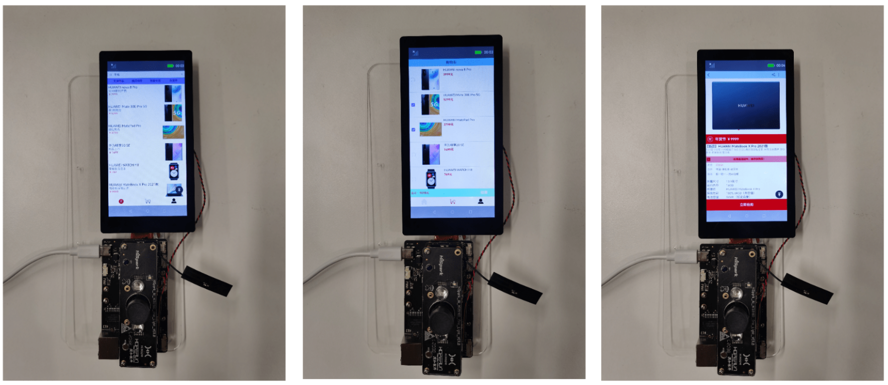

# 2 搭建OpenHarmony环境

完成本篇Codelab我们首先要完成开发环境的搭建，本示例以**Hi3516DV300**开发板为例，参照以下步骤进行：

[获取OpenHarmony系统版本](https://gitee.com/openharmony/docs/blob/master/zh-cn/device-dev/get-code/sourcecode-acquire.md#%E8%8E%B7%E5%8F%96%E6%96%B9%E5%BC%8F3%E4%BB%8E%E9%95%9C%E5%83%8F%E7%AB%99%E7%82%B9%E8%8E%B7%E5%8F%96)：标准系统解决方案（二进制）。

搭建烧录环境。

1.  [完成DevEco Device Tool的安装](https://gitee.com/openharmony/docs/blob/master/zh-cn/device-dev/quick-start/quickstart-standard-env-setup.md)

2.  [完成Hi3516开发板的烧录](https://gitee.com/openharmony/docs/blob/master/zh-cn/device-dev/quick-start/quickstart-lite-steps-hi3516-burn.md)

搭建开发环境：

1.  开始前请参考[工具准备](https://gitee.com/openharmony/docs/blob/master/zh-cn/application-dev/quick-start/start-overview.md#%E5%B7%A5%E5%85%B7%E5%87%86%E5%A4%87) ，完成DevEco Studio的安装和开发环境配置。
2.  开发环境配置完成后，请参考[使用工程向导](https://gitee.com/openharmony/docs/blob/master/zh-cn/application-dev/quick-start/start-with-js-fa.md#%E5%88%9B%E5%BB%BAjs%E5%B7%A5%E7%A8%8B) 创建工程（模板选择“Empty Ability”），选择JS或者eTS语言开发。
3.  工程创建完成后，选择使用[真机进行调测](https://gitee.com/openharmony/docs/blob/master/zh-cn/application-dev/quick-start/start-with-js-fa.md#%E4%BD%BF%E7%94%A8%E7%9C%9F%E6%9C%BA%E8%BF%90%E8%A1%8C%E5%BA%94%E7%94%A8) 。


# 3 代码结构解读

本篇Codelab只对核心代码进行讲解，对于完整代码，我们会在最后的参考中提供下载方式，接下来我们会用一小节来讲解整个工程的代码结构：

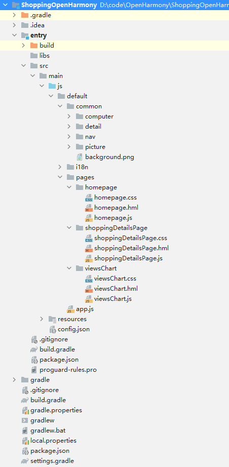

-   entry/src/main/js/default/common 文件夹存放一些公共的资源，比如图片。
-   entry/src/main/js/default/pages 文件夹存放页面布局，包含css、hml、js三类文件。
-   entry/src/main/config.json：配置文件。

# 4 构建主界面

主界面的效果图如下：

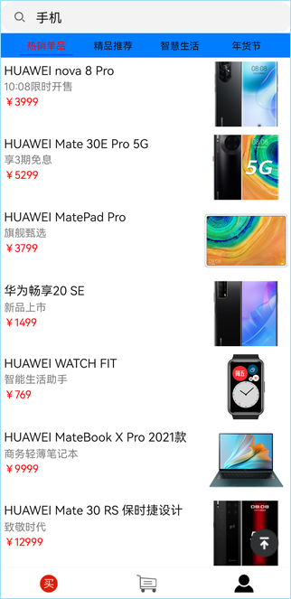

点击应用的底部的不同图标，页面会随之切换，被选中的页面图片变红，图片示例和代码如下：

 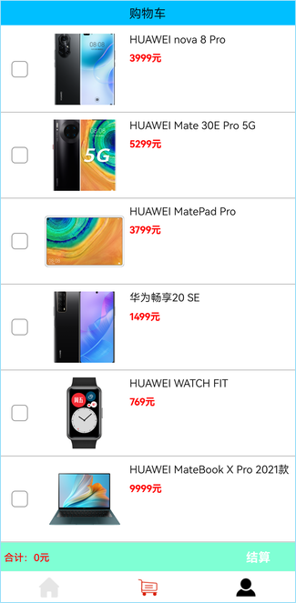 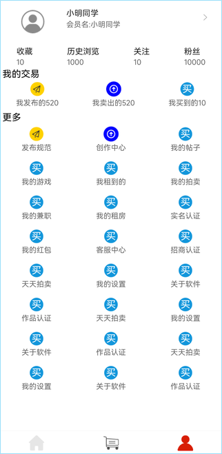

```
<div class="container-bottom-div">
    <image src="{{ icon.buys }}" class="container-bottom-div-image" @click="clickBuy">
    </image>
    <image src="{{ icon.shoppingCarts }}" class="container-bottom-div-image" @click="clickShoppingCart">
    </image>
    <image src="{{ icon.mys }}" class="container-bottom-div-image" @click="clickMy">
    </image>
</div>
```


# 5 构建商品列表页签

商品列表页签的效果图如下：

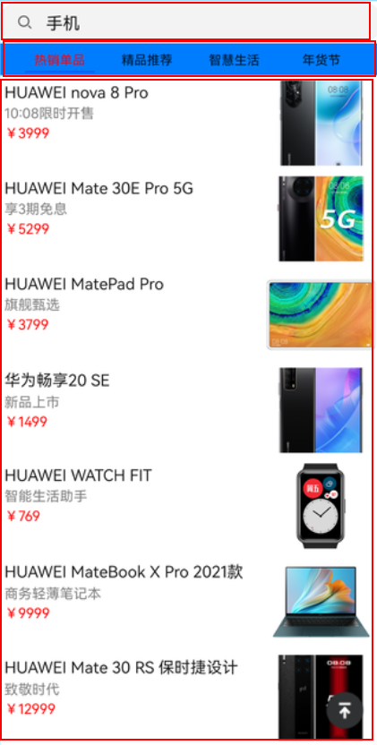

可以看出商品类标页签由搜索栏和下面的商品列表组成。

1. 搜索框组件（search）：用于提供用户搜索内容的输入区域，图片示例和代码如下：

   页面展示：

   

   ```
   <search hint="{{ pageWord.searchKeyWord }}" value="{{ pageWord.searchValue }}" focusable="true"
           @submit="submitColumn">
   </search>
   ```

2. 商品列表，页签容器组件（tabs）实现：

   <tabs\>的子组件（tab-bar）：用来展示tab的标签区。

   <tabs\>的子组件（tab-content）：用来展示tab的内容区。

   ```
   <tabs class="tabs" index="0" vertical="false" onchange="change">
       <tab-bar class="tab-bar" mode="fixed">
           <text class="tab-text" for="{{ item in titleList }}">{{ item }}
           </text>
       </tab-bar>
       <tab-content class="tab-content" scrollable="true">
           <div class="item-content" for="{{ item in contentList }}">
               <list class="todo-wrapper">
                   <list-item for="{{ allList }}">
                       <div class="margin-comm" @click="detailPage">
                           <div class="todo-total">
                               <text class="todo-title">
                                   {{ $item.title }}
                               </text>
                               <text class="todo-content">
                                   {{ $item.content }}
                               </text>
                               <text class="todo-price">
                                   <span>
                                       ￥
                                   </span>
                                   <span>
                                       {{ $item.price }}
                                   </span>
                               </text>
                           </div>
                           <div class="width-comm">
                               <image src="{{ $item.imgSrc }}" class="container-home-image">
                               </image>
                           </div>
                       </div>
                   </list-item>
               </list>
           </div>
       </tab-content>
   </tabs>
   ```

3. 页面路由跳转：用户点击商品浏览页面的任意商品，页面会跳转到商品详情页面：

   ```
   detailPage() {
     router.push({
       uri: 'pages/shoppingDetailsPage/shoppingDetailsPage'
     });
   }
   ```


# 6 构建购物车页签

购物车页面：用户将选中的商品加入购物车后，可以选中需要的商品进行结算，图片示例和代码如下：

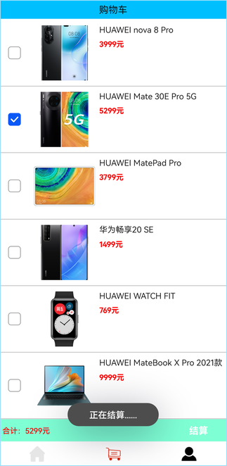

```
<div class="top-comm flex-direction-column">
    <div for="{{ latestList }}" class="flex-direction-column">
        <div class="container-shopping-list">
            <input type="checkbox" value="{{ $item.price }}" @change="addShopping">
            </input>
            <image src="{{ $item.imgSrc }}" class="container-shopping-list-image">
            </image>
            <div class="container-shopping-list-div">
                <text class="container-shopping-list-div-text">
                    {{ $item.title }}
                </text>
                <text class="container-shopping-list-div-texts">
                    <span>
                        {{ $item.price }}
                    </span>
                    <span>
                        元
                    </span>
                </text>
            </div>
        </div>
        <divider class="container-shopping-list-divider">
        </divider>
    </div>
</div>
```

# 7 构建“我的”页签

1. “我的”页面布局，图片示例和代码如下：

   

   ```
   <div class="container-my-deals">
       <text class="container-my-deals-text">
           {{ pageWord.myDeals }}
       </text>
       <div class="container-my-deals-div">
           <div class="container-my-deals-div-div" for="{{ transaction }}">
               <image src="{{ $item.src }}" class="container-my-image">
               </image>
               <text class="container-my-text">
                   {{ $item.title }}{{ $item.num }}
               </text>
           </div>
       </div>
   </div>
   ```

# 8 构建商品详情页面

1. 滑动容器（swiper）：用户可以在swiper组件上进行滑动 左右切换图片，或者3s自动滑动一次，图片示例和代码如下：

   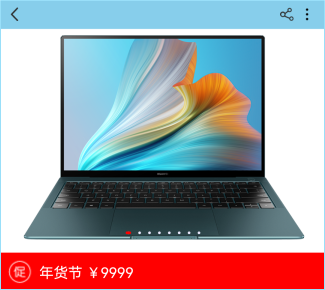

   ```
   <swiper class="swiper" id="swiper" index="0" autoplay="true" interval="3000" indicator="true" loop="true"
           digital="false">
       <div class="swiperContent" for="{{ item in swiperList }}">
           <image src="/common/computer/computer{{ item }}.png">
           </image>
       </div>
   </swiper>
   ```

2. 对样式进行动态双向绑定，可以修改“次日达”字体的颜色 ，图片示例和代码如下：

   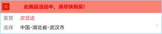 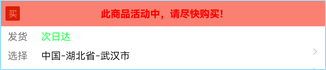 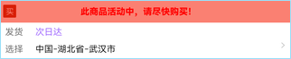 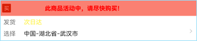

   ```
   <text class="content-column-size-mar" style="color : {{textColor}};" @click="changeColor">{{pageInfo.nextDayReach}}</text>
   
   export default {
       data: {
           textColor: '#FF3536',
       }
   }
   ```

3. 点击详情页右上角的图标会展示menu菜单，图片示例和代码如下：

   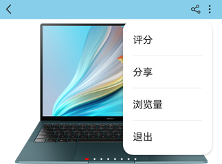

   ```
   <menu id="apiMenu" @selected="onMenuSelected">    <option value="Item-1">        {{ pageInfo.scoring }}    </option>    <option value="Item-2">        {{ pageInfo.sharing }}    </option>    <option value="Item-3">        {{ pageInfo.views }}    </option>    <option value="Item-4">        {{ pageInfo.exit }}    </option></menu>
   ```

4. 点击menu菜单的“浏览量”，跳转到浏览量页面：chart组件（曲线图可以实时动态更新数据），图片示例和代码如下：

   

   ```
   <stack class="chart-region">    <image class="chart-background" src="common/background.png"></image>    <chart class="chart-data" type="line" ref="lineChart" options="{{lineOps}}" datasets="{{lineData}}"></chart></stack>
   ```

5. 点击立即抢购会弹出一个含有进度条（progress）的弹框 ，图片示例和代码如下：

   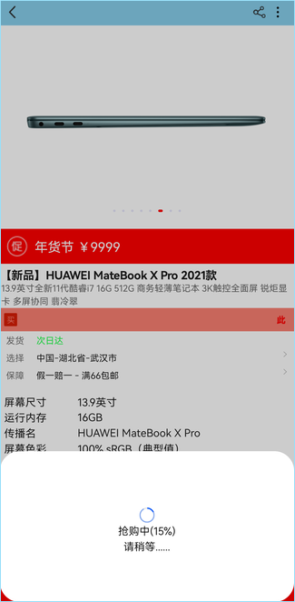

   ```
   <progress class="min-progress" type="scale-ring" percent="{{ progress.percent }}"          secondarypercent="{{ progress.secondaryPercent }}"></progress>
   ```


# 9 恭喜您<a name="ZH-CN_TOPIC_0000001160885234"></a>

目前你已经成功完成了Codelab并且学到了：

-   如何使用OpenHarmony ArkUI常用组件。
-   如何实现各页面之间的跳转。

