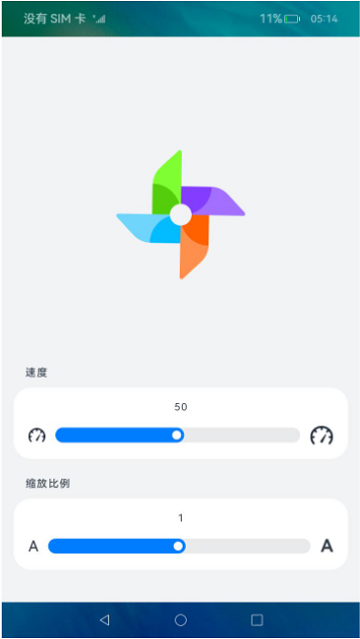

# slider组件的使用（JS）

## 介绍

本篇Codelab主要介绍slider滑动条组件的使用。如图所示拖动对应滑动条调节风车的旋转速度以及缩放比例。


### 相关概念

-   [slider组件](https://gitcode.com/openharmony/docs/blob/master/zh-cn/application-dev/reference/apis-arkui/arkui-js/js-components-basic-slider.md)：滑动条组件，通常用于快速调节设置值，如音量调节、亮度调节等应用场景。

## 环境搭建

### 软件要求

-   [DevEco Studio](https://gitcode.com/openharmony/docs/blob/master/zh-cn/application-dev/quick-start/start-overview.md#%E5%B7%A5%E5%85%B7%E5%87%86%E5%A4%87)版本：DevEco Studio 3.1 Release及以上版本。
-   OpenHarmony SDK版本：API version 9及以上版本。

### 硬件要求

-   开发板类型：[润和RK3568开发板](https://gitcode.com/openharmony/docs/blob/master/zh-cn/device-dev/quick-start/quickstart-appendix-rk3568.md)。
-   OpenHarmony系统：3.2 Release及以上版本。

### 环境搭建

完成本篇Codelab我们首先要完成开发环境的搭建，本示例以**RK3568**开发板为例，参照以下步骤进行：

1. [获取OpenHarmony系统版本](https://gitcode.com/openharmony/docs/blob/master/zh-cn/device-dev/get-code/sourcecode-acquire.md#%E8%8E%B7%E5%8F%96%E6%96%B9%E5%BC%8F3%E4%BB%8E%E9%95%9C%E5%83%8F%E7%AB%99%E7%82%B9%E8%8E%B7%E5%8F%96)：标准系统解决方案（二进制）。以3.2 Release版本为例：

   

2. 搭建烧录环境。

   1.  [完成DevEco Device Tool的安装](https://gitcode.com/openharmony/docs/blob/master/zh-cn/device-dev/quick-start/quickstart-ide-env-win.md)
   2.  [完成RK3568开发板的烧录](https://gitcode.com/openharmony/docs/blob/master/zh-cn/device-dev/quick-start/quickstart-ide-3568-burn.md)

3. 搭建开发环境。

   1.  开始前请参考[工具准备](https://gitcode.com/openharmony/docs/blob/master/zh-cn/application-dev/quick-start/start-overview.md#%E5%B7%A5%E5%85%B7%E5%87%86%E5%A4%87)，完成DevEco Studio的安装和开发环境配置。
   2.  开发环境配置完成后，请参考[使用工程向导](https://gitcode.com/openharmony/docs/blob/master/zh-cn/application-dev/quick-start/start-with-ets-stage.md#创建ets工程)创建工程（模板选择“Empty Ability”）。
   3.  工程创建完成后，选择使用[真机进行调测](https://gitcode.com/openharmony/docs/blob/master/zh-cn/application-dev/quick-start/start-with-ets-stage.md#使用真机运行应用)。

## 代码结构解读

本篇Codelab只对核心代码进行讲解，对于完整代码，我们会在gitcode中提供。

```
├──entry/src/main/js                          // 代码区
│  └──MainAbility
│     ├──common
│     │  ├──constants
│     │  │  └──constants.js                   // 常量定义文件
│     │  └──images
│     │     ├──ic_speed.png                   // 速度标识图片
│     │     └──ic_windmill.png                // 风车图片
│     ├──i18n
│     │  ├──en-US.json                        // 英文国际化
│     │  └──zh-CN.json                        // 中文国际化
│     ├──pages
│     │   └──index
│     │     ├──index.css                      // 界面样式
│     │     ├──index.hml                      // 主界面
│     │     └──index.js                       // slider组件事件逻辑
│     └───app.js                              // 程序入口
└──entry/src/main/resource                    // 应用静态资源目录
```

## 页面布局

界面主要由上方风车图片展示区域及下方滑动条功能区域两部分组成，滑动条功能区域包含调节旋转速度的滑动条组件和调节缩放比例的滑动条组件。



### 图片区域

使用image组件加载示例图片，src属性标识图片路径。transform: scale控制图片大小，animation-duration动画样式用来定义图形旋转一周所用的时间。本篇Codelab设置图片缩放起始倍数为1，旋转一周需要的默认时间为5000ms。

```html
<!-- index.hml -->
<div class="top-block">
    <div class="image-block" style="transform: scale({{ imageSize }});">
        <image class="image-show" src="{{ imgUrl }}" style="animation-duration: {{ animationDuration }}; "/>
    </div>    
</div>

```
```js
// index.js
export default {
  data: {
    imgUrl: Constants.IMG_URL,
    animationDuration: Constants.ANIMATION_DURATION,
    imageSize: Constants.INIT_IMAGE_SIZE,
    ...
  }
};

// constants.js
export default class Constants {
  static IMG_URL = '/common/images/ic_windmill.png';
  static INIT_IMAGE_SIZE = 1;
  static ANIMATION_DURATION = '5000ms';
  ...
};
```

### 滑动条功能区域

创建两个slider组件实现控制风车的转动速度以及风车缩放的大小。配置slider组件最大进度值为100，最小进度值为1，初始进度值为50，滑动条样式设置为滑块在滑杆内inset。分别为两个组件添加事件changeSpeed以及changeSize，用于处理滑块滑动事件。

```html
<!-- index.hml -->
<div class="bottom-block">
    ...
    <div class="slider-block">
        <image class="speed-slow-img" src="{{ speedImg }}"></image>
        <slider min="{{ minSpeed }}" max="{{ maxSpeed }}" value="{{ speed }}" onchange="changeSpeed" mode="inset"></slider>
        <image class="speed-fast-img" src="{{ speedImg }}"></image>
    </div>
    ...
    <div class="slider-block">
        <text class="text-small">A</text>
            <slider min="{{ minSize }}" max="{{ maxSize }}" value="{{ size }}" onchange="changeSize" mode="inset"></slider>
        <text class="text-big">A</text>
    </div>
</div>
```

## 风车旋转效果

实现风车旋转的动画效果需要在加载风车图片的image组件上配置如下样式：

-   animation-name：设置动画执行的操作。
-   animation-iteration-count：定义动画播放的次数。
-   animation-timing-function：描述动画执行的速度曲线，使动画更加平滑。

```css
/* index.css */
/* 风车图片布局 */
.image-show {
    /* 动画执行的操作 */
    animation-name: Go;

    /* 动画播放的次数：无限 */
    animation-iteration-count: infinite;

    /* 动画匀速播放 */
    animation-timing-function: linear;
}

/* 图片旋转角度：0°到360° */
@keyframes Go {
    from {
        transform: rotate(0deg);
    }

    to {
        transform: rotate(360deg);
    }
}
```

## 滑动条调整功能

移动控制速度的slider组件滑块时，触发slider组件事件。事件类型为end或click时，表示滑动结束或点击滑动条的某处，此时slider组件的进度值停止改变。获取当前进度值计算动画持续时长数值，使用计算结果更新动画播放时间。

```js
// constants.js
// 动画最长持续时间
static MAX_ANIMATION_DURATION = 10000;

// 动画持续时间倍数
static ANIMATION_DURATION_MULTIPLE = 95;

// 毫秒缩写
static MILLISECOND_ABBREVIATION = "ms";

// index.js
export default {
  /**
   * 修改转速
   * @param event : slider组件事件
   */
  changeSpeed(event) {
    if (event.mode === Constants.SLIDER_EVENT_MODE_END || event.mode === Constants.SLIDER_EVENT_MODE_CLICK) {
      this.speed = event.value;

      // 计算动画播放时间
      this.animationDurationNum = Constants.MAX_ANIMATION_DURATION -
        (event.value * Constants.ANIMATION_DURATION_MULTIPLE);
      this.animationDuration = this.animationDurationNum + Constants.MILLISECOND_ABBREVIATION;
    }
  }
};
```

移动控制缩放比例的slider组件滑块时，触发slider组件事件。事件类型为end或click时，表示滑动结束或点击滑动条的某处，此时slider组件的进度值停止改变。获取当前进度值计算缩放比例，计算结果保留2位小数。

```js
// constants.js
// 缩放比例计算数值
static HALF_HUNDRED = 50;

// 最小缩放比例 
static MIN_IMAGE_SIZE = 0.1;

// index.js
export default {
  /**
   * 修改缩放比例
   * @param event : slider组件事件
   */
  changeSize(event) {
    if (event.mode === Constants.SLIDER_EVENT_MODE_END || event.mode === Constants.SLIDER_EVENT_MODE_CLICK) {
      this.size = event.value;
      // 图片缩放比例范围：0.1到2
      this.imageSize = (this.size / Constants.HALF_HUNDRED) < Constants.MIN_IMAGE_SIZE ?
        Constants.MIN_IMAGE_SIZE : (this.size / Constants.HALF_HUNDRED);
      this.imageSize = this.imageSize.toFixed(2);
    }
  }
};
```

## 总结

您已经完成了本次Codelab的学习，并了解到以下知识点：

1.  image组件旋转动画效果的实现。
2.  slider组件的使用。

