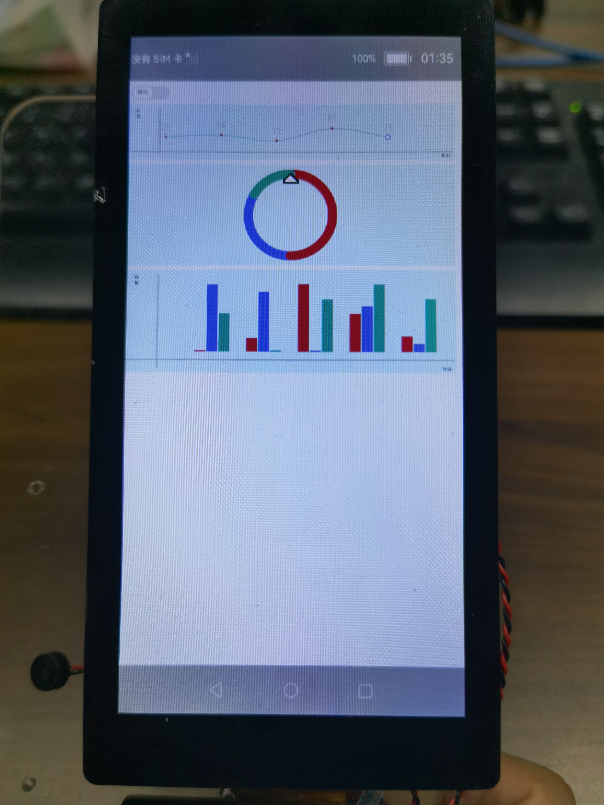

# 1.介绍

OpenHarmony的ArkUI（基于JS扩展的类Web开发范式）提供了常用的接口和组件，开发者可以根据实际场景和开发需求，选用不同的组件和接口，本篇Codelab，我们将一起开启ArkUI（基于JS扩展的类Web开发范式）基础组件的学习之路。本教程是基础组件之switch、chart组件的使用。

在本教程中，我们将会通过一个简单的样例，将chart组件和switch组件进行结合，实现线形图、量规图、柱状图不同效果的展示，并通过switch切换chart组件数据的动静态显示。效果如下图所示，开发者还可以根据自己的需求添加不同的效果。



## 应用场景

-   运动健康、办公类应用，数据可视化等场景。

# 2.相关概念

[switch组件](https://gitee.com/openharmony/docs/blob/master/zh-cn/application-dev/reference/arkui-js/js-components-basic-switch.md)
：开关选择器，通过开关，开启或关闭某个功能。

[chart组件](https://gitee.com/openharmony/docs/blob/master/zh-cn/application-dev/reference/arkui-js/js-components-basic-chart.md)
：图表组件，用于呈现线形图、柱状图、量规图界面。

[div组件](https://gitee.com/openharmony/docs/blob/master/zh-cn/application-dev/reference/arkui-js/js-components-container-div.md)
：基础容器组件，用作页面结构的根节点或将内容进行分组。

[text组件](https://gitee.com/openharmony/docs/blob/master/zh-cn/application-dev/reference/arkui-js/js-components-basic-text.md)
：文本组件，用于呈现一段信息。

# 3.搭建OpenHarmony环境

完成本篇Codelab我们首先要完成开发环境的搭建，本示例以**Hi3516DV300**开发板为例，参照以下步骤进行：

1. [获取OpenHarmony系统版本](https://gitee.com/openharmony/docs/blob/master/zh-cn/device-dev/get-code/sourcecode-acquire.md#%E8%8E%B7%E5%8F%96%E6%96%B9%E5%BC%8F3%E4%BB%8E%E9%95%9C%E5%83%8F%E7%AB%99%E7%82%B9%E8%8E%B7%E5%8F%96)：标准系统解决方案（二进制）

   以3.0版本为例：

   

2. 搭建烧录环境

   1.  [完成DevEco Device Tool的安装](https://gitee.com/openharmony/docs/blob/master/zh-cn/device-dev/quick-start/quickstart-standard-env-setup.md)

   2.  [完成Hi3516开发板的烧录](https://gitee.com/openharmony/docs/blob/master/zh-cn/device-dev/quick-start/quickstart-lite-steps-hi3516-burn.md)

3. 搭建开发环境

   1. 开始前请参考[工具准备](https://gitee.com/openharmony/docs/blob/master/zh-cn/application-dev/quick-start/start-overview.md#%E5%B7%A5%E5%85%B7%E5%87%86%E5%A4%87) ，完成DevEco Studio的安装和开发环境配置。
   2. 开发环境配置完成后，请参考[使用工程向导](https://gitee.com/openharmony/docs/blob/master/zh-cn/application-dev/quick-start/start-with-js.md#%E5%88%9B%E5%BB%BAjs%E5%B7%A5%E7%A8%8B) 创建工程（模板选择“Empty Ability”），选择JS或者eTS语言开发。
   3. 工程创建完成后，选择使用[真机进行调测](https://gitee.com/openharmony/docs/blob/master/zh-cn/application-dev/quick-start/start-with-ets.md#%E4%BD%BF%E7%94%A8%E7%9C%9F%E6%9C%BA%E8%BF%90%E8%A1%8C%E5%BA%94%E7%94%A8) 。


# 4.将组件添加到布局文件中

在这个任务中，我们需要完成程序页面的新建和设计，并将程序使用到的switch、chart组件添加到布局文件index.hml中，在完成新建项目后，我们看到系统自动创建了pages.index目录，在这个目录下，我们找到index.hml文件，开始进行页面设计。

打开index.hml文件，默认代码使用div组件和text组件来共同呈现文本显示的效果，具体代码如下：

```
<div class="container">
    <text class="title">
        {{ $t('strings.hello') }} {{ title }}
    </text>
</div>
```

## switch组件

开发者可以删除index.hml中的默认代码，根据下述步骤一起开发，整个布局文件使用div组件将页面进行划分，定义switch组件有动态和静态两种切换方式，页面如下：

 

```
<div class="switch-block">
	<switch class="switch"
			showtext="{{ showText }}"
			texton="{{ textOn }}"
			textoff="{{ textOff }}"
			allow-scale="{{allowScale}}"
			onchange="change">
        </switch>
</div>
```

## chart组件

添加chart组件呈现线形图、量规图、柱状图三种类型的图表，页面如下：


```
<div class="chart-block">
	<text class="text-speed">利润</text>
	<chart class="chart-data" type="line" ref="linechart" options="{{lineOps}}" datasets="{{lineData}}"></chart>
	<text class="text-time">年份</text>
</div>
<div class="gauge-block">
	<chart class="data-gauge" type="gauge" percent = "{{percent}}"></chart>
</div>
<div class="bar-block">
	<text class="text-speed">销量</text>
	<chart class="data-bar" type="bar" id="bar-chart" options="{{barOps}}" datasets="{{barData}}"></chart>
	<text class="text-time">年份</text>
</div>
```

# 5.为页面设计样式

在这个任务中，我们将一起为页面添加样式，上面所有的组件，我们都定义了class属性，它对应的样式都定义在index.css中，有关css更多的知识可以参考[CSS语法参考](https://gitee.com/openharmony/docs/blob/OpenHarmony-3.0-LTS/zh-cn/application-dev/js-reference/js-framework-syntax-css.md)。

## switch组件部分样式

这部分定义了switch-block容器的样式，以及switch组件的样式。删掉默认代码后，在index.css中先添加如下代码：

```
.switch-block {
    width: 98%;
    height: 50px;
}
.switch {
    text-padding: 10px; /* texton/textoff中最长文本两侧距离滑块边界的距离 */
    font-size: 12px;
    texton-color: #5F5F5F; /* 选中字体颜色 */ 
    textoff-color: #707070; /* 未选中字体颜色 */
}
```

## chart组件部分样式

这部分定义了chart组件线形图、量规图、柱状图三种类型的样式，在index.css中继续添加如下代码：

```
.chart-block, .gauge-block, .bar-block {
    position: relative;
    width: 98%;
    border-radius: 5px;
    background-color: #E3F8F9;
}
.text-speed{
    position: absolute;
    top: 10px;
    left: 20px;
    width: 10px;
    font-size: 10px;
}
.chart-data {
    margin: 10px 5px 10px;
    width: 100%;
    height: 100px;
}
.text-time {
    position: absolute;
    font-size: 10px;
    bottom: 2px;
    right: 10px;
}
.gauge-block, .bar-block {
    margin-top: 10px;
}
.data-gauge{
    width: 200%;
    height: 200px;
    margin: 10px 0 10px; /* 刻度条的宽度 */
    start-angle: 0; /* 起始角度 */
    total-angle: 360; /* 最大角度 */
    stroke-width: 20px;
    colors: #CF0A2C, #8477DF, #17A98E; /* 颜色 */
    weights: 3, 2, 1; /* 颜色占比权重 */
}
.data-bar {
    width: 100%;
    height: 200px;
    margin: 10px 5px 10px;
}
```

# 6.为组件添加响应事件

## 数据定义

在之前的步骤中，我们已经提到了布局中组件初始值的定义，在index.js中首先添加如下代码：

```
export default {
  data: {
    interval: null, // 定时器对象
    showText: true, // 是否显示文本
    textOn: '动态',
    textOff: '静态',
    allowScale: true, // 文本尺寸跟随系统设置字体缩放
    dataLength: 5, // 数据长度
    barGroup: 3, // 柱状图组数

    lineData: null, // 线形图数据
    lineOps: { // 线形图样式
      xAxis: {
        min: 0,
        max: 5,
        display: true
      },
      yAxis: {
        min: 0,
        max: 100,
        display: true
      },
      series: {
        lineStyle: {
          width: '1px',
          smooth: true
        },
        headPoint: {
          shape: 'circle',
          size: 10,
          strokeWidth: 2,
          fillColor: '#ffffff',
          strokeColor: '#8477DF',
          display: true
        },
        loop: {
          margin: 2
        }
      }
    },

    percent: 100, // 量规图进度

    barData: [ // 柱状图数据
      {
        fillColor: '#CF0A2C',
        data: [2, 20, 99, 56, 23]
      },
      {
        fillColor: '#8477DF',
        data: [99, 88, 2, 67, 12]
      },
      {
        fillColor: '#17A98E',
        data: [56, 2, 77, 99, 78]
      }
    ],
    barOps: { // 柱状图样式
      xAxis: {
        min: 0,
        max: 20,
        display: true,
        axisTick: 5
      },
      yAxis: {
        min: 0,
        max: 100,
        display: true
      }
    }
  },
}
```

这些值的具体含义，可以参考如下表格：

<table><thead align="left"><tr id="row7799183932719"><th class="cellrowborder" valign="top" width="50%" id="mcps1.1.3.1.1"><p id="p13799163942713"><a name="p13799163942713"></a><a name="p13799163942713"></a>key</p>
</th>
<th class="cellrowborder" valign="top" width="50%" id="mcps1.1.3.1.2"><p id="p1979920394275"><a name="p1979920394275"></a><a name="p1979920394275"></a>description</p>
</th>
</tr>
</thead>
<tbody><tr id="row167993390271"><td class="cellrowborder" valign="top" width="50%" headers="mcps1.1.3.1.1 "><p id="p1456225735310"><a name="p1456225735310"></a><a name="p1456225735310"></a>interval</p>
</td>
<td class="cellrowborder" valign="top" width="50%" headers="mcps1.1.3.1.2 "><p id="p16800139132713"><a name="p16800139132713"></a><a name="p16800139132713"></a>定时器对象。</p>
</td>
</tr>
<tr id="row7800173942712"><td class="cellrowborder" valign="top" width="50%" headers="mcps1.1.3.1.1 "><p id="p5602529143018"><a name="p5602529143018"></a><a name="p5602529143018"></a>showText</p>
</td>
<td class="cellrowborder" valign="top" width="50%" headers="mcps1.1.3.1.2 "><p id="p180003913276"><a name="p180003913276"></a><a name="p180003913276"></a>switch是否显示文本。</p>
</td>
</tr>
<tr id="row3800163922714"><td class="cellrowborder" valign="top" width="50%" headers="mcps1.1.3.1.1 "><p id="p208163307300"><a name="p208163307300"></a><a name="p208163307300"></a>textOn</p>
</td>
<td class="cellrowborder" valign="top" width="50%" headers="mcps1.1.3.1.2 "><p id="p16800103917279"><a name="p16800103917279"></a><a name="p16800103917279"></a>switch打开时显示内容。</p>
</td>
</tr>
<tr id="row880093915275"><td class="cellrowborder" valign="top" width="50%" headers="mcps1.1.3.1.1 "><p id="p19440103863010"><a name="p19440103863010"></a><a name="p19440103863010"></a>textOff</p>
</td>
<td class="cellrowborder" valign="top" width="50%" headers="mcps1.1.3.1.2 "><p id="p1933474117350"><a name="p1933474117350"></a><a name="p1933474117350"></a>switch关闭时显示内容。</p>
</td>
</tr>
<tr id="row280083914277"><td class="cellrowborder" valign="top" width="50%" headers="mcps1.1.3.1.1 "><p id="p99687555389"><a name="p99687555389"></a><a name="p99687555389"></a>dataLength</p>
</td>
<td class="cellrowborder" valign="top" width="50%" headers="mcps1.1.3.1.2 "><p id="p5800639122712"><a name="p5800639122712"></a><a name="p5800639122712"></a>线形图、柱状图数据长度。</p>
</td>
</tr>
<tr id="row68001939122713"><td class="cellrowborder" valign="top" width="50%" headers="mcps1.1.3.1.1 "><p id="p20436143820308"><a name="p20436143820308"></a><a name="p20436143820308"></a>barGroup</p>
</td>
<td class="cellrowborder" valign="top" width="50%" headers="mcps1.1.3.1.2 "><p id="p1969117263561"><a name="p1969117263561"></a><a name="p1969117263561"></a>柱状图组数。</p>
</td>
</tr>
<tr id="row6800539192714"><td class="cellrowborder" valign="top" width="50%" headers="mcps1.1.3.1.1 "><p id="p1943411388302"><a name="p1943411388302"></a><a name="p1943411388302"></a>lineData</p>
</td>
<td class="cellrowborder" valign="top" width="50%" headers="mcps1.1.3.1.2 "><p id="p380083911278"><a name="p380083911278"></a><a name="p380083911278"></a>线形图数据。</p>
</td>
</tr>
<tr id="row18006395275"><td class="cellrowborder" valign="top" width="50%" headers="mcps1.1.3.1.1 "><p id="p17787193573018"><a name="p17787193573018"></a><a name="p17787193573018"></a>lineOps</p>
</td>
<td class="cellrowborder" valign="top" width="50%" headers="mcps1.1.3.1.2 "><p id="p19785173511303"><a name="p19785173511303"></a><a name="p19785173511303"></a>线形图样式。</p>
</td>
</tr>
<tr id="row380073992718"><td class="cellrowborder" valign="top" width="50%" headers="mcps1.1.3.1.1 "><p id="p197821535143012"><a name="p197821535143012"></a><a name="p197821535143012"></a>percent</p>
</td>
<td class="cellrowborder" valign="top" width="50%" headers="mcps1.1.3.1.2 "><p id="p474283543011"><a name="p474283543011"></a><a name="p474283543011"></a>量规图进度。</p>
</td>
</tr>
<tr id="row208222045164220"><td class="cellrowborder" valign="top" width="50%" headers="mcps1.1.3.1.1 "><p id="p98239454426"><a name="p98239454426"></a><a name="p98239454426"></a>barData</p>
</td>
<td class="cellrowborder" valign="top" width="50%" headers="mcps1.1.3.1.2 "><p id="p15823545104213"><a name="p15823545104213"></a><a name="p15823545104213"></a>柱状图数据。</p>
</td>
</tr>
<tr id="row4919449194214"><td class="cellrowborder" valign="top" width="50%" headers="mcps1.1.3.1.1 "><p id="p14919154954218"><a name="p14919154954218"></a><a name="p14919154954218"></a>barOps</p>
</td>
<td class="cellrowborder" valign="top" width="50%" headers="mcps1.1.3.1.2 "><p id="p13920204914428"><a name="p13920204914428"></a><a name="p13920204914428"></a>柱状图样式。</p>
</td>
</tr>
</tbody>
</table>


## 事件

接下来继续添加如下代码，当switch开关发生变化时，触发change事件设置chart图片数据静态或动态。静态时chart组件显示静态数据，动态时利用interval定时器动态随机生成数据并显示，在export default中的data对象后面添加代码如下：

```
// 初始化
onInit() {
	this.changeLine();
},
change(e) {
	if (e.checked) {
		this.interval = setInterval(() => {
			this.changeLine(); // 更新线形图数据
			this.changeGauge(); // 更新量规图数据
			this.changeBar(); // 更新柱状图数据
		}, 1000)
	} else {
		clearInterval(this.interval);
	}
},
// 更新线形图数据
changeLine() {
	var dataArray = [];
	for (var i = 0; i < this.dataLength; i++) {
		var nowValue = Math.floor(Math.random() * 99 + 1);
		var obj = {
			"value": nowValue, // Y坐标
			"description": nowValue + "", // 当前点的注释内容
			"textLocation": "top", // 注释内容位置
			"textColor": "#CDCACA", // 注释内容颜色
			"pointStyle": { // 节点形状
				"shape": "circle", // 形状
				"size": 5, // 形状大小
				"fillColor": "#CF0A2C", // 填充颜色
				"strokeColor": "#CF0A2C" // 边框颜色
			}
		};
		dataArray.push(obj);
	}
	this.lineData = [
		{
			strokeColor: '#17A98E', // 线的颜色
			data: dataArray,
			gradient: false,
		}
	]
},
// 更新量规图数据
changeGauge() {
	this.percent = parseInt(this.percent) >= 99 ? 0 : parseInt(this.percent) + 1;

},
// 更新柱状图数据
changeBar() {
	for (var i=0;i<this.barGroup;i++) {
		var dataArray = this.barData[i].data;
		for (var j=0;j<this.dataLength;j++) {
			dataArray[j] = Math.floor(Math.random() * 99 + 1);
		}
	}
	this.barData = this.barData.splice(0, this.barGroup + 1);
}
```

到此我们已经完成了所有的任务和代码的编写。

> **说明：** 
>样例中当我们设置switch为动态时，使用setInterval定时器，每秒动态生成数据展示。

# 7.恭喜你

在本篇Codelab中，我们主要为大家讲解了如下JS基础组件

-   switch
-   chart

通过一个代码示例，利用switch开关设置chart图形数据的动态变换，从布局、样式、响应事件三个层面，逐步为大家进行代码讲解，希望通过本教程，各位开发者可以对以上基础组件具有更深刻的认识。