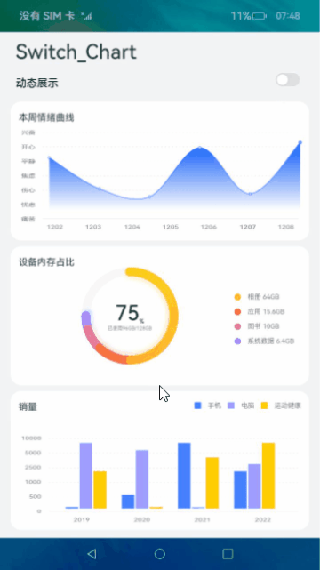
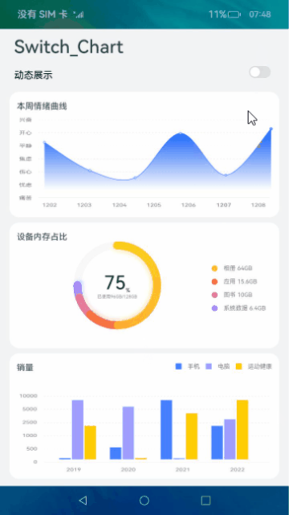

# switch、chart组件的使用（JS）

## 介绍
本篇Codelab基于switch组件和chart组件，实现线形图、占比图、柱状图，并通过switch切换chart组件数据的动静态显示。要求实现以下功能：

1.  实现静态数据可视化图表。
2.  打开开关，实现静态图切换为动态可视化图表。



### 相关概念

-   [switch组件](https://gitee.com/openharmony/docs/blob/master/zh-cn/application-dev/reference/arkui-js/js-components-basic-switch.md)：开关选择器，通过开关，开启或关闭某个功能。
-   [chart组件](https://gitee.com/openharmony/docs/blob/master/zh-cn/application-dev/reference/arkui-js/js-components-basic-chart.md)：图表组件，用于呈现线形图、占比图、柱状图界面。

## 环境搭建

### 软件要求

-   [DevEco Studio](https://gitee.com/openharmony/docs/blob/master/zh-cn/application-dev/quick-start/start-overview.md#%E5%B7%A5%E5%85%B7%E5%87%86%E5%A4%87)版本：DevEco Studio 3.1 Release及以上版本。
-   OpenHarmony SDK版本：API version 9及以上版本。

### 硬件要求

-   开发板类型：[润和RK3568开发板](https://gitee.com/openharmony/docs/blob/master/zh-cn/device-dev/quick-start/quickstart-appendix-rk3568.md)。
-   OpenHarmony系统：3.2 Release及以上版本。

### 环境搭建

完成本篇Codelab我们首先要完成开发环境的搭建，本示例以**RK3568**开发板为例，参照以下步骤进行：

1.  [获取OpenHarmony系统版本](https://gitee.com/openharmony/docs/blob/master/zh-cn/device-dev/get-code/sourcecode-acquire.md#%E8%8E%B7%E5%8F%96%E6%96%B9%E5%BC%8F3%E4%BB%8E%E9%95%9C%E5%83%8F%E7%AB%99%E7%82%B9%E8%8E%B7%E5%8F%96)：标准系统解决方案（二进制）。以3.2 Release版本为例：

    

2.  搭建烧录环境。
    1.  [完成DevEco Device Tool的安装](https://gitee.com/openharmony/docs/blob/master/zh-cn/device-dev/quick-start/quickstart-ide-env-win.md)
    2.  [完成RK3568开发板的烧录](https://gitee.com/openharmony/docs/blob/master/zh-cn/device-dev/quick-start/quickstart-ide-3568-burn.md)

3.  搭建开发环境。
    1.  开始前请参考[工具准备](https://gitee.com/openharmony/docs/blob/master/zh-cn/application-dev/quick-start/start-overview.md#%E5%B7%A5%E5%85%B7%E5%87%86%E5%A4%87)，完成DevEco Studio的安装和开发环境配置。
    2.  开发环境配置完成后，请参考[使用工程向导](https://gitee.com/openharmony/docs/blob/master/zh-cn/application-dev/quick-start/start-with-ets-stage.md#创建ets工程)创建工程（模板选择“Empty Ability”）。
    3.  工程创建完成后，选择使用[真机进行调测](https://gitee.com/openharmony/docs/blob/master/zh-cn/application-dev/quick-start/start-with-ets-stage.md#使用真机运行应用)。

## 代码结构解读

本篇Codelab只对核心代码进行讲解，对于完整代码，我们会在gitee中提供。

```
├──entry/src/main/js	     // 代码区
│  └──MainAbility
│     ├──common
│     │  └──images           // 图片资源
│     ├──i18n                // 国际化中英文
│     │  ├──en-US.json			
│     │  └──zh-CN.json			
│     ├──pages
│     │  └──index
│     │     ├──index.css     // 首页样式文件	
│     │     ├──index.hml     // 首页布局文件
│     │     └──index.js      // 首页业务处理文件
│     └──app.js              // 程序入口
└──entry/src/main/resources  // 应用资源目录
```
## 构建主界面

本章节将介绍应用主页面的实现，页面从上至下分为两个部分：

1.  使用switch组件实现切换按钮，用于控制chart组件数据的动静态显示。
2.  使用chart组件依次实现线形图、占比图、柱状图。



本应用使用div组件用作外层容器，嵌套text、chart、switch等基础组件，共同呈现图文显示的效果。

```html
<!-- index.hml -->
<div class="container">
    <!-- 自定义标题组件 -->
    <div class="switch-block">
        <text class="title">Switch_Chart</text>
        <text class="switch-info">{{ $t('strings.switchInfo') }}</text>
        <!-- switch按钮组件 -->
        <switch onchange="change"></switch>
    </div>
</div>
```

在线形图中，lineOps用于设置线形图参数，包括曲线的样式、端点样式等。lineData 为线形图的数据。

```html
<!-- index.hml -->
<div class="container">
    ....
    <!-- 线形图组件 -->
    <div class="chart-block">
        <stack class="stack-center">
            <image class="background-image" src="common/images/bg_png_line.png"></image>
            <!-- 线形图 -->
            <chart class="chart-data" type="line" ref="linechart" options="{{ lineOps }}" datasets="{{ lineData }}">
            </chart>
        </stack>
        <!-- 线形图标题 -->
        <text class="text-vertical">{{ $t('strings.lineTitle') }}</text>
    </div>
</div>
```

相对于线形图，占比图添加了自定义图例。其中rainBowData为占比图的数据。

```html
<!-- index.hml -->
<div class="container">
    ....
    <!-- 占比图组件 -->
    <div class="gauge-block">
        <div class='flex-row-center full-size'>
            <stack class="flex-row-center rainbow-size">
                <!-- 占比图组件 -->
                <chart class="data-gauge" type="rainbow" segments="{{ rainBowData }}" effects="true"
                        animationduration="2000"></chart>
                ...
            </stack>
            <div class='flex-column'>
                <!-- 自定义图例 -->    
                <div class="chart-legend-item">
                    <div class="chart-legend-icon rainbow-color-photo"></div>
                    <text class="chart-legend-text">{{ this.$t('strings.legendPhoto') }} 64GB</text>
                </div>
                ....
            </div>
        </div>
        <!-- 占比图标题 -->
        <text class="text-vertical">{{ $t('strings.rainBowTitle') }}</text>
    </div>
</div>
```

在柱状图中，barOps用于设置柱状图参数，barData为柱状图数据。

```html
<!-- index.hml -->
<div class="container">
    <div class="bar-block">
        <div class="flex-column full-size">
            <!-- 自定义图例 -->
            ...
            <stack class="full-size bar-height">
                <image class="background-image" src="common/images/bg_png_bar.png"></image>
                <!-- 柱状图 -->
                <chart class="data-bar" type="bar" id="bar-chart1" options="{{ barOps }}" datasets="{{ barData }}">  
                </chart>
            </stack>
        </div>
        <!-- 柱状图标题 -->
        <text class="text-vertical">{{ $t('strings.barTitle') }}</text>
    </div>
</div>
```
## 动态显示数据

在上一章节讲解了switch组件实现切换按钮，接下来实现switch按钮的点击事件。在回调方法中设置chart组件静态或动态显示，静态时chart组件显示静态数据，动态时利用interval定时器动态生成并显示随机数据。

```javascript
// index.js
export default {
  ...

  /**
   * switch按钮点击事件的回调方法
   */
  change(event) {
    if (event.checked) {
      // 线形图、柱状图数据定时器
      this.interval = setInterval(() => {
        // 更新线形图数据
        this.changeLine();
        // 更新柱状图数据
        this.changeBar();
      }, 1000);
      // 占比图数据定时器
      this.rainbowInterval = setInterval(() => {
        // 更新占比图数据
        this.changeGauge();
      }, 3000);
    } else {
      clearInterval(this.interval);
      clearInterval(this.rainbowInterval);
    }
  }
}
```

实现changeLine方法更新线形图数据。遍历所有数据，重新生成随机数并设置每个点的数据、形状、大小和颜色，最后为lineData重新赋值。

```javascript
// index.js
export default {
  ...
  /**
   * 更新线形图数据
   */
  changeLine() {
    const dataArray = [];
    for (let i = 0; i < this.dataLength; i++) {
      const nowValue = Math.floor(Math.random() * CommonConstants.LINE_RANDOM_MAX + 1);
      const obj = {
        // y轴的值
        'value': nowValue,
        'pointStyle': {
          // 点的形状
          'shape': 'circle',
          'size': CommonConstants.LINE_POINT_SIZE,
          'fillColor': '#FFFFFF',
          'strokeColor': '#0A59F7'
        }
      };
      dataArray.push(obj);
    }
    this.lineData = [
      {
        // 曲线颜色
        strokeColor: '#0A59F7',
        // 渐变填充颜色
        fillColor: '#0A59F7', 
        data: dataArray,
        gradient: true
      }
    ];
  }
}
```
实现changeGauge方法更新占比图数据，每三秒增长5%的数据。

```javascript
// index.js
export default {
  ...
  /**
   * 更新占比图数据
   */
  changeGauge() {
    const sysData = this.rainBowData[this.rainBowData.length - 2];
    sysData.value += addPercent;
    this.percent += addPercent;
    // 小数相加，保留一位小数
    this.used = (this.used * coefficients + addSize * coefficients) / coefficients;
    this.systemDataSize = (this.systemDataSize * coefficients + addSize * coefficients) / coefficients;
    // 数据总和到达100%后恢复初始数据
    if (sysData.value + CommonConstants.RAINBOW_OTHER_PERCENT > CommonConstants.RAINBOW_ALL_PERCENT) {
      sysData.value = CommonConstants.RAINBOW_SYSTEM_PERCENT;
      this.percent = CommonConstants.RAINBOW_USED_PERCENT;
      this.used = CommonConstants.RAINBOW_USED_SIZE;
      this.systemDataSize = CommonConstants.RAINBOW_SYSTEM_SIZE;
    }
    this.rainBowData = this.rainBowData.splice(0, this.rainBowData.length);
  },
}
```
实现changeBar方法更新柱状图数据。遍历柱状图所有的数据组，获取每组的数据后，再次遍历每组数据，生成随机数并为barData重新赋值。

```javascript
// index.js
export default {
  ...
  /**
   * 更新柱状图数据
   */
  changeBar() {
    for (let i = 0; i < this.barGroup; i++) {
      const dataArray = this.barData[i].data;
      for (let j = 0; j < this.dataLength; j++) {
        dataArray[j] = Math.floor(Math.random() * CommonConstants.BAR_RANDOM_MAX + 1);
      }
    }
    this.barData = this.barData.splice(0, this.barGroup + 1);
  }
}
```

## 总结

您已经完成了本次Codelab的学习，并了解到以下知识点：

1.  switch、chart等组件的使用。


