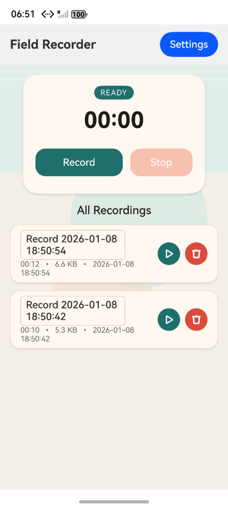
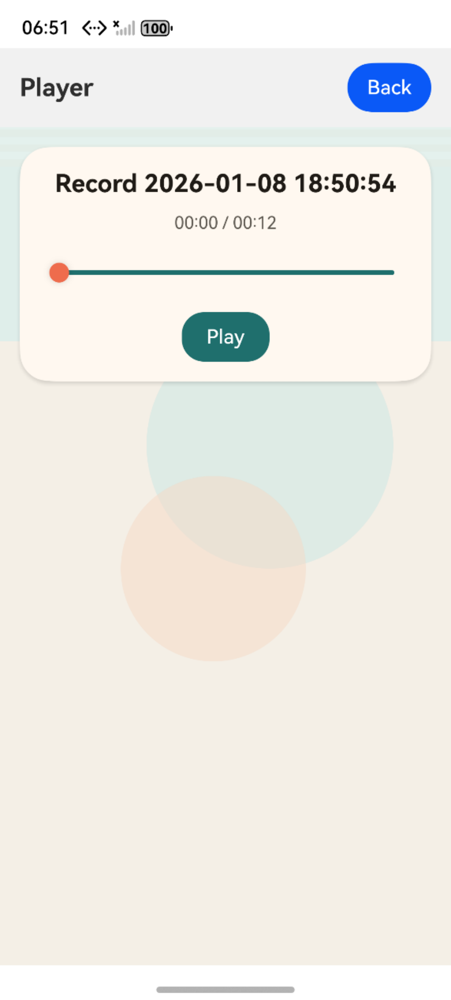

# 音频录制（ArkTS）

## 介绍

本篇Codelab使用ArkTS语言实现了一个简易的音频录制应用，主要包含以下功能：

1.  录制麦克风音频，支持开始、暂停、恢复、停止等录制控制，并可配置采样率、声道数、码率与格式。
2.  管理录音文件并进行回放：列表展示、重命名、删除，支持播放/暂停与进度拖拽。


### 相关概念

-   [AVRecorder](https://gitcode.com/openharmony/docs/blob/master/zh-cn/application-dev/media/using-avrecorder-for-recording.md)：用于采集麦克风音频并输出为媒体文件，支持参数化配置与录制控制。
-   [AVPlayer](https://gitcode.com/openharmony/docs/blob/master/zh-cn/application-dev/media/using-avplayer-for-playback.md)：用于音频回放，支持播放/暂停、进度跳转与状态回调。
-   [文件管理（@ohos.file.fs）](https://gitcode.com/openharmony/docs/blob/master/zh-cn/application-dev/reference/apis/js-apis-file-fs.md)：用于创建目录、管理录音文件与文件句柄。

### 约束与限制

1. 本示例仅支持在标准系统上运行，支持设备：Phone。
2. 本示例的 targetSdkVersion 为 6.0.0(20)（见 `build-profile.json5`）。
3. 录音列表当前为内存态，应用重启后不会自动扫描已有录音文件。

## 环境搭建

### 软件要求

-   [DevEco Studio](https://gitcode.com/openharmony/docs/blob/master/zh-cn/application-dev/quick-start/start-overview.md#%E5%B7%A5%E5%85%B7%E5%87%86%E5%A4%87)版本：支持 OpenHarmony SDK 6.0.0(20) 的版本。
-   OpenHarmony SDK版本：6.0.0(20)。

### 硬件要求

-   开发板类型：DAYU200 开发板（dayu200）。
-   OpenHarmony系统：与 SDK 6.0.0(20) 版本匹配的标准系统。

### 环境搭建

完成本篇Codelab我们首先要完成开发环境的搭建，本示例以**DAYU200**开发板为例，参照以下步骤进行：

1. [获取OpenHarmony系统版本](https://gitcode.com/openharmony/docs/blob/master/zh-cn/device-dev/get-code/sourcecode-acquire.md#%E8%8E%B7%E5%8F%96%E6%96%B9%E5%BC%8F3%E4%BB%8E%E9%95%9C%E5%83%8F%E7%AB%99%E7%82%B9%E8%8E%B7%E5%8F%96)：标准系统解决方案（二进制）。

2. 搭建烧录环境。

   1.  [完成DevEco Device Tool的安装](https://gitcode.com/openharmony/docs/blob/master/zh-cn/device-dev/quick-start/quickstart-ide-env-win.md)
   2.  完成DAYU200开发板的烧录（参考DAYU200开发板烧录指南）。

3. 搭建开发环境。

   1.  开始前请参考[工具准备](https://gitcode.com/openharmony/docs/blob/master/zh-cn/application-dev/quick-start/start-overview.md#%E5%B7%A5%E5%85%B7%E5%87%86%E5%A4%87)，完成DevEco Studio的安装和开发环境配置。
   2.  开发环境配置完成后，请参考[使用工程向导](https://gitcode.com/openharmony/docs/blob/master/zh-cn/application-dev/quick-start/start-with-ets-stage.md#%E5%88%9B%E5%BB%BAets%E5%B7%A5%E7%A8%8B)创建工程（模板选择“Empty Ability”）。
   3.  工程创建完成后，选择使用[真机进行调测](https://gitcode.com/openharmony/docs/blob/master/zh-cn/application-dev/quick-start/start-with-ets-stage.md#%E4%BD%BF%E7%94%A8%E7%9C%9F%E6%9C%BA%E8%BF%90%E8%A1%8C%E5%BA%94%E7%94%A8)。

## 代码结构解读

本篇Codelab只对核心代码进行讲解，对于完整代码，我们会在gitcode中提供。

```
├──entry/src/main/ets               // 代码区
│  ├──components                    // 组件：录音控制、列表卡片、对话框、提示等
│  │  ├──AudioItemCard.ets          // 录音条目卡片（重命名/播放/删除）
│  │  ├──ConfirmDialog.ets          // 删除确认弹窗
│  │  ├──RecorderControls.ets       // 录音控制按钮
│  │  ├──Toast.ets                  // 轻提示
│  │  ├──TopBar.ets                 // 顶部栏
│  │  └──WaveformView.ets           // 简易波形视图
│  ├──constants                     // 常量与默认配置
│  │  ├──Defaults.ets               // 默认录音参数
│  │  ├──Keys.ets                   // 存储键名
│  │  └──Paths.ets                  // 录音目录与扩展名
│  ├──entryability                  // Ability 生命周期管理
│  ├──entrybackupability            // 备份扩展能力
│  ├──model                         // 数据模型
│  │  ├──AudioRecord.ets            // 录音实体
│  │  ├──Enums.ets                  // 录音/播放状态
│  │  └──RecorderConfig.ets         // 录音配置
│  ├──pages                         // 页面
│  │  ├──RecordPage.ets             // 录音主页
│  │  ├──SettingsPage.ets           // 设置页
│  │  └──PlayerPage.ets             // 播放页
│  ├──services                      // 业务服务
│  │  ├──RecorderService.ets        // AVRecorder 录音封装
│  │  ├──PlayerService.ets          // AVPlayer 播放封装
│  │  └──PermissionService.ets      // 权限申请
│  ├──store                         // 状态管理
│  │  ├──RecordStore.ets            // 录音列表
│  │  ├──SettingsStore.ets          // 录音参数
│  │  └──AppState.ets               // 全局提示状态
│  └──utils                         // 工具类
│     ├──AppContext.ets             // 全局 Context
│     ├──FileUtils.ets              // 文件路径/删除/大小获取
│     ├──FormatUtils.ets            // 格式化函数
│     ├──IdUtils.ets                // ID 生成
│     ├──Logger.ets                 // 日志封装
│     ├──TimeUtils.ets              // 时间格式化
│     └──Validators.ets             // 参数校验
└──entry/src/main/resources          // 应用资源目录
```

## 实现音频录制

本案例使用录制管理类AVRecorder，实现应用内麦克风录音，并可进行开始、暂停、恢复、停止等操作。



使用AVRecorder进行录制，需要先创建实例并配置录音参数。在RecorderService中调用createAVRecorder并完成录制配置。

```typescript
// RecorderService.ets
async start(filePath: string, config: RecorderConfig): Promise<void> {
  this.recorder = await media.createAVRecorder();
  this.recorder.on('error', (err: Error) => {
    Logger.error('Recorder error', String(err));
    this.setStatus(RecordStatus.Idle);
  });
  const profile: media.AVRecorderProfile = {
    audioCodec: media.CodecMimeType.AUDIO_AAC,
    audioSampleRate: config.sampleRate,
    audioChannels: config.channels,
    audioBitrate: config.bitRate,
    fileFormat: media.ContainerFormatType.CFT_MPEG_4A
  };
  const pathConfig: media.AVRecorderConfig = {
    audioSourceType: media.AudioSourceType.AUDIO_SOURCE_TYPE_MIC,
    profile: profile,
    url: filePath
  };
  await this.recorder.prepare(pathConfig);
  await this.recorder.start();
  this.setStatus(RecordStatus.Recording);
}
```

当直接写入文件路径失败时，使用`fd://`方式进行回退录制。

```typescript
// RecorderService.ets
const file = fs.openSync(filePath, fs.OpenMode.READ_WRITE | fs.OpenMode.CREATE | fs.OpenMode.TRUNC);
const fdConfig: media.AVRecorderConfig = {
  audioSourceType: media.AudioSourceType.AUDIO_SOURCE_TYPE_MIC,
  profile: profile,
  url: `fd://${file.fd}`
};
await this.recorder.prepare(fdConfig);
await this.recorder.start();
```

录制过程中支持暂停与恢复，停止录制后会重置并释放资源。

```typescript
// RecorderService.ets
async pause(): Promise<void> {
  if (!this.recorder || this.status !== RecordStatus.Recording) {
    return;
  }
  await this.recorder.pause();
  this.setStatus(RecordStatus.Paused);
}

async resume(): Promise<void> {
  if (!this.recorder || this.status !== RecordStatus.Paused) {
    return;
  }
  await this.recorder.resume();
  this.setStatus(RecordStatus.Recording);
}

async stop(): Promise<void> {
  if (!this.recorder || this.status === RecordStatus.Idle) {
    return;
  }
  await this.recorder.stop();
  await this.recorder.reset();
  await this.recorder.release();
  this.recorder = undefined;
  this.setStatus(RecordStatus.Idle);
}
```

在RecordPage中，优先使用`filesDir/recordings`保存录音，当写入失败时回退到`cacheDir/recordings`。

```typescript
// RecordPage.ets
let path = buildRecordPath(context.filesDir, fileName);
try {
  await recorderService.start(path, config);
} catch (err) {
  const detail = String(err);
  if (detail.indexOf('13900002') >= 0 && context.cacheDir) {
    const fallbackPath = buildRecordPath(context.cacheDir, fileName);
    path = fallbackPath;
    await recorderService.start(path, config);
  } else {
    throw new Error(detail);
  }
}
```

同时在module.json5中声明录音所需权限，并通过PermissionService动态申请。

```json
"requestPermissions": [
  {
    "name": "ohos.permission.MICROPHONE"
  },
  {
    "name": "ohos.permission.WRITE_MEDIA"
  },
  {
    "name": "ohos.permission.READ_MEDIA"
  }
]
```

```typescript
// PermissionService.ets
async requestRecordingPermissions(context: Context): Promise<boolean> {
  const permissions: Permissions[] = [
    'ohos.permission.MICROPHONE',
    'ohos.permission.WRITE_MEDIA',
    'ohos.permission.READ_MEDIA'
  ];
  return new Promise((resolve) => {
    this.atManager.requestPermissionsFromUser(context, permissions, (err, result) => {
      if (err) {
        resolve(false);
        return;
      }
      const granted = result.authResults.every((value: number) => value === 0);
      resolve(granted);
    });
  });
}
```

## 实现录音回放

使用AVPlayer实现录音回放，监听播放状态与时间更新事件，并支持播放/暂停与进度拖拽。



```typescript
// PlayerService.ets
async play(path: string): Promise<void> {
  await this.release();
  const file = fs.openSync(path, fs.OpenMode.READ_ONLY);
  this.playingFile = file;
  this.player = await media.createAVPlayer();
  this.player.on('timeUpdate', (time: number) => {
    this.setPosition(time);
  });
  this.player.on('stateChange', (state: string) => {
    if (state === 'completed') {
      this.setStatus(PlayerStatus.Completed);
      this.safeClose();
    }
  });
  this.player.url = `fd://${file.fd}`;
  await this.player.prepare();
  this.setDuration(this.player.duration);
  await this.player.play();
  this.setStatus(PlayerStatus.Playing);
}
```

播放过程中可进行暂停、恢复与进度跳转。

```typescript
// PlayerService.ets
async pause(): Promise<void> {
  if (!this.player || this.status !== PlayerStatus.Playing) {
    return;
  }
  await this.player.pause();
  this.setStatus(PlayerStatus.Paused);
}

async resume(): Promise<void> {
  if (!this.player || this.status !== PlayerStatus.Paused) {
    return;
  }
  await this.player.play();
  this.setStatus(PlayerStatus.Playing);
}

async seek(positionMs: number): Promise<void> {
  if (!this.player) {
    return;
  }
  await this.player.seek(positionMs);
  this.setPosition(positionMs);
}
```

## 总结

您已经完成了本次Codelab的学习，并了解到以下知识点：

1. 使用AVRecorder录制麦克风音频并控制录制流程。
2. 使用AVPlayer完成录音回放与进度控制。
3. 使用@ohos.file.fs管理录音文件，并通过abilityAccessCtrl申请权限。


