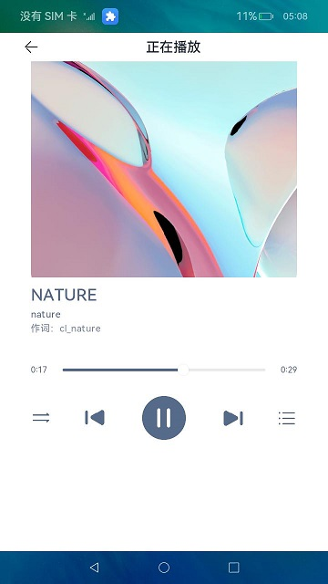
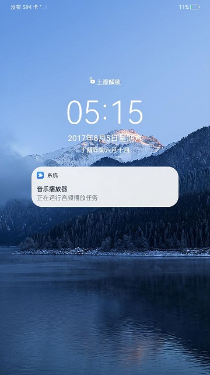

# 音乐播放器（ArkTS）

# 介绍

本篇Codelab使用ArkTS语言实现了一个简易的音乐播放器应用，主要包含以下功能：

1.  播放应用中的音频资源文件，并可进行上一曲、下一曲、播放、暂停、切换播放模式（顺序播放、单曲循环、随机播放）等操作。
2.  结合后台任务管理模块，实现熄屏后继续播放音频。


## 相关概念

-   [AVPlayer](https://gitee.com/openharmony/docs/blob/OpenHarmony-3.2-Release/zh-cn/application-dev/media/using-avplayer-for-playback.md)：AVPlayer主要工作是将Audio/Video媒体资源转码为可供渲染的图像和可听见的音频模拟信号，并通过输出设备进行播放，同时对播放任务进行管理，包括开始播放、暂停播放、停止播放、释放资源、设置音量、跳转播放位置、获取轨道信息等功能控制。
-   [后台任务管理](https://gitee.com/openharmony/docs/blob/OpenHarmony-3.2-Release/zh-cn/application-dev/task-management/background-task-overview.md)：针对应用或业务模块处于后台（无可见界面）时，有需要继续执行或者后续执行的业务，可基于业务类型，申请短时任务延迟挂起或者长时任务避免进入挂起状态；如后台播放音乐可使用长时任务避免进入挂起状态。

## 约束与限制

1. 本篇Codelab部分能力依赖于系统API，需下载full-SDK并替换DevEco Studio自动下载的public-SDK。具体操作可参考指南[《如何替换full-SDK》](https://gitee.com/openharmony/docs/blob/master/zh-cn/application-dev/faqs/full-sdk-switch-guide.md)。
2. 本篇Codelab使用的部分API仅系统应用可用，需要提升应用等级。具体可参考指南[《访问控制授权申请指导》](https://gitee.com/openharmony/docs/blob/master/zh-cn/application-dev/security/accesstoken-overview.md#%E5%BA%94%E7%94%A8apl%E7%AD%89%E7%BA%A7%E8%AF%B4%E6%98%8E)。

# 环境搭建

## 软件要求

-   [DevEco Studio](https://gitee.com/openharmony/docs/blob/master/zh-cn/application-dev/quick-start/start-overview.md#%E5%B7%A5%E5%85%B7%E5%87%86%E5%A4%87)版本：DevEco Studio 3.1 Release及以上版本。
-   OpenHarmony SDK版本：API version 9及以上版本。

## 硬件要求

-   开发板类型：[润和RK3568开发板](https://gitee.com/openharmony/docs/blob/master/zh-cn/device-dev/quick-start/quickstart-appendix-rk3568.md)。
-   OpenHarmony系统：3.2 Release及以上版本。

## 环境搭建

完成本篇Codelab我们首先要完成开发环境的搭建，本示例以**RK3568**开发板为例，参照以下步骤进行：

1. [获取OpenHarmony系统版本](https://gitee.com/openharmony/docs/blob/master/zh-cn/device-dev/get-code/sourcecode-acquire.md#%E8%8E%B7%E5%8F%96%E6%96%B9%E5%BC%8F3%E4%BB%8E%E9%95%9C%E5%83%8F%E7%AB%99%E7%82%B9%E8%8E%B7%E5%8F%96)：标准系统解决方案（二进制）。以3.2 Release版本为例：

   

2. 搭建烧录环境。

   1.  [完成DevEco Device Tool的安装](https://gitee.com/openharmony/docs/blob/master/zh-cn/device-dev/quick-start/quickstart-ide-env-win.md)
   2.  [完成RK3568开发板的烧录](https://gitee.com/openharmony/docs/blob/master/zh-cn/device-dev/quick-start/quickstart-ide-3568-burn.md)

3. 搭建开发环境。

   1.  开始前请参考[工具准备](https://gitee.com/openharmony/docs/blob/master/zh-cn/application-dev/quick-start/start-overview.md#%E5%B7%A5%E5%85%B7%E5%87%86%E5%A4%87)，完成DevEco Studio的安装和开发环境配置。
   2.  开发环境配置完成后，请参考[使用工程向导](https://gitee.com/openharmony/docs/blob/master/zh-cn/application-dev/quick-start/start-with-ets-stage.md#创建ets工程)创建工程（模板选择“Empty Ability”）。
   3.  工程创建完成后，选择使用[真机进行调测](https://gitee.com/openharmony/docs/blob/master/zh-cn/application-dev/quick-start/start-with-ets-stage.md#使用真机运行应用)。

# 代码结构解读

本篇Codelab只对核心代码进行讲解，对于完整代码，我们会在gitee中提供。

```
├──entry/src/main/ets               // 代码区
│  ├──common         
│  │  ├──bean							
│  │  │  └──MusicItem.ets           // 音乐类          
│  │  ├──constants                   
│  │  │  └──CommonConstants.ets     // 公共常量
│  │  └──utils
│  │     ├──AvSessionUtil.ets  	    // 媒体会话工具类	
│  │     ├──BackgroundTaskUtil.ets  // 后台任务工具类
│  │     ├──CommonUtil.ets  	    // 公共工具类	
│  │     ├──Logger.ets              // 日志类          
│  │     └──ResourceManagerUtil.ets // 资源管理工具类
│  ├──controller           
│  │  ├──AudioPlayerController.ets  // 音乐播放器控制器
│  │  └──PlayBarController.ets      // 播放栏控制器
│  ├──entryability                    
│  │  └──EntryAbility.ets           // 程序入口类
│  ├──pages                          
│  │  ├──AudioStartUp.ets           // 启动页
│  │  ├──MusicList.ets              // 歌单页
│  │  └──Play.ets                   // 播放页
│  ├──view                         
│  │  ├──MusicCardView.ets          // 播放卡片模块
│  │  ├──MusicView.ets              // 歌单音乐模块
│  │  ├──PlayBarView.ets            // 播放控制模块
│  │  ├──PlayListDialogView.ets     // 弹窗模块
│  │  ├──PlayListMusicView.ets      // 弹窗音乐模块
│  │  └──ProgressView.ets           // 播放页
│  └──viewmodel  
│     └──MusicViewModel.ets         // 歌单音乐模型
└──entry/src/main/resources         // 应用资源目录
```

# 实现音频播放

本案例使用播放管理类AVPlayer，实现应用内音频资源的播放，并可进行上一曲、下一曲、播放、暂停、切换播放模式（顺序播放、单曲循环、随机播放）等操作。




使用AVPlayer播放器，需要先创建一个AVPlayer实例。在AudioPlayerController中使用createAVPlayer方法完成音频播放实例的创建。

```typescript
// AudioPlayerController.ets
import media from '@ohos.multimedia.media';
...
export class AudioPlayerController {
  ...
  initAudioPlayer() {
    media.createAVPlayer((error, video) => {
      if (CommonUtil.isEmpty(video)) {
        this.avPlayer = video;
        Logger.error(TAG, `createAVPlayer fail, error: ${error}`);
      } else {
        this.avPlayer = video;
        Logger.info(TAG, 'createAVPlayer success');
      }
    });
  }
  ...  
}
```

根据业务需要设置监听事件，搭配播放场景使用。

```typescript
// AudioPlayerController.ets
// 注册AVPlayer回调函数
setEventCallBack(context) {
  if (CommonUtil.isEmpty(context)) {
    Logger.info(TAG, 'setEventCallBack fail,context is empty.');
    return;
  }
  // 状态变更回调函数
  this.avPlayer.on('stateChange', async (state) => {
    switch (state) {
      case StateEvent.IDLE: // 调用reset成功后触发此状态。
        ...
        break;
      case StateEvent.INITIALIZED: // 设置播放源触发此状态。
        ...
        break;
      case StateEvent.PREPARED:
        ...
        break;
      case StateEvent.PLAYING:
        ...
        break;
      case StateEvent.COMPLETED:
        ...
        break;
      default:
        Logger.error('unknown state: ' + state);
        break;
    }
  })
}
```

设置音频资源，AVPlayer进入initialized状态。在initialized状态回调中，调用prepare方法，准备播放，AVPlayer进入prepared状态。

```typescript
// AudioPlayerController.ets
// 设置播放源
this.avPlayer.fdSrc = src;
...
// 设置播放源后进入initialized状态
case stateEvent.INITIALIZED: 
  Logger.info(TAG, 'state initialized called');
  this.avPlayerState = playerState.INITIALIZED;
  this.avPlayer.prepare().then(() => {
    Logger.info(TAG, 'prepare success');
  }, (err) => {
    Logger.error(TAG, 'prepare failed,error message is: ' + err.message);
  })
  break;
```

AVPlayer进入prepared状态，可进行音频播控操作。包括播放play\(\)、跳转至指定位置播放seek\(\)、暂停pause\(\)、停止stop\(\)等操作。

```typescript
// AudioPlayerController.ets
case stateEvent.PREPARED:
  Logger.info(TAG, 'state prepared called');
  this.avPlayer.play();
  break;
```

切换歌曲播放时，需调用reset\(\)重置资源。此时AVPlayer重新进入idle状态，允许更换资源。

```typescript
// AudioPlayerController.ets
if (this.avPlayerState === playerState.INITIALIZED) {
  await this.avPlayer.reset();
  Logger.info(TAG, 'play reset success');
}
this.avPlayer.fdSrc = src;
```

> **说明：** 
>只能在initialized/prepared/playing/paused/complete/stopped/error状态调用reset\(\)。

调用release()销毁实例，AVPlayer进入released状态，退出播放。

```typescript
// AudioPlayerController.ets
async release() {
  Logger.info(TAG, 'audioPlayer release');
  if (typeof (this.avPlayer) !== 'undefined') {
    if (this.timeId === CommonConstants.DEFAULT_TIME_ID) {
      clearInterval(this.timeId);
    }
    await this.avPlayer.release();
    this.avPlayer = undefined;
  }
}
```

# 实现熄屏后播放

通过后台任务管理模块申请长时任务，可避免设备熄屏后，应用进入挂起状态。



首先在module.json5文件中配置长时任务权限和后台模式类型。

```json
"module": {
  ...
  "abilities": [
    {
      ...
      "backgroundModes": [
        "audioPlayback"
      ],
      ...
    }
  ],
  "requestPermissions": [
    {
      "name": "ohos.permission.KEEP_BACKGROUND_RUNNING"
    }
  ],
}
```

在播放音乐时，申请长时任务。这样在应用切换至后台或设备熄屏后，仍可以继续播放音乐。

```typescript
// BackgroundTaskUtil.ets
import wantAgent from '@ohos.app.ability.wantAgent';
import backgroundTaskManager from '@ohos.resourceschedule.backgroundTaskManager';
...
  public static startContinuousTask(context) {
    if (CommonUtil.isEmpty(context)) {
      Logger.info(TAG, 'startContinuousTask fail,context is empty.');
      return;
    }
    let wantAgentInfo = {
      // 点击通知后需要执行的动作
      wants: [
        {
          bundleName: CommonConstants.BUNDLE_NAME,
          abilityName: CommonConstants.ABILITY_NAME
        }
      ],
      // 单击通知后的动作类型
      operationType: wantAgent.OperationType.START_ABILITY,
      // 用户定义的私有属性
      requestCode: CommonConstants.BACKGROUND_REQUEST_CODE
    };

    // 通过WanAgent模块的方法获取WanAgent对象
    wantAgent.getWantAgent(wantAgentInfo).then((wantAgentObj) => {
      try {
        backgroundTaskManager.startBackgroundRunning(context, backgroundTaskManager.BackgroundMode.AUDIO_PLAYBACK,
          wantAgentObj).then(() => {
          Logger.info(TAG, 'startBackgroundRunning succeeded');
        }).catch((err) => {
          Logger.error(TAG, 'startBackgroundRunning failed Cause: ' + JSON.stringify(err));
        });
      } catch (error) {
        Logger.error(TAG, `startBackgroundRunning failed. code is ${error.code} message is ${error.message}`);
      }
    });
  }
...
```

暂停音乐播放，结束长时任务。

```typescript
// BackgroundTaskUtil.ets
import wantAgent from '@ohos.app.ability.wantAgent';
import backgroundTaskManager from '@ohos.resourceschedule.backgroundTaskManager';
...
  public static stopContinuousTask(context) {
    if (CommonUtil.isEmpty(context)) {
      Logger.info(TAG, 'stopContinuousTask fail,context is empty.');
      return;
    }
    try {
      backgroundTaskManager.stopBackgroundRunning(context).then(() => {
        Logger.info(TAG, 'stopBackgroundRunning succeeded');
      }).catch((err) => {
        Logger.error(TAG, 'stopBackgroundRunning failed Cause: ' + JSON.stringify(err));
      });
    } catch (error) {
      Logger.error(TAG, `stopBackgroundRunning failed. code is ${error.code} message is ${error.message}`);
    }
  }
...
```

# 总结

您已经完成了本次Codelab的学习，并了解到以下知识点：
1. 使用AVPlayer播放音频资源。
2. 通过后台任务管理模块backgroundTaskManager管理长时任务。


