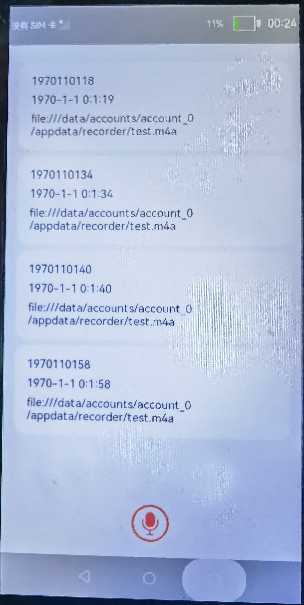
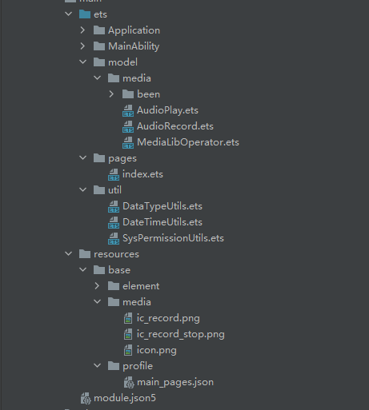

# 介绍

本教程为您展示如何使用OpenHarmony的媒体组件AudioRecorder收录当前音频，并使用AudioPlayer播放已收录的音频。本应用包含一个页面，控制录音结束后展示录音文件列表。效果图如下：

**图 1** <a name="fig17386359476"></a>  




# 搭建OpenHarmony环境

完成本篇Codelab我们首先要完成开发环境的搭建，本示例以**RK3568**开发板为例，参照以下步骤进行：

1. [获取OpenHarmony系统版本](https://gitee.com/openharmony/docs/blob/master/zh-cn/device-dev/get-code/sourcecode-acquire.md#%E8%8E%B7%E5%8F%96%E6%96%B9%E5%BC%8F3%E4%BB%8E%E9%95%9C%E5%83%8F%E7%AB%99%E7%82%B9%E8%8E%B7%E5%8F%96)：标准系统解决方案（二进制）。

   以3.1版本为例：

   

2. 搭建烧录环境。
   1. [完成DevEco Device Tool的安装](https://gitee.com/openharmony/docs/blob/master/zh-cn/device-dev/quick-start/quickstart-standard-env-setup.md)
   2. [完成RK3568开发板的烧录](https://gitee.com/openharmony/docs/blob/master/zh-cn/device-dev/quick-start/quickstart-ide-standard-running-rk3568-burning.md)

3. 搭建开发环境。

    1.  开始前请参考[工具准备](https://gitee.com/openharmony/docs/blob/master/zh-cn/application-dev/quick-start/start-overview.md#%E5%B7%A5%E5%85%B7%E5%87%86%E5%A4%87)，完成DevEco Studio的安装和开发环境配置。
    2.  开发环境配置完成后，请参考[使用工程向导](https://gitee.com/openharmony/docs/blob/master/zh-cn/application-dev/quick-start/start-with-ets.md#%E5%88%9B%E5%BB%BAets%E5%B7%A5%E7%A8%8B)创建工程（模板选择“Empty Ability”），选择JS或者eTS语言开发。
    3.  工程创建完成后，选择使用[真机进行调测](https://gitee.com/openharmony/docs/blob/master/zh-cn/application-dev/quick-start/start-with-ets.md#%E4%BD%BF%E7%94%A8%E7%9C%9F%E6%9C%BA%E8%BF%90%E8%A1%8C%E5%BA%94%E7%94%A8)。


   # 代码结构解读

   

   -   resources：文件夹存放一些公共的资源，比如图片。

   -   pages：用于存放所有页面的目录。
       -   index.ets：录音页面文件。


   -   util：用于存放常用工具类的目录。
       -   DateTimeUtils.ets：用于处理日期格式转化的工具类。
       -   DataTypeUtils.ets：用于处理数据格式的工具类。
       -   SysPermissionUtils.ets：用于申请系统权限的工具类


   -   model：用于存放项目中使用到的能力模块。
       -   AudioPlay.ets：用于音频播放模块接口。

       -   AudioRecord.ets：用于音频录制模块接口。
       -   MediaLibOperator.ets：用于操作媒体库模块接口文件
   -   module.json5：配置文件。


# 音频录制

点击“开始录制”按钮，开始收集音频流，在代码配置的uri地址保存录音文件。

1. 初始化自定义音频录制AudioRecord模块，在构造方法中实例化AudioRecorder，并在其生命周期中处理后续逻辑和回调Recorder状态。

   ```
   initAudioRecorder() {
     this.recorder = media.createAudioRecorder();
     this.setOperateListener();
     this.setStatusListener();
   }
   
   setOperateListener() {
     this.recorder.on('reset', () => {
       this.currentState = RecordState.RESET;
       if (typeof (this.statusChangedListener) != 'undefined') {
         this.statusChangedListener(RecordState.RESET);
       }
     });
     this.recorder.on('release', () => {
       this.currentState = RecordState.RELEASE;
       if (typeof (this.statusChangedListener) != 'undefined') {
         this.statusChangedListener(RecordState.RELEASE);
       }
     });
     this.recorder.on('error', (err) => {
       console.info('AudioRecorder error callback,err is ' + JSON.stringify(err))
       this.currentState = RecordState.ERROR;
       if (typeof (this.statusChangedListener) != 'undefined') {
         this.statusChangedListener(RecordState.ERROR, err);
       }
     });
   }
   
   setStatusListener() {
     this.recorder.on('prepare', () => {
       this.recorder.start();
       this.currentState = RecordState.PREPARE;
       if (typeof (this.statusChangedListener) != 'undefined') {
         this.statusChangedListener(RecordState.PREPARE);
       }
     });
     this.recorder.on('start', () => {
       this.currentState = RecordState.START;
       if (typeof (this.statusChangedListener) != 'undefined') {
         this.statusChangedListener(RecordState.START, this.curRecordAsset);
       }
     });
     this.recorder.on('pause', () => {
       this.currentState = RecordState.PAUSE;
       if (typeof (this.statusChangedListener) != 'undefined') {
         this.statusChangedListener(RecordState.PAUSE);
       }
     });
     this.recorder.on('resume', () => {
       this.currentState = RecordState.RESUME;
       if (typeof (this.statusChangedListener) != 'undefined') {
         this.statusChangedListener(RecordState.RESUME);
       }
     });
     this.recorder.on('stop', () => {
       this.currentState = RecordState.STOP;
       this.mediaLibOperator.closeOperationChannel()
       if (typeof (this.statusChangedListener) != 'undefined') {
         this.statusChangedListener(RecordState.STOP);
       }
     });
   }
   ```

2. 监听AudioRecorder状态。

   ```
   this.recorder.setOnStatusChangedListener((state, extra) => {
     switch (state) {
   	case RecordState.START:
   	  this.curRecordInfo = extra
   	  break
   	case RecordState.STOP:
   	  this.audioRecordList.unshift(this.curRecordInfo)
   	  break
     }
   })
   ```

3. 开始/停止录制。

   ```
   if (event.type === TouchType.Down) {
     this.isCaptureBtnPress = true
   } else if (event.type === TouchType.Up) {
     this.isCaptureBtnPress = false
     if (this.recorder.isRecording()) {
   	this.captureBtnSrc = $r('app.media.ic_record')
   	this.recorder.stop()
     } else {
   	this.captureBtnSrc = $r('app.media.ic_record_stop')
   	this.recorder.start()
     }
   }
   ```

4. 录制成功后，刷新列表界面。

   ```
   this.audioRecordList.unshift(this.curRecordInfo)
   ```

5. 释放AudioRecorder。

   ```
   this.recorder.release()
   ```


# 音频播放

选择录音列表项，开始播放音频流，当前所有录音均指向同一个文件。

1. 初始化自定义音频录制AudioPlay模块，在构造方法中实例化AudioPlayer，并在其生命周期中处理后续逻辑和回调Player状态。

   ```
   initAudioPlayer() {
     this.#player = media.createAudioPlayer();
     this.setOperateListener();
     this.setStatusListener();
   }
   
   setOperateListener() {
     this.#player.on('finish', () => {
       this.#currentState = AudioPlayerState.FINISH;
       if (typeof (this.#statusChangedListener) != 'undefined') {
         this.#statusChangedListener(AudioPlayerState.FINISH);
       }
     });
     this.#player.on('timeUpdate', (seekTime, action) => {
       this.#currentTimeMs = parseInt(seekTime);
       if (typeof (this.#statusChangedListener) != 'undefined') {
         this.#statusChangedListener(AudioPlayerState.TIME_UPDATE, JSON.stringify(action));
       }
     });
     this.#player.on('volumeChange', () => {
       if (typeof (this.#statusChangedListener) != 'undefined') {
         this.#statusChangedListener(AudioPlayerState.VOLUME_CHANGE);
       }
     });
   }
   
   setStatusListener() {
     this.#player.on('dataLoad', () => {
       this.#currentState = AudioPlayerState.LOAD;
       if (this.#isAutoPlay) {
         this.#player.play();
       }
       if (typeof (this.#statusChangedListener) != 'undefined') {
         this.#statusChangedListener(AudioPlayerState.LOAD);
       }
     });
     this.#player.on('play', () => {
       this.#currentState = AudioPlayerState.PLAY;
       if (this.#currentTimeMs > 0) {
         this.seek(this.#currentTimeMs);
       }
       if (typeof (this.#statusChangedListener) != 'undefined') {
         this.#statusChangedListener(AudioPlayerState.PLAY);
       }
     });
     this.#player.on('pause', () => {
       this.#currentState = AudioPlayerState.PAUSE;
       if (typeof (this.#statusChangedListener) != 'undefined') {
         this.#statusChangedListener(AudioPlayerState.PAUSE);
       }
     });
     this.#player.on('stop', () => {
       this.#currentState = AudioPlayerState.STOP;
       if (typeof (this.#statusChangedListener) != 'undefined') {
         this.#statusChangedListener(AudioPlayerState.STOP);
       }
     });
     this.#player.on('error', (err) => {
       this.#currentState = AudioPlayerState.ERROR;
       if (typeof (this.#statusChangedListener) != 'undefined') {
         this.#statusChangedListener(AudioPlayerState.ERROR, err);
       }
     });
   }
   ```

2. 监听AudioPlayer状态。

   ```
   this.player.setOnStatusChangedListener((state, extra) => {
     switch (state) {
   	case AudioPlayerState.FINISH:
   	  this.mediaLibOperator.closeOperationChannel()
   	  break
     }
   })
   ```

3. 音频播放。

   ```
   if (this.recorder.isRecording()) {
     prompt.showToast({
       message: 'Please stop record first!',
       duration: 3000,
       bottom: 100
     })
     return;
   }
   this.player.stop()
   this.mediaLibOperator.openAssetOperationChannel(item.id).then((operationAsset) => {
     console.info('cwq getAssetFd success,fd is ' + operationAsset.operationId.toString())
     this.player.play("fd://" + operationAsset.operationId.toString(), 0, true);
   })
   ```

4. 释放AudioPlayer.

   ```
   this.player.release()
   ```


# 恭喜你

目前您已经成功完成了本篇Codelab并且学到了：

-   如何使用AudioRecorder录制音频。
-   如何使用AudioPlayer播放音频。


# 参考

[gitee地址](https://gitee.com/openharmony/codelabs/tree/master/Media/Audio_OH_ETS)