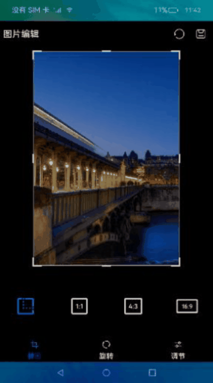
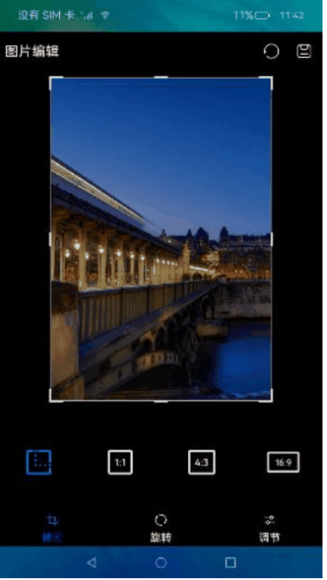
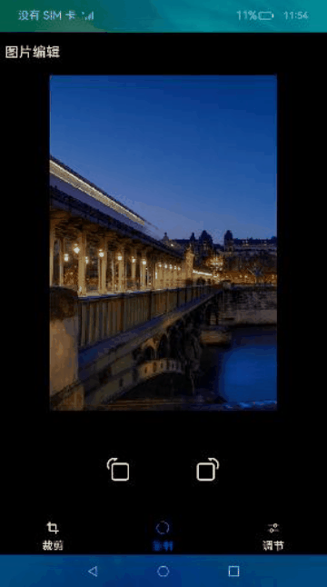
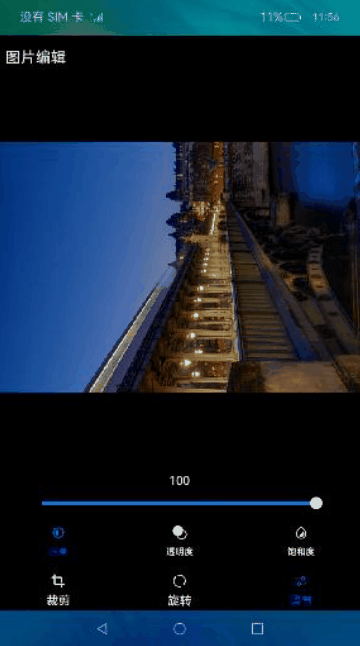
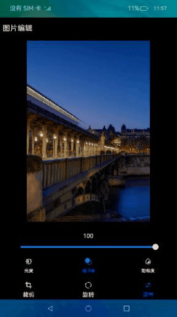
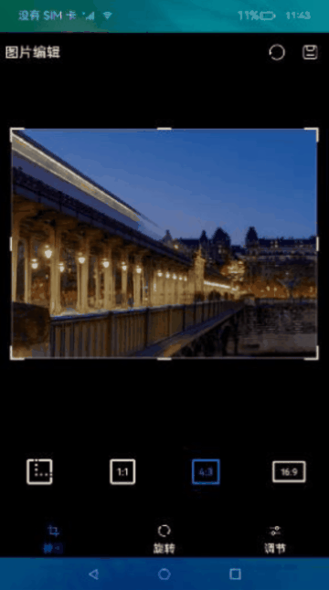

# 图片编辑（ArkTS）

## 介绍

本篇Codelab是基于ArkTS的声明式开发范式的样例，主要介绍了图片编辑实现过程。样例主要包含以下功能：

1.  图片的解码。
2.  使用PixelMap进行图片编辑，如裁剪、旋转、亮度、透明度、饱和度等。
3.  图片的编码。



### 相关概念

-   [图片解码](https://gitee.com/openharmony/docs/blob/master/zh-cn/application-dev/media/image-decoding.md)：读取不同格式的图片文件，无压缩的解码为位图格式。
-   [PixelMap](https://gitee.com/openharmony/docs/blob/master/zh-cn/application-dev/media/image-overview.md)：图片解码后的状态，用于对图片像素进行处理。
-   [图片编码](https://gitee.com/openharmony/docs/blob/master/zh-cn/application-dev/media/image-encoding.md)：图片经过像素处理完成之后，需要重新进行编码打包，生成需要的图片格式。

## 环境搭建

### 软件要求

-   [DevEco Studio](https://gitee.com/openharmony/docs/blob/master/zh-cn/application-dev/quick-start/start-overview.md#%E5%B7%A5%E5%85%B7%E5%87%86%E5%A4%87)版本：DevEco Studio 3.1 Release及以上版本。
-   OpenHarmony SDK版本：API version 9及以上版本。

### 硬件要求

-   开发板类型：[润和RK3568开发板](https://gitee.com/openharmony/docs/blob/master/zh-cn/device-dev/quick-start/quickstart-appendix-rk3568.md)。
-   OpenHarmony系统：3.2 Release及以上版本。

### 环境搭建

完成本篇Codelab我们首先要完成开发环境的搭建，本示例以**RK3568**开发板为例，参照以下步骤进行：

1.  [获取OpenHarmony系统版本](https://gitee.com/openharmony/docs/blob/master/zh-cn/device-dev/get-code/sourcecode-acquire.md#%E8%8E%B7%E5%8F%96%E6%96%B9%E5%BC%8F3%E4%BB%8E%E9%95%9C%E5%83%8F%E7%AB%99%E7%82%B9%E8%8E%B7%E5%8F%96)：标准系统解决方案（二进制）。以3.2 Release版本为例：

    

2.  搭建烧录环境。
    1.  [完成DevEco Device Tool的安装](https://gitee.com/openharmony/docs/blob/master/zh-cn/device-dev/quick-start/quickstart-ide-env-win.md)
    2.  [完成RK3568开发板的烧录](https://gitee.com/openharmony/docs/blob/master/zh-cn/device-dev/quick-start/quickstart-ide-3568-burn.md)

3.  搭建开发环境。
    1.  开始前请参考[工具准备](https://gitee.com/openharmony/docs/blob/master/zh-cn/application-dev/quick-start/start-overview.md#%E5%B7%A5%E5%85%B7%E5%87%86%E5%A4%87)，完成DevEco Studio的安装和开发环境配置。
    2.  开发环境配置完成后，请参考[使用工程向导](https://gitee.com/openharmony/docs/blob/master/zh-cn/application-dev/quick-start/start-with-ets-stage.md#创建ets工程)创建工程（模板选择“Empty Ability”）。
    3.  工程创建完成后，选择使用[真机进行调测](https://gitee.com/openharmony/docs/blob/master/zh-cn/application-dev/quick-start/start-with-ets-stage.md#使用真机运行应用)。


## 代码结构解读

本篇Codelab只对核心代码进行讲解，对于完整代码，我们会在gitee中提供。

```
├──entry/src/main/ets                            // 代码区
│  ├──common                         
│  │  ├──bean 
│  │  │  ├──CropType.ets                         // 按比例选取图片
│  │  │  ├──ImageSizeItem.ets                    // 图片尺寸
│  │  │  ├──Line.ets                             // 线封装类
│  │  │  ├──MessageItem.ets                      // 多线程封装消息
│  │  │  ├──PixelMapWrapper.ets                  // PixelMap封装类
│  │  │  ├──Point.ets                            // 点封装类
│  │  │  ├──Ratio.ets                            // 比例封装类
│  │  │  ├──Rect.ets                             // 矩形封装类
│  │  │  └──RegionItem.ets                       // 区域封装类
│  │  └──constant
│  │     └──CommonConstant.ets                   // 常量类
│  ├──entryability
│  │  └──EntryAbility.ts                         // 本地启动ability           
│  ├──pages
│  │  └──HomePage.ets                            // 本地主页面    
│  ├──utils
│  │  ├──AdjustUtil.ets                          // 调节工具类
│  │  ├──CropUtil.ets                            // 裁剪工具类
│  │  ├──DecodeUtil.ets                          // 解码工具类
│  │  ├──DrawingUtils.ets                        // Canvas画图工具类
│  │  ├──EncodeUtil.ets                          // 编码工具类
│  │  ├──LoggerUtil.ets                          // 日志工具类
│  │  ├──MathUtils.ets                           // 坐标转换工具类
│  │  └──OpacityUtil.ets                         // 透明度调节工具类
│  ├──view
│  │  ├──AdjustContentView.ets                   // 色域调整视图     
│  │  └──ImageSelect.ets                         // Canvas选择框实现类   
│  │──viewmodel
│  │  ├──CropShow.ets                            // 选择框显示控制类
│  │  ├──IconListViewModel.ets                   // icon数据
│  │  ├──ImageEditCrop.ets                       // 图片编辑操作类
│  │  ├──ImageFilterCrop.ets                     // 图片操作收集类
│  │  ├──OptionViewModel.ets                     // 图片处理封装类
│  │  └──ScreenManager.ts                        // 屏幕尺寸计算工具类
│  └──workers
│     ├──AdjustBrightnessWork.ts                 // 亮度异步调节
│     └──AdjustSaturationWork.ts                 // 饱和度异步调节
└──entry/src/main/resources                      // 资源文件目录
```

## 图片解码

在这个章节中，需要完成图片解码的操作，并将解码后的图片展示。效果如图所示：



在进行图片编辑前需要先加载图片，当前文档是在生命周期aboutToAppear开始加载。具体实现步骤。

1.  读取资源文件。
2.  将获取的fd创建成图片实例，通过实例获取其pixelMap。
3.  将解析好的pixelMap通过Image组件加载显示。

```typescript
// HomePage.ets
aboutToAppear() {
  this.pixelInit();
}

// DecodeUtil.ets
async function getResourceFd(filename: string) {
  const resourceMgr = getContext(this).resourceManager;
  const context = getContext(this);
  if (filename === CommonConstants.RAW_FILE_NAME) {
    let imageBuffer = await resourceMgr.getMediaContent($r('app.media.ic_low'));
    let filePath = context.cacheDir + '/' + filename;
    let file = fs.openSync(filePath, fs.OpenMode.READ_WRITE | fs.OpenMode.CREATE);
    let writeLen = fs.writeSync(file.fd, imageBuffer.buffer);
    fs.copyFileSync(filePath, context.cacheDir + '/' + CommonConstants.RAW_FILE_NAME_TEST);
    return file.fd;
  } else {
    let filePath = context.cacheDir + '/' + filename;
    let file = fs.openSync(filePath, fs.OpenMode.READ_WRITE | fs.OpenMode.CREATE);
    return file.fd;
  }
}

//DecodeUtil.ets
export async function getPixelMap(fileName: string) {
  const fd = await getResourceFd(fileName);
  const imageSourceApi = image.createImageSource(fd);
  if (!imageSourceApi) {
    Logger.error(TAG, 'imageSourceAPI created failed!');
    return;
  }
  const pixelMap = await imageSourceApi.createPixelMap({
    editable: true
  });
  return pixelMap;
}

// HomePage.ets
build() {
  Column() {
    ...
    Column() {
        if (this.isCrop && this.showCanvas && this.statusBar > 0) {
          ImageSelect({
            statusBar: this.statusBar
          })
        } else {
          Image(this.pixelMap)
            .scale({ x: this.imageScale, y: this.imageScale, z: 1 })
            .objectFit(ImageFit.None)
        }
    }
    ...
  }
  ...
}
```

## 图片处理

当前章节需要完成图片的裁剪、旋转、色域调节（本章只介绍亮度、透明度、饱和度）等功能。

-   裁剪：选取图片中的部分进行裁剪生成新的图片。
-   旋转：将图片按照不同的角度进行旋转，生成新的图片。
-   色域调节：当前Codelab色域调节的亮度、透明度和饱和度，使用色域模型RGB-HSV来实现的。
    -   RGB：是我们接触最多的颜色空间，分别为红色\(R\)，绿色\(G\)和蓝色\(B\)。
    -   HSV：是用色相H，饱和度S，明亮度V来描述颜色的变化。
        -   H：色相H取值范围为0°～360°，从红色开始按逆时针方向计算，红色为0°，绿色为120°，蓝色为240°。
        -   S：饱和度S越高，颜色则深而艳。光谱色的白光成分为0，饱和度达到最高。通常取值范围为0%～100%，值越大，颜色越饱和。
        -   V：明度V表示颜色明亮的程度，对于光源色，明度值与发光体的光亮度有关；对于物体色，此值和物体的透射比或反射比有关。通常取值范围为0%（黑）到100%（白）。

```typescript
// AdjustUtil.ets
// rgb转hsv
function rgb2hsv(red: number, green: number, blue: number) {
  let hsvH: number = 0, hsvS: number = 0, hsvV: number = 0;
  const rgbR: number = colorTransform(red);
  const rgbG: number = colorTransform(green);
  const rgbB: number = colorTransform(blue);
  const maxValue = Math.max(rgbR, Math.max(rgbG, rgbB));
  const minValue = Math.min(rgbR, Math.min(rgbG, rgbB));
  hsvV = maxValue * CommonConstants.CONVERT_INT;
  if (maxValue === 0) {
    hsvS = 0;
  } else {
    hsvS = Number((1 - minValue / maxValue).toFixed(CommonConstants.DECIMAL_TWO)) * CommonConstants.CONVERT_INT;
  }
  if (maxValue === minValue) {
    hsvH = 0;
  }
  if (maxValue === rgbR && rgbG >= rgbB) {
    hsvH = Math.floor(CommonConstants.ANGLE_60 * ((rgbG - rgbB) / (maxValue - minValue)));
  }
  if (maxValue === rgbR && rgbG < rgbB) {
    hsvH = Math.floor(CommonConstants.ANGLE_60 * ((rgbG - rgbB) / (maxValue - minValue)) + CommonConstants.ANGLE_360);
  }
  if (maxValue === rgbG) {
    hsvH = Math.floor(CommonConstants.ANGLE_60 * ((rgbB - rgbR) / (maxValue - minValue)) + CommonConstants.ANGLE_120);
  }
  if (maxValue === rgbB) {
    hsvH = Math.floor(CommonConstants.ANGLE_60 * ((rgbR - rgbG) / (maxValue - minValue)) + CommonConstants.ANGLE_240);
  }
  return [hsvH, hsvS, hsvV];
}
// hsv转rgb
function hsv2rgb(hue: number, saturation: number, value: number) {
  let rgbR: number = 0, rgbG: number = 0, rgbB: number = 0;
  if (saturation === 0) {
    rgbR = rgbG = rgbB = Math.round((value * CommonConstants.COLOR_LEVEL_MAX) / CommonConstants.CONVERT_INT);
    return { rgbR, rgbG, rgbB };
  }
  const cxmC = (value * saturation) / (CommonConstants.CONVERT_INT * CommonConstants.CONVERT_INT);
  const cxmX = cxmC * (1 - Math.abs((hue / CommonConstants.ANGLE_60) % CommonConstants.MOD_2 - 1));
  const cxmM = (value - cxmC * CommonConstants.CONVERT_INT) / CommonConstants.CONVERT_INT;
  const hsvHRange = Math.floor(hue / CommonConstants.ANGLE_60);
  switch (hsvHRange) {
    case AngelRange.ANGEL_0_60:
      rgbR = (cxmC + cxmM) * CommonConstants.COLOR_LEVEL_MAX;
      rgbG = (cxmX + cxmM) * CommonConstants.COLOR_LEVEL_MAX;
      rgbB = (0 + cxmM) * CommonConstants.COLOR_LEVEL_MAX;
      break;
    case AngelRange.ANGEL_60_120:
      rgbR = (cxmX + cxmM) * CommonConstants.COLOR_LEVEL_MAX;
      rgbG = (cxmC + cxmM) * CommonConstants.COLOR_LEVEL_MAX;
      rgbB = (0 + cxmM) * CommonConstants.COLOR_LEVEL_MAX;
      break;
    case AngelRange.ANGEL_120_180:
      rgbR = (0 + cxmM) * CommonConstants.COLOR_LEVEL_MAX;
      rgbG = (cxmC + cxmM) * CommonConstants.COLOR_LEVEL_MAX;
      rgbB = (cxmX + cxmM) * CommonConstants.COLOR_LEVEL_MAX;
      break;
    case AngelRange.ANGEL_180_240:
      rgbR = (0 + cxmM) * CommonConstants.COLOR_LEVEL_MAX;
      rgbG = (cxmX + cxmM) * CommonConstants.COLOR_LEVEL_MAX;
      rgbB = (cxmC + cxmM) * CommonConstants.COLOR_LEVEL_MAX;
      break;
    case AngelRange.ANGEL_240_300:
      rgbR = (cxmX + cxmM) * CommonConstants.COLOR_LEVEL_MAX;
      rgbG = (0 + cxmM) * CommonConstants.COLOR_LEVEL_MAX;
      rgbB = (cxmC + cxmM) * CommonConstants.COLOR_LEVEL_MAX;
      break;
    case AngelRange.ANGEL_300_360:
      rgbR = (cxmC + cxmM) * CommonConstants.COLOR_LEVEL_MAX;
      rgbG = (0 + cxmM) * CommonConstants.COLOR_LEVEL_MAX;
      rgbB = (cxmX + cxmM) * CommonConstants.COLOR_LEVEL_MAX;
      break;
    default:
      break;
  }
  return [
    Math.round(rgbR),
    Math.round(rgbG),
    Math.round(rgbB)
  ];
}
```

### 图片裁剪

1. 通过pixelMap获取图片尺寸，为后续裁剪做准备。
2. 确定裁剪的方式，当前裁剪默认有自由选取、1:1选取、4:3选取、16:9选取。
3. 通过pixelMap调用接口crop\(\)进行裁剪操作。

> **说明：** 
>当前裁剪功能采用pixelMap裁剪能力直接做切割，会有叠加效果，后续会通过增加选取框对当前功能进行优化。


```typescript
// HomePage.ets
cropImage(index: CropType) {
  this.currentCropIndex = index;
  switch (this.currentCropIndex) {
    case CropType.ORIGINAL_IMAGE:
      this.cropRatio = CropRatioType.RATIO_TYPE_FREE;
      break;
    case CropType.SQUARE:
      this.cropRatio = CropRatioType.RATIO_TYPE_1_1;
      break;
    case CropType.BANNER:
      this.cropRatio = CropRatioType.RATIO_TYPE_4_3;
      break;
    case CropType.RECTANGLE:
      this.cropRatio = CropRatioType.RATIO_TYPE_16_9;
    default:
      this.cropRatio = CropRatioType.RATIO_TYPE_FREE;
      break;
  }
}

// ImageFilterCrop.ets
cropImage(pixelMap: PixelMapWrapper, realCropRect: RectF, callback) {
  let offWidth = realCropRect.getWidth();
  let offHeight = realCropRect.getHeight();
  pixelMap.pixelMap.crop({
    size:{ height: vp2px(offHeight), width: vp2px(offWidth) },
    x: vp2px(realCropRect.left),
    y: vp2px(realCropRect.top)
  }, callback);
}
```

### 图片旋转

1. 确定旋转方向，当前支持顺时针和逆时针旋转。
2. 通过pixelMap调用接口rotate\(\)进行旋转操作。



```typescript
// HomePage.ets
rotateImage(rotateType: RotateType) {
  if (rotateType === RotateType.ClockWise) {
    try {
      this.pixelMap.rotate(commonConstant.CLOCK_WISE)
        .then(() => {
          this.flushPixelMap();
        })
    } catch (error) {
      Logger.error(TAG, `there is a error in rotate process with ${error?.code}`);
    }
  }
  if (rotateType === RotateType.Anti_clock) {
    try {
      this.pixelMap.rotate(commonConstant.ANTI_CLOCK)
        .then(() => {
          this.flushPixelMap();
        })
    } catch (error) {
      Logger.error(TAG, `there is a error in rotate process with ${error?.code}`);
    }
  }
}
```

### 亮度调节

1.  将pixelMap转换成ArrayBuffer。
2.  将生成好的ArrayBuffer发送到worker线程。
3.  对每一个像素点的亮度值按倍率计算。
4.  将计算好的ArrayBuffer发送回主线程。
5.  将ArrayBuffer写入pixelMap，刷新UI。

> **说明：** 
>当前亮度调节是在UI层面实现的，未实现细节优化算法，只做简单示例。调节后的图片会有色彩上的失真。



```typescript
// AdjustContentView.ets
// 转化成pixelMap及发送buffer到worker，返回数据刷新UI
postToWorker(type: AdjustId, value: number, workerName: string) {
  let sliderValue = type === AdjustId.BRIGHTNESS ? this.brightnessLastSlider : this.saturationLastSlider;
  let workerInstance = new worker.ThreadWorker(workerName);
  const bufferArray = new ArrayBuffer(this.pixelMap.getPixelBytesNumber());
  this.pixelMap.readPixelsToBuffer(bufferArray).then(() => {
    let message = new MessageItem(bufferArray, sliderValue, value);
    workerInstance.postMessage(message);
    if (this.postState) {
      this.deviceListDialogController.open();
    }
    this.postState = false;
    workerInstance.onmessage = this.updatePixelMap.bind(this);
    if (type === AdjustId.BRIGHTNESS) {
      this.brightnessLastSlider = Math.round(value);
    } else {
      this.saturationLastSlider = Math.round(value);
    }
    workerInstance.onexit = () => {
      if (workerInstance !== undefined) {
        workerInstance.terminate();
      }
    }
  });
}

// AdjustBrightnessWork.ts
// worker线程处理部分
workerPort.onmessage = function(event : MessageEvents) {
  let bufferArray = event.data.buf;
  let last = event.data.last;
  let cur = event.data.cur;
  let buffer = adjustImageValue(bufferArray, last, cur);
  workerPort.postMessage(buffer);
  workerPort.close();
}

// AdjustUtil.ets
// 倍率计算部分
export function adjustImageValue(bufferArray: ArrayBuffer, last: number, cur: number) {
  return execColorInfo(bufferArray, last, cur, HSVIndex.VALUE);
}
```

### 透明度调节

1. 获取pixelMap。
2. 调用接口opacity\(\)进行透明度调节。



```typescript
// OpacityUtil.ets
export async function adjustOpacity(pixelMap: PixelMap, value: number) {
  if (!pixelMap) {
    return;
  }
  const newPixelMap = pixelMap;
  newPixelMap.opacity(value / CommonConstants.SLIDER_MAX, err => {
    if (err) {
      Logger.error(TAG, `Failed adjust opacity with ${err}`);
    }
  })
  return newPixelMap;
}
```

### 饱和度调节

1.  将pixelMap转换成ArrayBuffer。
2.  将生成好的ArrayBuffer发送到worker线程。
3.  对每一个像素点的饱和度按倍率计算。
4.  将计算好的ArrayBuffer发送回主线程。
5.  将ArrayBuffer写入pixelMap，刷新UI。

> **说明：** 
> 当前饱和度调节是在UI层面实现的，未实现细节优化算法，只做简单示例。调节后的图片会有色彩上的失真。



```typescript
// AdjustContentView.ets
// 转化成pixelMap及发送buffer到worker，返回数据刷新UI
postToWorker(type: AdjustId, value: number, workerName: string) {
  let sliderValue = type === AdjustId.BRIGHTNESS ? this.brightnessLastSlider : this.saturationLastSlider;
  let workerInstance = new worker.ThreadWorker(workerName);
  const bufferArray = new ArrayBuffer(this.pixelMap.getPixelBytesNumber());
  this.pixelMap.readPixelsToBuffer(bufferArray).then(() => {
    let message = new MessageItem(bufferArray, sliderValue, value);
    workerInstance.postMessage(message);
    if (this.postState) {
      this.deviceListDialogController.open();
    }
    this.postState = false;
    workerInstance.onmessage = this.updatePixelMap.bind(this);
    if (type === AdjustId.BRIGHTNESS) {
      this.brightnessLastSlider = Math.round(value);
    } else {
      this.saturationLastSlider = Math.round(value);
    }
    workerInstance.onexit = () => {
      if (workerInstance !== undefined) {
        workerInstance.terminate();
      }
    }
  });
}

// AdjustBrightnessWork.ts
// worker线程处理部分
workerPort.onmessage = function(event : MessageEvents) {
  let bufferArray = event.data.buf;
  let last = event.data.last;
  let cur = event.data.cur;
  let buffer = adjustImageValue(bufferArray, last, cur);
  workerPort.postMessage(buffer);
  workerPort.close();
}

// AdjustUtil.ets
// 倍率计算部分
export function adjustSaturation(bufferArray: ArrayBuffer, last: number, cur: number) {
  return execColorInfo(bufferArray, last, cur, HSVIndex.SATURATION);
}
```

## 图片编码

图片位图经过处理之后，还是属于解码的状态，还需要进行打包编码成对应的格式，本章讲解编码的具体过程。

1.  通过image组件创建打包工具packer。
2.  使用PackingOption进行打包参数设定，比如格式、压缩质量等。
3.  打包成图片信息数据imageData。
4.  创建媒体库media，获取公共路径。
5.  创建媒体文件asset，获取其fd。
6.  使用fs将打包好的图片数据写入到媒体文件asset中。

```typescript
// EncodeUtil.ets
export async function encode(pixelMap: PixelMap) {
  const newPixelMap = pixelMap;
  // packing image.
  const imagePackerApi = image.createImagePacker();
  const packOptions: image.PackingOption = {
    format: CommonConstants.ENCODE_FORMAT,
    quality: CommonConstants.ENCODE_QUALITY
  }
  const imageData = await imagePackerApi.packing(newPixelMap, packOptions);
  Logger.info(TAG, `imageData's length is ${imageData.byteLength}`);
  // get album's path.
  const context = getContext(this);
  const media = mediaLibrary.getMediaLibrary(context);
  const publicPath = await media.getPublicDirectory(mediaLibrary.DirectoryType.DIR_IMAGE);
  const currentTime = new Date().getTime();
  // create image asset.
  const imageAssetInfo = await media.createAsset(
    mediaLibrary.MediaType.IMAGE,
    `${CommonConstants.IMAGE_PREFIX}_${currentTime}${CommonConstants.IMAGE_FORMAT}`,
    publicPath
  );
  const imageFd = await imageAssetInfo.open(CommonConstants.ENCODE_FILE_PERMISSION);
  await fs.write(imageFd, imageData);
  // image resource release.
  await imageAssetInfo.close(imageFd);
  imagePackerApi.release();
  await media.release();
}
```

## 总结

您已经完成了本次Codelab的学习，并了解到以下知识点：

1.  使用image库进行图片的解码。
2.  使用pixelMap进行图片处理（旋转、裁剪、亮度、透明度、饱和度等）。
3.  使用image库进行图片的编码。


