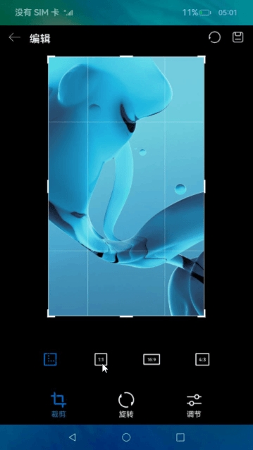
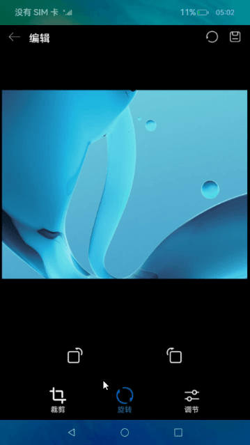
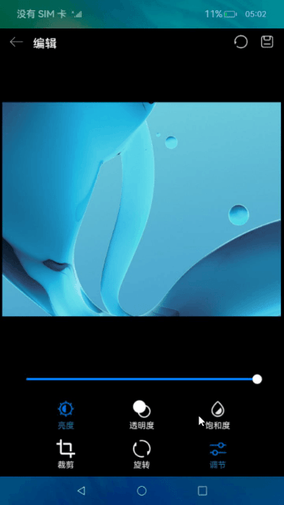
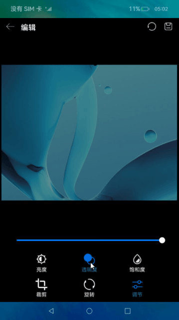
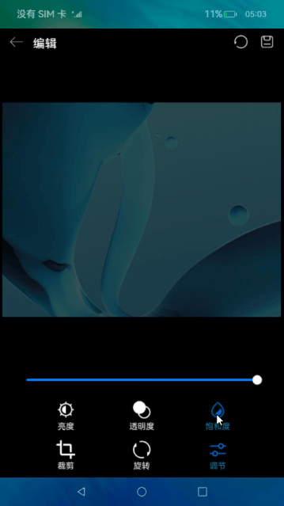

# 图片编辑（JS）

## 介绍
本篇Codelab基于canvas组件、图片编解码，介绍了图片编辑实现过程。主要包含以下功能：
1. 图片的解码和绘制。
2. 使用PixelMap进行图片编辑，如裁剪、旋转、亮度调节、透明度调节、饱和度调节等操作。


### 相关概念

-   [canvas组件](https://gitcode.com/openharmony/docs/blob/master/zh-cn/application-dev/reference/apis-arkui/arkui-js/js-components-canvas-canvas.md)：提供画布组件。用于自定义绘制图形。
-   [图片处理](https://gitcode.com/openharmony/docs/blob/master/zh-cn/application-dev/media/image-overview.md)：提供图片处理效果，包括通过属性创建PixelMap、读取图像像素数据、读取区域内的图片数据等。

### 相关权限

本篇Codelab使用了媒体文件存储能力，需要在配置文件config.json里添加媒体文件读写权限：
- ohos.permission.MEDIA_LOCATION
- ohos.permission.READ_MEDIA
- ohos.permission.WRITE_MEDIA

## 环境搭建

### 软件要求

-   [DevEco Studio](https://gitcode.com/openharmony/docs/blob/master/zh-cn/application-dev/quick-start/start-overview.md#%E5%B7%A5%E5%85%B7%E5%87%86%E5%A4%87)版本：DevEco Studio 3.1 Release及以上版本。
-   OpenHarmony SDK版本：API version 9及以上版本。

### 硬件要求

-   开发板类型：[润和RK3568开发板](https://gitcode.com/openharmony/docs/blob/master/zh-cn/device-dev/quick-start/quickstart-appendix-rk3568.md)。
-   OpenHarmony系统：3.2 Release及以上版本。

### 环境搭建

完成本篇Codelab我们首先要完成开发环境的搭建，本示例以**RK3568**开发板为例，参照以下步骤进行：

1.  [获取OpenHarmony系统版本](https://gitcode.com/openharmony/docs/blob/master/zh-cn/device-dev/get-code/sourcecode-acquire.md#%E8%8E%B7%E5%8F%96%E6%96%B9%E5%BC%8F3%E4%BB%8E%E9%95%9C%E5%83%8F%E7%AB%99%E7%82%B9%E8%8E%B7%E5%8F%96)：标准系统解决方案（二进制）。以3.2 Release版本为例：

    

2.  搭建烧录环境。
    1.  [完成DevEco Device Tool的安装](https://gitcode.com/openharmony/docs/blob/master/zh-cn/device-dev/quick-start/quickstart-ide-env-win.md)
    2.  [完成RK3568开发板的烧录](https://gitcode.com/openharmony/docs/blob/master/zh-cn/device-dev/quick-start/quickstart-ide-3568-burn.md)

3.  搭建开发环境。
    1.  开始前请参考[工具准备](https://gitcode.com/openharmony/docs/blob/master/zh-cn/application-dev/quick-start/start-overview.md#%E5%B7%A5%E5%85%B7%E5%87%86%E5%A4%87)，完成DevEco Studio的安装和开发环境配置。
    2.  开发环境配置完成后，请参考[使用工程向导](https://gitcode.com/openharmony/docs/blob/master/zh-cn/application-dev/quick-start/start-with-ets-stage.md#创建ets工程)创建工程（模板选择“Empty Ability”）。
    3.  工程创建完成后，选择使用[真机进行调测](https://gitcode.com/openharmony/docs/blob/master/zh-cn/application-dev/quick-start/start-with-ets-stage.md#使用真机运行应用)。

## 代码结构解读

本篇Codelab只对核心代码进行讲解，对于完整代码，我们会在gitcode中提供。

```
├──entry/src/main/js	              // 代码区
│  └──MainAbility
│     ├──common
│     │  ├──bean
│     │  │  └──messageItem.js         // 多线程封装消息
│     │  ├──constant
│     │  │  └──commonConstants.js     // 常量
│     │  ├──images                    // 图片资源
│     │  └──utils
│     │     ├──adjustUtil.js          // 饱和度、亮度调节工具
│     │     ├──imageUtil.js           // 图片获取、打包工具
│     │     ├──logger.js              // 日志工具             
│     │     ├──opacityUtil.js         // 透明度调节工具
│     │     └──rotateUtil.js          // 旋转工具
│     ├──i18n		                  // 国际化中英文
│     │  ├──en-US.json			
│     │  └──zh-CN.json		
│     ├──model
│     │  └──cropModel.js              // 裁剪数据处理
│     ├──pages
│     │  └──index
│     │     ├──index.css              // 首页样式文件	
│     │     ├──index.hml              // 首页布局文件
│     │     └──index.js               // 首页业务处理文件
│     ├──workers
│     │  ├──adjustBrightnessWork.js   // 亮度异步调节
│     │  └──adjustSaturationWork.js   // 饱和度异步调节
│     └──app.js                       // 程序入口
└──entry/src/main/resources           // 应用资源目录
```

## 图片解码
本章节将介绍如何将图片解码，并显示在canvas组件上。需要完成以下功能：

1.  获取图片的PixelMap对象。
2.  在canvas组件上绘制第一步获取的PixelMap对象。


在index.js文件的onInit生命周期中初始化canvas画布，具体有以下步骤：

1.  调用imageUtil工具类的getImageFd方法，根据资源文件获取图片fd。
2.  调用imageUtil工具类的getImagePixelMap方法，将获取的fd创建成图片实例，通过实例获取其PixelMap。
3.  通过canvas id获取CanvasRenderingContext2D对象。
4.  将获取的PixelMap绘制到canvas组件上。

```javascript
// index.js
export default {
  onInit() {
    ...
    this.initCanvas().then(() => {
      this.postState = false;
    });
  },
  async initCanvas() {
    ...
    // 获取图片fd
    this.imageFd = await getImageFd(CommonConstants.IMAGE_NAME);
    // 获取图片pixelMap
    this.imagePixelMapAdjust = await getImagePixelMap(this.imageFd);
    ...
    // 获取canvas对象
    const canvasOne = this.$element('canvasOne');
    this.canvasContext = canvasOne.getContext('2d');
    ...
    // 在canvas组件上绘图
    this.drawToCanvas(this.imagePixelMapAdjust, this.drawImageLeft, this.drawImageTop,
      this.drawWidth, this.drawHeight);
  }
}

// imageUtil.js
export async function getImageFd(imageName) {
  let mResourceManager = await resourceManager.getResourceManager();
  let rawImageDescriptor = await mResourceManager.getRawFd(imageName);
  let fd = rawImageDescriptor?.fd;
  return fd;
}
export async function getImagePixelMap(fd) {
  let imageSource = image.createImageSource(fd);
  if (!imageSource) {
    return;
  }
  let pixelMap = await imageSource.createPixelMap({
    editable: true,
    desiredPixelFormat: CommonConstants.PIXEL_FORMAT
  });
  return pixelMap;
}
```

## 图片裁剪
本篇Codelab提供四种裁剪比例，全图裁剪、1：1裁剪、16：9裁剪、4：3裁剪。需要完成以下步骤实现裁剪功能：

1.  根据裁剪比例，获取canvas画布上需要绘制的裁剪框宽高。
2.  根据裁剪比例，获取原图需要裁剪的宽高。
3.  根据第二步获取的原图需要裁剪的宽高，对图片进行裁剪。
4.  根据裁剪后原图宽高，适配屏幕大小，重新绘制。



```javascript
// index.js
export default {
  // 任意点击四种裁剪比例
  cropClick(clickIndex) {
    this.cropClickIndex = clickIndex;
    switch (clickIndex) {
      // 全图裁剪
      case CommonConstants.CropType.ORIGINAL:
        cropOriginal(this);
        break;
      // 1：1裁剪
      case CommonConstants.CropType.ONE_TO_ONE:
        cropSquareImage(this);
        break;
      // 16：9裁剪
      case CommonConstants.CropType.SIXTEEN_TO_NINE:
        cropRectangleImage(this);
        break;
      // 4：3裁剪
      case CommonConstants.CropType.FOUR_TO_THREE:
        cropBannerImage(this);
        break;
      default:
        break;
    }
    drawScreenSelection(this, this.canvasCropContext);
  }
}
```

以1：1裁剪为例，调用cropSquareImage方法，获取原图需要裁剪的宽高以及裁剪框的宽高。点击切换编辑类型或保存，调用cropDrawImage方法裁剪图片，最后适配屏幕重新绘制。

```javascript
// cropModel.js
export function cropSquareImage(context) {
  ...
  let length = Math.min(context.originalImage.width, context.originalImage.height);
  // 原图需要裁剪的宽高
  context.cropWidth = length;
  context.cropHeight = length;
  let drawLength = Math.min(context.drawWidth, context.drawHeight);
  // 裁剪框宽高
  context.cropDrawWidth = drawLength;
  context.cropDrawHeight = drawLength;
}
export async function cropDrawImage(context) {
  ...
  let imagePixel = context.imagePixelMapAdjust;
  let diffX = (context.originalImage.width - context.cropWidth) / CommonConstants.HALF;
  let diffY = (context.originalImage.height - context.cropHeight) / CommonConstants.HALF;
  context.cropLeft = Math.floor(diffX * accuracy) / accuracy;
  context.cropTop = Math.floor(diffY * accuracy) / accuracy;
  // 裁剪图片
  await imagePixel.crop({ x: context.cropLeft, y: context.cropTop,
    size: {
      height: context.cropHeight,
      width: context.cropWidth
    }
  });
  // 裁剪后原图宽高
  context.originalImage.width = context.cropWidth;
  context.originalImage.height = context.cropHeight;
  context.imagePixelMapAdjust = imagePixel;
}

// index.js
// 选择裁剪框后，裁剪并适应屏幕显示
async crop() {
  await cropDrawImage(this);
  // 适配屏幕
  this.adjustSize();
  this.canvasCropContext.clearRect(0, 0, this.canvasWidth, this.canvasHeight);
  // 重新绘制
  this.drawToCanvas(this.imagePixelMapAdjust, this.drawImageLeft, this.drawImageTop, this.drawWidth,
    this.drawHeight);
  cropOriginal(this);
}
```
## 图片旋转
本篇Codelab提供逆时针旋转、顺时针旋转两种方式，每次旋转角度为90度。在index.html文件中，使用两个image组件实现逆时针旋转、顺时针旋转按钮。点击对应图片时，触发onclick事件并回调onRotate方法。


```html
<!-- index.html -->
<div class="space-around-row adjust-width crop-height">
    <!-- 逆时针旋转 -->
    <image src="common/images/ic_anti_clockwise.png" class="edit-image" onclick="onRotate(-90)"></image>
    <!-- 顺时针旋转 -->
    <image src="common/images/ic_clockwise.png" class="edit-image" onclick="onRotate(90)"></image>
</div>
```
在index.js文件中，实现onRotate方法。根据方法入参angle，调用PixelMap接口提供的rotate方法，完成图片旋转功能。

```javascript
// index.js
export default {
  // 点击逆时针旋转
  onRotate(angle) {
    let that = this;
    this.postState = true;
    rotate(this.imagePixelMapAdjust, angle, () => {
      that.exchange();
    });
  }
}
// rotateUtil.js
export async function rotate(pixelMap, angle, callback) {
  if (!pixelMap) {
    return;
  }
  await pixelMap.rotate(angle);
  callback();
}
```

## 图片色域调节
本篇Codelab的色域调节是使用色域模型RGB-HSV来实现的。

-   RGB：是我们接触最多的颜色空间，分别为红色（R）、绿色（G）和蓝色（B）。
-   HSV：是用色相H，饱和度S，明亮度V来描述颜色的变化
    -   H：色相H取值范围为0°～360°，从红色开始按逆时针方向计算，红色为0°，绿色为120°，蓝色为240°。
    -   S：饱和度S越高，颜色则深而艳。光谱色的白光成分为0，饱和度达到最高。通常取值范围为0%～100%，值越大，颜色越饱和。
    -   V：明度V表示颜色明亮的程度，对于光源色，明度值与发光体的光亮度有关；对于物体色，此值和物体的透射比或反射比有关。通常取值范围为0%（黑）到100%（白）。

### 亮度调节

完成以下步骤实现亮度调节：

1.  将PixelMap转换成ArrayBuffer。
2.  将生成好的ArrayBuffer发送到worker线程。
3.  对每一个像素点的亮度值按倍率计算。
4.  将计算好的ArrayBuffer发送回主线程。
5.  将ArrayBuffer写入PixelMap，重新绘图。

> **说明：** 
>当前亮度调节是在UI层面实现的，未实现细节优化算法，只做简单示例。调节后的图片会有色彩上的失真。



```javascript
// index.js
export default {
  // pixelMap转换ArrayBuffer及发送ArrayBuffer到worker，
  postToWorker(type, value, workerName) {
    let sliderValue = type === CommonConstants.AdjustId.BRIGHTNESS ? this.brightnessValue : this.saturationValue;
    this.workerInstance = new worker.ThreadWorker(workerName);
    const bufferArray = new ArrayBuffer(this.imagePixelMapAdjust.getPixelBytesNumber());
    this.imagePixelMapAdjust.readPixelsToBuffer(bufferArray).then(() => {
      let message = new MessageItem(bufferArray, sliderValue, value);
      this.workerInstance.postMessage(message);
      this.postState = true;
      // 收到worker线程完成的消息
      this.workerInstance.onmessage = this.updatePixelMap.bind(this);
      this.workerInstance.onexit = () => {
        if (type === CommonConstants.AdjustId.BRIGHTNESS) {
          this.brightnessValue = Math.floor(value);
        } else {
          this.saturationValue = Math.floor(value);
        }
      }
    });
  }
}
// AdjustBrightnessWork.js
// worker线程处理部分
workerPort.onmessage = function (event) {
  let bufferArray = event.data.buffer;
  let lastValue = event.data.lastValue;
  let currentValue = event.data.currentValue;
  let buffer = adjustImageValue(bufferArray, lastValue, currentValue);
  workerPort.postMessage(buffer);
}
// adjustUtil.js
// 倍率计算部分
export function adjustImageValue(bufferArray, last, cur) {
  return execColorInfo(bufferArray, last, cur, CommonConstants.HSVIndex.VALUE);
}
```

### 透明度调节

PixelMap接口提供了图片透明度调节的功能。拖动滑块调节透明度，回调setOpacityValue方法，获取需要调节的透明度，最后调用opacity方法完成透明度调节。



```javascript
// index.js
export default {
  setOpacityValue(event) {
    let slidingOpacityValue = event.value;
    let slidingMode = event.mode;
    if (slidingMode === CommonConstants.SLIDER_MODE_END || slidingMode === CommonConstants.SLIDER_MODE_CLICK) {
      adjustOpacity(this.imagePixelMapAdjust, slidingOpacityValue).then(pixelMap => {
        this.imagePixelMapAdjust = pixelMap;
        this.drawToCanvas(this.imagePixelMapAdjust, this.drawImageLeft, this.drawImageTop,
          this.drawWidth, this.drawHeight);
        this.opacityValue = Math.floor(slidingOpacityValue);
      });
    }
  }
}
// opacityUtil.js
export async function adjustOpacity(pixelMap, value) {
  if (!pixelMap) {
    return;
  }
  pixelMap.opacity(parseInt(value) / CommonConstants.SLIDER_MAX_VALUE).catch(err => {
    Logger.error(`opacity err ${JSON.stringify(err)}`);
  });
  return pixelMap;
}
```

### 饱和度调节

饱和度调节与亮度调节步骤类似：

1.  将PixelMap转换成ArrayBuffer。
2.  将生成好的ArrayBuffer发送到worker线程。
3.  对每一个像素点的饱和度值按倍率计算。
4.  将计算好的ArrayBuffer发送回主线程。
5.  将ArrayBuffer写入PixelMap，重新绘图。

> **说明：** 
>当前饱和度调节是在UI层面实现的，未实现细节优化算法，只做简单示例。调节后的图片会有色彩上的失真。



```javascript
// index.js
export default {
  // pixelMap转换ArrayBuffer及发送ArrayBuffer到worker，
  postToWorker(type, value, workerName) {
    let sliderValue = type === CommonConstants.AdjustId.BRIGHTNESS ? this.brightnessValue : this.saturationValue;
    this.workerInstance = new worker.ThreadWorker(workerName);
    const bufferArray = new ArrayBuffer(this.imagePixelMapAdjust.getPixelBytesNumber());
    this.imagePixelMapAdjust.readPixelsToBuffer(bufferArray).then(() => {
      let message = new MessageItem(bufferArray, sliderValue, value);
      this.workerInstance.postMessage(message);
      this.postState = true;
      // 收到worker线程完成的消息
      this.workerInstance.onmessage = this.updatePixelMap.bind(this);
      this.workerInstance.onexit = () => {
        if (type === CommonConstants.AdjustId.BRIGHTNESS) {
          this.brightnessValue = Math.floor(value);
        } else {
          this.saturationValue = Math.floor(value);
        }
      }
    });
  }
}
// adjustSaturationWork.js
// worker线程处理部分
workerPort.onmessage = function (event) {
  let bufferArray = event.data.buffer;
  let lastValue = event.data.lastValue;
  let currentValue = event.data.currentValue;
  let buffer = adjustSaturation(bufferArray, lastValue, currentValue)
  workerPort.postMessage(buffer);
}
// adjustUtil.js
// 倍率计算部分
export function adjustSaturation(bufferArray, last, cur) {
  return execColorInfo(bufferArray, last, cur, CommonConstants.HSVIndex.SATURATION);
}
```

## 总结

您已经完成了本次Codelab的学习，并了解到以下知识点：

1.  canvas组件的使用。
2.  使用image模块进行图片的解码。
3.  使用PixelMap进行图片处理（旋转、裁剪、亮度调节、透明度调节、饱和度调节等）。


