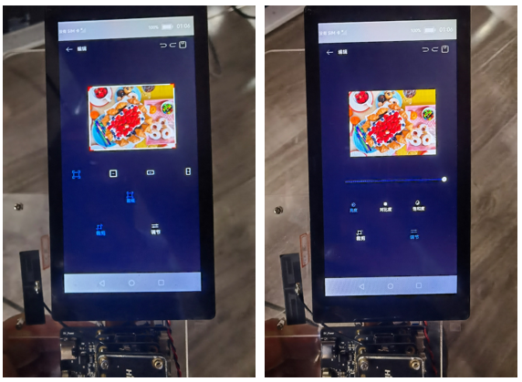
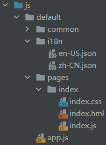
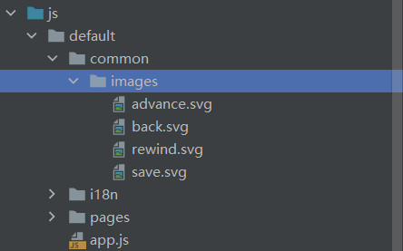
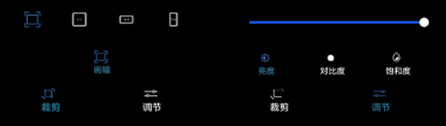
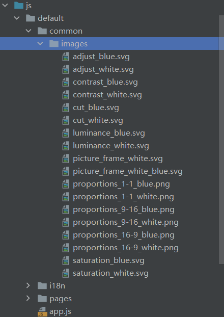

# 概述

本篇Codelab将为开发者介绍如何使用ArkUI实现对图片的裁剪和调节。应用主界面包含顶部区域、中间区域和底部区域。顶部区域由4个image组件\(后退、撤销、重做、保存\)和1个text组件（编辑）构成；中间区域由预览图、裁剪框构成；底部区域由上至下依次为：用于调节次级功能的编辑参数、用于选择次级功能、用于选择图片编辑功能。

效果图如下：


# 相关概念

-   [JS FA工程目录](#section245862185518)

**[canvas组件](https://developer.harmonyos.com/cn/docs/documentation/doc-references/js-components-canvas-canvas-0000000000621808)**：画布组件，用于自定义绘制图形。

**[slider组件](https://developer.harmonyos.com/cn/docs/documentation/doc-references/js-components-basic-slider-0000000000611724)**：滑动条组件，用来快速调节设置值，如音量、亮度等。

## JS FA工程目录
新建工程的JS目录如下图所示：



在工程目录中：i18n下存放多语言的json文件；

-   **main \> js \> default \> common \> images：**此文件夹存放一些图片资源。
-   **main \> js \> default \> i18n \> en-US.json：**此文件定义了英文模式下页面显示的变量内容。
-   **main \> js \> default \> i18n \> zh-CN.json：**此文件定义了中文模式下页面显示的变量内容。
-   **main \> js \> default \> pages \> index \> index.hml：**此文件定义了index页面的布局，包含index页面中的各个组件以及组件间的层级关系。
-   **main \> js \> default \> pages \> index \> index.css：**此文件定义了index页面的样式。
-   **main \> js \> default \> pages \> index \> index.js：**此文件定义了index页面的业务逻辑，比如数据绑定、事件处理等。

# 搭建OpenHarmony环境

完成本篇Codelab我们首先要完成开发环境的搭建，本示例以**Hi3516DV300**开发板为例，参照以下步骤进行：

1.  [获取OpenHarmony系统版本](https://gitee.com/openharmony/docs/blob/master/zh-cn/device-dev/get-code/sourcecode-acquire.md#%E8%8E%B7%E5%8F%96%E6%96%B9%E5%BC%8F3%E4%BB%8E%E9%95%9C%E5%83%8F%E7%AB%99%E7%82%B9%E8%8E%B7%E5%8F%96)：标准系统解决方案（二进制）

    以3.0版本为例：

    

2.  搭建烧录环境

    1.  [完成DevEco Device Tool的安装](https://device.harmonyos.com/cn/docs/documentation/guide/install_windows-0000001050164976)

    2.  [完成Hi3516开发板的烧录](https://device.harmonyos.com/cn/docs/documentation/guide/hi3516_upload-0000001052148681)

3.  搭建开发环境

    1.  开始前请参考[下载与安装软件](https://developer.harmonyos.com/cn/docs/documentation/doc-guides/software_install-0000001053582415)、[配置开发环境](https://gitee.com/openharmony/docs/blob/master/zh-cn/application-dev/quick-start/configuring-openharmony-sdk.md)，完成DevEco Studio的安装和开发环境配置。
    2.  开发环境配置完成后，请参考[使用工程向导](https://gitee.com/openharmony/docs/blob/master/zh-cn/application-dev/quick-start/use-wizard-to-create-project.md)创建工程，使用JS或者eTS语言开发、“Application”为例，模板选择“\[Standard\]Empty Ability”。
    3.  工程创建完成后，可参考下面章节进行代码编写，使用真机进行调测：

    -   [配置OpenHarmony应用签名信息](https://gitee.com/openharmony/docs/blob/master/zh-cn/application-dev/quick-start/configuring-openharmony-app-signature.md)
    -   [hap包安装指导](https://gitee.com/openharmony/docs/blob/master/zh-cn/application-dev/quick-start/installing-openharmony-app.md)
    -   工程示例：

    


# 实现页面布局和样式

-   [顶部区域](#section273864225210)
-   [4.2 中间区域](#section132517464018)
-   [4.3 底部区域](#section8170339131916)

在这个任务中，我们需要实现应用主界面的布局和样式。

## 顶部区域

由后退、撤销、重做以及保存image组件构成。

所需图片资源：



zh-CN.json文件定义：

```
titleAppBar ：“编辑”
```

index.hml布局代码如下：

```
<!-- 顶部 -->
<div class="container-top">
    <!-- 后退、编辑 -->
     <div class="container-appBar-left">
            <image src="common/images/back.svg" class="container-image-left" onclick="showDialog"></image>
            <text class="container-txt">{{ titleAppBar }}</text>
      </div>
    <!-- 撤销、重做、保存 -->
      <div class="container-appBar-right">
            <image src="common/images/rewind.svg" class="container-image-right" onclick="rewind"></image>
            <image src="common/images/advance.svg" class="container-image-right" onclick="advance"></image>
            <image src="common/images/save.svg" class="container-image-right" onclick="save"></image>
       </div>
</div>
```

点击后退，弹出提示框提示“是否放弃当前修改?”，index.hml布局如下：

```
<!-- 退出弹窗 -->
<dialog id="simpleDialog" class="dialog-main" oncancel="cancelDialog">
    <div class="dialog-div">
        <div class="inner-txt">
            <text class="txt">{{ title }}</text>
        </div>
        <div class="inner-btn">
            <button type="text" value="取消" onclick="cancelSchedule" class="btn-cancel"></button>
            <button type="text" value="放弃" onclick="setSchedule" class="btn-stop"></button>
        </div>
    </div>
</dialog>
```

## 4.2 中间区域

由画布组件canvas绘制的预览图、8个div组件组成的裁剪框构成。

所需图片资源：


index.hml布局代码如下：

```
<!-- 裁剪部分 -->
<div id="cropBox">
    <canvas id="canvasOne"></canvas>
    <!-- 裁剪框 -->
    <div id="mainBox"
	 style="width : {{ cropWidth }}; height : {{ cropHeight }}; top : {{ cropTop }}; left : {{ cropLeft }}"
         show="{{ showFlag1 }}">
        <div id="left-up-top" class="minBox left-up-top"></div>
        <div id="left-up" class="minBox left-up"></div>
        <div id="right-up-top" class="minBox right-up-top"></div>
        <div id="right-up" class="minBox right-up"></div>
        <div id="left-down-bot" class="minBox left-down-bot"></div>
        <div id="left-down" class="minBox left-down"></div>
        <div id="right-down-bot" class="minBox right-down-bot"></div>
        <div id="right-down" class="minBox right-down"></div>
    </div>
</div>
```

## 4.3 底部区域

由上至下依次为：调节次级功能的编辑参数\(裁剪比例、调节系数\)、选择次级功能\(画幅、亮度、对比度和饱和度\)、选择图片编辑功能\(裁剪和调节\)。如下图：



所需图片资源：



zh-CN.json文件定义：

```
"picFrame": "画幅",
"luminance": "亮度",
"contrast": "对比度",
"saturation": "饱和度",
"cropping": "裁剪",
"adjust": "调节"
```

选择裁剪功能时，index.hml布局代码如下所示：

```
<!-- 裁剪比例 -->
<div class="container-bottom-first" show="{{ showFlag1 }}">
    <div class="container-bottom-one-first">
        <!-- 原图 -->
        <image src="{{ conBotFirImgSrc }}" style="width : 30px; height : 30px;" onclick="conBotFirImage"></image>
        <!-- 1:1 -->
        <image src="{{ conBotSecImgSrc }}" class="container-bottom-image" onclick="conBotSecImage"></image>
        <!-- 16:9 -->
        <image src="{{ conBotThrImgSrc }}" class="container-bottom-image" onclick="conBotThrImage"></image>
        <!-- 9:16 -->
        <image src="{{ conBotFouImgSrc }}" class="container-bottom-image" onclick="conBotFouImage"></image>
    </div>
    <div class="container-bottom-two-first">
        <!-- 画幅 -->
        <image src="{{ picFraImgSrc }}" style="width : 24px; height : 24px;"></image>
        <text style="font-size : 14px; color : #2788B9;">{{ picFrame }}</text>
    </div>
    <div class="container-bottom-three-first">
        <!-- 裁剪 -->
        <image src="common/images/cut_blue.svg" style="width : 24px; height : 24px;"></image>
        <!-- 调节 -->
        <image src="common/images/adjust_white.svg" style="width : 24px; height : 24px; margin-left : 148px;"
                onclick="showAdjustPage"></image>
    </div>
    <div class="container-bottom-four-first">
        <!-- 裁剪 -->
        <text style="font-size : 16px; color : #2788B9;">{{ cropping }}</text>
        <!-- 调节 -->
        <text style="font-size : 16px; color : #FFFFFF; margin-left : 138px;" onclick="showAdjustPage">{{ adjust }}</text>
    </div>
</div>
```

选择调节功能时，index.hml布局代码如下所示：

```
<!-- 调节区域 -->
<div class="container-bottom-second" show="{{ showFlag2 }}">
    <slider min="1" max="10" value="{{ brightnessValue }}" onchange="setBrightnessValue" show="{{ showBrightness }}"
            style="color : #808080;"/>
    <slider min="1" max="10" value="{{ contrastValue }}" onchange="setContrastValue" show="{{ showContrast }}"
            style="color : #808080;"/>
    <slider min="1" max="10" value="{{ saturationValue }}" onchange="setSaturationValue" show="{{ showSaturation }}"
            style="color : #808080;"/>
    <div class="container-bottom-two-second">
        <!-- 亮度 -->
        <image src="{{ luminanceImgSrc }}"
               style="width : 24px; height : 24px; margin-left : 60px;"
               onclick="luminanceAdj"></image>
        <!-- 对比度 -->
        <image src="{{ contrastImgSrc }}"
               style="width : 24px; height : 24px; margin-left : 86px;"
               onclick="contrastAdj"></image>
        <!-- 饱和度 -->
        <image src="{{ saturationImgSrc }}" style="width : 24px; height : 24px; margin-left : 86px;"
               onclick="saturationAdj"></image>
    </div>
    <div class="container-bottom-three-second">
        <!-- 亮度 -->
        <text class="luminanceTxt" style="color : {{ luminanceColor }};" onclick="luminanceAdj">{{ luminance }}</text>
        <!-- 对比度 -->
        <text class="contrastTxt" style="color : {{ contrastColor }};" onclick="contrastAdj">{{ contrast }}</text>
        <!-- 饱和度 -->
        <text class="saturationTxt" style="color : {{ saturationColor }};" onclick="saturationAdj">{{ saturation }}</text>
    </div>
    <div class="container-bottom-four-second">
        <!-- 裁剪 -->
        <image src="common/images/cut_white.svg" style="width : 24px; height : 24px;" onclick="showCropPage"/>
        <!-- 调节 -->
        <image src="common/images/adjust_blue.svg" style="width : 24px; height : 24px; margin-left : 148px;"/>
    </div>
    <div class="container-bottom-five-second">
        <!-- 裁剪 -->
        <text style="font-size : 16px; color : #FFFFFF;" onclick="showCropPage">{{ cropping }}</text>
        <!-- 裁剪 -->
        <text style="font-size : 16px; color : #2788B9; margin-left : 138px;">{{ adjust }}</text>
    </div>
</div>
```

# 图片编辑之裁剪

图片裁剪功能提供了原图、1：1、16：9、9：16等固定裁剪比例，结合画布组件canvas进行裁剪图片。本任务将以9：16裁剪比例为例，为大家讲解JS图片裁剪功能的实现。其他比例裁剪功能的实现，请参考[完整代码](完整代码.md)。

使用canvas组件绘制一张原图，尺寸大小为宽300，高224。绘制完成后，调整裁剪框的位置。

index.js代码如下所示：

```
// 画布canvas初始化图片
onShow() {
    const img = new Image();
    img.src = 'common/images/image.jpg';
    const el = this.$element('canvasOne');
    const ctx = el.getContext('2d');
    // 清除画布内容
    ctx.clearRect(this.zero, this.zero, this.canvasWidth, this.canvasHeight);
    // 原图相对画布的上边距(画布高度减原图高度除2)
    this.originalImageTop = (this.canvasWidth - this.originalImageHeight) / this.two;
    // 绘制原始图片
    ctx.drawImage(img, this.zero, this.originalImageTop, this.originalImageWidth, this.originalImageHeight);
    // 保存图片(后续调节图片亮度、对比度和饱和度restore)
    this.brightnessImgData = ctx.getImageData(this.zero, this.zero, this.canvasWidth, this.canvasHeight);
    this.contrastImgData = this.brightnessImgData;
    this.saturationImgData = this.brightnessImgData;
    ctx.save();
    // 裁剪框左边距(原图)
    this.cropBoxLeftOne = (this.originalImageWidth - this.originalImageWidth) / this.two + this.offset;
    // 裁剪框左边距(1:1)
    this.cropBoxLeftTwo = (this.originalImageWidth - this.originalImageHeight) / this.two + this.offset;
    // 裁剪框左边距(16:9)
    this.cropBoxLeftThr = (this.originalImageWidth - this.originalImageWidth) / this.two + this.offset;
    // 裁剪框左边距(9:16)
    this.cropBoxLeftFou = (this.originalImageWidth - this.originalImageHeight * 9 / 16) / this.two + this.offset;
    // 裁剪框上边距(原图;图片相对于画布)
    this.cropBoxTopOne = this.originalImageTop;
    // 裁剪框上边距(1:1;图片相对于画布)
    this.cropBoxTopTwo = this.originalImageTop;
    // 裁剪框上边距(16:9;图片相对于画布)
    this.cropBoxTopThr = (this.canvasHeight - this.originalImageWidth * 9 / 16) / this.two;
    // 裁剪框上边距(9:16;图片相对于画布)
    this.cropBoxTopFou = this.originalImageTop;
    // 绘制完成后图片宽高
    this.dWidth = this.originalImageWidth;
    this.dHeight = this.originalImageHeight;
    console.log('初始化onShow()绘制完图片宽:' + this.dWidth + '高:' + this.dHeight);
}
```

其中，画布组件宽和高均设置为300px，原图距离画布上边距为\(300-224\)/2，offset是画布左边距。调整好裁剪框之后，按照9：16比例裁剪并放大图片。

index.js代码如下：

```
cropFour() {
    const el = this.$element('canvasOne');
    const ctx = el.getContext('2d');
    console.log('9:16比例裁剪cropFour()裁剪框宽:' + this.cropWidth + '高:' + this.cropHeight);
    // 需要输出的区域的左上角x坐标、y坐标
    this.sx = (this.dWidth - this.cropWidth) / this.two;
    this.sy = (this.cropImgMaxHeight - this.cropHeight) / this.two;
    let imageData;
    // 以当前canvas指定区域内的像素创建ImageData对象
    if (this.dHeight === this.cropImgMaxHeight && this.dWidth !== this.cropImgMaxWidth) {
      imageData = ctx.getImageData(this.sx, this.sy, this.cropWidth + (this.cropImgMaxWidth - this.originalImageHeight * 9 / 16) / this.two, this.cropHeight);
    } else {
      imageData = ctx.getImageData(this.sx, this.sy, this.cropWidth, this.cropHeight);
    }
    // 删除指定区域内的绘制内容
    ctx.clearRect(this.zero, this.zero, this.canvasWidth, this.canvasHeight);
    if (this.dWidth === this.cropImgMaxWidth) {
      // 放大
      ctx.scale(this.cropImgMaxHeight / this.cropHeight, this.cropImgMaxHeight / this.cropHeight);
    }
    // 绘制时x轴偏移量
    if (this.dHeight === this.cropImgMaxHeight && this.dWidth !== this.cropImgMaxWidth) {
      // 9:16裁剪后继续9:16裁剪
      this.dx = this.zero;
    } else {
      this.dx = (this.cropImgMaxWidth - this.cropWidth * (this.cropImgMaxHeight / this.cropHeight)) / (this.two * (this.cropImgMaxHeight / this.cropHeight));
    }
    // 绘制时y轴偏移量
    this.dy = this.zero;
    console.log('9:16比例裁剪cropThr()ImageData对象:' + imageData);
    // 绘制图片
    ctx.putImageData(imageData, this.dx, this.dy);
    // 图片宽度为最大宽度300
    if (this.dWidth === this.cropImgMaxWidth) {
      ctx.scale(this.cropHeight / this.cropImgMaxHeight, this.cropHeight / this.cropImgMaxHeight);
    }
    // 保存图片
    this.brightnessImgData = ctx.getImageData(this.zero, this.zero, this.canvasWidth, this.canvasHeight);
    this.contrastImgData = this.brightnessImgData;
    this.saturationImgData = this.brightnessImgData;
    ctx.save();
    // 裁剪后裁剪框距离左边距离(9:16)
    this.cropBoxLeftFou = (this.cropImgMaxWidth - this.cropImgMaxHeight * 9 / 16) / this.two + this.offset;
    // 裁剪后裁剪框距离左边距离(16:9)
    this.cropBoxLeftThr = (this.cropImgMaxWidth - this.cropImgMaxHeight * 9 / 16) / this.two + this.offset;
    // 裁剪后裁剪框距离左边距离(1:1)
    this.cropBoxLeftTwo = (this.cropImgMaxWidth - this.cropImgMaxHeight * 9 / 16) / this.two + this.offset;
    // 裁剪后裁剪框距离左边距离(原图)
    this.cropBoxLeftOne = (this.cropImgMaxWidth - this.cropImgMaxHeight * 9 / 16) / this.two + this.offset;
    // 裁剪后裁剪框距离上边距离(原图)
    this.cropBoxTopOne = (this.cropImgMaxHeight - this.cropImgMaxHeight * 9 / 16 * 16 / 9) / this.two;
    // 裁剪后裁剪框距离上边距离(1:1)
    this.cropBoxTopTwo = (this.cropImgMaxHeight - this.cropImgMaxHeight * 9 / 16) / this.two;
    // 裁剪后裁剪框距离上边距离(16:9)
    this.cropBoxTopThr = (this.cropImgMaxHeight - this.cropImgMaxHeight * 9 / 16 * 9 / 16) / this.two;
    // 裁剪后裁剪框距离上边距离(9:16)
    this.cropBoxTopFou = (this.cropImgMaxHeight - this.cropImgMaxHeight * 9 / 16 * 16 / 9) / this.two;
    // 裁剪完图片宽高等于裁剪比例缩放后宽高
    this.dHeight = this.cropImgMaxHeight;
    this.dWidth = this.dHeight * 9 / 16;
    console.log('9:16比例裁剪cropFour()后图片宽:' + this.dWidth + '高:' + this.dHeight);
    // 裁剪框宽高等于裁剪完图片宽高
    this.cropWidth = this.dWidth;
    this.cropHeight = this.dHeight;
}
```

# 图片编辑之调节

图片调节功能使用slider组件和canvas组件，实现对图片亮度、对比度和饱和度的调节。本任务将以亮度调节为例，为大家讲解JS图片调节功能的实现。其他调节功能的实，请参考[完整代码](完整代码.md)。

在图片调节中，亮度调节的实现是将所有像素点亮度值乘一个增强系数，改变图片HSV和RGB，使得图像整体变亮或者变暗。

图片亮度调节实现index.js代码如下：

```
// 亮度调节
setBrightnessValue(e) {
  if (e.mode === 'start') {
    this.oldBrightnessValue = e.value;
  } else if (e.mode === 'end') {
    this.brightnessValue = e.value;
    // 亮度调节值最大时，恢复裁剪后的图片
    if (e.value === this.sliderMaxValue) {
      const test = this.$element('canvasOne');
      const ctx = test.getContext('2d');
      // 恢复图片
      ctx.restore();
      ctx.putImageData(this.brightnessImgData, this.zero, this.zero);
    } else {
      // 亮度调节系数（新亮度值比原来亮度值）
      const adjustValue = e.value / this.oldBrightnessValue;
      this.adjustBrightness(adjustValue);
      this.oldBrightnessValue = e.value;
    }
  }
},
adjustBrightness(value) {
    const test = this.$element('canvasOne');
    const ctx = test.getContext('2d');
    // 获取当前ImageData对象
    const imgData = ctx.getImageData(this.zero, this.zero, this.canvasWidth, this.canvasHeight);
    // 绘制返回的新ImageData对象    ctx.putImageData(this.changeBrightness(imgData, value), this.zero, this.zero);
  },
// 调节图片亮度
changeBrightness(imgdata, value) {
    const data = imgdata.data;
    // 循环遍历图片上的像素点，通过rgb2hsv和hsv2rgb计算公式，算出新的hsv和rgb
    for (let i = 0; i < data.length; i += 4) {
      const hsv = this.rgb2hsv([data[i], data[i + 1], data[i + 2]]);
      // 像素值乘以增强系数
      hsv[2] *= value;
      const rgb = this.hsv2rgb([...hsv]);
      data[i] = rgb[0];
      data[i + 1] = rgb[1];
      data[i + 2] = rgb[2];
    }
    return imgdata;
},
// RGB转HSV
rgb2hsv(arr) {
    let rr;
    let gg;
    let bb;
    const r = arr[0] / 255;
    const g = arr[1] / 255;
    const b = arr[2] / 255;
    let h;
    let s;
    const v = Math.max(r, g, b);
    const diff = v - Math.min(r, g, b);
    const diffc = function(c) {
      return (v - c) / 6 / diff + 1 / 2;
    };
    if (diff === 0) {
      h = s = 0;
    } else {
      s = diff / v;
      rr = diffc(r);
      gg = diffc(g);
      bb = diffc(b);
      if (r === v) {
        h = bb - gg;
      } else if (g === v) {
        h = 1 / 3 + rr - bb;
      } else if (b === v) {
        h = 2 / 3 + gg - rr;
      }
      if (h < 0) {
        h += 1;
      } else if (h > 1) {
        h -= 1;
      }
    }
    return [Math.round(h * 360), Math.round(s * 100), Math.round(v * 100)];
},
// HSV转RGB
hsv2rgb(hsv) {
    let _l = hsv[0];
    let _m = hsv[1];
    let _n = hsv[2];
    let newR;
    let newG;
    let newB;
    if (_m === 0) {
      _l = _m = _n = Math.round(255 * _n / 100);
      newR = _l;
      newG = _m;
      newB = _n;
    } else {
      _m = _m / 100;
      _n = _n / 100;
      const p = Math.floor(_l / 60) % 6;
      const f = _l / 60 - p;
      const a = _n * (1 - _m);
      const b = _n * (1 - _m * f);
      const c = _n * (1 - _m * (1 - f));
      switch (p) {
        case 0:
          newR = _n; newG = c; newB = a;
          break;
        case 1:
          newR = b; newG = _n; newB = a;
          break;
        case 2:
          newR = a; newG = _n; newB = c;
          break;
        case 3:
          newR = a; newG = b; newB = _n;
          break;
        case 4:
          newR = c; newG = a; newB = _n;
          break;
        case 5:
          newR = _n; newG = a; newB = b;
          break;
      }
      newR = Math.round(255 * newR);
      newG = Math.round(255 * newG);
      newB = Math.round(255 * newB);
    }
    return [newR, newG, newB];
}
```

# 总结

通过本篇Codelab，您可以学到：

1.  利用canvas组件提供的方法，实现图片绘制、裁剪、缩放、保存和恢复。
2.  利用公式算法，结合silder调节值的大小，计算图片的HSV和RGB值，从而调节图片的亮度、对比度和饱和度。

# 编码挑战

本节提供了一个简单的家庭作业，用来测试您的学习情况。

## 目标

按1：1裁剪图片后顺时针旋转180度。
# 完整代码

您可以点击下面的链接，查看工程的完整代码：

[gitee地址](https://gitee.com/openharmony/codelabs/tree/master/Media/ImageEditorTemplate)


