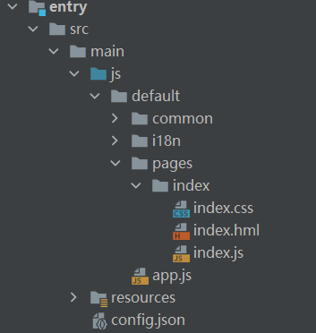
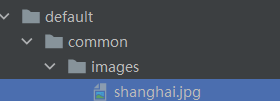

# 1.介绍

OpenHarmony 基于JS扩展的类Web开发范式支持图片业务的开发，本Codelab以图片操作的旋转、剪裁、缩放、镜像四种常见操作为例，给大家介绍图像编辑操作。基于JS扩展的类Web开发范式是一种跨设备的高性能UI开发框架，支持声明式编程和跨设备多态UI。

本案例部署到Hi3516DV300开发板上的效果如下图所示：


# 2.相关概念

[image组件](https://gitee.com/openharmony/docs/blob/master/zh-cn/application-dev/reference/arkui-js/js-components-basic-image.md)：图片组件，用来渲染展示图片。

[button组件](https://gitee.com/openharmony/docs/blob/master/zh-cn/application-dev/reference/arkui-js/js-components-basic-button.md)：按钮组件，用于实现点击效果并实现点击触发事件。

[div组件](https://gitee.com/openharmony/docs/blob/master/zh-cn/application-dev/reference/arkui-js/js-components-container-div.md)：基础容器组件，用作页面结构的根节点或将内容进行分组。

[text组件](https://gitee.com/openharmony/docs/blob/master/zh-cn/application-dev/reference/arkui-js/js-components-basic-text.md)：文本组件，用于呈现一段信息。

# 3.搭建OpenHarmony环境

完成本篇Codelab我们首先要完成开发环境的搭建，本示例以**Hi3516DV300**开发板为例，参照以下步骤进行：

1. [获取OpenHarmony系统版本](https://gitee.com/openharmony/docs/blob/master/zh-cn/device-dev/get-code/sourcecode-acquire.md#%E8%8E%B7%E5%8F%96%E6%96%B9%E5%BC%8F3%E4%BB%8E%E9%95%9C%E5%83%8F%E7%AB%99%E7%82%B9%E8%8E%B7%E5%8F%96)：标准系统解决方案（二进制）

   以3.0版本为例：

   

2. 搭建烧录环境

   1.  [完成DevEco Device Tool的安装](https://gitee.com/openharmony/docs/blob/master/zh-cn/device-dev/quick-start/quickstart-standard-env-setup.md)

   2.  [完成Hi3516开发板的烧录](https://gitee.com/openharmony/docs/blob/master/zh-cn/device-dev/quick-start/quickstart-lite-steps-hi3516-burn.md)

3. 搭建开发环境

   1.  开始前请参考[下载与安装软件](https://developer.harmonyos.com/cn/docs/documentation/doc-guides/software_install-0000001053582415)、[配置开发环境](https://gitee.com/openharmony/docs/blob/master/zh-cn/application-dev/quick-start/configuring-openharmony-sdk.md)，完成DevEco Studio的安装和开发环境配置。
   2.  开发环境配置完成后，请参考[使用工程向导](https://gitee.com/openharmony/docs/blob/master/zh-cn/application-dev/quick-start/use-wizard-to-create-project.md)创建工程，使用JS或者eTS语言开发、“Application”为例，模板选择“\[Standard\]Empty Ability”。
   3.  工程创建完成后，可参考下面章节进行代码编写，使用真机进行调测：

   -   [配置OpenHarmony应用签名信息](https://gitee.com/openharmony/docs/blob/master/zh-cn/application-dev/quick-start/configuring-openharmony-app-signature.md)
   -   [hap包安装指导](https://gitee.com/openharmony/docs/blob/master/zh-cn/application-dev/quick-start/installing-openharmony-app.md)
   -   工程示例：

   

# 4.代码结构解读

本篇Codelab只对核心代码进行讲解，整个工程的代码结构如下：



- common：存放公共资源

- index：构成图片操作的主页面

  index.hml：布局文件

  index.css：样式文件

  index.js：逻辑处理文件

- config.json：配置文件

# 5.任务一：页面设计

在这个任务中，我们完成UI界面的设计，具体步骤：

-   准备所使用的图片等相关资源。
-   编写样式文件index.css。
-   编写图形背景数据。
-   编写主页面。

1. 在default/common/images 目录下放入案例要用到的图片：

   

2. 在src/main/js/default/pages/index/index.css中编写需要用到的样式，样式代码如下：

   ```
   .container {
       justify-content: flex-start;
       left: 0px;
       top: 0px;
       width: 100%;
       height: 100%;
       flex-direction: column;
   }
   .title {
       font-size: 30px;
       text-align: center;
       width: 200px;
       height: 100px;
       justify-content: center;
       align-items: center;
   }
   .title-div{
       width: 100%;
       height: 100px;
       align-items: center;
       justify-content: center;
   }
   .button-div{
       justify-content: center;
       height: 100px;
   }
   .button{
       margin: 10px;
       font-size: 22px;
       background-color: #e9e9e9;
       text-color: black;
       width: 180px;
       text-align: center;
       height: 120px;
   }
   .image-div{
       width: 100%;
       justify-content: center;
       margin-top: 100px;
   }
   .image{
       width: 576px;
       height: 432px;
   }
   ```

3. 在src/main/js/default/pages/index/index.js中准备所需要用到的数据：

   ```
   data: {
       // demo标题
       title: '图像开发',
       // 图片资源位置
       imageUrl: '/common/images/shanghai.jpg',
       // 是否旋转判定标志，默认为true
       isRevolve: true,
       // 是否剪裁判定标志，默认为false
       isCut: false,
       // 是否缩放判定标志，默认为false
       isScale: false,
       // 是否镜像判定标志，默认为false
       isMirror: false,
       // 用以记录旋转的角度（以图片组件中中心为旋转中心）
       degrees: 0,
       // 用以记录以y轴方向旋转的角度
       yDegrees: 0,
       // 用以记录旋转次数（默认为0，最大为3，因为默认一次旋转90°，四次还原）
       rotateIndex: 0,
       // 图片宽度
       width: 576,
       // 图片高度
       height: 488,
       // 剪裁区域值数组（值分别指的是距离top, right, bottom, left 四个点的数值，默认都为0）
       clipArray: [0, 0, 0, 0]
     }
   ```

4. 完成程序页面的新建和设计，将程序使用到的image组件添加到布局文件index.hml中：

   ```
   <div class="container">
       <div class="title-div"  >
           <text class="title">
               {{title}}
           </text>
       </div>
       <div class="button-div" >
           <button class="button" onclick="imageRotate">旋转</button>
           <button class="button" onclick="imageCut">剪裁</button>
           <button class="button" onclick="imageScale">缩放</button>
           <button class="button" onclick="imageMirror">镜像</button>
       </div>
       <div class="image-div">
           <image if="{{isRevolve}}" ref="image1" src="{{imageUrl}}" class="image" style="transform: rotate({{degrees}});"></image>
           <image if="{{isCut}}" ref="image2" src="{{imageUrl}}" class="image" style="clip-path:inset({{clipArray[0]}}, {{clipArray[1]}}, {{clipArray[2]}}, {{clipArray[3]}});"></image>
           <image if="{{isScale}}" ref="image3" src="{{imageUrl}}" style="width:{{width}}px;height:{{height}}px;"></image>
           <image if="{{isMirror}}" ref="image4" src="{{imageUrl}}" class="image" style="transform: rotateY({{yDegrees}})"></image>
       </div>
   </div>
   ```

# 6.任务二：添加交互事件

1. 为图片组件绑定数据：

   ```
   <div class="image-div">
       <image if="{{isRevolve}}" ref="image1" src="{{imageUrl}}" class="image" style="transform: rotate({{degrees}});"></image>
       <image if="{{isCut}}" ref="image2" src="{{imageUrl}}" class="image" style="clip-path:inset({{clipArray[0]}}, {{clipArray[1]}}, {{clipArray[2]}}, {{clipArray[3]}});"></image>
       <image if="{{isScale}}" ref="image3" src="{{imageUrl}}" style="width:{{width}}px;height:{{height}}px;"></image>
       <image if="{{isMirror}}" ref="image4" src="{{imageUrl}}" class="image" style="transform: rotateY({{yDegrees}})"></image>
   </div>
   ```

2. 为4个button组件添加点击事件，分别实现点击旋转、剪裁、缩放、镜像的效果：

   ```
   <div class="button-div" >
       <button class="button" onclick="imageRotate">旋转</button>
       <button class="button" onclick="imageCut">剪裁</button>
       <button class="button" onclick="imageScale">缩放</button>
       <button class="button" onclick="imageMirror">镜像</button>
   </div>
   ```

3. 在src/main/js/default/pages/index/index.js中实现相应方法：

   -   旋转

   ```
   // 旋转
   imageRotate() {
     if (!this.isRevolve) {
       this.isRevolve = true;
       this.isCut = false;
       this.isScale = false;
       this.isMirror = false;
       this.rotateIndex = 0;
     }
     if (this.rotateIndex < 3) {
       this.rotateIndex++;
     } else {
       this.rotateIndex = 0;
     }
     this.degrees = this.rotateIndex * 90;
   }
   ```

   -   剪裁

   ```
   // 剪裁
   imageCut() {
     if (!this.isCut) {
       this.isRevolve = false;
       this.isCut = true;
       this.isScale = false;
       this.isMirror = false;
     }
     if (this.clipArray[2] === 0) {
       // 值指的是 top, right, bottom, left 四个点
       this.clipArray = [0, 0, this.height / 2, 0];
     } else {
       this.clipArray = [0, 0, 0, 0];
     }
   }
   ```

   -   缩放

   ```
   // 缩放
   imageScale() {
     if (!this.isScale) {
       this.isRevolve = false;
       this.isCut = false;
       this.isScale = true;
       this.isMirror = false;
       if (this.width === 576) {
         this.width = this.width / 2;
         this.height = this.height / 2;
       }
     } else {
       if (this.width === 576) {
         this.width = this.width / 2;
         this.height = this.height / 2;
       } else {
         this.width = this.width * 2;
         this.height = this.height * 2;
       }
     }
   }
   ```

   -   镜像

   ```
   // 镜像
   imageMirror() {
     if (!this.isMirror) {
       this.isRevolve = false;
       this.isCut = false;
       this.isScale = false;
       this.isMirror = true;
       this.yDegrees = 0;
     }
     if (this.yDegrees === 0) {
       this.yDegrees = 180;
     } else {
       this.yDegrees = 0;
     }
   }
   ```

# 7.恭喜你

恭喜你已经成功完成了本篇Codelab，并且学到了：

-   image组件的使用
-   button组件的使用
-   text组件的使用
-   图片的旋转、剪裁、缩放、镜像四种常见操作

# 8.参考

[gitee地址](https://gitee.com/openharmony/codelabs/tree/master/Media/ImageJsDemo)