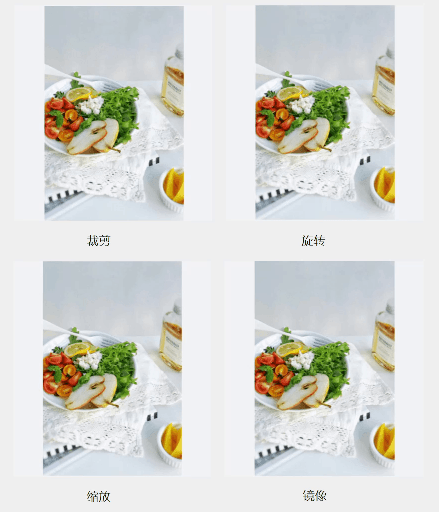

# 图片常见操作（JS）

## 介绍

本篇Codelab通过动态设置元素样式的方式，实现几种常见的图片操作，包括裁剪、旋转、缩放和镜像。效果如图所示：


### 相关概念

-   [image组件](https://gitcode.com/openharmony/docs/blob/OpenHarmony-3.2-Release/zh-cn/application-dev/reference/arkui-js/js-components-basic-image.md)：图片组件，用来渲染展示图片。
-   [div组件](https://gitcode.com/openharmony/docs/blob/OpenHarmony-3.2-Release/zh-cn/application-dev/reference/arkui-js/js-components-container-div.md)：基础容器组件，用作页面结构的根节点或将内容进行分组。
-   [text组件](https://gitcode.com/openharmony/docs/blob/OpenHarmony-3.2-Release/zh-cn/application-dev/reference/arkui-js/js-components-basic-text.md)：文本组件，用于呈现一段信息。
-   [setstyle](https://gitcode.com/openharmony/docs/blob/OpenHarmony-3.2-Release/zh-cn/application-dev/reference/arkui-js/js-components-create-elements.md#setstyle)：动态设置组件样式的方法。

## 环境搭建

### 软件要求

-   [DevEco Studio](https://gitcode.com/openharmony/docs/blob/master/zh-cn/application-dev/quick-start/start-overview.md#%E5%B7%A5%E5%85%B7%E5%87%86%E5%A4%87)版本：DevEco Studio 3.1 Release及以上版本。
-   OpenHarmony SDK版本：API version 9及以上版本。

### 硬件要求

-   开发板类型：[润和RK3568开发板](https://gitcode.com/openharmony/docs/blob/master/zh-cn/device-dev/quick-start/quickstart-appendix-rk3568.md)。
-   OpenHarmony系统：3.2 Release及以上版本。

### 环境搭建

完成本篇Codelab我们首先要完成开发环境的搭建，本示例以**RK3568**开发板为例，参照以下步骤进行：

1.  [获取OpenHarmony系统版本](https://gitcode.com/openharmony/docs/blob/master/zh-cn/device-dev/get-code/sourcecode-acquire.md#%E8%8E%B7%E5%8F%96%E6%96%B9%E5%BC%8F3%E4%BB%8E%E9%95%9C%E5%83%8F%E7%AB%99%E7%82%B9%E8%8E%B7%E5%8F%96)：标准系统解决方案（二进制）。以3.2 Release版本为例：

    

2.  搭建烧录环境。
    1.  [完成DevEco Device Tool的安装](https://gitcode.com/openharmony/docs/blob/master/zh-cn/device-dev/quick-start/quickstart-ide-env-win.md)
    2.  [完成RK3568开发板的烧录](https://gitcode.com/openharmony/docs/blob/master/zh-cn/device-dev/quick-start/quickstart-ide-3568-burn.md)

3.  搭建开发环境。
    1.  开始前请参考[工具准备](https://gitcode.com/openharmony/docs/blob/master/zh-cn/application-dev/quick-start/start-overview.md#%E5%B7%A5%E5%85%B7%E5%87%86%E5%A4%87)，完成DevEco Studio的安装和开发环境配置。
    2.  开发环境配置完成后，请参考[使用工程向导](https://gitcode.com/openharmony/docs/blob/master/zh-cn/application-dev/quick-start/start-with-ets-stage.md#创建ets工程)创建工程（模板选择“Empty Ability”）。
    3.  工程创建完成后，选择使用[真机进行调测](https://gitcode.com/openharmony/docs/blob/master/zh-cn/application-dev/quick-start/start-with-ets-stage.md#使用真机运行应用)。

## 代码结构解读

本篇Codelab只对核心代码进行讲解，对于完整代码，我们会在gitcode中提供。

```
├──entry/src/main/js	              // 代码区
│  └──MainAbility
│     ├──common
│     │  ├──constants
│     │  │  └──commonConstants.js     // 公共数据常量
│     │  └──images
│     ├──i18n		                  // 中英文	
│     │  ├──en-US.json			
│     │  └──zh-CN.json			
│     └──pages
│        └──index
│           ├──index.css              // 首页样式文件	
│           ├──index.hml              // 首页布局文件
│           └──index.js               // 首页脚本文件
└──entry/src/main/resources           // 应用资源目录
```

## 构建界面

本示例主界面由上至下分为三部分：顶部标题栏、中间图片区域、底部操作栏。


标题栏中的元素呈水平分布，包含“返回”图标、“编辑”标题和“保存”图标。div容器内元素默认为水平分布，开发者将对应元素置于div容器组件中即可。“返回”图标和“编辑”标题置于同一个子div容器中，组成一个新元素，与“保存”图标分别置于父div容器的水平两侧。

```html
<!-- index.hml -->
<!-- 顶部标题栏 -->
<div class="title-container">
    <div>
        <image src="/common/images/ic_back.png" class="image-back"></image>
        <text class="title-text">{{ $t('strings.edit') }}</text>
    </div>
    <image src="/common/images/ic_save.png" class="image-save"></image>
</div>
```
```css
/* index.css */
.title-container {
    justify-content: space-between;
    width: 100%;
    padding-top: 13vp;
    padding-left: 26vp;
    padding-bottom: 15vp;
    padding-right: 24vp;
}
```

图片区域用于展示被编辑的图片，使用div容器组件限定区域范围。再通过设置样式，使范围内的图片居中展示。图片组件image设置object-fit属性为contain，确保图片保持宽高比缩放，并在区域内完整展示。

```html
<!-- index.hml -->
<!-- 图片区域 -->
<div class="image-container">
    <image id="picture" src="/common/images/ic_meals.png" class="picture"></image>
</div>
```

```css
/* index.css */
.image-container {
    justify-content: center;
    width: 100%;
    height: 68%;
    flex-direction: column;
    align-items: center;
}

.picture {
    object-fit: contain;
}
```

操作栏包含裁剪、旋转、缩放和镜像四种常见操作按钮。他们的布局和数据结构相同，可采用for循环的方式进行渲染。每个按钮的图标和文字都是垂直分布，也是通过设置对应样式达到效果。

```html
<!-- index.hml -->
<!-- 操作栏 -->
<div>
    <div class="button-container" for="item in buttonList" on:click="pictureManipulation({{ item.buttonType }})">
        <image src="{{ item.src }}" class="button-icon">
        </image>
        <text class="operation-text">{{ item.description }}</text>
    </div>
</div>
```

```css
/* index.css */
.button-icon {
    width: 27vp;
    height: 27vp;
    margin-left: 24vp;
    margin-right: 24vp;
    margin-top: 52vp;
    margin-bottom: 6vp;
}

.operation-text {
    font-size: 12fp;
    color: #182431;
}

.button-container {
    justify-content: center;
    flex-direction: column;
    align-items: center;
    width: 100%;
}
```

## 编辑图片  



使用指定元素的setStyle\(name: string, value: string\)方法，可以动态设置该元素样式。当前示例正是基于此方式，实现了对图片裁剪、旋转、缩放以及镜像操作。

-   裁剪操作：使用clip-path样式，设置组件的裁剪区域，只显示区域内的部分，实现对图片的裁剪操作。
-   旋转操作：使用transform动画样式，设置组件的旋转动画属性，实现对图片的旋转操作。
-   缩放操作：动态等比例设置组件宽、高属性，实现对图片的缩放操作。
-   镜像操作：使用transform动画样式，设置组件的Y轴方向旋转动画属性，实现对图片的旋转操作。

```javascript
// index.js
pictureManipulation(buttonType) {
  if (this.isCropped || this.isRotated || this.isZoomed || this.isMirror) {
    this.$element('picture').setStyle('clipPath', 'inset(0, 0, 0, 0');
    this.$element('picture').setStyle('transform', 'rotate(0)');
    this.$element('picture').setStyle('height', this.imageHeight);
    this.$element('picture').setStyle('width', this.imageWidth);
    this.$element('picture').setStyle('transform', 'rotateY(0)');
    this.degrees = 0;
    this.rotateY = 0;
    this.isCropped = false;
    this.isRotated = false;
    this.isZoomed = false;
    this.isMirror = false;
  } else {
    switch (buttonType) {
      case CommonConstants.OperationType.CROP:
        this.$element('picture')
          .setStyle('clipPath', 'inset(0, 0, ' + (this.imageHeight / CommonConstants.SPLIT_IN_HALF) + ', 0');
        this.isCropped = true;
        break;
      case CommonConstants.OperationType.ROTATE:
        this.degrees = this.degrees + CommonConstants.ROTATE_DEGREE;
        this.$element('picture').setStyle('transform', 'rotate(' + this.degrees + ')');
        this.isRotated = true;
        break;
      case CommonConstants.OperationType.ZOOM:
        this.$element('picture').setStyle('height', this.imageHeight / CommonConstants.SPLIT_IN_HALF);
        this.$element('picture').setStyle('width', this.imageWidth / CommonConstants.SPLIT_IN_HALF);
        this.isZoomed = true;
        break;
      case CommonConstants.OperationType.MIRROR:
        this.rotateY = this.rotateY + CommonConstants.ROTATE_Y;
        this.$element('picture').setStyle('transform', 'rotateY(' + this.rotateY + ')');
        this.isMirror = true;
        break;
      default:
        hilog.info(0x0000, 'ImageOperation', '%{public}s', 'Operation type is wrong!');
        break;
    }
  }
}
```

## 总结

您已经完成了本次Codelab的学习，并了解到以下知识点：

1.  clip-path、transform样式的使用。
2.  如何为指定元素动态设置样式。


