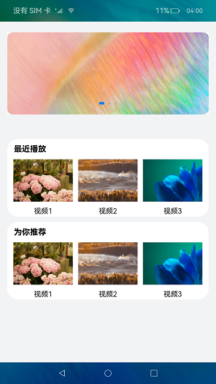
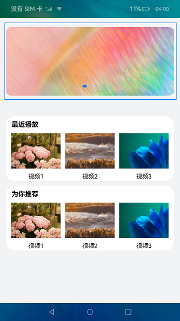
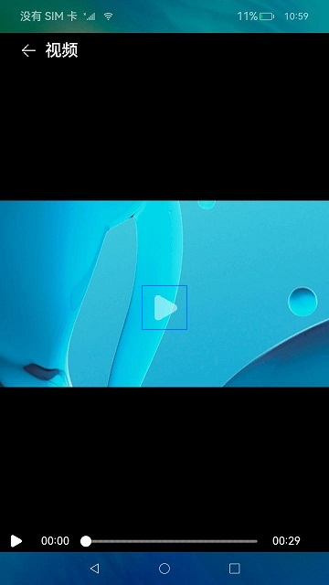
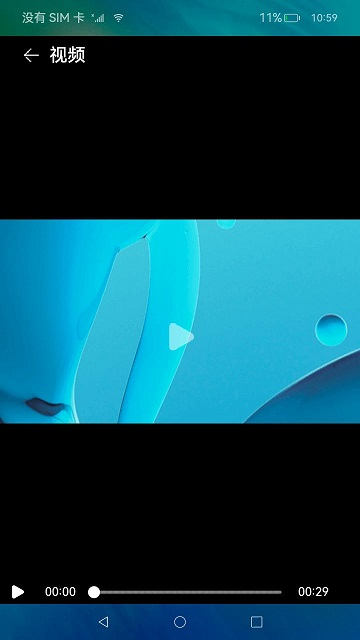

# 简易视频播放器（ArkTS）

## 介绍

本篇Codelab使用ArkTS语言实现视频播放器，主要包括主界面和视频播放界面，我们将一起完成以下功能：

1. 主界面顶部使用Swiper组件实现视频海报轮播。
2. 主界面下方使用List组件实现视频列表。
3. 播放界面使用Video组件实现视频播放。
4. 在不使用视频组件默认控制器的前提下，实现自定义控制器。
5. 播放界面底部使用图标控制视频播放/暂停。
6. 播放界面底部使用Slider组件控制和实现视频播放进度。
7. 播放界面使用Stack容器组件的[Ｚ序控制](https://gitee.com/openharmony/docs/blob/master/zh-cn/application-dev/reference/arkui-ts/ts-universal-attributes-z-order.md)实现在视频播放画面上添加开始／暂停/加载图标。


### 相关概念

-   [Swiper](https://gitee.com/openharmony/docs/blob/master/zh-cn/application-dev/reference/arkui-ts/ts-container-swiper.md)组件：滑动容器，提供切换子组件显示的能力。
-   [List](https://gitee.com/openharmony/docs/blob/master/zh-cn/application-dev/reference/arkui-ts/ts-container-list.md)组件：列表包含一系列相同宽度的列表项。适合连续、多行呈现同类数据，例如图片和文本。
-   [Video](https://gitee.com/openharmony/docs/blob/master/zh-cn/application-dev/reference/arkui-ts/ts-media-components-video.md)组件：用于播放视频文件并控制其播放状态的组件。
-   [Navigator](https://gitee.com/openharmony/docs/blob/master/zh-cn/application-dev/reference/arkui-ts/ts-container-navigator.md)组件：路由容器组件，提供路由跳转能力。
-   [ForEach](https://gitee.com/openharmony/docs/blob/master/zh-cn/application-dev/quick-start/arkts-rendering-control-foreach.md)组件：基于数组类型数据执行循环渲染。

## 环境搭建

### 软件要求

-   [DevEco Studio](https://gitee.com/openharmony/docs/blob/master/zh-cn/application-dev/quick-start/start-overview.md#%E5%B7%A5%E5%85%B7%E5%87%86%E5%A4%87)版本：DevEco Studio 3.1 Release及以上版本。
-   OpenHarmony SDK版本：API version 9及以上版本。

### 硬件要求

-   开发板类型：[润和RK3568开发板](https://gitee.com/openharmony/docs/blob/master/zh-cn/device-dev/quick-start/quickstart-appendix-rk3568.md)。
-   OpenHarmony系统：3.2 Release及以上版本。

### 环境搭建

完成本篇Codelab我们首先要完成开发环境的搭建，本示例以**RK3568**开发板为例，参照以下步骤进行：

1. [获取OpenHarmony系统版本](https://gitee.com/openharmony/docs/blob/master/zh-cn/device-dev/get-code/sourcecode-acquire.md#%E8%8E%B7%E5%8F%96%E6%96%B9%E5%BC%8F3%E4%BB%8E%E9%95%9C%E5%83%8F%E7%AB%99%E7%82%B9%E8%8E%B7%E5%8F%96)：标准系统解决方案（二进制）。以3.2 Release版本为例：

   

2. 搭建烧录环境。

   1.  [完成DevEco Device Tool的安装](https://gitee.com/openharmony/docs/blob/master/zh-cn/device-dev/quick-start/quickstart-ide-env-win.md)
   2.  [完成RK3568开发板的烧录](https://gitee.com/openharmony/docs/blob/master/zh-cn/device-dev/quick-start/quickstart-ide-3568-burn.md)

3. 搭建开发环境。

   1.  开始前请参考[工具准备](https://gitee.com/openharmony/docs/blob/master/zh-cn/application-dev/quick-start/start-overview.md#%E5%B7%A5%E5%85%B7%E5%87%86%E5%A4%87)，完成DevEco Studio的安装和开发环境配置。
   2.  开发环境配置完成后，请参考[使用工程向导](https://gitee.com/openharmony/docs/blob/master/zh-cn/application-dev/quick-start/start-with-ets-stage.md#创建ets工程)创建工程（模板选择“Empty Ability”）。
   3.  工程创建完成后，选择使用[真机进行调测](https://gitee.com/openharmony/docs/blob/master/zh-cn/application-dev/quick-start/start-with-ets-stage.md#使用真机运行应用)。

## 代码结构解读

本篇Codelab只对核心代码进行讲解，对于完整代码，我们会在gitee中提供。

```
├──entry/src/main/ets	        // 代码区
│  ├──common
│  │  └──constants
│  │     └──CommonConstants.ets	// 样式常量类
│  ├──entryability
│  │  └──EntryAbility.ts	    // 程序入口类
│  ├──model
│  │  └──VideoControll.ets	    // 视频播放控制相关方法类
│  ├──pages
│  │  ├──SimpleVideoIndex.ets   // 主界面
│  │  └──SimpleVideoPlay.ets    // 视频播放界面
│  ├──view
│  │  ├──IndexModule.ets        // 自定义首页List模块组件文件
│  │  ├──IndexSwiper.ets        // 自定义首页Swiper组件文件
│  │  ├──VideoPlayer.ets        // 自定义播放界面视频组件文件
│  │  └──VideoPlaySlider.ets    // 自定义播放界面视频进度条组件文件
│  └──viewmodel
│     └──VideoData.ets          // 首页相关数据
└──entry/src/main/resource      // 应用静态资源目录
```

## 构建主界面

主界面由视频轮播模块和多个视频列表模块组成，效果如图所示：



VideoData.ets中定义的视频轮播图数组SWIPER_VIDEOS和视频列表图片数组HORIZONTAL_VIDEOS。

```typescript
// VideoData.ets
export const SWIPER_VIDEOS: object[] = [
  {
    "image": $r("app.media.ic_banner1")
  },
  {
    "image": $r("app.media.ic_banner2")
  },
  {
    "image": $r("app.media.ic_banner3")
  }
];

export const HORIZONTAL_VIDEOS: object[] = [
  {
    "id": 1,
    "image": $r("app.media.ic_video_list0"),
    "name": '视频1'
  },
  {
    "id": 2,
    "image": $r("app.media.ic_video_list1"),
    "name": '视频2'
  },
  {
    "id": 3,
    "image": $r("app.media.ic_video_list2"),
    "name": '视频3'
  }
];
```

IndexSwiper.ets文件中定义的轮播图子组件SwiperVideo，点击轮播图片，页面跳转到视频播放页面，并携带本地视频flag，效果如图所示：



```typescript
//IndexSwiper.ets
@Component
export struct SwiperVideo {

  build() {
    Column() {
      Swiper() {
        ForEach(SWIPER_VIDEOS, item => {
          SwiperItem({ imageSrc: item.image, source: $rawfile('videoTest.mp4') })
        }, item => JSON.stringify(item))
      }
      .autoPlay(true)
    }
    // 样式设置
    ...
  }
}

@Component
struct SwiperItem {
  private imageSrc: Resource;
  private source: Resource;

  build() {
    // 跳转一：使用Navigator组件跳转到视频播放界面
    Navigator({ target: SECOND_PAGE, type: NavigationType.Push }) {
      Image(this.imageSrc)
        .borderRadius(MARGIN_FONT_SIZE.FIRST_MARGIN)
    }
    .params({ source: this.source })
  }
}
```

IndexModule.ets文件中定义的视频列表图片子组件VideoModule，点击子组件中的图片，页面跳转到视频播放页面，并携带网络视频flag，效果如图所示：


```typescript
// IndexModule.ets
@Component
export struct VideoModule {
  private moduleName: string;

  build() {
    Column() {
      // 视频列表上方的文本信息
      ...
      // 视频列表组件
      List({ space: MARGIN_FONT_SIZE.FIRST_MARGIN }) {
        ForEach(HORIZONTAL_VIDEOS, item => {
          ListItem() {
            HorizontalItem({
              imageSrc: item.image,
              source: NET,
              videoName: item.name
            })
          }
        }, item => JSON.stringify(item))
      }
      // 设置列表横向排列
      .listDirection(Axis.Horizontal)
    }
    // 样式设置
    ...
  }
}

@Component
struct HorizontalItem {
  private imageSrc: Resource;
  private source: string;
  private videoName: string;

  build() {
    // 跳转二：使用route跳转到视频播放界面
    Column() {
      Image(this.imageSrc)
        .width(MARGIN_FONT_SIZE.SEVENTH_MARGIN)
        .height(MARGIN_FONT_SIZE.SIXTH_MARGIN)
        .onClick(() => {
          router.pushUrl({
            url: SECOND_PAGE,
            params: { source: this.source }
          });
        })
     ...
    }
    .justifyContent(FlexAlign.Center)
  }
}
```

在SimpleVideoIndex.ets主界面中引用SwiperVideo和VideoModule子组件。

```typescript
// SimpleVideoIndex.ets
@Entry
@Component
struct SimpleVideoIndex {
  build() {
    Column({ space: MARGIN_FONT_SIZE.FOURTH_MARGIN }) {
      // 视频轮播组件
      SwiperVideo()
      List() {
        ForEach(LIST, (item) => {
          ListItem() {
            VideoModule({ moduleName: item })
              .margin({ top: MARGIN_FONT_SIZE.FIRST_MARGIN })
          }
        }, item => JSON.stringify(item))
      }
      .listDirection(Axis.Vertical)
      .margin({ top: MARGIN_FONT_SIZE.THIRD_MARGIN })
    }
    ...
  }
}
```

## 构建视频播放界面

VideoPlayer.ets其中定义了视频播放子组件VideoPlayer ，onPrepared回调方法中可以获取视频总时长，onUpdate回调方法中可实时获取到视频播放的当前时间戳，onFinish是视频播放结束后的回调方法，onError是视频播放出错的回调方法。

```typescript
// VideoPlayer.ets
@Component
export struct VideoPlayer {
  private source: String | Resource;
  private controller: VideoController;
  private previewUris: Resource = $r('app.media.ic_preview');
  @Provide currentTime: number = 0;
  @Provide durationTime: number = 0;
  @Provide durationStringTime: string = START_TIME;
  @Provide currentStringTime: string = START_TIME;
  @Consume isPlay: boolean;
  @Consume isOpacity: boolean ;
  @Consume flag: boolean;
  @Consume isLoading: boolean;
  @Consume progressVal: number;

  build() {
    Column() {
      Video({
        src: this.source,
        previewUri: this.previewUris,
        controller: this.controller
      })
        .width(ALL_PERCENT)
        .height(STRING_PERCENT.NINETY_PERCENT)
        .controls(false)
        .autoPlay(false)
        .objectFit(ImageFit.Contain)
        .loop(false)
        .onUpdate((event) => {
          this.currentTime = event.time;
          this.currentStringTime = changeSliderTime(this.currentTime);
         })
        .onPrepared((event) => {
          prepared.call(this, event);
        })
        .onFinish(() => {
          finish.call(this);
        })
        .onError(() => {
          prompt.showToast({
            duration: COMMON_NUM_DURATION,
            message: MESSAGE
          });
        })
      VideoSlider({ controller: this.controller })
    }
  }
}
```

在自定义组件VideoPlayer底部使用了自定义子组件VideoSlider，VideoSlider自定义组件中显示和控制视频播放进度，效果如图所示：



```typescript
// VideoPlaySlider.ets
@Component
export struct VideoSlider {
  @Consume isOpacity: boolean;
  private controller: VideoController;
  @Consume  currentStringTime: string;
  @Consume  currentTime: number;
  @Consume durationTime: number;
  @Consume durationStringTime: string;
  @Consume isPlay: boolean;
  @Consume flag: boolean;
  @Consume isLoading: boolean;
  @Consume progressVal: number;

  build() {
    Row({ space: MARGIN_FONT_SIZE.FIRST_MARGIN }) {
      ...
      Slider({
        value: this.currentTime,
        min: 0,
        max: this.durationTime,
        step: 1,
        style: SliderStyle.OutSet
      })
        .blockColor($r("app.color.white"))
        .width(STRING_PERCENT.SLIDER_WITH)
        .trackColor(Color.Gray)
        .selectedColor($r("app.color.white"))
        .showSteps(true)
        .showTips(true)
        .trackThickness(this.isOpacity ? SMALL_TRACK_THICK_NESS : BIG_TRACK_THICK_NESS)
        .onChange((value: number, mode: SliderChangeMode) => {
          sliderOnchange.call(this, value, mode);
        })
      ...

    }
    .opacity(this.isOpacity ? DEFAULT_OPACITY : 1)
    .width(ALL_PERCENT)
   }
}
```

在VideoController.ets中的视频控制和回调的相关方法。

```typescript
// VideoControll.ets
export function prepared(event) {
  // 获取视频资源时长，单位（秒）
  this.durationTime = event.duration;
  // 转成mm:ss类型，计算其mm 和 ss
  let second: number = event.duration % COMMON_NUM_MINUTE;
  let min: number = parseInt((event.duration / COMMON_NUM_MINUTE).toString());
  let head = min < COMMON_NUM_DOUBLE ? `${ZERO_STR}${min}` : min;
  let end = second < COMMON_NUM_DOUBLE ? `${ZERO_STR}${second}` : second;
  this.durationStringTime = `${head}${SPLIT}${end}`;
  this.flag = true;
}

export function finish() {
  // 结束播放后修改isPlay 重新渲染控制图标,控制图标显形
  this.isPlay = false;
  this.isOpacity = false;
}

export function sliderOnchange(value: number, mode: SliderChangeMode) {
  this.currentTime = parseInt(value.toString());
  this.controller.setCurrentTime(parseInt(value.toString()), SeekMode.Accurate);
  if (mode === SliderChangeMode.Begin) {
    this.isOpacity = false;
  }
  if (mode === SliderChangeMode.Moving) {
    this.isOpacity = false;
  }
  if (mode === SliderChangeMode.End) {
    this.isOpacity = true;
  }
};

export function changeSliderTime(value: number): string {
  let second: number = value % COMMON_NUM_MINUTE;
  let min: number = parseInt((value / COMMON_NUM_MINUTE).toString());
  let head = min < COMMON_NUM_DOUBLE ? `${ZERO_STR}${min}` : min;
  let end = second < COMMON_NUM_DOUBLE ? `${ZERO_STR}${second}` : second;
  let nowTime = `${head}${SPLIT}${end}`;
  return nowTime;
}

export function iconOnclick() {
  if (this.isPlay) {
    this.controller.pause()
    this.isPlay = false;
    this.isOpacity = false;
    return;
  }
  if(this.flag) {
    this.controller.start();
    this.isPlay = true;
    this.isOpacity = true;
  } else {
    let that = this;
    that.isLoading = true;
    // 视频加载未完成。显示加载动作
    let intervalLoading = setInterval(function() {
      if (that.progressVal >= STACK_STYLE.PROGRESS_TOTAL) {
        that.progressVal = 0;
      } else {
        that.progressVal += STACK_STYLE.PROGRESS_STEP;
      }
    }, STACK_STYLE.MILLI_SECONDS)
    // 定时任务判断视频加载是否完成
    let intervalFlag = setInterval(function() {
      if (that.flag) {
        that.controller.start();
        that.isPlay = true;
        that.isOpacity = true;
        that.isLoading = false;
        clearInterval(intervalFlag);
        clearInterval(intervalLoading);
      }
    }, STACK_STYLE.MILLI_SECONDS);
  }
}
```

在SimpleVideoPlay.ets播放界面，引用VideoPlayer子组件，并在视频播放页面使用堆叠容器，在视频播放画面中心堆叠控制、视频加载图标，效果如图所示：



```typescript
// SimpleVideoPlay.ets
@Entry
@Component
struct Play {
  // 取到Index页面跳转来时携带的source对应的数据。
  private source: string = router.getParams()['source'];
  private startIconResource: Resource = $r('app.media.ic_public_play');
  private backIconResource: Resource = $r('app.media.ic_back');
  @Provide isPlay: boolean = false;
  @Provide isOpacity: boolean = false ;
  controller: VideoController = new VideoController();
  @Provide isLoading: boolean = false;
  @Provide progressVal: number = 0;
  @Provide flag: boolean = false;

  onPageHide() {
    this.controller.pause();
  }

  build() {
    Column() {
      // 顶部返回以及标题
　　　　...
      Stack() {
        // 不同的播放状态渲染不同得控制图片
        if (!this.isPlay && !this.isLoading) {
          Image(this.startIconResource)
            .width(MARGIN_FONT_SIZE.FIFTH_MARGIN)
            .height(MARGIN_FONT_SIZE.FIFTH_MARGIN)
            // 同一容器中兄弟组件显示层级关系，z值越大，显示层级越高 用于控制图片在视频上。
            .zIndex(STACK_STYLE.IMAGE_Z_INDEX)
        }
        if (this.isLoading) {
          Progress({
            value: STACK_STYLE.PROGRESS_VALUE,
            total: STACK_STYLE.PROGRESS_TOTAL,
            type: ProgressType.ScaleRing
        })
          .color(Color.Grey)
          .value(this.progressVal)
          .width(STACK_STYLE.PROGRESS_WIDTH)
          .style({
            strokeWidth: STACK_STYLE.PROGRESS_STROKE_WIDTH,
            scaleCount: STACK_STYLE.PROGRESS_SCALE_COUNT,
            scaleWidth: STACK_STYLE.PROGRESS_SCALE_WIDTH
          })
          .zIndex(STACK_STYLE.PROGRESS_Z_INDEX)
       }
        VideoPlayer({
          source: this.source,
          controller: this.controller
        })
          .zIndex(0)
      }
    }
    .height(ALL_PERCENT)
    .backgroundColor(Color.Black)
  }
}
```

## 总结

您已经完成了本次Codelab的学习，并了解到以下知识点：

1.  Swiper组件的使用。
2.  List组件的使用。
3.  Video组件的使用。
4.  Slider组件的使用。
5.  如何实现自定义视频控制器。


