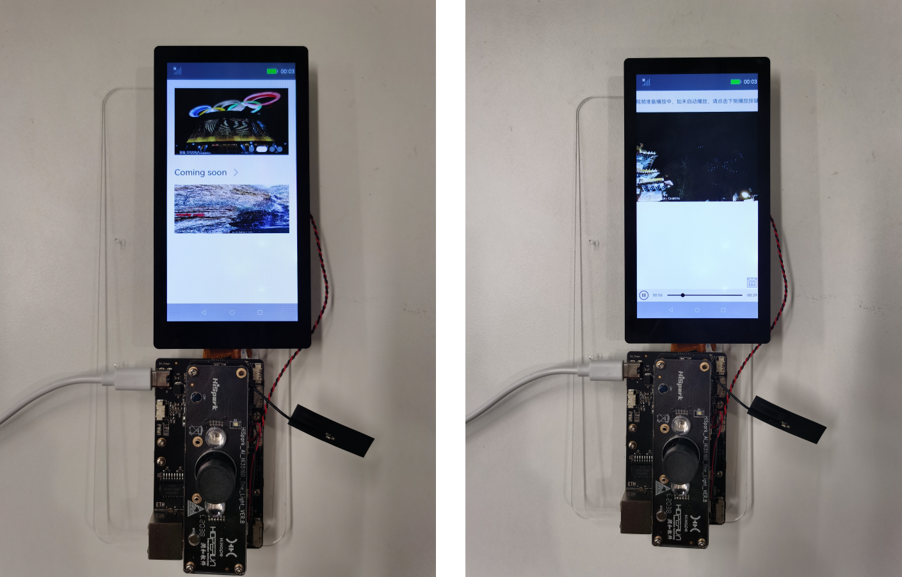
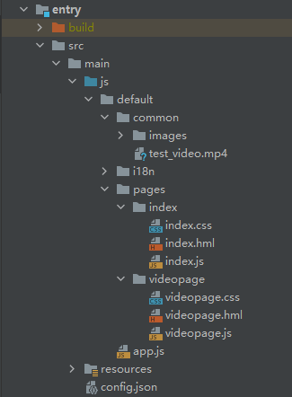

# 介绍

本篇Codelab我们将教会大家如何构建一个简易的OpenHarmony视频播放器（JS版本）。应用包含两级页面，分别是主页面和播放页面，两个页面都展示了丰富的JS UI组件。本教程将结合以下内容进行讲解：

1．主页面顶部使用swiper组件完成视频海报轮播

2．主页面底部使用list组件完成视频列表

3．播放页面使用video组件完成视频播放

**本案例部署到OpenHarmony的开发环境上，部署效果如下图所示：**



# 搭建OpenHarmony环境

完成本篇Codelab我们首先要完成开发环境的搭建，本示例以**Hi3516DV300**开发板为例，参照以下步骤进行：

1. [获取OpenHarmony系统版本](https://gitee.com/openharmony/docs/blob/master/zh-cn/device-dev/get-code/sourcecode-acquire.md#%E8%8E%B7%E5%8F%96%E6%96%B9%E5%BC%8F3%E4%BB%8E%E9%95%9C%E5%83%8F%E7%AB%99%E7%82%B9%E8%8E%B7%E5%8F%96)：标准系统解决方案（二进制）

   以3.0版本为例：

   

2. 搭建烧录环境

   1. 开始前请参考[工具准备](https://gitee.com/openharmony/docs/blob/master/zh-cn/application-dev/quick-start/start-overview.md#%E5%B7%A5%E5%85%B7%E5%87%86%E5%A4%87) ，完成DevEco Studio的安装和开发环境配置。
   2. 开发环境配置完成后，请参考[使用工程向导](https://gitee.com/openharmony/docs/blob/master/zh-cn/application-dev/quick-start/start-with-js-fa.md#%E5%88%9B%E5%BB%BAjs%E5%B7%A5%E7%A8%8B) 创建工程（模板选择“Empty Ability”），选择JS或者eTS语言开发。
   3. 工程创建完成后，选择使用[真机进行调测](https://gitee.com/openharmony/docs/blob/master/zh-cn/application-dev/quick-start/start-with-js-fa.md#%E4%BD%BF%E7%94%A8%E7%9C%9F%E6%9C%BA%E8%BF%90%E8%A1%8C%E5%BA%94%E7%94%A8) 。


# 代码结构解读

本篇Codelab只对核心代码进行讲解，对于完整代码，我们会在最后的参考中提供下载方式，接下来我们会用一小节来讲解整个工程的代码结构：



-   common：包含视频播放器所需要的图片资源和视频资源。
-   pages：用于存放所有页面的目录。
    -   index：构成视频播放器的主页面，包括index.hml布局文件，index.css样式文件，index.js逻辑处理文件。
    -   videopage：构成视频播放器的播放页面，包括videopage.hml布局文件，videopage.css样式文件，videopage.js逻辑处理文件。

-   config.json：配置文件。

# 视频播放器主页面

首先，为视频播放器主页面添加一个海报轮播图，需要用到容器组件swiper，其提供了切换子组件显示的能力。代码如下所示：

```
<swiper class="swiper" id="swiper" index="0" autoplay="true" indicator="true" loop="true">
    <div for="{{ swiperList }}">
        <image class="swiper_img" src="{{ $item.image }}" onclick="playVideo"></image>
    </div>
</swiper>
```

然后，为视频播放器主页面添加一个视频列表，需要用到容器组件list。列表是包含一系列相同宽度的列表项，适合连续、多行呈现同类数据，例如图片和文本，代码如下所示：

```
<list class="list">
    <list-item for="{{ videoList }}">
        <image class="list_img" src="{{ $item }}" onclick="playVideo"></image>
    </list-item>
</list>
```

最后，为图片的点击事件添加跳转逻辑，在点击图片后进入视频播放页面，代码如下所示：

```
import router from '@system.router';
export default {
    playVideo() {
        router.push({
            uri: 'pages/videopage/videopage'
        });
    }
}
```

# 视频播放器播放页面

JS视频播放器video组件的使用大家可以参考[【JS媒体组件】video的使用](https://gitee.com/openharmony/docs/blob/OpenHarmony-3.0-LTS/zh-cn/application-dev/js-reference/component/js-components-media-video.md)进行学习，其中详细的给大家介绍了如何将video组件添加到布局中，如何为页面添加样式、如何为组件添加响应事件等操作。

要实现一个视频播放器的功能，首先需要在config.json添加配置，代码如下所示：

```
"module": {
  ...
  "abilities": [
    {
      ...
      "configChanges": ["orientation"]
    }
  ]
}
```

然后，我们需要在页面中添加一个video组件，代码如下所示：

```
<div class="container">
    <video class="video" id="videoId" src="/common/test_video.mp4" autoplay="true"
           loop="true" controls="true" onclick="changeStartPause">
    </video>
</div>
```

最后，我们需要为video组件的onclick事件添加处理逻辑，代码如下所示：

```
export default {
    data: {
        isStart: true
    },
    // 点击播放和暂停视频
    changeStartPause() {
        if (this.isStart) {
            this.$element('videoId').pause();
            this.isStart = false;
        } else {
            this.$element('videoId').start();
            this.isStart = true;
        }
    }
}
```

# 回顾和总结

本篇Codelab我们最终构建了一个JS版本的视频播放器，应用包含两级页面，分别是主页面和播放页面，两个页面都展示了丰富的JS UI组件，本篇Codelab我们学会了swiper、list容器组件的使用和video媒体组件的使用。

# 恭喜您

目前你已经成功完成了Codelab并且学到了：

-   如何将一个JS项目部署到OpenHarmony设备上

-   swiper组件的使用
-   list组件的使用
-   video组件的使用
