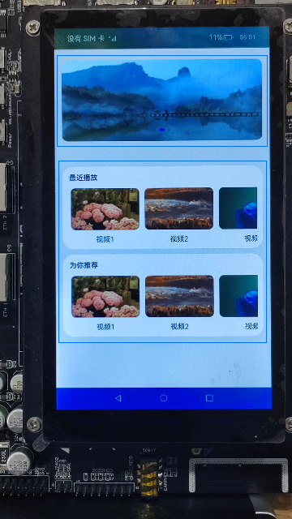
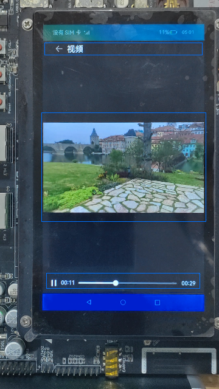
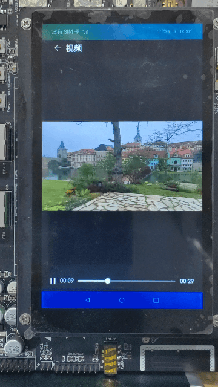

# 简易视频播放器（JS）

## 介绍

基于video、swiper和slider组件，实现简单的视频播放器，可支持海报轮播、视频播放等功能。


### 相关概念

-   [video组件](https://gitee.com/openharmony/docs/blob/OpenHarmony-3.2-Release/zh-cn/application-dev/reference/arkui-js/js-components-media-video.md)：视频播放组件。
-   [swiper组件](https://gitee.com/openharmony/docs/blob/OpenHarmony-3.2-Release/zh-cn/application-dev/reference/arkui-js/js-components-container-swiper.md)：滑动容器，提供切换子组件显示的能力。
-   [slider组件](https://gitee.com/openharmony/docs/blob/OpenHarmony-3.2-Release/zh-cn/application-dev/reference/arkui-js/js-components-basic-slider.md)：滑动z条组件，用来快速调节设置值，如音量、亮度等。

## 环境搭建

### 软件要求

-   [DevEco Studio](https://gitee.com/openharmony/docs/blob/master/zh-cn/application-dev/quick-start/start-overview.md#%E5%B7%A5%E5%85%B7%E5%87%86%E5%A4%87)版本：DevEco Studio 3.1 Release及以上版本。
-   OpenHarmony SDK版本：API version 9及以上版本。

### 硬件要求

-   开发板类型：[润和RK3568开发板](https://gitee.com/openharmony/docs/blob/master/zh-cn/device-dev/quick-start/quickstart-appendix-rk3568.md)。
-   OpenHarmony系统：3.2 Release及以上版本。

### 环境搭建

完成本篇Codelab我们首先要完成开发环境的搭建，本示例以**RK3568**开发板为例，参照以下步骤进行：

1. [获取OpenHarmony系统版本](https://gitee.com/openharmony/docs/blob/master/zh-cn/device-dev/get-code/sourcecode-acquire.md#%E8%8E%B7%E5%8F%96%E6%96%B9%E5%BC%8F3%E4%BB%8E%E9%95%9C%E5%83%8F%E7%AB%99%E7%82%B9%E8%8E%B7%E5%8F%96)：标准系统解决方案（二进制）。以3.2 Release版本为例：

   

2. 搭建烧录环境。

   1.  [完成DevEco Device Tool的安装](https://gitee.com/openharmony/docs/blob/master/zh-cn/device-dev/quick-start/quickstart-ide-env-win.md)
   2.  [完成RK3568开发板的烧录](https://gitee.com/openharmony/docs/blob/master/zh-cn/device-dev/quick-start/quickstart-ide-3568-burn.md)

3. 搭建开发环境。

   1.  开始前请参考[工具准备](https://gitee.com/openharmony/docs/blob/master/zh-cn/application-dev/quick-start/start-overview.md#%E5%B7%A5%E5%85%B7%E5%87%86%E5%A4%87)，完成DevEco Studio的安装和开发环境配置。
   2.  开发环境配置完成后，请参考[使用工程向导](https://gitee.com/openharmony/docs/blob/master/zh-cn/application-dev/quick-start/start-with-ets-stage.md#创建ets工程)创建工程（模板选择“Empty Ability”）。
   3.  工程创建完成后，选择使用[真机进行调测](https://gitee.com/openharmony/docs/blob/master/zh-cn/application-dev/quick-start/start-with-ets-stage.md#使用真机运行应用)。

## 代码结构解读

本篇Codelab只对核心代码进行讲解，对于完整代码，我们会在gitee中提供。

```
├──entry/src/main/js                          // 代码区
│  └──MainAbility   
│     ├──common
│     │  ├──constant
│     │  │  └──commonConstants.js             // 公共常量类
│     │  ├──images                            // 图片文件
│     │  └──video
│     │     └──video.mp4                      // 视频文件
│     ├──i18n
│     │  ├──en-US.json	                      // 英文国际化
│     │  └──zh-CN.json	                      // 中文国际化
│     ├──pages
│     │  ├──homePage
│     │  │  ├──homePage.css                   // 主页面样式
│     │	 │  ├──homePage.hml                   // 主页面
│     │	 │  └──homePage.js                    // 主页面逻辑
│     │  └──videoPage
│     │     ├──videoPage.css                  // 播放页面样式
│     │	    ├──videoPage.hml                  // 播放页面
│     │	    └──videoPage.js                   // 播放页面逻辑
│     └──app.js                               // 程序入口
└──entry/src/main/resource                    // 应用静态资源目录
```

## 主页面

主页面分为轮播图区域和滑动图区域两部分，效果如图所示：



轮播图使用swiper组件自动播放轮播图片，点击图片跳转到视频播放页面。

```html
<!-- homePage.hml -->
<div class="container">
    <swiper class="swiper" id="swiper" index="0" autoplay='true' indicator="true"
            loop="true" digital="false">
        <image class="swiper-img" src="{{ swiperVideos[0] }}" onclick="playVideo"></image>
        <image class="swiper-img" src="{{ swiperVideos[1] }}" onclick="playVideo"></image>
        <image class="swiper-img" src="{{ swiperVideos[2] }}" onclick="playVideo"></image>
    </swiper>
    ...
</div>
```

```javascript
// homePage.js
export default {
  data: {
    swiperVideos: [],
    ...
  },

  // 初始化数据
  onInit() {
    ...
  },

  // 跳转到视频播放页面
  playVideo() {
    router.push({
      url: CommonConstants.PLAY_PAGE
    });
  },
};
```

滑动图区域分为最近播放和为你推荐两部分，使用List组件进行纵向排列；最近播放和为你推荐中的图片使用List组件进行横向排列，可滑动图片，点击图片跳转到播放页面。

```html
<!-- homePage.hml -->
<div class="container">
    ...
    <div class="horizontal-area">
        <list class="todo-wrapper">
            <list-item for="{{ horizontal_description }}" class="todo-item" clickeffect="false">
                <div class="horizontal-area-div">
                    <text class="horizontal-area-description">{{ $item }}</text>
                    <list class="todo-wrapper">
                        <list-item for="{{ horizontal_videos }}" clickeffect="false" class="todo-item">
                            <div class="image-area" onclick="playVideo">
                                <image src="{{ $item.image }}"></image>
                                <text>{{ $item.name }}</text>
                            </div>
                        </list-item>
                    </list>
                </div>
            </list-item>
        </list>
    </div>
</div>
```

```javascript
// homePage.js
export default {
  data: {
    ...
    horizontal_description: [],
    horizontal_videos: []
  },

  // 初始化数据
  onInit() {
    ...
  },

  // 跳转到视频播放页面
  playVideo() {
    router.push({
      url: CommonConstants.PLAY_PAGE
    });
  },
};
```

## 视频播放页面

视频播放页面主要分为标题栏、视频播放区域和进度条三个部分，效果如图所示：



标题栏包括返回图标和“视频”字样。

```html
<!-- videoPage.hml -->
<div class="container">
    <div class="title">
        <image src="{{ playIcons.backSrc }}" onclick="back"></image>
        <text>{{ $t('strings.play') }}</text>
    </div>
    ...
</div>
```

```javascript
// videoPage.js
export default {
  data: {
    playIcons: {},
    ...
  },

  // 初始化数据
  onInit() {
    this.playIcons = CommonConstants.PLAY_ICONS;
    ...
  },

  ...
};
```

当视频暂停时，视频区域展示暂停图标；当视频播放时，视频区域暂停图标隐藏，效果如图所示：



```html
<!-- videoPage.hml -->
<div class="container">
    ...
    <video id="video" ...></video>
    <image class="play-image" show="{{ !isPlay }}" src="{{ playIcons.publicPlayIcon }}"></image>
    ...
</div>
```

```javascript
// videoPage.js
export default {
  data: {
    playIcons: {},
    ...
    src: '',
    ...
    isPlay: false,
    ...
  },

  // 初始化数据
  onInit() {
    this.playIcons = CommonConstants.PLAY_ICONS;
    this.src = CommonConstants.VIDEO_SRC;
  },
  ...
};
```

进度条分为播放/暂停图标和进度条（进度条左边为当前视频播放时间，进度条右边为视频总时长）两部分。

```html
<div class="container">
    ...
    <div class="progress">
        <div class="image-div">
            <image src="{{ isPlay ? playIcons.pauseIcon : playIcons.playIcon }}" onclick="startOrPause"></image>
        </div>
        <div class="slider-div">
            <text class="now-time">
                {{ nowTime }}
            </text>
            <slider min="{{ sliderMin }}" max="{{ sliderMax }}" value="{{ sliderValue }}"
                    mode="outset" onchange="change"></slider>
            <text class="duration-time">
                {{ durationTime }}
            </text>
        </div>
    </div>
</div>
```

```javascript
// videoPage.js
export default {
  data: {
    playIcons: {},
    ...
    sliderMin: 0,
    sliderMax: 100,
    sliderValue: 0,
    nowTime: '00:00',
    duration: 0,
    durationTime: '00:00',
    isPlay: false,
    secondUnit: 60,
    zero: '0',
    initTime: '00:00',
    paddingLen: 2,
    milliSeconds: 1000,
    ...
  },

  // 初始化数据
  onInit() {
    this.playIcons = CommonConstants.PLAY_ICONS;
    ...
  },
  ...
};
```

## 视频播放逻辑

视频播放器可设置是否静音播放、视频路径、是否自动播放、是否显示控制栏、是否循环播放等属性。

```html
<!-- index.hml -->
<video id="video"
       muted="{{ muted }}"
       src="{{ src }}"
       autoplay="{{ autoplay }}"
       controls="{{ controlShow }}"
       loop="{{ loop }}"
       ...
>
</video>
```

```javascript
// index.js
data: {
  ...
  videoId: 'video', // 播放器id
  muted: false, // 是否静音播放
  src: '', // 视频地址
  autoplay: true, // 是否自动播放
  controlShow: false, // 是否显示控制栏
  loop: false, // 是否循环播放
  ...
},
```

视频加载完成后获取视频总时长，当视频开始播放后获取视频当前播放时间（单位：秒）并更新进度条的值；拖动进度条可设置视频播放位置，点击播放/暂停图标可对视频进行控制。

```html
<!-- index.hml -->
<video id="video"
       ...
       onprepared="prepared"
       onstart="start"
       onpause="pause"
       onfinish="finish"
       ontimeupdate="timeUpdate">
</video>
...
<div class="progress">
    <div class="imageDiv">
        <image src="{{ isPlay ? playIcons.pauseIcon : playIcons.playIcon }}" onclick="startOrPause"></image>
    </div>
    <div class="sliderDiv">
        ...
        <slider min="{{ sliderMin }}" max="{{ sliderMax }}" value="{{ sliderValue }}"
                mode="outset" onchange="change"></slider>
        ...
    </div>
</div>
```

```javascript
// index.js
...
// 视频准备完成
prepared(event) {
  this.duration = event.duration;
  this.durationTime = this.secondToTime(event.duration);
},

// 视频开始播放
start() {
  this.isPlay = true;
},
// 视频暂停播放
pause() {
  this.isPlay = false;
},

// 视频播放完成
finish() {
  setTimeout(() => {
    this.nowTime = this.initTime;
    this.sliderValue = this.sliderMin;
  }, this.milliSeconds);
},

// 播放进度变化
timeUpdate(event) {
  if ((this.currentTime != -1) && (this.currentTime !== event.currenttime)) {
    return;
  }
  this.currentTime = -1;
  let currSliderValue = event.currenttime / this.duration * this.sliderMax;
  this.sliderValue = ((this.sliderValue > currSliderValue) ? this.sliderValue : currSliderValue);
  let currTime = this.sliderValue * this.duration / this.sliderMax;
  this.nowTime = this.secondToTime(Math.round(currTime));
},
    
// 暂停或播放
startOrPause() {
  if (this.isPlay) {
    this.$element(this.videoId).pause();
  } else {
    this.$element(this.videoId).start();
  }
},
    
// 拖动进度条
change(event) {
  this.sliderValue = event.progress;
  this.currentTime = Math.round(this.duration * event.progress / this.sliderMax);
  this.$element(this.videoId).setCurrentTime({
    currenttime: this.currentTime
  });
},
...
```

## 总结

您已经完成了本次Codelab的学习，并了解到以下知识点：

1. video组件的使用。
2. swiper组件的使用。
3. slider组件的使用。


