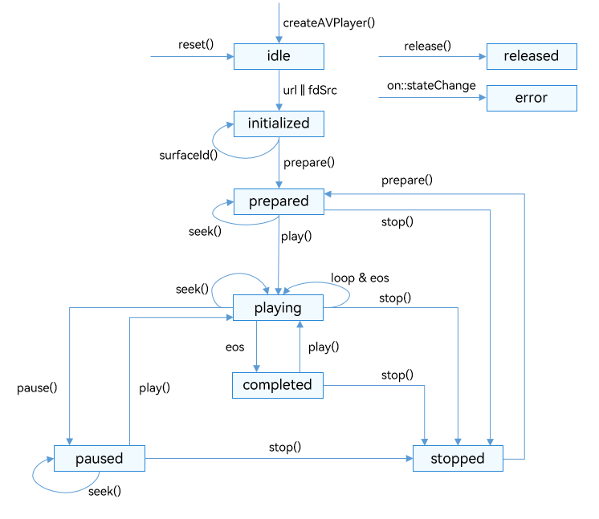

# 视频播放器（ArkTS）

## 介绍

本篇Codelab使用ArkTS语言实现视频播放器，主要包括主页面和视频播放页面，我们将一起完成以下功能：

1.  获取本地视频和网络视频。
2.  通过AVPlayer进行视频播放。
3.  通过手势调节屏幕亮度和视频播放音量。


### 相关概念

-   [AVPlayer](https://gitee.com/openharmony/docs/blob/master/zh-cn/application-dev/reference/apis/js-apis-media.md#avplayer9)：播放管理类，用于管理和播放媒体资源。
-   [XComponent](https://gitee.com/openharmony/docs/blob/master/zh-cn/application-dev/reference/arkui-ts/ts-basic-components-xcomponent.md)：可用于EGL/OpenGLES和媒体数据写入，并显示在XComponent组件。
-   [PanGesture](https://gitee.com/openharmony/docs/blob/master/zh-cn/application-dev/reference/arkui-ts/ts-basic-gestures-pangesture.md)手势：用于触发拖动手势事件，滑动的最小距离为5vp时拖动手势识别成功。

### 相关权限

本篇Codelab使用了网络连接，需要在配置文件module.json5文件里添加权限：ohos.permission.INTERNET。

## 环境搭建

### 软件要求

-   [DevEco Studio](https://gitee.com/openharmony/docs/blob/master/zh-cn/application-dev/quick-start/start-overview.md#%E5%B7%A5%E5%85%B7%E5%87%86%E5%A4%87)版本：DevEco Studio 3.1 Release。
-   OpenHarmony SDK版本：API version 9。

### 硬件要求

-   开发板类型：[润和RK3568开发板](https://gitee.com/openharmony/docs/blob/master/zh-cn/device-dev/quick-start/quickstart-appendix-rk3568.md)。
-   OpenHarmony系统：3.2 Release。

### 环境搭建

完成本篇Codelab我们首先要完成开发环境的搭建，本示例以**RK3568**开发板为例，参照以下步骤进行：

1. [获取OpenHarmony系统版本](https://gitee.com/openharmony/docs/blob/master/zh-cn/device-dev/get-code/sourcecode-acquire.md#%E8%8E%B7%E5%8F%96%E6%96%B9%E5%BC%8F3%E4%BB%8E%E9%95%9C%E5%83%8F%E7%AB%99%E7%82%B9%E8%8E%B7%E5%8F%96)：标准系统解决方案（二进制）。以3.2 Release版本为例：

   

2. 搭建烧录环境。

   1.  [完成DevEco Device Tool的安装](https://gitee.com/openharmony/docs/blob/master/zh-cn/device-dev/quick-start/quickstart-ide-env-win.md)
   2.  [完成RK3568开发板的烧录](https://gitee.com/openharmony/docs/blob/master/zh-cn/device-dev/quick-start/quickstart-ide-3568-burn.md)

3. 搭建开发环境。

   1.  开始前请参考[工具准备](https://gitee.com/openharmony/docs/blob/master/zh-cn/application-dev/quick-start/start-overview.md#%E5%B7%A5%E5%85%B7%E5%87%86%E5%A4%87)，完成DevEco Studio的安装和开发环境配置。
   2.  开发环境配置完成后，请参考[使用工程向导](https://gitee.com/openharmony/docs/blob/master/zh-cn/application-dev/quick-start/start-with-ets-stage.md#创建ets工程)创建工程（模板选择“Empty Ability”）。
   3.  工程创建完成后，选择使用[真机进行调测](https://gitee.com/openharmony/docs/blob/master/zh-cn/application-dev/quick-start/start-with-ets-stage.md#使用真机运行应用)。

## 代码结构解读

本篇Codelab只对核心代码进行讲解，对于完整代码，我们会在gitee中提供。

```
├──entry/src/main/ets	                   // 代码区
│  ├──common
│  │  ├──constants
│  │  │  ├──CommonConstants.ets	           // 公共常量类
│  │  │  ├──HomeConstants.ets	           // 首页常量类
│  │  │  └──PlayConstants.ets	           // 视频播放页面常量类
│  │  ├──constants
│  │  │  ├──HomeTabModel.ets	           // 首页参数模型
│  │  │  └──PlayerModel.ets	               // 播放参数模型
│  │  └──util
│  │     ├──DateFormatUtil.ets	           // 日期工具类
│  │     ├──GlobalContext.ets	           // 全局工具类
│  │     ├──Logger.ets	                   // 日志工具类
│  │     └──ScreenUtil.ets                 // 屏幕工具类
│  ├──controller
│  │  └──VideoController.ets	           // 视频控制类
│  ├──entryability
│  │  └──EntryAbility.ts                   // 程序入口类
│  ├──pages
│  │  ├──HomePage.ets                      // 首页页面
│  │  └──PlayPage.ets                      // 视频播放页面
│  ├──view
│  │  ├──HomeTabContent.ets                // 首页Tab页面
│  │  ├──HomeTabContentButton.ets          // 首页按钮子组件
│  │  ├──HomeTabContentDialog.ets          // 添加网络视频弹框子组件
│  │  ├──HomeTabContentList.ets            // 视频列表子组件
│  │  ├──HomeTabContentListItem.ets        // 视频对象子组件
│  │  ├──PlayControl.ets                   // 播放控制子组件
│  │  ├──PlayPlayer.ets                    // 视频播放子组件
│  │  ├──PlayProgress.ets                  // 播放进度子组件
│  │  ├──PlayTitle.ets                     // 播放标题子组件
│  │  └──PlayTitleDialog.ets               // 播放速度设置子组件
│  └──viewmodel
│     ├──HomeDialogModel.ets         	   // 添加网络视频弹框类
│     ├──HomeVideoListModel.ets            // 获取视频列表数据类
│     ├──VideoItem.ets         	           // 视频对象
│     └──VideoSpeed.ets                    // 播放速度类
└──entry/src/main/resource                 // 应用静态资源目录
```

## 获取视频

视频来源主要有本地视和网络视频两种方式，效果如图所示：


获取本地视频，通过resourceManager.getRawFd方法获取rawfile文件夹中的视频资源文件描述符，构造本地视频对象。

```typescript
// HomeVideoListModel.ets
// 获取本地视频
async getLocalVideo() {
  this.videoLocalList = [];
  await this.assemblingVideoBean();
  GlobalContext.getContext().setObject('videoLocalList', this.videoLocalList);
  return this.videoLocalList;
}

// HomeVideoListModel.ets
// 组装本地视频对象
async assemblingVideoBean() {
  VIDEO_DATA.forEach(async (item: VideoItem) => {
    let videoBean = await getContext().resourceManager.getRawFd(item.iSrc);
    let uri = videoBean;
    this.videoLocalList.push(new VideoItem(item.name, uri, ''));
  });
}
```

网络视频是通过手动输入地址，在有网的环境下点击“链接校验”，通过地址获取视频时长，当视频时长小于等于零时弹出“链接校验失败”提示，否则弹出“链接校验成功”提示。

```typescript
// HomeDialogModel.ets
// 设置网络视频路径
async checkSrcValidity(checkFlag: number) {
  if (this.isLoading) {
    return;
  }
  this.isLoading = true;
  this.homeTabModel.linkCheck = $r('app.string.link_checking');
  this.homeTabModel.loadColor = $r('app.color.index_tab_unselected_font_color');
  this.checkFlag = checkFlag;
  this.createAvPlayer();
}

// 校验链接有效性
checkUrlValidity() {
  this.isLoading = false;
  this.homeTabModel.linkCheck = $r('app.string.link_check');
  this.homeTabModel.loadColor = $r('app.color.index_tab_selected_font_color');
  if (this.avPlayer !== null) {
    this.avPlayer.release();
  }
  if (this.duration === HomeConstants.DURATION_TWO) {
    // Failed to verify the link
    this.showPrompt($r('app.string.link_check_fail'));
  } else if (this.duration === HomeConstants.DURATION_ONE) {
    // The address is incorrect or no network is available
    this.showPrompt($r('app.string.link_check_address_internet'));
  } else {
    this.duration = 0;
    if (this.checkFlag === 0) {
      this.showPrompt($r('app.string.link_check_success'));
    } else {
      this.homeTabModel!.confirm();
      this.homeTabModel!.controller!.close();
    }
  }
}
```

## 视频播放

视频播放主要包括视频的暂停、播放、切换、倍速播放、拖动进度条设置当前进度、显示当前播放时间、音量调节等功能，本章节主要针对播放管理类（下面简称：AVPlayer）进行讲解，具体细节请参考gitee源码，效果如图所示：


播放的全流程包含：创建AVPlayer，设置播放资源，设置播放参数（音量/倍速），播放控制（播放/暂停/上一个视频/下一个视频），重置，销毁资源。状态机变化如图所示：



视频播放之前需要初始化XComponent组件用于展示视频画面。XComponent组件初始化成功之后在onLoad()中获取surfaceID用于与AVPlayer实例关联。

```typescript
// PlayPlayer.ets
XComponent({
  ...
  controller: this.xComponentController
})
  .onLoad(async () => {
    ...
    this.surfaceID = this.xComponentController.getXComponentSurfaceId();
    ...
  })
  ...
```

使用AVPlayer前需要通过createAVPlayer\(\)构建一个实例对象，并为AVPlayer实例绑定状态机，状态机具体请参考[AVPlayerState](https://gitee.com/openharmony/docs/blob/master/zh-cn/application-dev/reference/apis/js-apis-media.md#avplayerstate9)。

```typescript
// VideoController.ets
async createAVPlayer() {
  let avPlayer: media.AVPlayer = await media.createAVPlayer();
  this.avPlayer = avPlayer;
  this.bindState();
}

// VideoController.ets
async bindState() {
  if (this.avPlayer === null) {
    return;
  }
  this.avPlayer.on(Events.STATE_CHANGE, async (state: media.AVPlayerState) => {
    let avplayerStatus: string = state;
    if (this.avPlayer === null) {
      return;
    }
    switch (avplayerStatus) {
      case AvplayerStatus.IDLE:
        ...
      case AvplayerStatus.INITIALIZED:
        ...
      case AvplayerStatus.PREPARED:
        ...
      case AvplayerStatus.PLAYING:
        ...
      case AvplayerStatus.PAUSED:
        ...
      case AvplayerStatus.COMPLETED:
        ...
      case AvplayerStatus.RELEASED:
        ...
      default:
        ...
    }
  });
  this.avPlayer.on(Events.TIME_UPDATE, (time: number) => {
    this.initProgress(time);
  });
  this.avPlayer.on(Events.ERROR, () => {
    this.playError();
  })
}
```

AVPlayer实例需设置播放路径和XComponent中获取的surfaceID，设置播放路径之后AVPlayer状态机变为initialized状态，在此状态下调用prepare\(\)，进入prepared状态。

```typescript
// VideoController.ets
async firstPlay(index: number, url: resourceManager.RawFileDescriptor, iUrl: string, surfaceId: string) {
  this.index = index;
  this.url = url;
  this.iUrl = iUrl;
  this.surfaceId = surfaceId;
  if (this.avPlayer === null) {
    await this.createAVPlayer();
  }
  if (this.avPlayer !== null) {
    if (this.iUrl) {
      this.avPlayer.url = this.iUrl;
    } else {
      this.avPlayer.fdSrc = this.url;
    }
  }
}

// VideoController.ets
async bindState() {
  ...
  this.avPlayer.on(Events.STATE_CHANGE, async (state: media.AVPlayerState) => {
    let avplayerStatus: string = state;
    if (this.avPlayer === null) {
      return;
    }
    switch (avplayerStatus) {
      case AvplayerStatus.IDLE:
        ...
      case AvplayerStatus.INITIALIZED:
        this.avPlayer.surfaceId = this.surfaceId;
        this.avPlayer.prepare();
        break;
      ...
    }
  });
  ...
}
```

在prepared状态下可获取当前播放路径对应视频的总时长，并执行play\(\)进行视频播放。

```typescript
// VideoController.ets
async bindState() {
  ...
  this.avPlayer.on(Events.STATE_CHANGE, async (state: media.AVPlayerState) => {
    ...
    switch (avplayerStatus) {
      ...
      case AvplayerStatus.PREPARED:
        this.avPlayer.videoScaleType = 0;
        this.setVideoSize();
        this.avPlayer.play();
        this.duration = this.avPlayer.duration;
        break;
      ...
    }
  });
  ...
}
```

视频播放后，变为playing状态，可通过“播放/暂停”按钮切换播放状态，当视频暂停时状态机变为paused状态。

```typescript
// VideoController.ets
switchPlayOrPause() {
  if (this.avPlayer === null) {
    return;
  }
  if (this.status === CommonConstants.STATUS_START) {
    this.avPlayer.pause();
  } else {
    this.avPlayer.play();
  }
}

// VideoController.ets
async bindState() {
  ...
  this.avPlayer.on(Events.STATE_CHANGE, async (state: media.AVPlayerState) => {
    ...
    switch (avplayerStatus) {
      ...
      case AvplayerStatus.PLAYING:
        this.avPlayer.setVolume(this.playerModel.volume);
        this.setBright();
        this.status = CommonConstants.STATUS_START;
        this.watchStatus();
        break;
      ...
    }
  });
  ...
}
```

可拖动进度条设置视频播放位置，也可滑动音量调节区域设置视频播放音量、设置播放速度。

```typescript
// VideoController.ets
// 设置当前播放位置
setSeekTime(value: number, mode: SliderChangeMode) {
  if (mode === Number(SliderMode.MOVING)) {
    this.playerModel.progressVal = value;
    this.playerModel.currentTime = DateFormatUtil.secondToTime(Math.floor(value * this.duration /
    CommonConstants.ONE_HUNDRED / CommonConstants.A_THOUSAND));
  }
  if (mode === Number(SliderMode.END) || mode === Number(SliderMode.CLICK)) {
    this.seekTime = value * this.duration / CommonConstants.ONE_HUNDRED;
    if (this.avPlayer !== null) {
      this.avPlayer.seek(this.seekTime, media.SeekMode.SEEK_PREV_SYNC);
    }
  }
}

// VideoController.ets
// 设置播放音量
onVolumeActionUpdate(event?: GestureEvent) {
  if (!event) {
    return;
  }
  if (this.avPlayer === null) {
    return;
  }
  if (CommonConstants.OPERATE_STATE.indexOf(this.avPlayer.state) === -1) {
    return;
  }
  if (this.playerModel.brightShow === false) {
    this.playerModel.volumeShow = true;
    let screenWidth = GlobalContext.getContext().getObject('screenWidth') as number;
    let changeVolume = (event.offsetX - this.positionX) / screenWidth;
    let volume: number = this.playerModel.volume;
    let currentVolume = volume + changeVolume;
    let volumeMinFlag = currentVolume <= PlayConstants.MIN_VALUE;
    let volumeMaxFlag = currentVolume > PlayConstants.MAX_VALUE;
    this.playerModel.volume = volumeMinFlag ? PlayConstants.MIN_VALUE :
      (volumeMaxFlag ? PlayConstants.MAX_VALUE : currentVolume);
    this.avPlayer.setVolume(this.playerModel.volume);
    this.positionX = event.offsetX;
  }
}

// VideoController.ets
// 设置播放速度
setSpeed(playSpeed: number) {
  if (this.avPlayer === null) {
    return;
  }
  if (CommonConstants.OPERATE_STATE.indexOf(this.avPlayer.state) === -1) {
    return;
  }
  this.playerModel.playSpeed = playSpeed;
  this.avPlayer.setSpeed(this.playerModel.playSpeed);
}
```

视频播放完成之后，进入completed状态，需调用reset\(\)对视频进行重置，此时变为idle转态，在idle状态下设置下一个视频的播放地址，又会进入initialized状态。

```typescript
// VideoController.ets 
sync bindState() {
  ...
  this.avPlayer.on(Events.STATE_CHANGE, async (state: media.AVPlayerState) => {
    let avplayerStatus: string = state;
    ...
    switch (avplayerStatus) {
      case AvplayerStatus.IDLE:
        this.resetProgress();
        if (this.iUrl) {
          this.avPlayer.url = this.iUrl;
        } else {
          this.avPlayer.fdSrc = this.url;
        }
        break;
      case AvplayerStatus.INITIALIZED:
        this.avPlayer.surfaceId = this.surfaceId;
        this.avPlayer.prepare();
        break;
      ...
      case AvplayerStatus.COMPLETED:
        ...
        this.avPlayer.reset();
        break;
      ...
    }
  });
  ...
}
```

## 手势控制

播放页面通过绑定平移手势（PanGesture），上下滑动调节屏幕亮度，左右滑动调节视频音量，效果如图所示：


```typescript
// PlayPage.ets
Column() {
  ...
  Column()
    ...
    .gesture(
      PanGesture(this.panOptionBright)
        .onActionStart((event?: GestureEvent) => {
          this.playVideoModel.onBrightActionStart(event);
        })
        .onActionUpdate((event?: GestureEvent) => {
          this.playVideoModel.onBrightActionUpdate(event);
        })
        .onActionEnd(() => {
          this.playVideoModel.onActionEnd();
        })
    )
  ...
  Column()
    ...
    .gesture(
      PanGesture(this.panOptionVolume)
        .onActionStart((event?: GestureEvent) => {
          this.playVideoModel.onVolumeActionStart(event);
        })
        .onActionUpdate((event?: GestureEvent) => {
          this.playVideoModel.onVolumeActionUpdate(event);
        })
        .onActionEnd(() => {
          this.playVideoModel.onActionEnd();
        })
    )
  ...
}
...
```

本章节以音量调节介绍手势控制，当手指触摸音量调节区域时获取当前屏幕坐标，滑动手指实时获取屏幕坐标并计算音量。

```typescript
// VideoController.ets
// 手指触摸到音量调节区域
onVolumeActionStart(event?: GestureEvent) {
  if (!event) {
    return;
  }
  this.positionX = event.offsetX;
}

// 手指在音量调节区域水平滑动
onVolumeActionUpdate(event?: GestureEvent) {
  if (!event) {
    return;
  }
  if (this.avPlayer === null) {
    return;
  }
  if (CommonConstants.OPERATE_STATE.indexOf(this.avPlayer.state) === -1) {
    return;
  }
  if (this.playerModel.brightShow === false) {
    this.playerModel.volumeShow = true;
    let screenWidth = GlobalContext.getContext().getObject('screenWidth') as number;
    let changeVolume = (event.offsetX - this.positionX) / screenWidth;
    let volume: number = this.playerModel.volume;
    let currentVolume = volume + changeVolume;
    let volumeMinFlag = currentVolume <= PlayConstants.MIN_VALUE;
    let volumeMaxFlag = currentVolume > PlayConstants.MAX_VALUE;
    this.playerModel.volume = volumeMinFlag ? PlayConstants.MIN_VALUE :
      (volumeMaxFlag ? PlayConstants.MAX_VALUE : currentVolume);
    this.avPlayer.setVolume(this.playerModel.volume);
    this.positionX = event.offsetX;
  }
}
```

## 总结

您已经完成了本次Codelab的学习，并了解到以下知识点：
1. AVPlayer组件的使用。
2. XComponent组件的使用。
3. PanGesture手势的使用。


