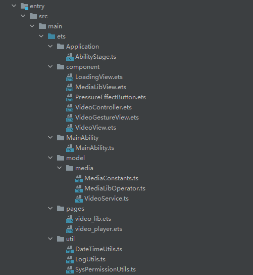
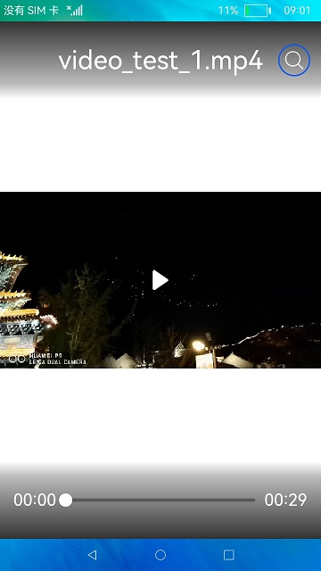

# 介绍<a name="ZH-CN_TOPIC_0000001275421420"></a>

本Codelab指导开发者如何在OpenHarmony应用中使用VideoPlayer更灵活地构建自定义播放器。

VideoPlayer支持播放http网络地址、hls直播流地址、系统文件绝对路径地址、rawfile资源路径地址。

与ArkUI提供的Video组件使用场景区分：VideoPlayer属于媒体服务系统，兼容视频软件主流的播放格式和主流分辨率，与其它媒体服务系统搭配使用更方便，面对复杂逻辑的场景有更好的兼容性。

本篇Codelab实现如下功能：

-   如何使用VideoPlayer。
-   如何实现自定义播控菜单栏。
-   如何通过触屏控制播放进度、音量、亮度。

-   如何通过媒体库访问媒体资源。

最终效果如下所示：


# 相关概念<a name="ZH-CN_TOPIC_0000001275741304"></a>

-   [VideoPlayer](https://gitee.com/openharmony/docs/blob/master/zh-cn/application-dev/reference/apis/js-apis-media.md#videoplayer8)：系统媒体库视频播放管理类，用于管理和播放视频媒体。
-   VideoService：VideoPlayer封装的服务类，提供播放器各个状态切换回调、设置亮度等功能，不同播放源的构造和释放，简化使用难度。
-   VideoView：使用XComponent封装的自定义组件，管理播放器窗口，适配播放内容宽高。
-   VideoController：控制播放菜单，包括加载时动画、播放控制、手势控制、查询媒体库功能。
-   VideoGestureView：手势控制自定义组件，显示进度、音量、亮度数据修改面板。
-   VideoAsset：由播放路径、播放标题等组成媒资内容。
-   MediaLibOperator：媒体库操作服务类，提供查询媒资、新建媒资、获取读写权限、释放读写权限等能力。

# 搭建OpenHarmony环境<a name="ZH-CN_TOPIC_0000001275261536"></a>

完成本篇Codelab我们首先要完成开发环境的搭建，本示例以**RK3568**开发板为例，参照以下步骤进行：

1.  [获取OpenHarmony系统版本](https://gitee.com/openharmony/docs/blob/master/zh-cn/device-dev/get-code/sourcecode-acquire.md#%E8%8E%B7%E5%8F%96%E6%96%B9%E5%BC%8F3%E4%BB%8E%E9%95%9C%E5%83%8F%E7%AB%99%E7%82%B9%E8%8E%B7%E5%8F%96)：标准系统解决方案（二进制）。

    以3.1版本为例：

    

2.  搭建烧录环境。
    1.  [完成DevEco Device Tool的安装](https://gitee.com/openharmony/docs/blob/master/zh-cn/device-dev/quick-start/quickstart-standard-env-setup.md)
    2.  [完成RK3568开发板的烧录](https://gitee.com/openharmony/docs/blob/master/zh-cn/device-dev/quick-start/quickstart-ide-standard-running-rk3568-burning.md)

3.  搭建开发环境。
    1.  开始前请参考[工具准备](https://gitee.com/openharmony/docs/blob/master/zh-cn/application-dev/quick-start/start-overview.md#%E5%B7%A5%E5%85%B7%E5%87%86%E5%A4%87)，完成DevEco Studio的安装和开发环境配置。
    2.  开发环境配置完成后，请参考[使用工程向导](https://gitee.com/openharmony/docs/blob/master/zh-cn/application-dev/quick-start/start-with-ets.md#%E5%88%9B%E5%BB%BAets%E5%B7%A5%E7%A8%8B)创建工程（模板选择“Empty Ability”），选择JS或者eTS语言开发。
    3.  工程创建完成后，选择使用[真机进行调测](https://gitee.com/openharmony/docs/blob/master/zh-cn/application-dev/quick-start/start-with-ets.md#%E4%BD%BF%E7%94%A8%E7%9C%9F%E6%9C%BA%E8%BF%90%E8%A1%8C%E5%BA%94%E7%94%A8)。


# 代码结构解读<a name="ZH-CN_TOPIC_0000001326381257"></a>



```
└── entry/src/main/ets                        // ets代码区
    └── Application
    │   └── AbilityStage.ts                   // Hap包运行时类
    ├── component                                            
    │   └── LoadingView.ets                   // 加载动画组件
    │   ├── MediaLibView.ets                  // 媒体选择库组件
    │   ├── PressureEffectButton.ets          // 多状态按钮组件
    │   ├── VideoController.ets               // 播控控制菜单
    │   ├── VideoGestureView.ets              // 手势控制组件
    │   └── VideoView.ets                     // 播放容器组件
    ├── MainAbility
    │   └── MainAbility.ts                    // Ability，提供对Ability生命周期、上下文环境等调用管理
    ├── model
    │   └── media
    │       └── MediaConstants.ts             // 媒体常量类 
    │       ├── MediaLibOperator.ts           // 媒体库操作类
    │       └── VideoService.ts               // VideoPlayer服务类       
    │── pages
    │   └── video_lib.ets                     // 媒体库列表页面
    │   └── video_player.ets                  // 播放器页面
    └── util
        └── DateTimeUtils.ts                  // 日期工具类
        ├── LogUtils.ts                       // 日志工具类
        └── SysPermissionUtils.ts             // 系统权限工具类
```

# 相关权限设置<a name="ZH-CN_TOPIC_0000001326381253"></a>

本篇Codelab需要在module.json5中配置如下权限：

```
"requestPermissions": [
  {
	"name": "ohos.permission.READ_MEDIA"
  },
  {
	"name": "ohos.permission.WRITE_MEDIA"
  },
  {
	"name": "ohos.permission.WRITE_USER_STORAGE"
  },
  {
	"name": "ohos.permission.READ_USER_STORAGE"
  },
  {
	"name": "ohos.permission.MEDIA_LOCATION"
  },
  {
	"name": "ohos.permission.INTERNET"
  }
]
```

> **说明：** 
>应用获取权限的流程取决于相应的权限类型：
>-   如果目标权限是system\_grant类型，开发者需要在module.json5文件中[声明目标权限](https://gitee.com/openharmony/docs/blob/master/zh-cn/application-dev/security/accesstoken-guidelines.md)，系统会在安装应用时为其进行权限预授予。
>-   如果目标权限是user\_grant类型，开发者需要先在module.json5文件中[声明目标权限](https://gitee.com/openharmony/docs/blob/master/zh-cn/application-dev/security/accesstoken-guidelines.md)，然后运行时发送弹窗，请求用户授权。
>-   本篇Codelab用user\_grant类型权限进行讲解，具体可参考[权限定义列表](https://gitee.com/openharmony/docs/blob/master/zh-cn/application-dev/security/accesstoken-overview.md#%E6%9D%83%E9%99%90%E5%AE%9A%E4%B9%89%E5%88%97%E8%A1%A8)。

# 播放器界面<a name="ZH-CN_TOPIC_0000001326501197"></a>

播放器界面由VideoView和VideoController组件组成，VideoView负责播放器内容显示的适配，VideoController提供加载动画、播放控制、手势操作、查询媒体库等功能。



1.  VideoView是以XComponent主体的自定义组件，提供视频播放的内存地址，使用时传入[VideoService](#ZH-CN_TOPIC_0000001275741304)作为自定义组件参数。

    ```
    VideoView({
      service: this.videoService
      ...
    })
    ```

2.  VideoView初始化过程中添加播放尺寸改变状态回调，当播放视频尺寸更改时，修改XComponennt的宽、高比来适应视频尺寸。

    ```
    this.service.addStatusChangedListener((state, extra) => {
    	switch (state) {
    	  case VideoPlayerState.SIZE_CHANGED:
    		if (!this.isContentFull) {
    		  this.ratio = extra.width / extra.height
    		  this.playerAreaController.setXComponentSurfaceSize({
    			surfaceWidth: extra.width,
    			surfaceHeight: extra.height
    		  })
    		}
    		break;
    	}
    })
    ```

3.  XComponent初始化完成，绑定VideoPlayer和XComponent的内存地址，至此，VideoView构建完毕。

    ```
    XComponent({
    	id: '',
    	type: 'surface',
    	libraryname: '',
    	controller: this.playerAreaController
    })
    .onLoad(() => {
      let renderId = this.playerAreaController.getXComponentSurfaceId()
      if (this.service != null) {
    	this.service.addSurface(renderId)
      }
      this.onCreated(renderId)
    })
    .aspectRatio(this.ratio)
    ```

4.  在使用[VideoController](#ZH-CN_TOPIC_0000001275741304)时传入VideoService作为自定义组件参数。

    ```
    VideoController({ service: this.videoService })
    ```

5.  VideoController初始化过程中添加播放状态改变回调，进行相应的UI改变。

    ```
    this.service.addStatusChangedListener((state, extra) => {
    	switch (state) {
    	  case VideoPlayerState.START:
    		break;
    	  case VideoPlayerState.PREPARED:
                    // 播放器准备完毕回调，更新控制菜单栏的标题、播放总时长
    		this.title = extra.title
    		this.totalDuration = extra.duration
    		break
    	  case VideoPlayerState.BUFFERING_START:
                    // 视频加载状态回调，显示加载动画
    		this.isBuffering = true
    		break;
    	  case VideoPlayerState.PLAY:
                    // 视频播放状态，修改播放按钮样式，启动进度刷新任务
    		this.showMenu(5000)
    		this.playBtnSrc = $r('app.media.ic_pause')
    	  case VideoPlayerState.BUFFERING_END:
    		this.isBuffering = false
    		this.startDurationTasker()
    		break;
    	  case VideoPlayerState.IDLE:
                    // 视频停止状态，修改播放按钮样式，停止进度刷新任务
    	  case VideoPlayerState.ERROR:
    		this.stopDurationTasker()
    	  case VideoPlayerState.FINISH:
    		this.curDuration = 0
    	  case VideoPlayerState.STOP:
    	  case VideoPlayerState.PAUSE:
    		this.showMenu()
    		this.playBtnSrc = $r('app.media.ic_play')
    		break;
    	}
    })
    ```

6.  在使用[VideoGestureView](#ZH-CN_TOPIC_0000001275741304)时传入VideoService作为自定义组件参数。

    ```
    VideoGestureView({ service: this.service })
    ```

7.  手指按下时保存屏幕起始坐标，根据其实坐标和位移方向，设置当前模式为进度、音量或者亮度，手指移动时计算位移变量，手指松开后根据当前设置模式设置进度、音量或者亮度。

    ```
    // 手指按下
    if (event.type === TouchType.Down) {
    	this.startFocusX = focusPoint.x
    	this.startFocusY = focusPoint.y
    }
    
    // 手指移动
    onFingerMove(focusX, focusY) {
    	let changedValue
    	let offsetX = focusX - this.startFocusX
    	let offsetY = focusY - this.startFocusY
    	switch (this.gestureType) {
    	  case VideoPlayerGestureType.IDLE:
                    // 根据按下的位置，设置当前模式
    		break;
    	  case VideoPlayerGestureType.PROGRESS_CONTROL:
    		// 当前为进度控制模式，计算位移量
    		break;
    	  case VideoPlayerGestureType.VOLUME_CONTROL:
    		// 当前为音量控制模式，计算位移量
    		break;
    	  case VideoPlayerGestureType.BRIGHT_CONTROL:
    		// 当前为亮度控制模式，计算位移量
    		break;
    	}
    }
    
    // 手指松开
    onFingerUp() {
    	switch (this.gestureType) {
    	  case VideoPlayerGestureType.PROGRESS_CONTROL:
                    // 设置播放进度
    		this.service.seek(this.gestureValue)
    		break;
    	  case VideoPlayerGestureType.VOLUME_CONTROL:
                    // 设置音量
    		this.service.setVolume(this.gestureValue)
    		break;
    	  case VideoPlayerGestureType.BRIGHT_CONTROL:
                    // 设置亮度
    		this.service.setBrightness(this.gestureValue)
    		break;
    	}
            // 重置当前模式
    	this.gestureType = VideoPlayerGestureType.IDLE
    	this.setViewShow(false)
    }
    ```

# 媒体库列表界面<a name="ZH-CN_TOPIC_0000001275261540"></a>

媒体库列表界面由MediaLibView自定义组件构建，根据媒体类型不同展示不同UI风格的媒体库列表。


1.  在使用MediaLibView时传入需要查询的媒体类型作为自定义组件参数。

    ```
    MediaLibView({
    	mediaTypes: [MediaType.VIDEO]
            ...
    })
    ```

2.  MediaLibView初始化时使用[MediaLibOperator](#ZH-CN_TOPIC_0000001275741304)根据传入的媒体类型查询媒体数据，没有媒体类型默认查询全部类型的数据，根据数据类型设置列表item的样式。

    ```
    this.mediaLibOperator.getAllAssets(this.mediaTypes).then(async (assets) => {
      for (let i = 0;i < assets.length; i++) {
    	let thumbnail
    	switch (assets[i].mediaType) {
    	  case MediaType.FILE:
    		thumbnail = $r('app.media.ic_file')
    		break
    	  case MediaType.IMAGE:
    	  case MediaType.VIDEO:
    		thumbnail = await assets[i].getThumbnail()
    		break
    	  case MediaType.AUDIO:
    		thumbnail = $r('app.media.ic_note')
    		break
    	}
    	let mediaInfo: MediaInfo = new MediaInfo(assets[i].id, assets[i].mediaType, assets[i].duration, thumbnail)
    	this.mediaList.push(mediaInfo)
      }
      if (this.controller != null) {
    	this.controller.setList(this.mediaList)
      }
    })
    ```

# 恭喜您<a name="ZH-CN_TOPIC_0000001275581380"></a>

目前你已经成功完成了本Codelab并且学到了：

-   如何使用VideoPlayer。
-   如何实现自定义播控菜单栏。
-   如何通过手势控制播放进度、音量、亮度。

-   如何通过媒体库访问媒体资源。


