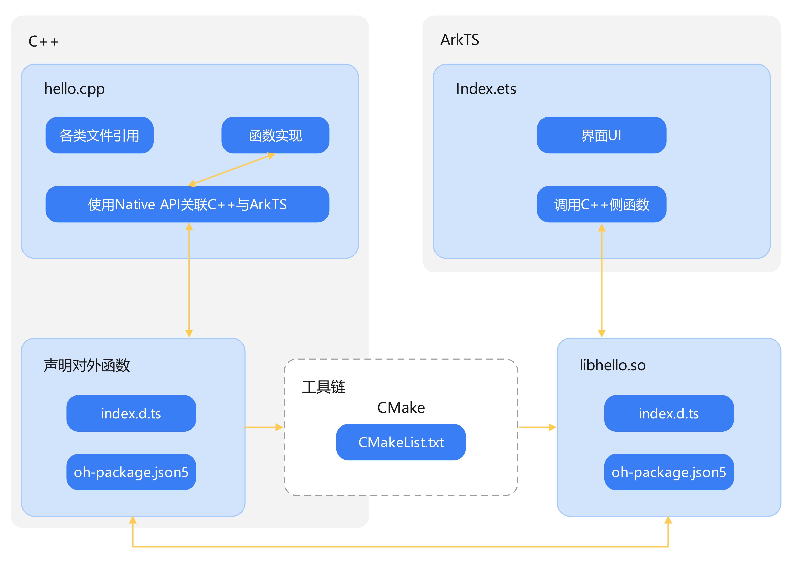
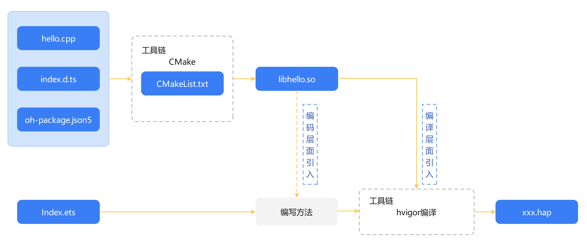

# 简易Native C++ 示例（ArkTS）

## 介绍

本篇Codelab主要介绍如何使用DevEco Studio创建一个Native C++应用。应用采用Native C++模板，实现使用Native API调用C标准库的功能。使用C标准库hypot接口计算两个给定数平方和的平方根。在输入框中输入两个数字，点击计算结果按钮显示计算后的数值。


### 相关概念

-   [Native API](https://gitee.com/openharmony/docs/blob/OpenHarmony-3.2-Release/zh-cn/application-dev/napi/napi-guidelines.md)：Native API提供的接口名与三方Node.js一致，目前支持部分接口。
-   [Native API中支持的标准库](https://gitee.com/openharmony/docs/blob/OpenHarmony-3.2-Release/zh-cn/application-dev/reference/native-lib/third_party_libc/musl.md)：目前支持标准C库、C++库、OpenSL ES、zlib。

## 环境搭建

### 软件要求

-   [DevEco Studio](https://gitee.com/openharmony/docs/blob/master/zh-cn/application-dev/quick-start/start-overview.md#%E5%B7%A5%E5%85%B7%E5%87%86%E5%A4%87)版本：DevEco Studio 3.1 Release及以上版本。
-   OpenHarmony SDK版本：API version 9及以上版本。

### 硬件要求

-   开发板类型：[润和RK3568开发板](https://gitee.com/openharmony/docs/blob/master/zh-cn/device-dev/quick-start/quickstart-appendix-rk3568.md)。
-   OpenHarmony系统：3.2 Release及以上版本。

### 环境搭建

完成本篇Codelab我们首先要完成开发环境的搭建，本示例以**RK3568**开发板为例，参照以下步骤进行：

1. [获取OpenHarmony系统版本](https://gitee.com/openharmony/docs/blob/master/zh-cn/device-dev/get-code/sourcecode-acquire.md#%E8%8E%B7%E5%8F%96%E6%96%B9%E5%BC%8F3%E4%BB%8E%E9%95%9C%E5%83%8F%E7%AB%99%E7%82%B9%E8%8E%B7%E5%8F%96)：标准系统解决方案（二进制）。以3.2 Release版本为例：

   

2. 搭建烧录环境。

   1.  [完成DevEco Device Tool的安装](https://gitee.com/openharmony/docs/blob/master/zh-cn/device-dev/quick-start/quickstart-ide-env-win.md)
   2.  [完成RK3568开发板的烧录](https://gitee.com/openharmony/docs/blob/master/zh-cn/device-dev/quick-start/quickstart-ide-3568-burn.md)

3. 搭建开发环境。

   1.  开始前请参考[工具准备](https://gitee.com/openharmony/docs/blob/master/zh-cn/application-dev/quick-start/start-overview.md#%E5%B7%A5%E5%85%B7%E5%87%86%E5%A4%87)，完成DevEco Studio的安装和开发环境配置。
   2.  开发环境配置完成后，请参考[使用工程向导](https://gitee.com/openharmony/docs/blob/master/zh-cn/application-dev/quick-start/start-with-ets-stage.md#创建ets工程)创建工程（模板选择“Empty Ability”）。
   3.  工程创建完成后，选择使用[真机进行调测](https://gitee.com/openharmony/docs/blob/master/zh-cn/application-dev/quick-start/start-with-ets-stage.md#使用真机运行应用)。

## 代码结构解读

本篇Codelab只对核心代码进行讲解，对于完整代码，我们会在gitee中提供。

```
├──entry/src/main
│  ├──common
│  │  └──CommonContants.ets               // 常量定义文件
│  ├──cpp                                 // C++代码区
│  │  ├──CMakeLists.txt                   // CMake编译配置文件
│  │  ├──hello.cpp                        // C++源代码
│  │  └──types                            // 接口存放文件夹
│  │     └──libhello
│  │        ├──index.d.ts                 // 接口文件
│  │        └──oh-package.json5           // 接口注册配置文件
│  └──ets                                 // 代码区
│     ├──entryability
│     │  └──EntryAbility.ts               // 程序入口类
│     └──pages
│        └──Index.ets                     // 主界面
└──entry/src/main/resources               // 资源文件目录
```

## 架构组成

### 应用架构

应用架构可以分为三部分：C++、ArkTS、工具链。

-   C++：包含各种文件的引用、C++或者C代码、Native项目必需的配置文件等。
-   ArkTS：包含界面UI、自身方法、调用引用包的方法等。
-   工具链：包含CMake编译工具在内的系列工具。

使用ArkTS调用C++方法的过程中，需要使用到Native API、CMake等工具来做中间转换，整个架构及其关联关系参考示意图。

示意图中，hello.cpp文件实现C++方法，并通过Native API将C++方法与ArkTS方法关联。

C++代码通过CMake编译工具编译成动态链接库so文件，使用index.d.ts文件对外提供接口。ArkTS引入so文件后调用其中的接口。



### 编译架构

ArkTS与C++方法的调用、编译流程参考示意图。图中C++代码通过CMake编译生成so文件后可以直接被ArkTS侧引入，最终通过hvigor编译成可执行的hap包。



## Native项目开发流程

### Native侧操作详解

1. 配置模块描述信息，设置Init方法为napi\_module的入口方法。\_\_attribute\_\_\(\(constructor\)\)修饰的方法由系统自动调用，使用Native API接口napi\_module\_register\(\)传入模块描述信息进行模块注册。

   ``` cpp
   // hello.cpp
   static napi_module demoModule = {
       nm_version = 1,
       nm_flags = 0,
       nm_filename = nullptr,
       nm_register_func = Init,         // napi_module入口方法
       nm_modname = "hello",            // napi_module模块名
       nm_priv = ((void *)0),
       reserved = { 0 }
   };
   
   extern "C" __attribute__((constructor)) void RegisterModule(void) {
       napi_module_register(&demoModule);
   }
   ```

2. 关联C++方法至ArkTS。在napi\_property\_descriptor desc\[\]中，我们需要将编写的MyHypot方法与对外提供的接口myHypot接口进行关联，其他参数使用示例默认值填写。使用Native API接口napi\_define\_properties构建包含方法对应列表的返回值。

   ``` cpp
   // hello.cpp
   EXTERN_C_START
   static napi_value Init(napi_env env, napi_value exports) {
       napi_property_descriptor desc[] = {
           { "myHypot", nullptr, MyHypot, nullptr, nullptr, nullptr, napi_default, nullptr }
       };
       napi_define_properties(env, exports, sizeof(desc) / sizeof(desc[0]), desc);
       return exports;
   }
   EXTERN_C_END
   ```

3. 实现C++方法。本例中使用C标准库的hypot方法进行计算。引入C标准库头文件math.h，使用double类型解析传入的参数后，调用C标准库方法hypot计算两数平方的和后计算平方根。使用Native API接口napi\_create\_double将结果转化为napi\_value类型的变量并返回。

   ``` cpp
   // hello.cpp
   #include "napi/native_api.h"
   #include "math.h"
   static napi_value MyHypot(napi_env env, napi_callback_info info) {
       // 参数数量
       size_t argc = 2;
   
       // 声明参数数组
       napi_value args[2] = {nullptr};
   
       // 获取传入的参数并依次放入参数数组中
       napi_get_cb_info(env, info, &argc, args, nullptr, nullptr);
   
       // 将第一个传入参数转化为double类型
       double value0;
       napi_get_value_double(env, args[0], &value0);
   
       // 将第二个传入参数转化为double类型
       double value1;
       napi_get_value_double(env, args[1], &value1);
   
       // 调用C标准库的hypot接口进行计算
       double result = hypot(value0, value1);
       napi_value sum;
       napi_create_double(env, result, &sum);
       return sum;
   }
   ```

4. 添加接口文件以及接口配置文件。接口文件index.d.ts用于对外提供方法说明。接口配置文件oh-package.json5文件中将index.d.ts与CMake编译的so文件关联起来。模块级目录下oh-package.json5文件添加so文件依赖。

   ```typescript
   // index.d.ts
   export const myHypot: (a: number, b: number) => number;
   ```
   ```json
   // oh-package.json5
   {
     "name": "libhello.so",
     "types": "./index.d.ts"
   }
   
   // entry/oh-package.json5
   {
     "devDependencies": {
       "@types/libhello.so": "file:./src/main/cpp/types/libhello"
     }
   }
   ```

5. 在CMakeLists.txt文件中配置CMake编译参数。配置需要添加的hello.cpp文件，编译后的so文件名为libhello.so。CMakeLists.txt是CMake编译的配置文件，里面的大部分内容无需修改，project、add\_library方法中的内容可以根据实际情况修改。

   ```cmake
   # CMakeLists.txt
   # 声明使用 CMAKE 的最小版本号
   cmake_minimum_required(VERSION 3.4.1)
   
   # 配置项目信息
   project(NativeTemplateDemo)
   
   # set命令，格式为set(key value)，表示设置key的值为value
   set(NATIVERENDER_ROOT_PATH ${CMAKE_CURRENT_SOURCE_DIR})
   
   # 设置头文件的搜索目录
   include_directories(
       ${NATIVERENDER_ROOT_PATH}
       ${NATIVERENDER_ROOT_PATH}/include
   )
   
   # 添加名为hello的库，库文件名为libhello.so
   add_library(hello SHARED hello.cpp)
   
   # 添加构建需要链接的库
   target_link_libraries(hello PUBLIC libace_napi.z.so libc++.a)
   ```

   > **说明：** 
   >
   >-   CMAKE\_CURRENT\_SOURCE\_DIR：CMakeList.txt文件所在的目录。
   >-   add\_library：添加本地的cpp文件，多cpp文件使用空格或换行间隔。
   >-   target\_link\_libraries：添加需要链接的库，本篇Codelab使用C标准库hypot方法，此处链接libc++.a库文件。

### ArkTS调用C++方法

Index.ets文件使用import语句导入CMake编译出的so文件。Button组件添加点击事件，点击按钮触发点击事件时，调用libhello.so对外提供的myHypot方法，执行计算并返回计算结果。依据结果值进行格式化，显示科学计数法或保留指定位小数。

```typescript
// Index.ets
import libHello from 'libhello.so';

@Entry
@Component
struct Index {
  ...
  build() {
    ...
    Button($r('app.string.submit_button'))
      .onClick(() => {
        let resultTemp = libHello.myHypot(this.numX, this.numY);
        if (resultTemp > CommonContants.MAX_RESULT) {
          this.result = resultTemp.toExponential(CommonContants.EXPONENTIAL_COUNT);
        } else {
          this.result = resultTemp.toFixed(CommonContants.FIXED_COUNT);
        }
      })
  }
}
```

### 界面设计

界面由标题、文本说明、计算结果展示、输入框、按钮组成。Index.ets文件完成界面实现，使用Column及Row容器组件进行布局。


```typescript
// Index.ets
@Entry
@Component
struct NativeTemplate {
  ...
  build() {
    Column() {
      ...
      Column() {
        ...
        Row() {
          ...
          TextInput({ controller: this.textInputControllerX })
            .type(InputType.Number)
        }
        .height($r('app.float.tips_num_height'))
        .width(CommonContants.FULL_PARENT)
        Row() {
          ...
          TextInput({ controller: this.textInputControllerY })
            .type(InputType.Number)
            .onChange(value => {
              this.numY = parseFloat(value);
            })
        }
        .height($r('app.float.tips_num_height'))
        .width(CommonContants.FULL_PARENT)
      }
      Row() {
        Button($r('app.string.submit_button'))
          .height(CommonContants.FULL_PARENT)
          .width($r('app.float.button_width'))
      }
      .height($r('app.float.button_height'))
      .width(CommonContants.FULL_PARENT)
    }
    .width(CommonContants.FULL_PARENT)
    .height(CommonContants.FULL_PARENT)
  }
}
```

## 总结

您已经完成了本次Codelab的学习，并了解到以下知识点：

1.  ArkTS调用so文件中接口的方法。
2.  Native C++代码编写与编译流程。

