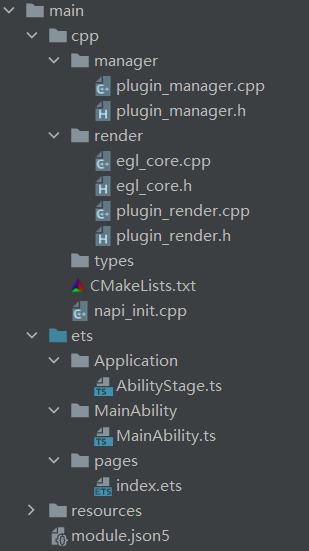
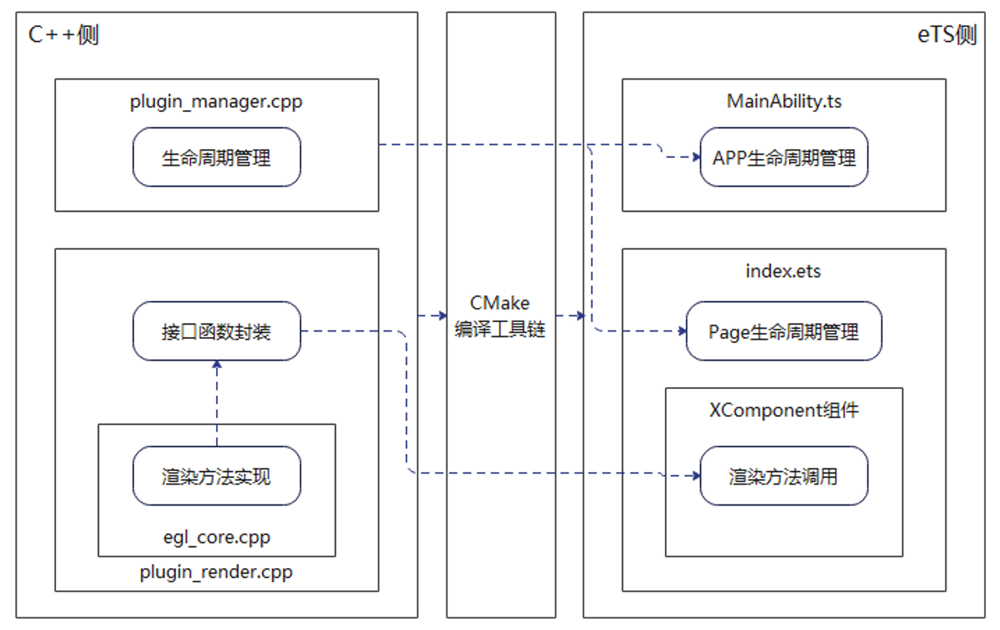

# 介绍<a name="ZH-CN_TOPIC_0000001263797638"></a>

本篇Codelab主要介绍如何使用XComponent组件调用Native API来创建EGL/GLES环境，从而使用标准OpenGL ES进行图形渲染。本项目使用OpenGL实现了在主页面绘制一个正方形，并可以改变正方形的颜色。如图所示，点击“绘制矩形”按钮，下方的XComponent组件中便渲染出一个正方形，此时点击正方形，可以改变正方形的颜色。


# 相关概念<a name="ZH-CN_TOPIC_0000001264117514"></a>

[XComponent](https://gitee.com/openharmony/docs/blob/master/zh-cn/application-dev/reference/arkui-ts/ts-basic-components-xcomponent.md)：OpenHarmony API8开始提供的UI组件，可用于EGL/OpenGLES和媒体数据写入。

[Native API](https://gitee.com/openharmony/docs/tree/master/zh-cn/application-dev/reference/native-apis)：用于封装C++方法，暴露给eTS侧。

# 搭建OpenHarmony环境<a name="ZH-CN_TOPIC_0000001263798438"></a>

完成本篇Codelab我们首先要完成开发环境的搭建，本示例以**RK3568**开发板为例，参照以下步骤进行：

1.  [获取OpenHarmony系统版本](https://gitee.com/openharmony/docs/blob/master/zh-cn/device-dev/get-code/sourcecode-acquire.md#%E8%8E%B7%E5%8F%96%E6%96%B9%E5%BC%8F3%E4%BB%8E%E9%95%9C%E5%83%8F%E7%AB%99%E7%82%B9%E8%8E%B7%E5%8F%96)：标准系统解决方案（二进制）。

    以3.1版本为例：

    

2.  搭建烧录环境。
    1.  [完成DevEco Device Tool的安装](https://gitee.com/openharmony/docs/blob/master/zh-cn/device-dev/quick-start/quickstart-standard-env-setup.md)
    2.  [完成RK3568开发板的烧录](https://gitee.com/openharmony/docs/blob/master/zh-cn/device-dev/quick-start/quickstart-ide-standard-running-rk3568-burning.md)

3.  搭建开发环境。
    1.  开始前请参考[工具准备](https://gitee.com/openharmony/docs/blob/master/zh-cn/application-dev/quick-start/start-overview.md#%E5%B7%A5%E5%85%B7%E5%87%86%E5%A4%87)，完成DevEco Studio的安装和开发环境配置。
    2.  开发环境配置完成后，请参考[使用工程向导](https://gitee.com/openharmony/docs/blob/master/zh-cn/application-dev/quick-start/start-with-ets.md#%E5%88%9B%E5%BB%BAets%E5%B7%A5%E7%A8%8B)创建工程（模板选择“Empty Ability”），选择JS或者eTS语言开发。
    3.  工程创建完成后，选择使用[真机进行调测](https://gitee.com/openharmony/docs/blob/master/zh-cn/application-dev/quick-start/start-with-ets.md#%E4%BD%BF%E7%94%A8%E7%9C%9F%E6%9C%BA%E8%BF%90%E8%A1%8C%E5%BA%94%E7%94%A8)。

# 代码结构解读<a name="ZH-CN_TOPIC_0000001264117518"></a>

本篇Codelab应用“Native C++”模板，整个工程的代码结构如下图所示：



各模块和文件说明说下：

```
├── cpp                                                  // C++代码区					
│   ├── manager                                          // 生命周期管理模块
│   │   ├── plugin_manager.cpp                           
│   │   └── plugin_manager.h                             
│   ├── render                                           // 渲染模块
│   │   ├── egl_core.cpp                                 // 核心渲染代码
│   │   ├── egl_core.h                                   
│   │   ├── plugin_render.cpp                            // Native API封装代码
│   │   └── plugin_render.h                              
│   ├── types                                            
│   ├── CMakeLists.txt                                   // Cmake编译工具链
│   └── napi_init.cpp                                    
└── ets                                                  // eTS代码区
    ├── Application                                      
    │   └── AbilityStage.ts                              // Hap包运行时类
    ├── MainAbility                                      
    │   └── MainAbility.ts                               // Ability，提供对Ability生命周期、上下文环境等管理 
    └── pages                                            
        └── index.ets                                    // 主页面
```

整个项目各模块之间的调用流程可用下图直观表示：



# C++侧渲染功能实现<a name="ZH-CN_TOPIC_0000001263797634"></a>

本节将介绍在C++侧如何实现图形渲染功能。

1.首先进行初始化，包括初始化可用的EGLDisplay、确定可用的Surface配置、创建渲染区域Surface、创建并关联上下文等。

```
void EGLCore::eglContextInit(void* window, int w, int h) {
    OH_LOG_Print(LOG_APP, LOG_INFO, 0xFF00, "EGLCore", "eglContextInit ===> window = %{public}p, w = %{public}d, h = %{public}d", window, w, h);
    width_ = w;
    height_ = h;
    mEglWindow = static_cast<EGLNativeWindowType>(window);

    // 初始化EGLDisplay
    EGLint majorVersion;
    EGLint minorVersion;
    mEglDisplay = eglGetDisplay(EGL_DEFAULT_DISPLAY);
    if (mEglDisplay == EGL_NO_DISPLAY) {
        OH_LOG_Print(LOG_APP, LOG_ERROR, 0xFF00, "EGLCore", "eglGetDisplay ===> unable to get EGL display");
        return;
    }
    if (!eglInitialize(mEglDisplay, &majorVersion, &minorVersion)) {
        OH_LOG_Print(LOG_APP, LOG_ERROR, 0xFF00, "EGLCore", "eglInitialize ===> unable to get initialize EGL display");
        return;
    }

    // 选择配置
    EGLint attribList[] = {
        EGL_SURFACE_TYPE, EGL_WINDOW_BIT,
        EGL_RED_SIZE, 8,
        EGL_GREEN_SIZE, 8,
        EGL_BLUE_SIZE, 8,
        EGL_ALPHA_SIZE, 8,
        EGL_RENDERABLE_TYPE, EGL_OPENGL_ES2_BIT,
        EGL_NONE
    };

    const EGLint maxConfigs = 1;
    EGLint numConfigs;
    if (!eglChooseConfig(mEglDisplay, attribList, &mEglConfig, maxConfigs, &numConfigs)) {
        OH_LOG_Print(LOG_APP, LOG_ERROR, 0xFF00, "EGLCore", "eglChooseConfig ===> unable to choose configs");
        return;
    }

    // 创建surface
    EGLint winAttribs[] = {
        EGL_GL_COLORSPACE_KHR, EGL_GL_COLORSPACE_SRGB_KHR,
        EGL_NONE
    };
    if (mEglWindow) {
        mEglSurface = eglCreateWindowSurface(mEglDisplay, mEglConfig, mEglWindow, winAttribs);
        if (mEglSurface == nullptr) {
            OH_LOG_Print(LOG_APP, LOG_ERROR, 0xFF00, "EGLCore", "eglCreateWindowSurface ===> unable to create surface");
            return;
        }
    }

    // 创建context
    EGLint verList[] = {
        EGL_CONTEXT_CLIENT_VERSION, 2,
        EGL_NONE
    };

    mEglContext = eglCreateContext(mEglDisplay, mEglConfig, EGL_NO_CONTEXT, verList);
    if (!eglMakeCurrent(mEglDisplay, mEglSurface, mEglSurface, mEglContext)) {
        OH_LOG_Print(LOG_APP, LOG_ERROR, 0xFF00, "EGLCore", "eglMakeCurrent ===> error = %{public}d", eglGetError());
    }

    // 创建program
    mProgramHandle = createProgram(vertexShader, fragmentShader);
    if (!mProgramHandle) {
        OH_LOG_Print(LOG_APP, LOG_ERROR, 0xFF00, "EGLCore", "createProgram ===> unable to create program");
        return;
    }
}
```

2.使用OpenGL渲染正方形。

实现一个渲染函数，通过调用OpenGL相关API进行绘制，有关OpenGL相关介绍请参考对应资料。

```
void EGLCore::draw() {
    GLfloat color[] = {
      0.5f, 0.6f, 0.3f, 1.0f
    };

    const GLfloat rectangleVertices[] = {
        -0.5f, 0.5f,
        0.5f, 0.5f,
        0.5f, -0.5f,
        -0.5f, -0.5f
    };

    glViewport(0, 0, width_, height_);
    glClearColor(0.0, 0.0, 0.0, 1.0);
    glClear(GL_COLOR_BUFFER_BIT);
    glUseProgram(mProgramHandle);
    GLint positionHandle = glGetAttribLocation(mProgramHandle, "a_position");
    glVertexAttribPointer(positionHandle, 2, GL_FLOAT, GL_FALSE, 0, rectangleVertices);
    glEnableVertexAttribArray(positionHandle);
    glVertexAttrib4fv(1, color);
    glDrawArrays(GL_TRIANGLE_FAN, 0, 4);
    glDisableVertexAttribArray(positionHandle);

    glFlush();
    glFinish();
    eglSwapBuffers(mEglDisplay, mEglSurface);
    flag = true;
}
```

3.改变正方形的颜色。

重新绘制一个大小相同、颜色不同的正方形，与原正方形地址交换，实现“改变颜色”功能。

```
void EGLCore::changeColor() {
    if (!eglMakeCurrent(mEglDisplay, mEglSurface, mEglSurface, mEglContext)) {
        OH_LOG_Print(LOG_APP, LOG_ERROR, 0xFF00, "EGLCore", "elgMakeCurrent ===> error = %{public}d", eglGetError());
    }

    GLfloat color[] = {
        0.9f, 0.5f, 0.7f, 1.0f
    };

    const GLfloat rectangleVertices[] = {
        -0.5f, 0.5f,
        0.5f, 0.5f,
        0.5f, -0.5f,
        -0.5f, -0.5f
    };

    glViewport(0, 0, width_, height_);
    glClearColor(0.0, 0.0, 0.0, 1.0);
    glClear(GL_COLOR_BUFFER_BIT);
    glUseProgram(mProgramHandle);
    GLint positionHandle = glGetAttribLocation(mProgramHandle, "a_position");
    glVertexAttribPointer(positionHandle, 2, GL_FLOAT, GL_FALSE, 0, rectangleVertices);
    glEnableVertexAttribArray(positionHandle);
    glVertexAttrib4fv(1, color);
    glDrawArrays(GL_TRIANGLE_FAN, 0, 4);
    glDisableVertexAttribArray(positionHandle);

    if (flag) {
        eglSwapBuffers(mEglDisplay, mEglSurface);
    }
}
```

# 使用Native API将C++方法暴露给eTS侧<a name="ZH-CN_TOPIC_0000001311237617"></a>

本节将介绍如何使用Native API将C++实现的方法暴露给eTS侧，从而能在eTS侧调用对应方法。

1.创建NAPI接口函数，封装对应C++方法。

```
napi_value PluginRender::NapiDrawRectangle(napi_env env, napi_callback_info info) {
    OH_LOG_Print(LOG_APP, LOG_INFO, 0xFF00, "PluginRender", "NapiDrawRectangle");
    napi_value exportInstance;
    napi_value thisArg;
    napi_status status;
    OH_NativeXComponent *nativeXComponent = nullptr;

    int32_t xID;
    char idStr[OH_XCOMPONENT_ID_LEN_MAX + 1] = {};
    uint64_t idSize = OH_XCOMPONENT_ID_LEN_MAX + 1;

    napi_get_cb_info(env, info, nullptr, nullptr, &thisArg, nullptr);

    status = napi_get_named_property(env, thisArg, OH_NATIVE_XCOMPONENT_OBJ, &exportInstance);
    if (status != napi_ok) {
        return nullptr;
    };

    status = napi_unwrap(env, exportInstance, reinterpret_cast<void**>(&nativeXComponent));
    if (status != napi_ok) {
        return nullptr;
    }

    xID = OH_NativeXComponent_GetXComponentId(nativeXComponent, idStr, &idSize);
    if (xID != OH_NATIVEXCOMPONENT_RESULT_SUCCESS) {
        OH_LOG_Print(LOG_APP, LOG_ERROR, 0xFF00, "PluginRender", "NapiDrawRectangle: Unable to get XComponent id");
        return nullptr;
    }

    std::string id(idStr);
    PluginRender* render = PluginRender::getInstance(id);
    if (render) {
        render->eglCore_->draw();  // 该接口函数封装的是上文实现的渲染函数
    }
    return nullptr;
}
```

2.注册方法。

将接口函数注册为eTS侧接口，如下所示，在eTS侧调用drawRectangle\(\)方法，即可绘制正方形。

```
napi_value PluginRender::Export(napi_env env, napi_value exports) {
    napi_property_descriptor desc[] = {
        { "drawRectangle", nullptr, PluginRender::NapiDrawRectangle, nullptr, nullptr, nullptr, napi_default, nullptr}
    };
    napi_define_properties(env, exports, sizeof(desc) / sizeof(desc[0]), desc);
    return exports;
}
```

# 使用Native API实现触摸事件回调函数<a name="ZH-CN_TOPIC_0000001311317633"></a>

为了在触摸时改变正方形的颜色，需要将上文实现的改变颜色函数changeColor\(\)封装为触摸事件的回调函数，本节介绍如何使用Native API来实现这一功能。

1.封装C++对应方法。

创建一个新函数，将C++对应方法封装。

```
void DispatchTouchEventCB(OH_NativeXComponent* component, void* window) {
    OH_LOG_Print(LOG_APP, LOG_INFO, 0xFF00, "Callback", "DispatchTouchEventCB");

    int32_t xID;
    char idStr[OH_XCOMPONENT_ID_LEN_MAX + 1] = {};
    uint64_t idSize = OH_XCOMPONENT_ID_LEN_MAX + 1;
    xID = OH_NativeXComponent_GetXComponentId(component, idStr, &idSize);

    if (xID != OH_NATIVEXCOMPONENT_RESULT_SUCCESS) {
        OH_LOG_Print(LOG_APP, LOG_ERROR, 0xFF00, "Callback", "DispatchTouchEventCB: Unable to get XComponent id");
        return;
    }

    std::string id(idStr);
    auto render = PluginRender::getInstance(id);
    if (render) {
        render->eglCore_->changeColor();  // 封装上文实现的改变颜色函数
    }
}
```

2.将新函数绑定为触摸事件的回调函数。

```
    auto renderCallback = &PluginRender::callback_;
    renderCallback->OnSurfaceCreated = OnSurfaceCreatedCB;
    renderCallback->OnSurfaceChanged = OnSurfaceChangedCB;
    renderCallback->OnSurfaceDestroyed = OnSurfaceDestroyedCB;
    renderCallback->DispatchTouchEvent = DispatchTouchEventCB;  // 这一步修改了触摸事件的回调函数，在触摸事件触发时调用NAPI接口函数，从而调用原C++方法
```

# 使用Native API在应用生命周期调用相应C++方法<a name="ZH-CN_TOPIC_0000001311477601"></a>

Native API可以将实现的接口函数绑定到eTS侧对应的生命周期函数上，从而在应用切换到不同的生命周期时自动调用封装的C++方法。

1.编写对应接口函数。

编写想要在对应的生命周期调用的接口函数，如在应用创建时调用的接口函数：

```
napi_value PluginManager::NapiOnCreate(napi_env env, napi_callback_info info) {
    OH_LOG_Print(LOG_APP, LOG_INFO, 0xFF00, "PluginManager", "NapiOnCreate");
    // do something
    return nullptr;
}
```

2.将接口函数注册到JS侧对应的生命周期函数上。

```
napi_value PluginManager::getContext(napi_env env, napi_callback_info info) {
    napi_status status;
    napi_value exports;
    size_t argc = 1;
    napi_value args[1] = {nullptr};
    napi_get_cb_info(env, info, &argc, args, nullptr, nullptr);

    if (argc != 1) {
        napi_throw_type_error(env, NULL, "Wrong number of arguments");
        return nullptr;
    }

    napi_valuetype valuetype;
    status = napi_typeof(env, args[0], &valuetype);

    if (status != napi_ok) {
        return nullptr;
    }

    if (valuetype != napi_number) {
        napi_throw_type_error(env, NULL, "Wrong type of arguments");
        return nullptr;
    }

    int64_t value;
    napi_get_value_int64(env, args[0], &value);
    napi_create_object(env, &exports);

    switch (value) {
        case APP_LIFECYCLE:
        {
            /*****  应用 APP 生命周期注册  *****/
            OH_LOG_Print(LOG_APP, LOG_INFO, 0xFF00, "PluginManager", "getContext: APP_LIFECYCLE");
            /*****  Register App Lifecycle  *****/
            napi_property_descriptor desc[] = {
                { "onCreate", nullptr, PluginManager::NapiOnCreate, nullptr, nullptr, nullptr, napi_default, nullptr },
                { "onShow", nullptr, PluginManager::NapiOnShow, nullptr, nullptr, nullptr, napi_default, nullptr },
                { "onHide", nullptr, PluginManager::NapiOnHide, nullptr, nullptr, nullptr, napi_default, nullptr },
                { "onDestroy", nullptr, PluginManager::NapiOnDestroy, nullptr, nullptr, nullptr, napi_default, nullptr }
            };
            napi_define_properties(env, exports, sizeof(desc) / sizeof(desc[0]), desc);
        }
        break;

        case JS_PAGE_LIFECYCLE:
        {
            /*****  声明式开发范式 JS Page 生命周期注册  *****/
            OH_LOG_Print(LOG_APP, LOG_INFO, 0xFF00, "PluginManager", "getContext: JS_PAGE_LIFECYCLE");
            /*****  Register JS Page Lifecycle  *****/
            napi_property_descriptor desc[] = {
                { "onPageShow", nullptr, PluginManager::NapiOnPageShow, nullptr, nullptr, nullptr, napi_default, nullptr },
                { "onPageHide", nullptr, PluginManager::NapiOnPageHide, nullptr, nullptr, nullptr, napi_default, nullptr }
            };
            napi_define_properties(env, exports, sizeof(desc) / sizeof(desc[0]), desc);
        }
        break;

        default:
        OH_LOG_Print(LOG_APP, LOG_ERROR, 0xFF00, "PluginManager", "getContext: wrong type of arguments");
    }
    return exports;
}
```

# 注册与编译<a name="ZH-CN_TOPIC_0000001263637754"></a>

本节介绍如何将上文的实现统一打包注册并编译动态链接库文件。

1.注册模块。

在该函数中注册上文实现的接口函数，从而将封装的C++方法暴露出来，供eTS侧调用。

```
static napi_value Init(napi_env env, napi_value exports) {
    OH_LOG_Print(LOG_APP, LOG_INFO, 0xFF00, "Init", "Init begins");
    napi_property_descriptor desc[] ={
        { "getContext", nullptr, PluginManager::getContext, nullptr, nullptr, nullptr, napi_default, nullptr }
    };
    napi_define_properties(env, exports, sizeof(desc) / sizeof(desc[0]), desc);

    bool ret = PluginManager::GetInstance()->Export(env, exports);
    if (!ret) {
        OH_LOG_Print(LOG_APP, LOG_INFO, 0xFF00, "Init", "Init failed");
    }
    return exports;
}
```

2.描述信息。

编写接口的描述信息，根据实际需要可以修改对应参数。

```
static napi_module nativerenderModule = {
    .nm_version = 1,
    .nm_flags = 0,
    .nm_filename = nullptr,
    .nm_register_func = Init,
    .nm_modname = "nativerender",  
    .nm_priv = ((void*)0),
    .reserved = { 0 },
};
```

3.CMake编译。

使用CMake工具链将C++源代码编译成动态链接库文件。

```
cmake_minimum_required(VERSION 3.4.1)
project(XComponent)

set(NATIVERENDER_ROOT_PATH ${CMAKE_CURRENT_SOURCE_DIR})
add_definitions(-DOHOS_PLATFORM)
include_directories(${NATIVERENDER_ROOT_PATH}
                    ${NATIVERENDER_ROOT_PATH}/include
                    )
add_library(nativerender SHARED
            render/egl_core.cpp
            render/plugin_render.cpp
            manager/plugin_manager.cpp
            napi_init.cpp
            )

find_library( # Sets the name of the path variable.
              EGL-lib
              EGL )

find_library( # Sets the name of the path variable.
              GLES-lib
              GLESv3 )

find_library( # Sets the name of the path variable.
              hilog-lib
              hilog_ndk.z )

find_library( # Sets the name of the path variable.
              libace-lib
              ace_ndk.z )

find_library( # Sets the name of the path variable.
              libnapi-lib
              ace_napi.z )

find_library( # Sets the name of the path variable.
              libuv-lib
              uv )

target_link_libraries(nativerender PUBLIC ${EGL-lib} ${GLES-lib} ${hilog-lib} ${libace-lib} ${libnapi-lib} ${libuv-lib} libc++.a)
```

# eTS侧界面设计与方法调用<a name="ZH-CN_TOPIC_0000001265381174"></a>

1.导入模块。

在eTS侧导入编译生成的动态链接库文件。

```
import nativerender from "libnativerender.so";
```

2.在eTS侧增加XComponent组件，调用.onLoad\(\)方法指定上下文环境。

```
XComponent({ id: 'xcomponentId', type: 'texture', libraryname: 'nativerender'})
          .onLoad((context) => {
            this.context = context;
          })
          .onDestroy(() => {
          })
```

3.新增Button组件，绑定由Native API注册的drawTriangle\(\)方法，实现绘制正方形的功能。

```
Button('绘制矩形')
        .margin({ bottom: 10 })
        .onClick(() => {
          if (this.context) {
            this.context.drawTriangle();
          }
        })
```

# 恭喜您<a name="ZH-CN_TOPIC_0000001312382197"></a>

通过本篇Codelab你已经学会了使用XComponent组件来调用Native API创建EGL/GLES环境，并使用OpenGL ES进行开发渲染。同时也掌握了使用回调函数来响应触摸事件，以及使用Native API在应用的对应生命周期调用C++方法。

