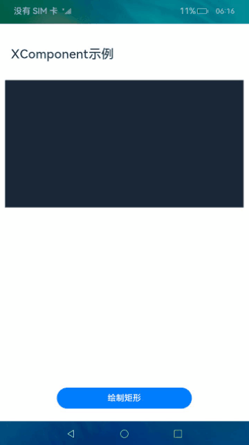
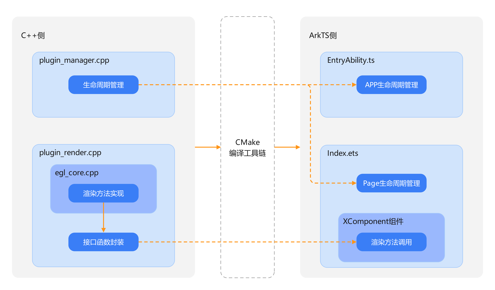
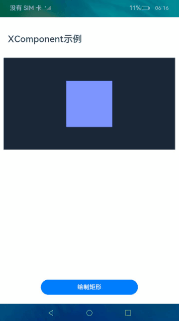

# Native XComponent组件的使用（ArkTS）

## 介绍

本篇Codelab主要介绍如何使用XComponent组件调用NAPI来创建EGL/GLES环境，实现在主页面绘制一个正方形，并可以改变正方形的颜色。本篇CodeLab使用Native C++模板创建。

如图所示，点击绘制矩形按钮，XComponent组件绘制区域中渲染出一个正方形，点击绘制区域，正方形显示另一种颜色，点击绘制矩形按钮正方形还原至初始绘制的颜色。



### 相关概念

-   [EGL\(Embedded Graphic Library\)](https://gitcode.com/openharmony/docs/blob/master/zh-cn/application-dev/reference/native-lib/third_party_opengl/egl.md)：EGL 是Khronos渲染API (如OpenGL ES 或 OpenVG) 与底层原生窗口系统之间的接口。
-   [XComponent](https://gitcode.com/openharmony/docs/blob/master/zh-cn/application-dev/reference/arkui-ts/ts-basic-components-xcomponent.md)：可用于EGL/OpenGLES和媒体数据写入，并显示在XComponent组件。

## 环境搭建

### 软件要求

-   [DevEco Studio](https://gitcode.com/openharmony/docs/blob/master/zh-cn/application-dev/quick-start/start-overview.md#%E5%B7%A5%E5%85%B7%E5%87%86%E5%A4%87)版本：DevEco Studio 3.1 Release。
-   OpenHarmony SDK版本：API version 9。

### 硬件要求

-   开发板类型：[润和RK3568开发板](https://gitcode.com/openharmony/docs/blob/master/zh-cn/device-dev/quick-start/quickstart-appendix-rk3568.md)。
-   OpenHarmony系统：3.2 Release。

### 环境搭建

完成本篇Codelab我们首先要完成开发环境的搭建，本示例以**RK3568**开发板为例，参照以下步骤进行：

1. [获取OpenHarmony系统版本](https://gitcode.com/openharmony/docs/blob/master/zh-cn/device-dev/get-code/sourcecode-acquire.md#%E8%8E%B7%E5%8F%96%E6%96%B9%E5%BC%8F3%E4%BB%8E%E9%95%9C%E5%83%8F%E7%AB%99%E7%82%B9%E8%8E%B7%E5%8F%96)：标准系统解决方案（二进制）。以3.2 Release版本为例：

   

2. 搭建烧录环境。

   1.  [完成DevEco Device Tool的安装](https://gitcode.com/openharmony/docs/blob/master/zh-cn/device-dev/quick-start/quickstart-ide-env-win.md)
   2.  [完成RK3568开发板的烧录](https://gitcode.com/openharmony/docs/blob/master/zh-cn/device-dev/quick-start/quickstart-ide-3568-burn.md)

3. 搭建开发环境。

   1.  开始前请参考[工具准备](https://gitcode.com/openharmony/docs/blob/master/zh-cn/application-dev/quick-start/start-overview.md#%E5%B7%A5%E5%85%B7%E5%87%86%E5%A4%87)，完成DevEco Studio的安装和开发环境配置。
   2.  开发环境配置完成后，请参考[使用工程向导](https://gitcode.com/openharmony/docs/blob/master/zh-cn/application-dev/quick-start/start-with-ets-stage.md#创建ets工程)创建工程（模板选择“Empty Ability”）。
   3.  工程创建完成后，选择使用[真机进行调测](https://gitcode.com/openharmony/docs/blob/master/zh-cn/application-dev/quick-start/start-with-ets-stage.md#使用真机运行应用)。

## 代码结构解读

### 代码目录结构图

本篇Codelab只对核心代码进行讲解，对于完整代码，我们会在gitee中提供。

使用Native C++模板创建项目会自动生成cpp文件夹、types文件夹、CMakeList.txt文件，开发者可以根据实际情况自行添加修改其他文件及文件夹。

```
├──entry/src/main
│  ├──cpp                           // C++代码区
│  │  ├──CMakeLists.txt             // CMake配置文件
│  │  ├──napi_init.cpp              // C++源代码
│  │  ├──common
│  │  │  └──common.h                // 常量定义文件
│  │  ├──manager                    // 生命周期管理模块
│  │  │  ├──plugin_manager.cpp
│  │  │  └──plugin_manager.h
│  │  ├──render                     // 渲染模块
│  │  │  ├──egl_core.cpp
│  │  │  ├──egl_core.h
│  │  │  ├──plugin_render.cpp
│  │  │  └──plugin_render.h
│  │  └──types                      // 接口存放文件夹
│  │     └──libhello
│  │        ├──index.d.ts           // 接口文件
│  │        └──oh-package.json5     // 接口注册配置文件
│  └──ets                           // 代码区
│     ├──common
│     │  └──CommonConstants.ets     // 常量定义文件
│     ├──entryability
│     │  └──EntryAbility.ts         // 程序入口类
│     └──pages                      // 页面文件
│        └──Index.ets               // 主界面
└──entry/src/main/resources         // 资源文件目录
```

## 应用架构

应用架构如图所示。其中，C++侧代码用于实现业务逻辑，ArkTS侧代码用于展示前端界面以及调用相关方法。

-   C++侧：实现图形渲染方法并进行接口函数封装，管理应用和页面的生命周期。
-   ArkTS侧：实现前端界面，调用C++侧的图形渲染方法，并在应用和页面的生命周期调用相关C++侧方法。
-   CMake编译工具链：跨平台的编译工具，将C++侧代码编译成so文件提供给ArkTS侧。



## 界面设计

主界面由标题、绘制区域、按钮组成。Index.ets文件完成界面实现，使用Column及Row容器组件进行布局。



```typescript
// Index.ets
@Entry
@Component
struct Index {
  ...
  build() {
    Column() {
      Row() {
        ...
      }
      .height($r('app.float.title_height'))
      Column() {
        XComponent({
          ...
        })
      }
      .height(CommonConstants.XCOMPONENT_HEIGHT)
      Row() {
        Button($r('app.string.button_text'))
          .fontSize($r('app.float.button_font_size'))
          .fontWeight(CommonConstants.FONT_WEIGHT)
      }
      .width(CommonConstants.FULL_PARENT)
    }
    .width(CommonConstants.FULL_PARENT)
    .height(CommonConstants.FULL_PARENT)
  }
}
```

## ArkTS侧方法调用

ArkTS侧方法调用步骤如下：

- 使用import语句导入编译生成的动态链接库文件。
- 增加XComponent组件，设置XComponent组件的唯一标识id，指定XComponent组件类型及需要链接的动态库名称。
- 组件链接动态库加载完成后回调onLoad()方法，指定XComponent组件的上下文环境，上下文环境包含来自C++挂载的方法。
- 新增Button组件，绑定由NAPI注册的drawRectangle()方法，实现绘制正方形的功能。

```typescript
// Index.ets
// 导入动态链接库
import nativerender from 'libnativerender.so';

@Entry
@Component
struct Index {
  // XComponent实例对象的context
  private xComponentContext: Record<string, () => void> = {};
  ...
  build() {
    ...
    // 增加XComponent组件
    XComponent({
      id: CommonConstants.XCOMPONENT_ID,
      type: CommonConstants.XCOMPONENT_TYPE,
      libraryname: CommonConstants.XCOMPONENT_LIBRARY_NAME
    })
      .onLoad((xComponentContext?: object | Record<string, () => void>) => {
        if (xComponentContext) {
          this.xComponentContext = xComponentContext as Record<string, () => void>;
        }
      })
    ...
    // 增加Button组件
    Button($r('app.string.button_text'))
      .onClick(() => {
        if (this.xComponentContext) {
          this.xComponentContext.drawRectangle();
        }
      })
    ...
  }
}
```

## C++侧功能实现

### 渲染功能实现

- 进行环境的初始化，包括初始化可用的EGLDisplay、确定可用的surface配置、创建渲染区域surface、创建并关联上下文等。

  ``` c++
  // egl_core.cpp
  bool EGLCore::EglContextInit(void *window, int width, int height)
  {
      OH_LOG_Print(LOG_APP, LOG_INFO, LOG_PRINT_DOMAIN, "EGLCore", "EglContextInit execute");
      if ((nullptr == window) || (0 >= width) || (0 >= height)) {
          OH_LOG_Print(LOG_APP, LOG_ERROR, LOG_PRINT_DOMAIN, "EGLCore", "EglContextInit: param error");
          return false;
      }
  
      m_width = width;
      m_height = height;
      if (0 < m_width) {
          // 计算绘制矩形宽度百分比
          m_widthPercent = FIFTY_PERCENT * m_height / m_width;
      }
      m_eglWindow = static_cast<EGLNativeWindowType>(window);
  
      // 初始化display
      m_eglDisplay = eglGetDisplay(EGL_DEFAULT_DISPLAY);
      if (EGL_NO_DISPLAY == m_eglDisplay) {
          OH_LOG_Print(LOG_APP, LOG_ERROR, LOG_PRINT_DOMAIN, "EGLCore", "eglGetDisplay: unable to get EGL display");
          return false;
      }
  
      EGLint majorVersion;
      EGLint minorVersion;
      if (!eglInitialize(m_eglDisplay, &majorVersion, &minorVersion)) {
          OH_LOG_Print(LOG_APP, LOG_ERROR, LOG_PRINT_DOMAIN, "EGLCore",
              "eglInitialize: unable to get initialize EGL display");
          return false;
      }
  
      // 选择配置
      const EGLint maxConfigSize = 1;
      EGLint numConfigs;
      if (!eglChooseConfig(m_eglDisplay, ATTRIB_LIST, &m_eglConfig, maxConfigSize, &numConfigs)) {
          OH_LOG_Print(LOG_APP, LOG_ERROR, LOG_PRINT_DOMAIN, "EGLCore", "eglChooseConfig: unable to choose configs");
          return false;
      }
  
      // 创建环境
      return CreateEnvironment();
  }
  
  bool EGLCore::CreateEnvironment()
  {
      // 创建surface
      if (nullptr == m_eglWindow) {
          OH_LOG_Print(LOG_APP, LOG_ERROR, LOG_PRINT_DOMAIN, "EGLCore", "m_eglWindow is null");
          return false;
      }
      m_eglSurface = eglCreateWindowSurface(m_eglDisplay, m_eglConfig, m_eglWindow, NULL);
  
      if (nullptr == m_eglSurface) {
          OH_LOG_Print(LOG_APP, LOG_ERROR, LOG_PRINT_DOMAIN, "EGLCore",
              "eglCreateWindowSurface: unable to create surface");
          return false;
      }
  
      // 创建context
      m_eglContext = eglCreateContext(m_eglDisplay, m_eglConfig, EGL_NO_CONTEXT, CONTEXT_ATTRIBS);
      if (!eglMakeCurrent(m_eglDisplay, m_eglSurface, m_eglSurface, m_eglContext)) {
          OH_LOG_Print(LOG_APP, LOG_ERROR, LOG_PRINT_DOMAIN, "EGLCore", "eglMakeCurrent failed");
          return false;
      }
  
      // 创建program
      m_program = CreateProgram(VERTEX_SHADER, FRAGMENT_SHADER);
      if (PROGRAM_ERROR == m_program) {
          OH_LOG_Print(LOG_APP, LOG_ERROR, LOG_PRINT_DOMAIN, "EGLCore", "CreateProgram: unable to create program");
          return false;
      }
      return true;
  }
  ```

- 使用EGL渲染正方形。实现一个渲染函数，通过调用EGL相关API进行绘制。绘制颜色使用小数表示，需要将十六进制颜色转换成十进制数值除以255计算。例如#182431转换十进制分别为24/36/49。

  ```c++
  // common.h
  /**
   * 绘制矩形颜色 #7E8FFB
   */
  const GLfloat DRAW_COLOR[] = { 126.0f / 255, 143.0f / 255, 251.0f / 255, 1.0f };
  
  /**
   * 绘制背景颜色 #182431
   */
  const GLfloat BACKGROUND_COLOR[] = { 24.0f / 255, 36.0f / 255, 49.0f / 255, 1.0f };
  
  /**
   * 绘制背景顶点
   */
  const GLfloat BACKGROUND_RECTANGLE_VERTICES[] = {
      -1.0f, 1.0f,
      1.0f, 1.0f,
      1.0f, -1.0f,
      -1.0f, -1.0f
  };
  
  // egl_core.cpp
  void EGLCore::Draw()
  {
      m_flag = false;
      OH_LOG_Print(LOG_APP, LOG_INFO, LOG_PRINT_DOMAIN, "EGLCore", "Draw");
  
      // 绘制准备工作
      GLint position = PrepareDraw();
      if (POSITION_ERROR == position) {
          OH_LOG_Print(LOG_APP, LOG_ERROR, LOG_PRINT_DOMAIN, "EGLCore", "Draw get position failed");
          return;
      }
  
      // 绘制背景
      if (!ExecuteDraw(position, BACKGROUND_COLOR, BACKGROUND_RECTANGLE_VERTICES,
          sizeof(BACKGROUND_RECTANGLE_VERTICES))) {
          OH_LOG_Print(LOG_APP, LOG_ERROR, LOG_PRINT_DOMAIN, "EGLCore", "Draw execute draw background failed");
          return;
      }
  
      // 确定绘制矩形的顶点，使用绘制区域的百分比表示
      const GLfloat rectangleVertices[] = {
          -m_widthPercent, FIFTY_PERCENT,
          m_widthPercent, FIFTY_PERCENT,
          m_widthPercent, -FIFTY_PERCENT,
          -m_widthPercent, -FIFTY_PERCENT
      };
  
      // 绘制矩形
      if (!ExecuteDraw(position, DRAW_COLOR, rectangleVertices, sizeof(rectangleVertices))) {
          OH_LOG_Print(LOG_APP, LOG_ERROR, LOG_PRINT_DOMAIN, "EGLCore", "Draw execute draw rectangle failed");
          return;
      }
  
      // 绘制后操作
      if (!FinishDraw()) {
          OH_LOG_Print(LOG_APP, LOG_ERROR, LOG_PRINT_DOMAIN, "EGLCore", "Draw FinishDraw failed");
          return;
      }
  
      // 标记已绘制
      m_flag = true;
  }
  
  // 绘制前准备，获取position，创建成功时position值从0开始
  GLint EGLCore::PrepareDraw()
  {
      if ((nullptr == m_eglDisplay) || (nullptr == m_eglSurface) || (nullptr == m_eglContext) ||
          (!eglMakeCurrent(m_eglDisplay, m_eglSurface, m_eglSurface, m_eglContext))) {
          OH_LOG_Print(LOG_APP, LOG_ERROR, LOG_PRINT_DOMAIN, "EGLCore", "PrepareDraw: param error");
          return POSITION_ERROR;
      }
  
      // 下列方法无返回值
      glViewport(DEFAULT_X_POSITION, DEFAULT_X_POSITION, m_width, m_height);
      glClearColor(GL_RED_DEFAULT, GL_GREEN_DEFAULT, GL_BLUE_DEFAULT, GL_ALPHA_DEFAULT);
      glClear(GL_COLOR_BUFFER_BIT);
      glUseProgram(m_program);
  
      return glGetAttribLocation(m_program, POSITION_NAME);
  }
  
  // 依据传入参数在指定区域绘制指定颜色
  bool EGLCore::ExecuteDraw(GLint position, const GLfloat *color, const GLfloat rectangleVertices[],
      unsigned long vertSize)
  {
      if ((0 > position) || (nullptr == color) || (RECTANGLE_VERTICES_SIZE != vertSize / sizeof(rectangleVertices[0]))) {
          OH_LOG_Print(LOG_APP, LOG_ERROR, LOG_PRINT_DOMAIN, "EGLCore", "ExecuteDraw: param error");
          return false;
      }
  
      // 下列方法无返回值
      glVertexAttribPointer(position, POINTER_SIZE, GL_FLOAT, GL_FALSE, 0, rectangleVertices);
      glEnableVertexAttribArray(position);
      glVertexAttrib4fv(1, color);
      glDrawArrays(GL_TRIANGLE_FAN, 0, TRIANGLE_FAN_SIZE);
      glDisableVertexAttribArray(position);
  
      return true;
  }
  
  // 结束绘制操作
  bool EGLCore::FinishDraw()
  {
      // 强制刷新缓冲
      glFlush();
      glFinish();
  
      // 交换前后缓存
      return eglSwapBuffers(m_eglDisplay, m_eglSurface);
  }
  ```
  
- 改变正方形的颜色。重新绘制一个大小相同、颜色不同的正方形，与原正方形地址交换，实现改变颜色的功能。

  ```C++
  // common.h
  /**
   * 改变后绘制的颜色 #92D6CC
   */
  const GLfloat CHANGE_COLOR[] = { 146.0f / 255, 214.0f / 255, 204.0f / 255, 1.0f };
  
  // egl_core.cpp
  void EGLCore::ChangeColor()
  {
      // 界面未绘制矩形时退出
      if (!m_flag) {
          return;
      }
  
      // 绘制准备工作
      GLint position = PrepareDraw();
      if (POSITION_ERROR == position) {
          OH_LOG_Print(LOG_APP, LOG_ERROR, LOG_PRINT_DOMAIN, "EGLCore", "ChangeColor get position failed");
          return;
      }
  
      // 绘制背景
      if (!ExecuteDraw(position, BACKGROUND_COLOR, BACKGROUND_RECTANGLE_VERTICES,
          sizeof(BACKGROUND_RECTANGLE_VERTICES))) {
          OH_LOG_Print(LOG_APP, LOG_ERROR, LOG_PRINT_DOMAIN, "EGLCore", "ChangeColor execute draw background failed");
          return;
      }
  
      // 确定绘制矩形的顶点，使用绘制区域的百分比表示
      const GLfloat rectangleVertices[] = {
          -m_widthPercent, FIFTY_PERCENT,
          m_widthPercent, FIFTY_PERCENT,
          m_widthPercent, -FIFTY_PERCENT,
          -m_widthPercent, -FIFTY_PERCENT
      };
  
      // 使用新的颜色绘制矩形
      if (!ExecuteDraw(position, CHANGE_COLOR, rectangleVertices, sizeof(rectangleVertices))) {
          OH_LOG_Print(LOG_APP, LOG_ERROR, LOG_PRINT_DOMAIN, "EGLCore", "ChangeColor execute draw rectangle failed");
          return;
      }
  
      // 结束绘制
      if (!FinishDraw()) {
          OH_LOG_Print(LOG_APP, LOG_ERROR, LOG_PRINT_DOMAIN, "EGLCore", "ChangeColor FinishDraw failed");
      }
  }
  ```


### 使用NAPI将C++方法传递给ArkTS

-   创建接口函数NapiDrawRectangle\(\)，封装对应C++渲染方法。根据XComponent组件信息，获取对应的渲染模块render，调用绘制矩形的方法。

    注册为ArkTS侧接口的方法，固定为napi\_value \(\*napi\_callback\)\(napi\_env env, napi\_callback\_info info\)类型，不可更改。napi\_value为NAPI定义的指针，无返回值时返回 nullptr。

    ```c++
    // plugin_render.cpp
    // NAPI注册方法固定参数及返回值类型，无返回值时返回nullptr
    napi_value PluginRender::NapiDrawRectangle(napi_env env, napi_callback_info info)
    {
        OH_LOG_Print(LOG_APP, LOG_INFO, LOG_PRINT_DOMAIN, "PluginRender", "NapiDrawRectangle");
        if ((nullptr == env) || (nullptr == info)) {
            OH_LOG_Print(LOG_APP, LOG_ERROR, LOG_PRINT_DOMAIN, "PluginRender", "NapiDrawRectangle: env or info is null");
            return nullptr;
        }
    
        // 获取环境变量参数
        napi_value thisArg;
        if (napi_ok != napi_get_cb_info(env, info, nullptr, nullptr, &thisArg, nullptr)) {
            OH_LOG_Print(LOG_APP, LOG_ERROR, LOG_PRINT_DOMAIN, "PluginRender", "NapiDrawRectangle: napi_get_cb_info fail");
            return nullptr;
        }
    
        // 获取环境变量中XComponent实例
        napi_value exportInstance;
        if (napi_ok != napi_get_named_property(env, thisArg, OH_NATIVE_XCOMPONENT_OBJ, &exportInstance)) {
            OH_LOG_Print(LOG_APP, LOG_ERROR, LOG_PRINT_DOMAIN, "PluginRender",
                "NapiDrawRectangle: napi_get_named_property fail");
            return nullptr;
        }
    
        OH_NativeXComponent *nativeXComponent = nullptr;
        if (napi_ok != napi_unwrap(env, exportInstance, reinterpret_cast<void **>(&nativeXComponent))) {
            OH_LOG_Print(LOG_APP, LOG_ERROR, LOG_PRINT_DOMAIN, "PluginRender", "NapiDrawRectangle: napi_unwrap fail");
            return nullptr;
        }
    
        // 获取XComponent实例的id
        char idStr[OH_XCOMPONENT_ID_LEN_MAX + 1] = { '\0' };
        uint64_t idSize = OH_XCOMPONENT_ID_LEN_MAX + 1;
        if (OH_NATIVEXCOMPONENT_RESULT_SUCCESS != OH_NativeXComponent_GetXComponentId(nativeXComponent, idStr, &idSize)) {
            OH_LOG_Print(LOG_APP, LOG_ERROR, LOG_PRINT_DOMAIN, "PluginRender",
                "NapiDrawRectangle: Unable to get XComponent id");
            return nullptr;
        }
    
        std::string id(idStr);
        PluginRender *render = PluginRender::GetInstance(id);
        if (render) {
            // 调用绘制矩形的方法
            render->m_eglCore->Draw();
            OH_LOG_Print(LOG_APP, LOG_INFO, LOG_PRINT_DOMAIN, "PluginRender", "render->m_eglCore->Draw() executed");
        }
        return nullptr;
    }
    ```

-   使用NAPI中的napi\_define\_properties方法，将接口函数NapiDrawRectangle\(\)注册为ArkTS侧接口drawRectangle\(\)，在ArkTS侧调用drawRectangle\(\)方法，完成正方形的绘制。

    ```c++
    // plugin_render.cpp
    void PluginRender::Export(napi_env env, napi_value exports)
    {
        if ((nullptr == env) || (nullptr == exports)) {
            OH_LOG_Print(LOG_APP, LOG_ERROR, LOG_PRINT_DOMAIN, "PluginRender", "Export: env or exports is null");
            return;
        }
    
        // 将接口函数注册为ArkTS侧接口drawRectangle
        napi_property_descriptor desc[] = {
            { "drawRectangle", nullptr, PluginRender::NapiDrawRectangle, nullptr, nullptr, nullptr, napi_default, nullptr }
        };
        if (napi_ok != napi_define_properties(env, exports, sizeof(desc) / sizeof(desc[0]), desc)) {
            OH_LOG_Print(LOG_APP, LOG_ERROR, LOG_PRINT_DOMAIN, "PluginRender", "Export: napi_define_properties failed");
        }
    }
    ```

### 使用NAPI实现触摸事件回调函数

通过将C++方法封装至触摸事件回调函数的方式，实现触摸绘制区域时改变正方形的颜色的功能。

- 创建一个新函数DispatchTouchEventCB()，将改变颜色的C++方法ChangeColor()封装于其中。
- 将新函数绑定为组件触摸事件的回调函数，组件绘制区域产生触摸事件时触发，改变正方形展示的颜色。

```c++
// plugin_render.cpp
void DispatchTouchEventCB(OH_NativeXComponent *component, void *window)
{
    OH_LOG_Print(LOG_APP, LOG_INFO, LOG_PRINT_DOMAIN, "Callback", "DispatchTouchEventCB");
    if ((nullptr == component) || (nullptr == window)) {
        OH_LOG_Print(LOG_APP, LOG_ERROR, LOG_PRINT_DOMAIN, "Callback",
            "DispatchTouchEventCB: component or window is null");
        return;
    }

    char idStr[OH_XCOMPONENT_ID_LEN_MAX + 1] = { '\0' };
    uint64_t idSize = OH_XCOMPONENT_ID_LEN_MAX + 1;
    if (OH_NATIVEXCOMPONENT_RESULT_SUCCESS != OH_NativeXComponent_GetXComponentId(component, idStr, &idSize)) {
        OH_LOG_Print(LOG_APP, LOG_ERROR, LOG_PRINT_DOMAIN, "Callback",
            "DispatchTouchEventCB: Unable to get XComponent id");
        return;
    }

    std::string id(idStr);
    PluginRender *render = PluginRender::GetInstance(id);
    if (nullptr != render) {
        // 封装改变颜色的函数
        render->m_eglCore->ChangeColor();
    }
}

PluginRender::PluginRender(std::string &id)
{
    this->m_id = id;
    this->m_eglCore = new EGLCore();
    auto renderCallback = &PluginRender::m_callback;
    renderCallback->OnSurfaceCreated = OnSurfaceCreatedCB;
    renderCallback->OnSurfaceChanged = OnSurfaceChangedCB;
    renderCallback->OnSurfaceDestroyed = OnSurfaceDestroyedCB;

    // 设置触摸事件的回调函数，在触摸事件触发时调用NAPI接口函数，从而调用原C++方法
    renderCallback->DispatchTouchEvent = DispatchTouchEventCB;
}
```

### 释放相关资源

释放申请资源的步骤如下：

-   EGLCore类下创建Release\(\)方法，释放初始化环境时申请的资源，包含窗口display、渲染区域surface、环境上下文context等。
-   PluginRender类添加Release\(\)方法，释放EGLCore实例及PluginRender实例。
-   创建一个新方法OnSurfaceDestroyedCB\(\)，将PluginRender类内释放资源的方法Release\(\)封装于其中。
-   将新方法绑定为组件销毁事件的回调方法，组件销毁时触发，释放相关资源。

```c++
// egl_core.cpp
void EGLCore::Release()
{
    if ((nullptr == m_eglDisplay) || (nullptr == m_eglSurface) || (!eglDestroySurface(m_eglDisplay, m_eglSurface))) {
        OH_LOG_Print(LOG_APP, LOG_ERROR, LOG_PRINT_DOMAIN, "EGLCore", "Release eglDestroySurface failed");
    }

    if ((nullptr == m_eglDisplay) || (nullptr == m_eglContext) || (!eglDestroyContext(m_eglDisplay, m_eglContext))) {
        OH_LOG_Print(LOG_APP, LOG_ERROR, LOG_PRINT_DOMAIN, "EGLCore", "Release eglDestroyContext failed");
    }

    if ((nullptr == m_eglDisplay) || (!eglTerminate(m_eglDisplay))) {
        OH_LOG_Print(LOG_APP, LOG_ERROR, LOG_PRINT_DOMAIN, "EGLCore", "Release eglTerminate failed");
    }
}

// plugin_render.cpp
void PluginRender::Release(std::string &id)
{
    PluginRender *render = PluginRender::GetInstance(id);
    if (nullptr != render) {
        render->m_eglCore->Release();
        delete render->m_eglCore;
        render->m_eglCore = nullptr;
        delete render;
        render = nullptr;
        m_instance.erase(m_instance.find(id));
    }
}

void OnSurfaceDestroyedCB(OH_NativeXComponent *component, void *window)
{
    OH_LOG_Print(LOG_APP, LOG_INFO, LOG_PRINT_DOMAIN, "Callback", "OnSurfaceDestroyedCB");
    if ((nullptr == component) || (nullptr == window)) {
        OH_LOG_Print(LOG_APP, LOG_ERROR, LOG_PRINT_DOMAIN, "Callback",
            "OnSurfaceDestroyedCB: component or window is null");
        return;
    }

    char idStr[OH_XCOMPONENT_ID_LEN_MAX + 1] = { '\0' };
    uint64_t idSize = OH_XCOMPONENT_ID_LEN_MAX + 1;
    if (OH_NATIVEXCOMPONENT_RESULT_SUCCESS != OH_NativeXComponent_GetXComponentId(component, idStr, &idSize)) {
        OH_LOG_Print(LOG_APP, LOG_ERROR, LOG_PRINT_DOMAIN, "Callback",
            "OnSurfaceDestroyedCB: Unable to get XComponent id");
        return;
    }

    // 释放申请的资源
    std::string id(idStr);
    PluginRender::Release(id);
}

PluginRender::PluginRender(std::string &id)
{
    this->m_id = id;
    this->m_eglCore = new EGLCore();
    OH_NativeXComponent_Callback *renderCallback = &PluginRender::m_callback;
    renderCallback->OnSurfaceCreated = OnSurfaceCreatedCB;
    renderCallback->OnSurfaceChanged = OnSurfaceChangedCB;

    // 设置组件销毁事件的回调函数，组件销毁时触发相关操作，释放申请的资源
    renderCallback->OnSurfaceDestroyed = OnSurfaceDestroyedCB;
    renderCallback->DispatchTouchEvent = DispatchTouchEventCB;
}
```


### 注册与编译

在napi\_init.cpp文件中，Init方法注册上文实现的接口函数，从而将封装的C++方法传递出来，供ArkTS侧调用。编写接口的描述信息，根据实际需要可以修改对应参数。\_\_attribute\_\_\(\(constructor\)\)修饰的方法由系统自动调用，使用NAPI接口napi\_module\_register\(\)传入模块描述信息进行模块注册。Native C++模板创建项目会自动生成此结构代码，开发者可根据实际情况修改其中内容。

```c++
// napi_init.cpp
static napi_value Init(napi_env env, napi_value exports)
{
    OH_LOG_Print(LOG_APP, LOG_INFO, LOG_PRINT_DOMAIN, "Init", "Init begins");
    if ((nullptr == env) || (nullptr == exports)) {
        OH_LOG_Print(LOG_APP, LOG_ERROR, LOG_PRINT_DOMAIN, "Init", "env or exports is null");
        return nullptr;
    }

    napi_property_descriptor desc[] = {
        { "getContext", nullptr, PluginManager::GetContext, nullptr, nullptr, nullptr, napi_default, nullptr }
    };

    // 将接口函数注册为ArkTS侧接口getContext()
    if (napi_ok != napi_define_properties(env, exports, sizeof(desc) / sizeof(desc[0]), desc)) {
        OH_LOG_Print(LOG_APP, LOG_ERROR, LOG_PRINT_DOMAIN, "Init", "napi_define_properties failed");
        return nullptr;
    }

    // 方法内检查环境变量是否包含XComponent组件实例，若实例存在注册绘制相关接口
    PluginManager::GetInstance()->Export(env, exports);
    return exports;
}

static napi_module nativerenderModule = {
    .nm_version = 1,
    .nm_flags = 0,
    .nm_filename = nullptr,
    .nm_register_func = Init,        // 入口函数
    .nm_modname = "nativerender",    // 模块名称
    .nm_priv = ((void *)0),
    .reserved = { 0 }
};

extern "C" __attribute__((constructor)) void RegisterModule(void)
{
    napi_module_register(&nativerenderModule);
}
```

使用CMake工具链将C++源代码编译成动态链接库文件。本篇Codelab中会链接两次动态库，第一次为import语句，第二次为XComponent组件链接动态库。

```cmake
# CMakeList.txt
# 声明使用 CMAKE 的最小版本号
cmake_minimum_required(VERSION 3.4.1)

# 配置项目信息
project(XComponent)

# set命令，格式为set(key value)，表示设置key的值为value
set(NATIVERENDER_ROOT_PATH ${CMAKE_CURRENT_SOURCE_DIR})

# 设置头文件的搜索目录
include_directories(
    ${NATIVERENDER_ROOT_PATH}
    ${NATIVERENDER_ROOT_PATH}/include
)

# 添加名为nativerender的库，库文件名为libnativerender.so，添加cpp文件
add_library(nativerender SHARED
    render/egl_core.cpp
    render/plugin_render.cpp
    manager/plugin_manager.cpp
    napi_init.cpp
)
...
# 添加构建需要链接的库
target_link_libraries(nativerender PUBLIC ${EGL-lib} ${GLES-lib} ${hilog-lib} ${libace-lib} ${libnapi-lib} ${libuv-lib} libc++.a)
```

## 总结

您已经完成了本次Codelab的学习，并了解到以下知识点：

1.  使用XComponent组件调用NAPI创建EGL/GLES环境。
2.  使用OpenGL ES进行开发渲染。
3.  使用回调函数响应触摸事件。


