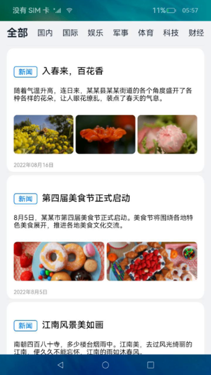
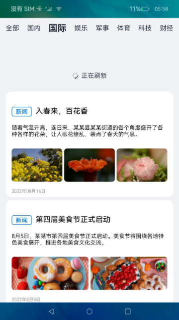


# 新闻数据加载（ArkTS）

## 介绍

本篇Codelab是基于ArkTS的声明式开发范式实现的样例，主要介绍了数据请求和touch事件的使用。包含以下功能：

1. 数据请求。
2. 列表下拉刷新。
3. 列表上拉加载。


### 相关概念

- [List组件](https://gitcode.com/openharmony/docs/blob/master/zh-cn/application-dev/reference/arkui-ts/ts-container-list.md)：列表包含一系列相同宽度的列表项。
- [Tabs](https://gitcode.com/openharmony/docs/blob/master/zh-cn/application-dev/reference/arkui-ts/ts-container-tabs.md)：通过页签进行内容视图切换。
- [TabContent](https://gitcode.com/openharmony/docs/blob/master/zh-cn/application-dev/reference/arkui-ts/ts-container-tabcontent.md)：仅在Tabs中使用，对应一个切换页签的内容视图。
- [数据请求](https://gitcode.com/openharmony/docs/blob/master/zh-cn/application-dev/reference/apis/js-apis-http.md)：提供HTTP数据请求能力。
- [触摸事件onTouch](https://gitcode.com/openharmony/docs/blob/master/zh-cn/application-dev/reference/arkui-ts/ts-universal-events-touch.md)：触摸动作触发调用该方法。

### 相关权限

添加网络权限：ohos.permission.INTERNET。

### 使用说明

#### 服务端搭建流程

1. 搭建nodejs环境：本篇Codelab的服务端是基于nodejs实现的，需要安装nodejs，如果您本地已有nodejs环境可以跳过此步骤。
   1. 检查本地是否安装nodejs：打开命令行工具（如Windows系统的cmd和Mac电脑的Terminal，这里以Windows为例），输入node -v，如果可以看到版本信息，说明已经安装nodejs。

      
   2. 如果本地没有nodejs环境，您可以去nodejs官网上下载所需版本进行安装配置。
   3. 配置完环境变量后，重新打开命令行工具，输入node -v，如果可以看到版本信息，说明已安装成功。
2. 构建局域网环境：测试本Codelab时要确保运行服务端代码的电脑和测试机连接的是同一局域网下的网络，您可以用您的手机开一个个人热点，然后将测试机和运行服务端代码的电脑都连接您的手机热点进行测试。
3. 运行服务端代码：在本项目的HttpServerOfNews目录下打开命令行工具，输入npm install 安装服务端依赖包，安装成功后输入npm start点击回车。看到“服务器启动成功！”则表示服务端已经在正常运行。

   
4. 连接服务器地址：打开命令行工具，输入ipconfig命令查看本地ip，将本地ip地址复制到src/main/ets/common/constant/CommonConstants.ets文件下的23行，注意只替换ip地址部分，不要修改端口号，保存好ip之后即可运行Codelab进行测试。

#### 前端使用说明

1. 点击应用进入主页面，页面使用tabBar展示新闻分类，tabContent展示新闻列表，新闻分类和新闻列表通过请求nodejs服务端获取。
2. 点击页签或左右滑动页面，切换标签并展示对应新闻类型的数据。
3. 新闻列表页面，滑动到新闻列表首项数据，接着往下滑动会触发下拉刷新操作，页面更新初始4条新闻数据，滑动到新闻列表最后一项数据，往上拉会触发上拉加载操作，新闻列表会在后面加载4条新闻数据。

## 环境搭建

### 软件要求

- [DevEco Studio](https://gitcode.com/openharmony/docs/blob/master/zh-cn/application-dev/quick-start/start-overview.md#%E5%B7%A5%E5%85%B7%E5%87%86%E5%A4%87)版本：DevEco Studio 3.1 Release。
- OpenHarmony SDK版本：API version 9。

### 硬件要求

- 开发板类型：[润和RK3568开发板](https://gitcode.com/openharmony/docs/blob/master/zh-cn/device-dev/quick-start/quickstart-appendix-rk3568.md)。
- OpenHarmony系统：3.2 Release。

### 环境搭建

完成本篇Codelab我们首先要完成开发环境的搭建，本示例以**RK3568**开发板为例，参照以下步骤进行：

1. [获取OpenHarmony系统版本](https://gitcode.com/openharmony/docs/blob/master/zh-cn/device-dev/get-code/sourcecode-acquire.md#%E8%8E%B7%E5%8F%96%E6%96%B9%E5%BC%8F3%E4%BB%8E%E9%95%9C%E5%83%8F%E7%AB%99%E7%82%B9%E8%8E%B7%E5%8F%96)：标准系统解决方案（二进制）。以3.2Release版本为例：

   

2. 搭建烧录环境。
   1. [完成DevEco Device Tool的安装](https://gitcode.com/openharmony/docs/blob/master/zh-cn/device-dev/quick-start/quickstart-ide-env-win.md)
   2. [完成RK3568开发板的烧录](https://gitcode.com/openharmony/docs/blob/master/zh-cn/device-dev/quick-start/quickstart-ide-3568-burn.md)

3. 搭建开发环境。
   1. 开始前请参考[工具准备](https://gitcode.com/openharmony/docs/blob/master/zh-cn/application-dev/quick-start/start-overview.md#%E5%B7%A5%E5%85%B7%E5%87%86%E5%A4%87)，完成DevEco Studio的安装和开发环境配置。
   2. 开发环境配置完成后，请参考[使用工程向导](https://gitcode.com/openharmony/docs/blob/master/zh-cn/application-dev/quick-start/start-with-ets-stage.md#创建arkts工程)创建工程（模板选择“Empty Ability”）。
   3. 工程创建完成后，选择使用[真机进行调测](https://gitcode.com/openharmony/docs/blob/master/zh-cn/application-dev/quick-start/start-with-ets-stage.md#使用真机运行应用)。

## 代码结构解读

本篇Codelab只对核心代码进行讲解，对于完整代码，我们会在gitcode中提供。

```
├──entry/src/main/ets                   // ArkTS代码区
│  ├──common
│  │  ├──constant
│  │  │  └──CommonConstant.ets          // 公共常量类
│  │  └──utils
│  │     ├──HttpUtil.ets                // 网络请求方法
│  │     ├──Logger.ets                  // 日志工具类
│  │     ├──PullDownRefresh.ets         // 下拉刷新方法
│  │     └──PullUpLoadMore.ets          // 上拉加载更多方法
│  ├──entryability
│  │  └──EntryAbility.ts                // 程序入口类
│  ├──pages
│  │  └──Index.ets                      // 主页面
│  ├──view
│  │  ├──CustomRefreshLoadLayout.ets    // 下拉刷新、上拉加载布局文件
│  │  ├──LoadMoreLayout.ets             // 上拉加载布局封装
│  │  ├──NewsItem.ets                   // 新闻数据
│  │  ├──NewsList.ets                   // 新闻列表
│  │  ├──NoMoreLayout.ets               // 上拉停止布局封装
│  │  ├──RefreshLayout.ets              // 下拉刷新布局封装
│  │  └──TabBar.ets                     // 新闻类型页签
│  └──viewmodel
│     ├──NewsModel.ets                  // 新闻模型类
│     └──NewsViewModel.ets              // 新闻ViewModel
├──entry/src/main/resources             // 资源文件目录
└──HttpServerOfNews                     // 服务端代码
```

## 构建主界面

本章节将介绍新闻列表页面的实现，用tabBar展示新闻分类，tabContent展示新闻列表，效果图如图所示：



在TabBar.ets文件中的aboutToAppear\(\)方法里获取新闻分类。

```typescript
// TabBar.ets
aboutToAppear() {
  // 请求服务端新闻类别
  NewsViewModel.getNewsTypeList().then((typeList: NewsTypeBean[]) => {
    this.tabBarArray = typeList;
  }).catch((typeList: NewsTypeBean[]) => {
     this.tabBarArray = typeList;
  });
}
```

在NewsList.ets文件中的aboutToAppear\(\)方法里获取新闻数据，将数据加载到新闻列表页面ListLayout布局中。

```typescript
// NewsList.ets
changeCategory() {
  this.newsModel.currentPage = 1;
  NewsViewModel.getNewsList(this.newsModel.currentPage, this.newsModel.pageSize, Const.GET_NEWS_LIST)
    .then((data: NewsData[]) => {
      this.newsModel.pageState = PageState.Success;
      if (data.length === this.newsModel.pageSize) {
        this.newsModel.currentPage++;
        this.newsModel.hasMore = true;
      } else {
        this.newsModel.hasMore = false;
      }
      this.newsModel.newsData = data;
    })
    .catch((err: string | Resource) => {
      promptAction.showToast({
        message: err,
        duration: Const.ANIMATION_DURATION
      });
      this.newsModel.pageState = PageState.Fail;
    });
}

aboutToAppear() {
  // 请求服务端新闻数据
  this.changeCategory();
}
...
@Builder ListLayout() {
  List() {
    ...
    ForEach(this.newsModel.newsData, (item: NewsData) => {
      ListItem() {
        // 新闻数据
        NewsItem({ newsData: item })
      }
      .height($r('app.float.news_list_height'))
      .backgroundColor($r('app.color.white'))
      .margin({ top: $r('app.float.news_list_margin_top') })
      .borderRadius(Const.NewsListConstant_ITEM_BORDER_RADIUS)
    }, (item: NewsData, index?: number) => JSON.stringify(item) + index)
    ...
  }
  ...
}
```

## 数据请求

在module.json5文件中配置如下权限：

```json
// module.json5
"requestPermissions": [
  {
    "name": "ohos.permission.INTERNET",
    "reason": "$string:dependency_reason",
    "usedScene": {
      "abilities": [
        "EntryAbility"
      ],
      "when": "inuse"
    }
  }
]
```

这一章节，将基于新闻数据请求来介绍如何从服务端请求数据。

导入http模块，封装httpRequestGet方法，调用者传入url地址和所需参数发起网络数据请求。

```typescript
// HttpUtil.ets
import http from '@ohos.net.http';
...
export function httpRequestGet(url: string): Promise<ResponseResult> {
  let httpRequest = http.createHttp();
  // 发送数据请求
  let responseResult = httpRequest.request(url, {
    method: http.RequestMethod.GET,
    readTimeout: Const.HTTP_READ_TIMEOUT,
    header: {
      'Content-Type': ContentType.JSON
    },
    connectTimeout: Const.HTTP_READ_TIMEOUT,
    extraData: {}
  });
  let serverData: ResponseResult = new ResponseResult();
  // 处理数据，并返回
  return responseResult.then((value: http.HttpResponse) => {
    Logger.info(`http value ${JSON.stringify(value)}`);
    if (value.responseCode === Const.HTTP_CODE_200) {
      // 获取返回数据
      let result = `${value.result}`;
      let resultJson: ResponseResult = JSON.parse(result);
      if (resultJson.code === Const.SERVER_CODE_SUCCESS) {
        serverData.data = resultJson.data;
      }
      serverData.code = resultJson.code;
      serverData.msg = resultJson.msg;
    } else {
      serverData.msg = `${$r('app.string.http_error_message')}&${value.responseCode}`;
    }
    return serverData;
  }).catch(() => {
    serverData.msg = $r('app.string.http_error_message');
    return serverData;
  })
}
```

在NewsViewModel.ets文件中封装getNewsList方法，调用httpRequestGet方法请求服务端，用Promise异步保存返回的新闻数据列表。

```typescript
// NewsViewModel.ets
// 获取服务端新闻数据列表
getNewsList(currentPage: number, pageSize: number, path: string): Promise<NewsData[]> {
  return new Promise(async (resolve: Function, reject: Function) => {
    let url = `${Const.SERVER}/${path}`;
    url += '?currentPage=' + currentPage + '&pageSize=' + pageSize;
    httpRequestGet(url).then((data: ResponseResult) => {
      if (data.code === Const.SERVER_CODE_SUCCESS) {
        resolve(data.data);
      } else {
        Logger.error('getNewsList failed', JSON.stringify(data));
        reject($r('app.string.page_none_msg'));
      }
    }).catch((err: Error) => {
      Logger.error('getNewsList failed', JSON.stringify(err));
      reject($r('app.string.http_error_message'));
    });
  });
}
```

## 下拉刷新

本章节将以下拉刷新的功能效果来介绍touch事件的使用。效果图如图所示：



创建一个下拉刷新布局CustomLayout，动态传入刷新图片和刷新文字描述。

```typescript
// CustomRefreshLoadLayout.ets
build() {
  Row() {
    // 下拉刷新图片
    Image(this.customRefreshLoadClass.imageSrc)
      ...
    // 下拉刷新文字
    Text(this.customRefreshLoadClass.textValue)
      ...
  }
  ...
}
```

将下拉刷新的布局添加到NewsList.ets文件中新闻列表布局ListLayout里面，监听ListLayout组件的onTouch事件实现下拉刷新。

```typescript
// NewsList.ets
build() {
  Column() {
    if (this.newsModel.pageState === PageState.Success) {
      this.ListLayout()
    }
    ...
  }
  ...
  .onTouch((event: TouchEvent | undefined) => {
    if (event) {
      if (this.newsModel.pageState === PageState.Success) {
        listTouchEvent(this.newsModel, event);
      }
    }
  })
}
...
@Builder ListLayout() {
  List() {
    ListItem() {
      RefreshLayout({
        refreshLayoutClass: new CustomRefreshLoadLayoutClass(this.newsModel.isVisiblePullDown, this.newsModel.pullDownRefreshImage,
          this.newsModel.pullDownRefreshText, this.newsModel.pullDownRefreshHeight)
      })
      ...
    }
  }
  ...
}
```

1. 在onTouch事件中，listTouchEvent方法判断触摸事件是否满足下拉条件。如下listTouchEvent所示：
2. 在touchMovePullRefresh方法中，我们将对下拉的偏移量与下拉刷新布局的高度进行对比，如果大于布局高度并且在新闻列表的顶部，则表示达到刷新条件。如下touchMovePullRefresh所示：
3. 在pullRefreshState方法中我们会对下拉刷新布局中的状态图片和描述进行改变，如下pullRefreshState所示：
4. 当手指松开，才执行刷新操作。

```typescript
// PullDownRefresh.ets
export function listTouchEvent(newsModel: NewsModel, event: TouchEvent) {
  switch (event.type) {
    ...
    case TouchType.Move:
      if ((newsModel.isRefreshing === true) || (newsModel.isLoading === true)) {
        return;
      }
      let isDownPull = event.touches[0].y - newsModel.lastMoveY > 0;
      if (((isDownPull === true) || (newsModel.isPullRefreshOperation === true)) && (newsModel.isCanLoadMore === false))
      {
        // 手指移动，处理下拉刷新
        touchMovePullRefresh(newsModel, event);
      }
      ...
      break;
  }
}

export function touchMovePullRefresh(newsModel: NewsModel, event: TouchEvent) {
  if (newsModel.startIndex === 0) {
    newsModel.isPullRefreshOperation = true;
    let height = vp2px(newsModel.pullDownRefreshHeight);
    newsModel.offsetY = event.touches[0].y - newsModel.downY;
    // 滑动偏移量大于下拉刷新布局高度，满足刷新条件。
    if (newsModel.offsetY >= height) {
      pullRefreshState(newsModel, RefreshState.Release);
      newsModel.offsetY = height + newsModel.offsetY * Const.Y_OFF_SET_COEFFICIENT;
    } else {
      pullRefreshState(newsModel, RefreshState.DropDown);
    }
    if (newsModel.offsetY < 0) {
      newsModel.offsetY = 0;
      newsModel.isPullRefreshOperation = false;
    }
  }
}

export function pullRefreshState(newsModel: NewsModel, state: number) {
  switch (state) {
    ...
    case RefreshState.Release:
      newsModel.pullDownRefreshText = $r('app.string.release_refresh_text');
      newsModel.pullDownRefreshImage = $r('app.media.ic_pull_up_refresh');
      newsModel.isCanRefresh = true;
      newsModel.isRefreshing = false;
      break;
    case RefreshState.Refreshing:
      newsModel.offsetY = vp2px(newsModel.pullDownRefreshHeight);
      newsModel.pullDownRefreshText = $r('app.string.refreshing_text');
      newsModel.pullDownRefreshImage = $r('app.media.ic_pull_up_load');
      newsModel.isCanRefresh = true;
      newsModel.isRefreshing = true;
      break;
    case RefreshState.Success:
      newsModel.pullDownRefreshText = $r('app.string.refresh_success_text');
      newsModel.pullDownRefreshImage = $r('app.media.ic_succeed_refresh');
      newsModel.isCanRefresh = true;
      newsModel.isRefreshing = true;
      break;
    ...
    default:
      break;
  }
}
```

上拉加载也是通过touch事件来实现的，此处不再赘叙，有兴趣的同学可参考代码。

## 总结

您已经完成了本次Codelab的学习，并了解到以下知识点：

1. 使用List组件实现数据列表。
2. 使用Tabs、TabContent组件实现内容视图切换。
3. 网络数据请求。
4. 触摸事件onTouch的使用。

