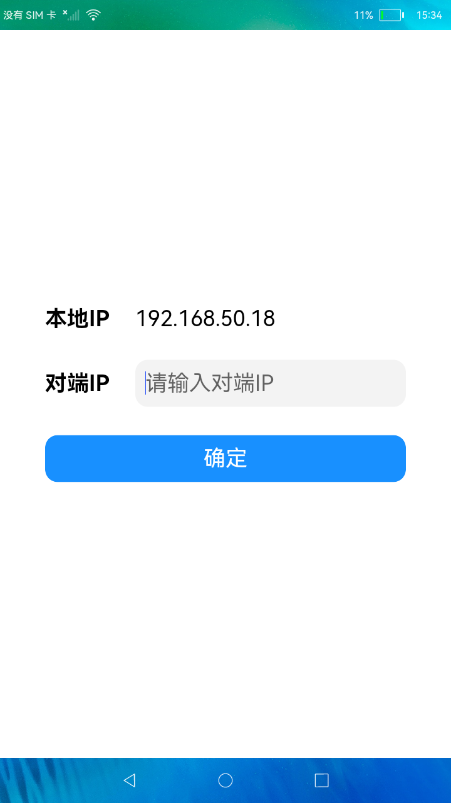
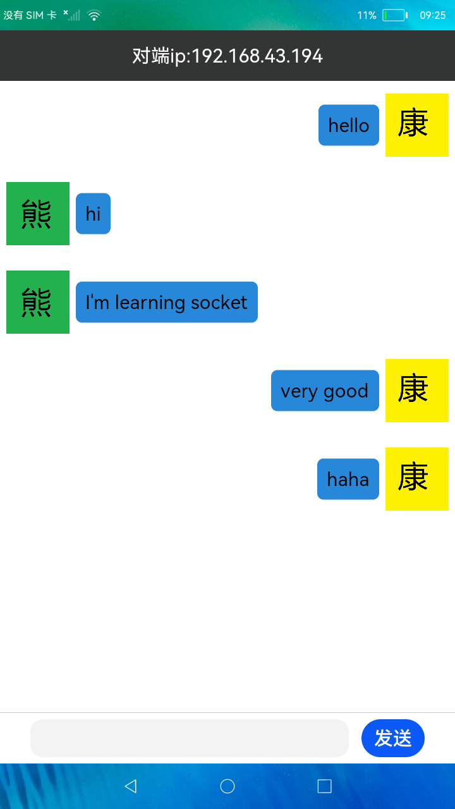

# 项目介绍<a name="ZH-CN_TOPIC_0000001252526718"></a>

本篇Codelab基于TCP的Socket与服务端建立连接，实现了一个能和服务端进行通信对话的聊天案例。在这个案例中，客户端可以给服务端发送聊天信息，服务端也可以给客户端发送数据。案例效果如下所示：



# 搭建OpenHarmony环境<a name="ZH-CN_TOPIC_0000001299046197"></a>

完成本篇Codelab我们首先要完成开发环境的搭建，本示例以**RK3568**开发板为例，参照以下步骤进行：

1.  [获取OpenHarmony系统版本](https://gitee.com/openharmony/docs/blob/master/zh-cn/device-dev/get-code/sourcecode-acquire.md#%E8%8E%B7%E5%8F%96%E6%96%B9%E5%BC%8F3%E4%BB%8E%E9%95%9C%E5%83%8F%E7%AB%99%E7%82%B9%E8%8E%B7%E5%8F%96)：标准系统解决方案（二进制）。

    以3.1版本为例：

    

2.  搭建烧录环境。
    1.  [完成DevEco Device Tool的安装](https://gitee.com/openharmony/docs/blob/master/zh-cn/device-dev/quick-start/quickstart-standard-env-setup.md)
    2.  [完成RK3568开发板的烧录](https://gitee.com/openharmony/docs/blob/master/zh-cn/device-dev/quick-start/quickstart-ide-standard-running-rk3568-burning.md)

3.  搭建开发环境。
    1.  开始前请参考[工具准备](https://gitee.com/openharmony/docs/blob/master/zh-cn/application-dev/quick-start/start-overview.md#%E5%B7%A5%E5%85%B7%E5%87%86%E5%A4%87)，完成DevEco Studio的安装和开发环境配置。
    2.  开发环境配置完成后，请参考[使用工程向导](https://gitee.com/openharmony/docs/blob/master/zh-cn/application-dev/quick-start/start-with-ets-stage.md#%E5%88%9B%E5%BB%BAets%E5%B7%A5%E7%A8%8B)创建工程（模板选择“Empty Ability”），选择JS或者eTS语言开发。
    3.  工程创建完成后，选择使用[真机进行调测](https://gitee.com/openharmony/docs/blob/master/zh-cn/application-dev/quick-start/start-with-ets-stage.md#%E4%BD%BF%E7%94%A8%E7%9C%9F%E6%9C%BA%E8%BF%90%E8%A1%8C%E5%BA%94%E7%94%A8)。


# TCP相关API介绍<a name="ZH-CN_TOPIC_0000001298925613"></a>

<a name="table15553881214"></a>
<table><thead align="left"><tr id="row55738111213"><th class="cellrowborder" valign="top" width="20.02%" id="mcps1.1.3.1.1"><p id="p1661038121219"><a name="p1661038121219"></a><a name="p1661038121219"></a>方法</p>
</th>
<th class="cellrowborder" valign="top" width="79.97999999999999%" id="mcps1.1.3.1.2"><p id="p3498151051317"><a name="p3498151051317"></a><a name="p3498151051317"></a>说明</p>
</th>
</tr>
</thead>
<tbody><tr id="row36738171213"><td class="cellrowborder" valign="top" width="20.02%" headers="mcps1.1.3.1.1 "><p id="p96338151220"><a name="p96338151220"></a><a name="p96338151220"></a>bind</p>
</td>
<td class="cellrowborder" valign="top" width="79.97999999999999%" headers="mcps1.1.3.1.2 "><p id="p472214518119"><a name="p472214518119"></a><a name="p472214518119"></a>绑定IP地址和端口</p>
</td>
</tr>
<tr id="row23809228417"><td class="cellrowborder" valign="top" width="20.02%" headers="mcps1.1.3.1.1 "><p id="p103801622646"><a name="p103801622646"></a><a name="p103801622646"></a>connect</p>
</td>
<td class="cellrowborder" valign="top" width="79.97999999999999%" headers="mcps1.1.3.1.2 "><p id="p18520139113719"><a name="p18520139113719"></a><a name="p18520139113719"></a>连接到指定的IP地址和端口</p>
</td>
</tr>
<tr id="row96938101213"><td class="cellrowborder" valign="top" width="20.02%" headers="mcps1.1.3.1.1 "><p id="p13623881219"><a name="p13623881219"></a><a name="p13623881219"></a>send</p>
</td>
<td class="cellrowborder" valign="top" width="79.97999999999999%" headers="mcps1.1.3.1.2 "><p id="p106133810129"><a name="p106133810129"></a><a name="p106133810129"></a>通过TCPSocket连接发送数据</p>
</td>
</tr>
<tr id="row16163818122"><td class="cellrowborder" valign="top" width="20.02%" headers="mcps1.1.3.1.1 "><p id="p933315114215"><a name="p933315114215"></a><a name="p933315114215"></a>on('message')</p>
</td>
<td class="cellrowborder" valign="top" width="79.97999999999999%" headers="mcps1.1.3.1.2 "><p id="p66163891213"><a name="p66163891213"></a><a name="p66163891213"></a>订阅TCPSocket连接的接收消息事件</p>
</td>
</tr>
<tr id="row13613382123"><td class="cellrowborder" valign="top" width="20.02%" headers="mcps1.1.3.1.1 "><p id="p107038101219"><a name="p107038101219"></a><a name="p107038101219"></a>close</p>
</td>
<td class="cellrowborder" valign="top" width="79.97999999999999%" headers="mcps1.1.3.1.2 "><p id="p1356104115117"><a name="p1356104115117"></a><a name="p1356104115117"></a>关闭TCPPSocket连接</p>
</td>
</tr>
</tbody>
</table>

> **说明：** 
>1、相关API可以参考：[TCPSocket连接](https://gitee.com/openharmony/docs/blob/master/zh-cn/application-dev/reference/apis/js-apis-socket.md#tcpsocket)

# 相关权限<a name="ZH-CN_TOPIC_0000001299138325"></a>

基于TCP的Socket通信需要在module.json5中配置如下权限：

```
"reqPermissions": [
  {
    "name": "ohos.permission.INTERNET"
  }
]
```
# 基于TCP的Socket与服务端的通信<a name="ZH-CN_TOPIC_0000001252526718"></a>

基于TCP的Socket与服务端的通信，实现客户端和服务端的聊天。实现客户端相对来说比服务器要简单的多，因为其不需要监听，只需要连接发送数据即可。客户端实现主要分为：

1.  调用TCPSocket的方法前，需要先通过socket.constructTCPSocketInstance创建TCPSocket对象。

    ```
    let tcpSocket= socket.constructTCPSocketInstance();
    ```

2.  调用tcpSocket.bind\(\)绑定IP地址和端口。

    ```
    tcpSocket.bind({address: '192.168.xx.xxx', port: xxxx, family: 1}, err => {
      if (err) {
    	console.log('bind fail');
    	return;
      }
      console.log('bind success');
    })
    ```

3.  调用tcpSocket.connect\(\)连接到指定的IP地址和端口

    ```
    tcpSocket.connect({ address: {address: '192.168.xx.xxx', port: xxxx, family: 1} , timeout: 6000}, err => {
      if (err) {
    	console.log('connect fail');
    	return;
      }
      console.log('connect success');
    })
    ```

4.  调用tcpSocket.send\(\)发送数据。

    ```
    let promise = tcpSocket.connect({ address: {address: '192.168.xx.xxx', port: xxxx, family: 1} , timeout: 6000});
    promise.then(() => {
      console.log('connect success');
      tcp.send({
    	data:'Hello, server!'
      },err => {
    	if (err) {
    	  console.log('send fail');
    	  return;
    	}
    	console.log('send success');
      })
    }).catch(err => {
      console.log('connect fail');
    });
    ```

5.  调用tcpSocket.on\(\)订阅TCPSocket连接的接收消息。

    ```
    tcpSocket.on('message', value => {
    	console.log("on message, message:" + value.message + ", remoteInfo:" + value.remoteInfo)
    });
    ```
# 总结和回顾<a name="ZH-CN_TOPIC_0000001299086757"></a>

本篇Codelab介绍基于TCP的Scoket与服务端通信，讲解如何与服务端建立连接，发送信息给服务端，监听服务器返回信息。

# 恭喜您<a name="ZH-CN_TOPIC_0000001252366942"></a>

通过本Codelab的学习，您已经学会了基于TCP的Socket通信。


