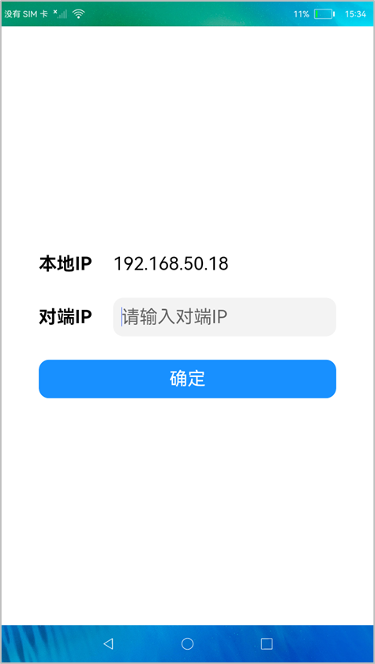
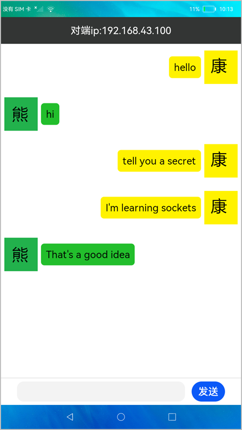
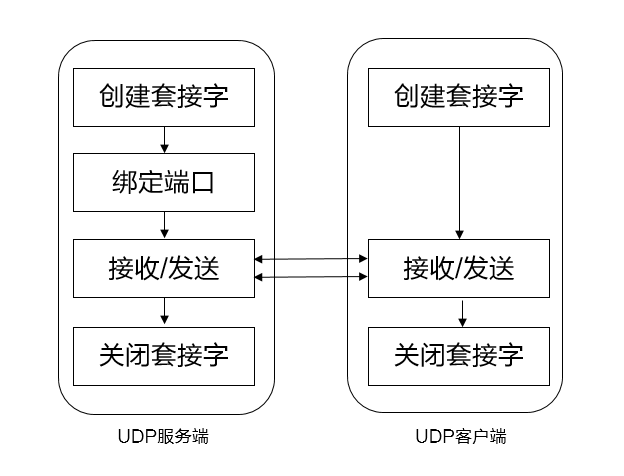
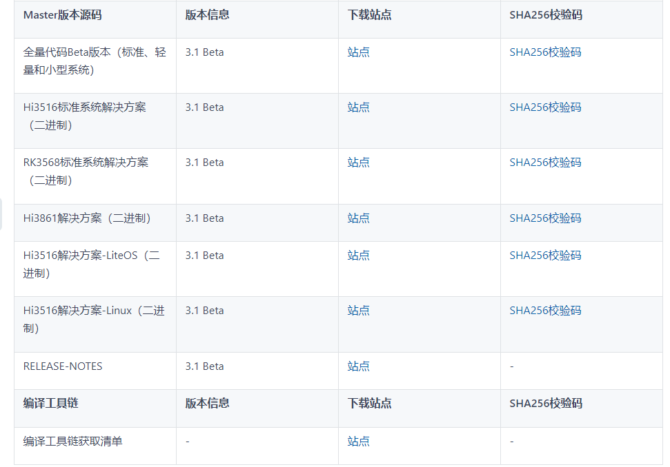
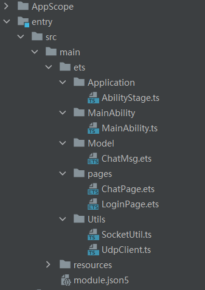

#  使用UDP实现与服务端的通信

# 项目介绍<a name="ZH-CN_TOPIC_0000001299083113"></a>

本篇Codelab使用基于UDP协议的socket和服务端建立连接，实现了一个能和服务端进行通信对话的聊天案例。在这个案例中，客户端可以给服务端发送聊天信息，服务端也可以给客户端发送数据。案例效果如下所示：

 

在客户端登录界面中输入服务端IP，点击“确定”按钮与服务端建立连接后，就可以进行通信了。

> **说明：** 
>服务端可以是装有该案例程序的设备，也可以是装有能调试UDP协议的软件的设备。

基于UDP协议的socket和服务端通信的流程图如下：



# 搭建OpenHarmony环境<a name="ZH-CN_TOPIC_0000001256391516"></a>

完成本篇Codelab我们首先要完成开发环境的搭建，本示例以**RK3568**开发板为例，参照以下步骤进行：

1.  [获取OpenHarmony系统版本](https://gitee.com/openharmony/docs/blob/master/zh-cn/device-dev/get-code/sourcecode-acquire.md#%E8%8E%B7%E5%8F%96%E6%96%B9%E5%BC%8F3%E4%BB%8E%E9%95%9C%E5%83%8F%E7%AB%99%E7%82%B9%E8%8E%B7%E5%8F%96)：标准系统解决方案（二进制）。

    以3.1版本为例：

    

2.  搭建烧录环境。
    1.  [完成DevEco Device Tool的安装](https://gitee.com/openharmony/docs/blob/master/zh-cn/device-dev/quick-start/quickstart-ide-env-win.md)
    2.  [完成RK3568开发板的烧录](https://gitee.com/openharmony/docs/blob/master/zh-cn/device-dev/quick-start/quickstart-ide-3568-burn.md)

3.  搭建开发环境。
    1.  开始前请参考[工具准备](https://gitee.com/openharmony/docs/blob/master/zh-cn/application-dev/quick-start/start-overview.md#%E5%B7%A5%E5%85%B7%E5%87%86%E5%A4%87)，完成DevEco Studio的安装和开发环境配置。
    2.  开发环境配置完成后，请参考[使用工程向导](https://gitee.com/openharmony/docs/blob/master/zh-cn/application-dev/quick-start/start-with-ets-stage.md#%E5%88%9B%E5%BB%BAets%E5%B7%A5%E7%A8%8B)创建工程（模板选择“Empty Ability”），选择JS或者eTS语言开发。
    3.  工程创建完成后，选择使用[真机进行调测](https://gitee.com/openharmony/docs/blob/master/zh-cn/application-dev/quick-start/start-with-ets-stage.md#%E4%BD%BF%E7%94%A8%E7%9C%9F%E6%9C%BA%E8%BF%90%E8%A1%8C%E5%BA%94%E7%94%A8)。


# UDP相关API介绍<a name="ZH-CN_TOPIC_0000001299044357"></a>

UDP部分API如下：

<a name="table15553881214"></a>
<table><thead align="left"><tr id="row55738111213"><th class="cellrowborder" valign="top" width="20.02%" id="mcps1.1.3.1.1"><p id="p1661038121219"><a name="p1661038121219"></a><a name="p1661038121219"></a>方法</p>
</th>
<th class="cellrowborder" valign="top" width="79.97999999999999%" id="mcps1.1.3.1.2"><p id="p3498151051317"><a name="p3498151051317"></a><a name="p3498151051317"></a>说明</p>
</th>
</tr>
</thead>
<tbody><tr id="row36738171213"><td class="cellrowborder" valign="top" width="20.02%" headers="mcps1.1.3.1.1 "><p id="p96338151220"><a name="p96338151220"></a><a name="p96338151220"></a>bind</p>
</td>
<td class="cellrowborder" valign="top" width="79.97999999999999%" headers="mcps1.1.3.1.2 "><p id="p472214518119"><a name="p472214518119"></a><a name="p472214518119"></a>绑定IP地址和端口。</p>
</td>
</tr>
<tr id="row96938101213"><td class="cellrowborder" valign="top" width="20.02%" headers="mcps1.1.3.1.1 "><p id="p13623881219"><a name="p13623881219"></a><a name="p13623881219"></a>send</p>
</td>
<td class="cellrowborder" valign="top" width="79.97999999999999%" headers="mcps1.1.3.1.2 "><p id="p106133810129"><a name="p106133810129"></a><a name="p106133810129"></a>通过UDPSocket连接发送数据。</p>
</td>
</tr>
<tr id="row16163818122"><td class="cellrowborder" valign="top" width="20.02%" headers="mcps1.1.3.1.1 "><p id="p933315114215"><a name="p933315114215"></a><a name="p933315114215"></a>on('message')</p>
</td>
<td class="cellrowborder" valign="top" width="79.97999999999999%" headers="mcps1.1.3.1.2 "><p id="p66163891213"><a name="p66163891213"></a><a name="p66163891213"></a>订阅UDPSocket连接的接收消息事件。</p>
</td>
</tr>
<tr id="row13613382123"><td class="cellrowborder" valign="top" width="20.02%" headers="mcps1.1.3.1.1 "><p id="p107038101219"><a name="p107038101219"></a><a name="p107038101219"></a>close</p>
</td>
<td class="cellrowborder" valign="top" width="79.97999999999999%" headers="mcps1.1.3.1.2 "><p id="p1356104115117"><a name="p1356104115117"></a><a name="p1356104115117"></a>关闭UDPSocket连接。</p>
</td>
</tr>
</tbody>
</table>

> **说明：** 
>相关API可以参考：[UDPSocket连接](https://gitee.com/openharmony/docs/blob/master/zh-cn/application-dev/reference/apis/js-apis-socket.md#udpsocket)


# 代码结构解读<a name="ZH-CN_TOPIC_0000001298923765"></a>



-   AppScope：App作用域目录。
-   entry/src/main/ets：程序目录。
    -   Application：stage模型目录。
        -   AbilityStage.ts：stage模型文件。

    -   MainAbility：程序入口目录。
        -   MainAbility.ts：程序入口类。

    -   Model：实体类目录。
        -   ChatMsg.ets：用于封装聊天消息。

    -   pages：存放应用页面。
        -   ChatPage.ets：聊天界面。
        -   LoginPage.ets：登录界面。

    -   Utils：工具类目录。
        -   SocketUtil.ts：用于封装解析IP地址的函数。
        -   UdpClient.ts：用于封装UDP相关API。


-   entry/src/main/resources：资源文件目录。
-   module.json5：应用配置文件，包含网络权限配置。


# 相关权限<a name="ZH-CN_TOPIC_0000001308602793"></a>

基于UDP的socket通信需要在module.json5中配置如下权限：

```
"requestPermissions": [
  {
    "name": "ohos.permission.INTERNET"
  },
  {
    "name": "ohos.permission.GET_WIFI_INFO"
  }
] 
```

其中INTERNET权限用于使用网络socket，GET\_WIFI\_INFO权限用于获取WLAN信息（比如获取本机IP）。
# 登录界面实现<a name="ZH-CN_TOPIC_0000001309008641"></a>

登录界面主要功能是获取本机IP和服务端IP，这两个参数是UDP通信功能所需要的，下面将介绍登录界面布局和功能的实现。

1.  实现登录页面布局，主要代码如下：

    ```
    @Entry
    @Component
    struct Login {
    
      build() {
        Flex({ direction: FlexDirection.Column, alignItems: ItemAlign.Center, justifyContent: FlexAlign.Center }) {
          Row() {
            Text('本地IP').fontSize(35).width('25%').fontWeight(FontWeight.Bold)
            Text(localIp)
              .fontSize(35)
          }.width('80%')
    
          Row() {
            Text('对端IP').fontSize(35).width('25%').fontWeight(FontWeight.Bold)
            TextInput({ placeholder: '请输入对端IP' })
              ...
          }.height(75)
         
          Text('确定')
            .onClick(() => {
              ...
            })
        }
      } 
    ```

2.  导入SocketUtil.ts文件中的resolveIP函数，获取本机IP地址。

    ```
    import { resolveIP } from '../Utils/SocketUtil'
    
    let localIp = resolveIP(wifi.getIpInfo().ipAddress)
    ```

3.  获取用户输入的服务端IP地址。

    ```
    let oppositeIp = ""
    
    TextInput({ placeholder: '请输入对端IP' })
      ...
      .onChange((value: string) => {
        oppositeIp = value
      }) 
    ```

4.  跳转到聊天界面，将本机IP和用户输入的服务端IP作为参数传递到ChatPage.ets。

    ```
    Text('确定')
      ...
      .onClick(() => {
        ...
        router.push({
          url: 'pages/ChatPage',
          params: { localIp: localIp, oppositeIp: oppositeIp}
        })
      })
    ```


# 聊天界面实现<a name="ZH-CN_TOPIC_0000001261449240"></a>

本节将介绍聊天界面布局的实现，效果图如下：


从以上效果图可以看出，布局由标题栏、聊天消息列表和底部栏组成。

1.  标题栏用于显示对端IP地址，主要实现代码如下：

    ```
    @Component
    struct Title {
      private title: string
    
      build() {
        Flex({ alignItems: ItemAlign.Center, justifyContent: FlexAlign.Center }) {
          Text(this.title).fontSize(30).fontColor("#fdfdfd")
        }.height(80).backgroundColor("#333534")
      }
    } 
    ```

2.  聊天消息列表用于显示聊天内容，右侧为己方发送的消息，左侧为对端发送的消息。主要实现代码如下：

    ```
    Scroll(this.scroller) {
      Column() {
        ForEach(this.msgArr, (item) => {
          if (item.isSend) {
            RightMessageBox({ msgStr: item.message })
          } else {
            LeftMessageBox({ msgStr: item.message })
          }
        }, item => item.id)
      }.width('100%')
    }
    .layoutWeight(1)
    .width("100%")
    ```

3.  左侧消息组件LeftMessageBox 实现代码如下：

    ```
    @Component
    struct LeftMessageBox {
      private msgStr: string
    
      build() {
        Row() {
          Image($r("app.media.xiong")).width(100).height(100).margin({ left: 10, right: 10 })
          Text(this.msgStr)
            .fontSize(30)
            .backgroundColor('#22BE2C')
            .padding(15)
            .borderRadius(10)
        }
        .width('100%')
        .padding({top:20,bottom:20,right:280})
        .alignItems(VerticalAlign.Center)
      }
    }
    ```

4.  右侧消息组件RightMessageBox实现代码如下：

    ```
    @Component
    struct RightMessageBox {
      private msgStr: string
    
      build() {
        Row() {
          Image($r("app.media.kang")).width(100).height(100).margin({ left: 10, right: 10 })
          Text(this.msgStr)
            .fontSize(30)
            .backgroundColor('#FFF200')
            .padding(15)
            .borderRadius(10)
        }
        .width('100%')
        .padding({top:20,bottom:20,left:280})
        .alignItems(VerticalAlign.Center)
        .direction(Direction.Rtl)
      }
    }  
    ```

5.  底部栏用于输入和发送消息，主要实现代码如下：

    ```
    Row() {
      TextInput({ placeholder: '', text: '' })
        .height(60)
        .fontSize(30)
        .width('70%')
        .margin(10)
       ...
    
      Button("发送")
        .height(60)
        .width(100)
        .margin(10)
        .fontSize(30)
        ...
    }
    ```


# UdpClient类实现<a name="ZH-CN_TOPIC_0000001261352384"></a>

将UDP相关API的实现封装到UdpClient类中，减少聊天界面代码冗余。UdpClient类主要功能有创建UDPSocket对象、绑定IP地址和端口、发送消息、订阅消息以及关闭UDPSocket连接等，实现步骤如下：

1.  导入socket 模块，定义构造函数，在构造函数中使用constructUDPSocketInstance创建UDPSocket对象。

    ```
    import socket from '@ohos.net.socket';
    
    export default class UdpClient {
        private localIp: string= ''
        private oppositeIp: string= ''
        private udp: any= null
    
        constructor(localIp: string, oppositeIp: string) {
            this.localIp = localIp
            this.oppositeIp = oppositeIp
            this.udp = socket.constructUDPSocketInstance(); 
        }
    }
    ```

2.  定义bindUdp函数，绑定本机IP地址和端口，端口可以指定或由系统随机分配，这里为了方便演示指定客户端端口为9000。

    ```
    bindUdp() {
        let promise = this.udp.bind({
            address: this.localIp, port: 9000, family: 1
        });
        promise.then(() => {
            console.log(`${TAG} udp bind success`);
        }).catch(err => {
            console.log(`${TAG} udp bind failed:${JSON.stringify(err)}`);
        });
    }
    ```

3.  定义函数sendMsg，用于发送消息，这里为了方便演示指定服务端端口为9000。

    ```
    sendMsg(msg: string) {
        let promise = this.udp.send({
            data: msg,
            address: {
                address: this.oppositeIp,
                port: 9000,
                family: 1
            }
        });
        promise.then(() => {
            console.log(`${TAG} udp send success:${msg}`);
        }).catch(err => {
            console.log(`${TAG} udp send fail:${JSON.stringify(err)}`);
        });
    }
    ```

4.  定义函数onMessage，用于订阅服务端消息。

    ```
    onMessage(callback) {
        this.udp.on('message', value => {
            console.log(`${TAG} udp on message:${value.message}`);
            // 收到的是ArrayBuffer 需要进行转换解析
            let dataView = new DataView(value.message)
            console.log(`${TAG} udp message length:${dataView.byteLength}`);
            let str = ""
            for (let i = 0;i < dataView.byteLength; ++i) {
                let c = String.fromCharCode(dataView.getUint8(i))
                if (c !== "\n") {
                    str += c
                }
            }
            console.log(`${TAG} udp on message array buffer:${str}`);
            callback(str)
        });
    }
    ```

5.  定义closeUdp函数，用于关闭UDPSocket连接。

    ```
    closeUdp() {
        let promise = this.udp.close();
        promise.then(() => {
            console.log(`${TAG} udp close success`);
        }).catch(err => {
            console.log(`${TAG} udp close fail:${JSON.stringify(err)}`);
        });
    }
    ```


# 使用UDP实现和服务端通信<a name="ZH-CN_TOPIC_0000001252684118"></a>

上一节完成了UdpClient类的封装，下面介绍在聊天界面中，如何使用UdpClient类和服务端进行通信。

1. 创建ChatMsg类用于封装发送和订阅的消息。

    ```
    export default class ChatMsg {
      isSend: boolean
      message: string
      id: string;
      constructor(isSend: boolean, message: string) {
        this.id = `${NextId++}`;
        this.isSend = isSend
        this.message = message
      }
    } 
    ```

2. 获取从登录界面传过来的对端IP和本机IP，定义消息数组。

    ```
    import router from '@ohos.router';
    
    @Entry
    @Component
    export struct ChatPage {
      @State msgArr: ChatMsg[]= []
      private localIp: string = router.getParams().localIp
      private oppositeIp: string = router.getParams().oppositeIp
    }
    ```

3. 在ChatPage.ets中导入UdpClient类，创建UdpClient对象，使用UdpClient对象调用bindUdp和onMessage函数。

    ```
    import UdpClient  from '../Utils/UdpClient';
    
    onPageShow() {
      this.udpClient = new UdpClient(this.localIp, this.oppositeIp)
      this.udpClient.bindUdp()
      this.udpClient.onMessage((msg) => {
        this.msgArr.push(new ChatMsg(false, msg))
      })
    }
    ```

4. 给“发送”按钮绑定点击事，使用UdpClient对象调用sendMsg函数实现发送消息功能

    ```
    Button("发送")
      ...
      .onClick(() => {
        this.msgArr.push(new ChatMsg(true, this.sendMsg))
        this.udpClient.sendMsg(this.sendMsg)
        this.sendMsg = ''
      }) 
    ```

5. 在aboutToDisappear中关闭UDPSocket连接。

    ```
    aboutToDisappear() {
      this.udpClient.closeUdp()
    }
    ```


# 总结和回顾<a name="ZH-CN_TOPIC_0000001252524854"></a>

本篇Codelab介绍基于UDP协议的socket的相关API的使用，通过一个简单的聊天案例，向开发者讲解了如何使用UDP与服务端建立连接、发送信息给服务端以及订阅服务器返回信息。

通过本Codelab的学习，您已经学会了：

-   基于UDP协议的socket相关API的使用


