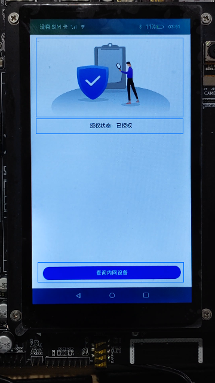

# 为应用添加运行时权限（ArkTS）

## 介绍

通过AbilityAccessCtrl动态向用户申请“允许不同设备间的数据交换”的权限，使用设备管理实例获取周边不可信设备列表。


> **说明：**
>查询周边不可信设备之前，请确保本设备与周边设备未进行配对。如果已配对，则恢复出厂设置之后重新查询。

### 相关概念

- [访问控制权限申请](https://gitee.com/openharmony/docs/blob/master/zh-cn/application-dev/security/accesstoken-guidelines.md#访问控制授权申请)：应用的APL（Ability Privilege Level）等级分为normal、system_basic和system_core三个等级，默认情况下，应用的APL等级都为normal等级。权限类型分为system_grant和user_grant两种类型。应用可申请的权限项参见应用权限列表。
- [权限类型说明](https://gitee.com/openharmony/docs/blob/master/zh-cn/application-dev/security/accesstoken-overview.md#权限类型说明)：根据授权方式的不同，权限类型可分为system_grant（系统授权）和user_grant（用户授权）。
- [应用ALP等级说明](https://gitee.com/openharmony/docs/blob/master/zh-cn/application-dev/security/accesstoken-overview.md#%E5%BA%94%E7%94%A8apl%E7%AD%89%E7%BA%A7%E8%AF%B4%E6%98%8E)：元能力权限等级APL（Ability Privilege Level）指的是应用的权限申请优先级的定义，不同APL等级的应用能够申请的权限等级不同。
- [应用权限列表](https://gitee.com/openharmony/docs/blob/master/zh-cn/application-dev/security/permission-list.md)：在申请目标权限前，建议开发者先阅读访问控制开发概述-权限的工作流程。对权限的工作流程有基本的了解后，再结合以下权限的具体说明，判断应用能否申请目标权限，提高开发效率。
- [设备管理实例](https://gitee.com/openharmony/docs/blob/master/zh-cn/application-dev/reference/apis/js-apis-device-manager.md#devicemanager)：用于获取可信设备和本地设备的相关信息。在调用DeviceManager的方法前，需要先通过createDeviceManager构建一个DeviceManager实例dmInstance。

### 约束与限制

通过DevEco Studio自动下载的SDK均为public版本，public-SDK不支持开发者使用系统API。本篇Codelab使用的DeviceManager（设备管理实例）依赖于系统API，需下载full-SDK并替换工具自动下载的public-SDK。具体操作可参考[指南《如何替换full-SDK》](https://gitee.com/openharmony/docs/blob/master/zh-cn/application-dev/faqs/full-sdk-switch-guide.md)。

### 相关权限

本篇Codelab需要在配置文件module.json5里添加允许不同设备间的数据交换权限：ohos.permission.DISTRIBUTED_DATASYNC。

## 环境搭建

### 软件要求

- [DevEco Studio](https://gitee.com/openharmony/docs/blob/master/zh-cn/application-dev/quick-start/start-overview.md#%E5%B7%A5%E5%85%B7%E5%87%86%E5%A4%87)版本：DevEco Studio 3.1 Release。
- OpenHarmony SDK版本：API version 9。

### 硬件要求

- 开发板类型：[润和RK3568开发板](https://gitee.com/openharmony/docs/blob/master/zh-cn/device-dev/quick-start/quickstart-appendix-rk3568.md)。
- OpenHarmony系统：3.2 Release。

### 环境搭建

完成本篇Codelab我们首先要完成开发环境的搭建，本示例以**RK3568**开发板为例，参照以下步骤进行：

1. [获取OpenHarmony系统版本](https://gitee.com/openharmony/docs/blob/master/zh-cn/device-dev/get-code/sourcecode-acquire.md#%E8%8E%B7%E5%8F%96%E6%96%B9%E5%BC%8F3%E4%BB%8E%E9%95%9C%E5%83%8F%E7%AB%99%E7%82%B9%E8%8E%B7%E5%8F%96)：标准系统解决方案（二进制）。以3.2 Release版本为例：

   

2. 搭建烧录环境。

   1. [完成DevEco Device Tool的安装](https://gitee.com/openharmony/docs/blob/master/zh-cn/device-dev/quick-start/quickstart-ide-env-win.md)
   2. [完成RK3568开发板的烧录](https://gitee.com/openharmony/docs/blob/master/zh-cn/device-dev/quick-start/quickstart-ide-3568-burn.md)

3. 搭建开发环境。

   1. 开始前请参考[工具准备](https://gitee.com/openharmony/docs/blob/master/zh-cn/application-dev/quick-start/start-overview.md#%E5%B7%A5%E5%85%B7%E5%87%86%E5%A4%87)，完成DevEco Studio的安装和开发环境配置。
   2. 开发环境配置完成后，请参考[使用工程向导](https://gitee.com/openharmony/docs/blob/master/zh-cn/application-dev/quick-start/start-with-ets-stage.md#创建ets工程)创建工程（模板选择“Empty Ability”）。
   3. 工程创建完成后，选择使用[真机进行调测](https://gitee.com/openharmony/docs/blob/master/zh-cn/application-dev/quick-start/start-with-ets-stage.md#使用真机运行应用)。

## 代码结构解读

本篇Codelab只对核心代码进行讲解，对于完整代码，我们会在gitee中提供。

```
├──entry/src/main/ets                      // 代码区
│  ├──common
│  │  ├──constants
│  │  │  └──CommonConstants.ets            // 公共常量类
│  │  └──util
│  │     ├──DeviceListUtil.ets             // 设备查询工具类
│  │     ├──Logger.ets                     // 日志管理工具类
│  │     └──PermissionUtil.ets             // 权限申请工具类
│  ├──entryability
│  │  └──EntryAbility.ts                   // 程序入口类
│  ├──pages
│  │  └──HomePage.ets                      // 主页面
│  └──view
│     ├──DeviceBean.ets                    // 设备信息类
│     ├──DeviceItem.ets                    // 设备信息对象
│     ├──DeviceListDialog.ets              // 设备列表展示弹框
│     └──NoPermissionDialog.ets            // 无权限弹框
└──entry/src/main/resource                 // 应用静态资源目录
```

## 页面设计

页面分为授权图片、授权说明、查询内网设备按钮三部分，效果如图所示：



```typescript
// HomePage.ets
struct HomePage {
  @State authorizedImage: Resource = $r('app.media.ic_unauthorized');
  @State permissionDescribe: Resource = $r('app.string.no_permission');
  noPermissionDialog: CustomDialogController = new CustomDialogController({
    builder: NoPermissionDialog(),
    autoCancel: false,
    alignment: DialogAlignment.Bottom,
    offset: {
      dx: CommonConstants.DIALOG_OFFSET_X,
      dy: CommonConstants.DIALOG_OFFSET_Y
    }
  });
  deviceListDialog: CustomDialogController = new CustomDialogController({
    builder: DeviceListDialog(),
    autoCancel: false,
    alignment: DialogAlignment.Bottom,
    offset: {
      dx: CommonConstants.DIALOG_OFFSET_X,
      dy: CommonConstants.DIALOG_OFFSET_Y
    }
  })
  ...
  build() {
    Column() {
      Image(this.authorizedImage)
        ...
      Text(this.permissionDescribe)
        ...
      Column() {
        Button($r('app.string.button_text'), { type: ButtonType.Capsule, stateEffect: true })
          ...
      }
      ...
    }
    ...
  }
}
```

授权状态为未授权时，点击查询内网设备按钮打开未申请权限提示的弹框，效果如图所示：


```typescript
// NoPermissionDialog.ets
@CustomDialog
export struct NoPermissionDialog {
  controller: CustomDialogController;
 
  build() {
    Column() {
      Text($r('app.string.no_permission_title'))
        ...
      Text($r('app.string.clear_permission'))
        ...
      Text($r('app.string.dialog_confirm'))
        ...
        .onClick(() => {
          this.controller.close();
        })
    }
    ...
  }
}
```

授权状态为已授权时，点击查询内网设备按钮打开设备查询列表弹框，效果如图所示：


```typescript
// DeviceListDialog.ets
@CustomDialog
export struct DeviceListDialog {
  private deviceListUtil: DeviceListUtil = new DeviceListUtil();
  @State deviceList: Array<DeviceBean> = [];
  controller: CustomDialogController;
  ...
  build() {
    Column() {
      Text($r('app.string.device_list'))
        ...
      Column() {
        if (this.deviceList.length === 0) {
          Text($r('app.string.no_device'))
            ...
        } else {
          Column() {
            List() {
              ForEach(this.deviceList, (item: DeviceBean, index: number) => {
                ListItem() {
                  DeviceItem({item: item, index: index});
                }
              }, (item: DeviceBean) => JSON.stringify(item))
            }
          }
          ...
        }
      }
      ...
      Text($r('app.string.dialog_confirm'))
        ...
        .onClick(() => {
          this.deviceListUtil.stopDeviceDiscovery();
          this.controller.close();
        })
    }
    ...
  }
}

```

## 权限申请

首次进入主页面弹出授权弹框，点击禁止按钮不会授权，点击允许按钮进行授权，再次进入首页不会出现授权弹框。

```typescript
// HomePage.ets
struct HomePage {
  ...
  async aboutToAppear() {
    let result = await PermissionUtil.applyPermission();
    if (result === 0) {
      this.permissionDescribe = $r('app.string.has_permission');
      this.authorizedImage = $r('app.media.ic_authorized');
    } else {
      this.permissionDescribe = $r('app.string.no_permission');
    }
  }
  ...
}

// PermissionUtil.ets
async applyPermission() {
  let atManager = abilityAccessCtrl.createAtManager();
  let data = await atManager.requestPermissionsFromUser(getContext(this), [CommonConstants.PERMISSION]);
  let grantStatus: Array<number> = data.authResults;
  let length: number = grantStatus.length;
  if (length === 0) {
    return 1;
  }
  return grantStatus[0];
}
```

主页面点击查询内网设备按钮时，先查询是否授权，根据授权状态打开对应的弹框（未授权：打开未授权弹框；已授权：打开设备查询列表弹框）。

```typescript
// HomePage.ets
struct HomePage {
  ...
  build() {
    Column() {
      ...
      Column() {
        Button($r('app.string.button_text'), { type: ButtonType.Capsule, stateEffect: true })
          ...
          .onClick(async () => {
            let result = await PermissionUtil.checkPermission();
            if(result === abilityAccessCtrl.GrantStatus.PERMISSION_GRANTED) {
              this.deviceListDialog.open();
            } else {
              this.noPermissionDialog.open();
            }
          })
      }
      ...
    }
    ...
  }
}

// PermissionUtil.ets
async checkPermission() {
  let atManager = abilityAccessCtrl.createAtManager();
  let grantStatus: abilityAccessCtrl.GrantStatus =  abilityAccessCtrl.GrantStatus.PERMISSION_DENIED;
  let tokenId: number = 0;
  try {
    let bundleInfo: bundleManager.BundleInfo =
      await bundleManager.getBundleInfoForSelf(bundleManager.BundleFlag.GET_BUNDLE_INFO_WITH_APPLICATION);
    let appInfo: bundleManager.ApplicationInfo = bundleInfo.appInfo;
    tokenId = appInfo.accessTokenId;
  } catch (err) {
    Logger.error(TAG, 'getBundleInfoForSelf failed, code is ${err.code}, message is ${err.message}');
  }
  try {
    grantStatus = await atManager.checkAccessToken(tokenId, CommonConstants.PERMISSION);
  } catch (err) {
    Logger.error(TAG, 'checkAccessToken failed, code is ${err.code}, message is ${err.message}');
  }
  return grantStatus;
}
```

## 设备查询

先创建dmInstance实例，再注册发现设备（deviceFoundOn）的回调方法，最后调用startDeviceDiscovery方法查询周边设备；当查询到设备之后调用deviceFoundOn方法处理设备信息。

```typescript
//DeviceListDialog.ets
export struct DeviceListDialog {
  ...
  aboutToAppear() {
    this.deviceListUtil.initDmInstance((data: DeviceInfoInterface) => {
      ...
    });
  }
  ...
}

// DeviceListUtil.ets
// 创建dmInstance实例
initDmInstance(dealDeviceInfo: Function) {
  this.dealDeviceInfo = dealDeviceInfo;
  try {
    deviceManager.createDeviceManager(getContext(this).applicationInfo.name, (err, data) => {
      if (err) {
        Logger.error(TAG, 'createDeviceManager errCode:' + err.code + ',errMessage:' + err.message);
        return;
      }
      this.dmInstance = data;
      this.deviceFoundOn();
      this.startDeviceDiscovery();
    });
  } catch (err) {
    Logger.error(TAG, 'createDeviceManager err=' + JSON.stringify(err));
  }
}

// DeviceListUtil.ets
// 注册发现设备回调方法
deviceFoundOn() {
  try {
    if (this.dmInstance !== undefined) {
      this.dmInstance.on('deviceFound', (data) => {
        if (this.dealDeviceInfo !== undefined) {
          this.dealDeviceInfo(data);
        }
      });
    }
  } catch (err) {
    Logger.error(TAG, 'deviceFoundOn err:' + JSON.stringify(err));
  }
}

// DeviceListUtil.ets
// 发现周边设备方法
startDeviceDiscovery() {
  this.subscribeId = Math.floor(Math.random() * CommonConstants.RANDOM_ONE + CommonConstants.RANDOM_TWO);
  let subscribeInfo: SubscribeInfoInterface = {
    subscribeId: this.subscribeId,
    mode: CommonConstants.MODE,
    medium: 0,
    freq: CommonConstants.FREQ,
    isSameAccount: false,
    isWakeRemote: true,
    capability: 1
  };
  try {
    if (this.dmInstance !== undefined) {
      this.dmInstance.startDeviceDiscovery(subscribeInfo);
    }
  } catch (err) {
    Logger.error(TAG, 'startDeviceDiscovery err:' + JSON.stringify(err));
  }
}
```

## 总结

您已经完成了本次Codelab的学习，并了解到以下知识点：

1. 访问控制授权申请。
2. 权限类型说明。
3. 如何获取周边设备。


