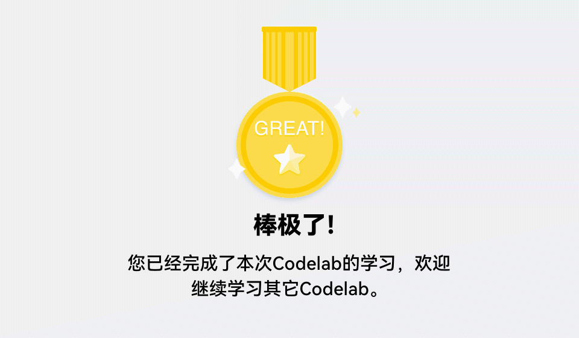

# 字符串加解密（ArkTS）
## 介绍
本Codelab针对用户隐私安全，使用加密算法API对密码进行加密存储，模拟开发一个用户注册登录应用。实现如下功能：
1.  实现登录、注册、登录成功页面。
2.  注册的用户数据保存到关系型数据库。
3.  登录时通过查询数据库校验用户是否存在、密码是否正确。
4.  密码通过加密算法保存和使用。


### 相关概念

-   [加解密算法库框架](https://gitee.com/openharmony/docs/blob/master/zh-cn/application-dev/reference/apis/js-apis-cryptoFramework.md#Cipher)：为屏蔽底层硬件和算法库，向上提供统一的密码算法库加解密相关接口。
-   [关系型数据库](https://gitee.com/openharmony/docs/blob/master/zh-cn/application-dev/database/data-persistence-by-rdb-store.md)：关系型数据库（Relational Database，RDB）是一种基于关系模型来管理数据的数据库。

## 环境搭建

### 软件要求

-   [DevEco Studio](https://gitee.com/openharmony/docs/blob/master/zh-cn/application-dev/quick-start/start-overview.md#%E5%B7%A5%E5%85%B7%E5%87%86%E5%A4%87)版本：DevEco Studio 3.1 Release及以上版本。
-   OpenHarmony SDK版本：API version 9及以上版本。

### 硬件要求

-   开发板类型：[润和RK3568开发板](https://gitee.com/openharmony/docs/blob/master/zh-cn/device-dev/quick-start/quickstart-appendix-rk3568.md)。
-   OpenHarmony系统：3.2 Release及以上版本。

### 环境搭建

完成本篇Codelab我们首先要完成开发环境的搭建，本示例以**RK3568**开发板为例，参照以下步骤进行：

1.  [获取OpenHarmony系统版本](https://gitee.com/openharmony/docs/blob/master/zh-cn/device-dev/get-code/sourcecode-acquire.md#%E8%8E%B7%E5%8F%96%E6%96%B9%E5%BC%8F3%E4%BB%8E%E9%95%9C%E5%83%8F%E7%AB%99%E7%82%B9%E8%8E%B7%E5%8F%96)：标准系统解决方案（二进制）。以3.2 Release版本为例：

    

2.  搭建烧录环境。
    1.  [完成DevEco Device Tool的安装](https://gitee.com/openharmony/docs/blob/master/zh-cn/device-dev/quick-start/quickstart-ide-env-win.md)
    2.  [完成RK3568开发板的烧录](https://gitee.com/openharmony/docs/blob/master/zh-cn/device-dev/quick-start/quickstart-ide-3568-burn.md)

3.  搭建开发环境。
    1.  开始前请参考[工具准备](https://gitee.com/openharmony/docs/blob/master/zh-cn/application-dev/quick-start/start-overview.md#%E5%B7%A5%E5%85%B7%E5%87%86%E5%A4%87)，完成DevEco Studio的安装和开发环境配置。
    2.  开发环境配置完成后，请参考[使用工程向导](https://gitee.com/openharmony/docs/blob/master/zh-cn/application-dev/quick-start/start-with-ets-stage.md#创建ets工程)创建工程（模板选择“Empty Ability”）。
    3.  工程创建完成后，选择使用[真机进行调测](https://gitee.com/openharmony/docs/blob/master/zh-cn/application-dev/quick-start/start-with-ets-stage.md#使用真机运行应用)。

## 代码结构解读

本篇Codelab只对核心代码进行讲解，对于完整代码，我们会在gitee中提供。

```
├──entry/src/main/ets                   // 代码区
│  ├──common
│  │  ├──bean
│  │  │  └──User.ets                    // 用户实体类
│  │  ├──constants
│  │  │  └──CommonConstants.ets         // 公共常量类
│  │  └──utils
│  │     ├──AesUtil.ets                 // 加解密工具类
│  │     ├──DataTransformUtil.ets       // 数据转换工具类
│  │     ├──Logger.ets                  // 日志打印工具类
│  │     └──PromptUtil.ts               // 弹窗工具类
│  ├──entryability
│  │  └──EntryAbility.ts                // 程序入口类
│  ├──model
│  │  ├──RdbModel.ets                   // 数据库业务处理文件
│  │  └──UserTableApi.ets               // 用户表具体业务文件
│  └──pages
│     ├──Login.ets                      // 登录页
│     ├──Register.ets                   // 注册页
│     └──Welcome.ets                    // 欢迎页
└──entry/src/main/resources             // 资源文件目录
```

## 关系型数据库
首先编写创建表的SQL语句，其中user为表名、id为主键并自动递增、username为用户名、password为加密后的密码、authTag为加解密认证信息。

```typescript
// CommonConstants.ets
/**
 * 创建表的SQL语句
 */
  static readonly CREATE_TABLE_SQL: string = 'CREATE TABLE IF NOT EXISTS user(' +
    'id INTEGER PRIMARY KEY AUTOINCREMENT, ' +
    'username TEXT NOT NULL, ' +
    'password TEXT NOT NULL, ' +
    'authTag TEXT NOT NULL)';
```

在RdbModel的构造方法中，调用getRdbStore方法创建数据库。其中STORE\_CONFIG为数据库相关配置，sqlCreateTable为创建user用户表所需的SQL语句。

```typescript
// RdbModel.ets
import dataRdb from '@ohos.data.relationalStore';
...
export class RdbModel {
  private sqlCreateTable: string = '';
  private columns: Array<string> = [];
  private STORE_CONFIG = { name: CommonConstants.DATABASE_NAME, securityLevel: dataRdb.SecurityLevel.S1 };
  ...
  constructor(tableName: string, sqlCreateTable: string, columns: Array<string>) {
    this.tableName = tableName;
    this.sqlCreateTable = sqlCreateTable;
    this.columns = columns;
    this.getRdbStore();
  }

  /**
   * 获取数据库操作对象rdbStore
   */
  getRdbStore() {
    let getPromiseRdb = dataRdb.getRdbStore(getContext(), this.STORE_CONFIG);
    getPromiseRdb.then(rdbStore => {
      this.rdbStore = rdbStore;
      this.rdbStore.executeSql(this.sqlCreateTable);
    }).catch((err) => {
      Logger.error("getRdbStore err." + JSON.stringify(err));
    });
  }
}
```

创建UserTableApi.ets文件，实例化RdbModel创建userTable对象。并对外提供可操作用户数据表的API接口，包括插入数据、根据用户名查询用户信息等方法。

```typescript
// UserTableApi.ets
export class UserTableApi {
  private userTable = new RdbModel(TABLE_NAME, CREATE_USER_TABLE, COLUMNS);  
	
  /**
   * 将数据保存到数据库中
   *
   * @param user 需要保存的User类型的数据对象
   */
  insertUserData(user: User) {
    this.userTable.insertData(user);
  }

   /**
   * 根据用户名查询用户信息
   *
   * @param username 查询的用户名
   * @returns 查询结果集
   */
  async queryUserByUsername(username: string) {
    let resultList;
    // 过滤条件
    let predicates = new dataRdb.RdbPredicates(TABLE_NAME);
    predicates.equalTo('username', username);
    // 将查询到的结果封装成User对应的用户信息
    let ret = await this.userTable.query(predicates);
    resultList = this.getListFromResultSet(ret);
    return resultList;
  }
  ...
}
```

## 密码加解密

创建AesUtil工具类，封装加解密相关逻辑。首先引入@ohos.security.cryptoFramework包，在构造方法中初始化加解密算法框架所需的环境，包括密钥规格的选择、加解密规格的选择等。本示例采用对称AES加解密算法，密钥长度为256位，分组模式为GCM。具体有以下步骤：

1.  创建对称密钥生成器。
2.  通过密钥生成器生成对称密钥。
3.  创建加解密生成器。
4.  通过加解密生成器加密或解密数据。

> **说明：** 
>对于对称密钥、非对称密钥、加解密算法模式，具体可见**[密钥生成规格](https://gitee.com/openharmony/docs/blob/master/zh-cn/application-dev/security/cryptoFramework-overview.md#%E5%AF%86%E9%92%A5%E7%94%9F%E6%88%90%E8%A7%84%E6%A0%BC)**。

```typescript
// AesUtil.ets
import cryptoFramework from '@ohos.security.cryptoFramework';
...
class AesUtil {
  private globalCipher: cryptoFramework.Cipher = null;
  private globalKey: cryptoFramework.SymKey = null;

  /**
   * 构造函数初始化加解密环境、生成密钥
   */
  constructor() {
    let symAlgName = CommonConstants.ENCRYPTION_MODE;
    // 创建对称密钥生成器
    let symKeyGenerator = cryptoFramework.createSymKeyGenerator(symAlgName);
    // 通过密钥生成器和keyMaterialBlob生成256位长度的对称密钥
    let keyMaterialBlob = this.genKeyMaterialBlob(CommonConstants.KEY_DATA);
    symKeyGenerator.convertKey(keyMaterialBlob, (err, symKey) => {
      if (err) {
        Logger.error(`Convert symKey failed, ${err.code}, ${err.message}`);
        return;
      }
      this.globalKey = symKey;
      let cipherAlgName = CommonConstants.GENERATOR_NAME;
      try {
        // 生成加解密生成器
        this.globalCipher = cryptoFramework.createCipher(cipherAlgName);
      } catch (error) {
        Logger.error(`createCipher failed, ${error.code}, ${error.message}`);
      }
    });
  }

  // 加密
  async encrypt(content: string): Promise<string> {
    ...
  }

  // 解密
  async decrypt(content: string): Promise<string> {
    ...
  }
}
```
### 密码加密

由于加密算法采用GCM分组模式，在加密前需要获取GCM模式加解密所需的参数GcmParamsSpec。依次生成长度为12字节、8字节、16字节的DataBlob类型的数据，并封装成GcmParamsSpec对象。

```typescript
// AesUtil.ets
class AesUtil {
  ...
  /**
   * 获取GCM分组加解密所需的参数
   *
   * @returns 返回加密所需参数的promise实例
   */
  async genGcmParamsSpec(): Promise<cryptoFramework.GcmParamsSpec> {
    let ivBlob: cryptoFramework.DataBlob = this.genKeyMaterialBlob(CommonConstants.GCM_IV_DATA);
    let aadBlob: cryptoFramework.DataBlob = this.genKeyMaterialBlob(CommonConstants.GCM_AAD_DATA);
    let tagBlob: cryptoFramework.DataBlob = this.genKeyMaterialBlob(CommonConstants.GCM_TAG_DATA);
    let gcmParamsSpec: cryptoFramework.GcmParamsSpec = {
      iv: ivBlob,
      aad: aadBlob,
      authTag: tagBlob,
      algName: "GcmParamsSpec"
    };
    return gcmParamsSpec;
  }

  /**
   * 根据数据组生成DataBlob类型的数据
   *
   * @param data 需要封装的数据
   * @returns Blob DataBlob类型的数据
   */
  genKeyMaterialBlob(data: Array<number>): cryptoFramework.DataBlob {
    let keyMaterial = new Uint8Array(data);
    return { data: keyMaterial };
  }  
}
```
在AesUtil.ets的encrypt方法中实现密码加密逻辑。由于本示例加密数据量较小，所以这里直接使用update一步完成加密操作。若数据量较大，可通过update方法分段加密。主要实现以下步骤：

1.  调用Cipher的init方法初始化加密环境。设置mode为ENCRYPT\_MODE，传入密钥和生成的gcmParams。
2.  将用户输入的密码转换为Uint8Array数组，进而封装成DataBlob对象。
3.  将封装好的plainTextBlob传入update方法中完成加密。
4.  调用doFinal方法，传入null，取出加密后的认证信息authTag。
5.  取出Uint8Array类型的加密数据和authTag，转换成Base64类型的字符串，封装成User类型返回。

```typescript
// AesUtil.ets
class AesUtil {
  ...
  /**
   * 加密
   *
   * @param content 加密内容
   * @returns 返回携带密文User对象的promise实例
   */
  async encrypt(content: string): Promise<User> {
    // 初始化加密环境
    let mode = cryptoFramework.CryptoMode.ENCRYPT_MODE;
    let gcmParams = await this.genGcmParamsSpec();
    await this.globalCipher.init(mode, this.globalKey, gcmParams);
    let plainTextBlob = {
      // 字符串转Uint8Array
      data: DataTransformUtil.stringToUint8Array(content)
    };
    // 加密
    let updateOutput: cryptoFramework.DataBlob = await this.globalCipher.update(plainTextBlob);
    if (!updateOutput) {
      return Promise.reject('encrypt updateOutput is null');
    }
    let authTag: cryptoFramework.DataBlob = await this.globalCipher.doFinal(null);
    // Uint8Array转base64
    let encryptContent: string = DataTransformUtil.uint8ArrayToBase64(updateOutput.data);
    let authTagContent: string = DataTransformUtil.uint8ArrayToBase64(authTag.data);
    let user = new User(null, null, encryptContent, authTagContent);
    return user;
  }
}
```
### 密码解密

解密操作与加密类似，主要实现以下步骤：

1.  调用Cipher的init方法初始化解密环境，设置mode为DECRYPT\_MODE，传入携带authTag认证信息的gcmParams。
2.  将Base64类型密文转换为Uint8Array数组，进而封装成DataBlob对象。
3.  将封装好的plainTextBlob传入doFinal方法中完成解密。
4.  取出Uint8Array类型的解密数据，转换成字符串并返回。

```typescript
// AesUtil.ets
class AesUtil {
  ...

  /** 
   * 解密
   *
   * @param content 解密内容
   * @param authTag GCM 解密所需认证信息内容
   * @returns 返回解密内容的promise实例
   */
  async decrypt(content: string, authTag: string): Promise<string> {
    // 初始化解密环境
    let mode = cryptoFramework.CryptoMode.DECRYPT_MODE;
    let gcmParams = await this.genGcmParamsSpec();
    let authTagBlob: cryptoFramework.DataBlob = {
      data: DataTransformUtil.base64ToUint8Array(authTag)
    };
    gcmParams.authTag = authTagBlob;
    await this.globalCipher.init(mode, this.globalKey, gcmParams);
    let plainTextBlob: cryptoFramework.DataBlob = {
      // base64转Uint8Array
      data: DataTransformUtil.base64ToUint8Array(content)
    };
    // 解密
    let finalOutput: cryptoFramework.DataBlob = await this.globalCipher.doFinal(plainTextBlob);
    if (!finalOutput) {
      return Promise.reject('decrypt finalOutput is null');
    }
    // Uint8Array转字符串
    let decryptContent = DataTransformUtil.uint8ArrayToString(finalOutput.data);
    return decryptContent;
  }
}
```

## 总结

您已经完成了本次Codelab的学习，并了解到以下知识点：

1.  加解密算法框架的使用。
2.  关系型数据库的使用。

